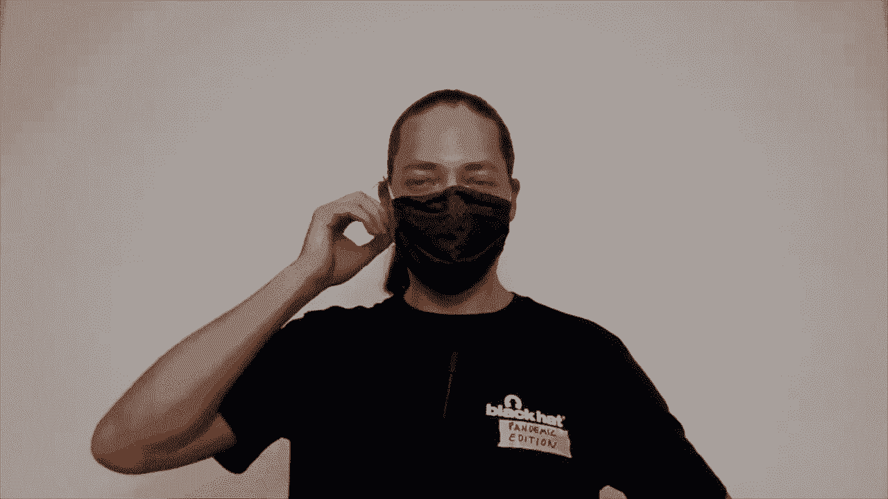
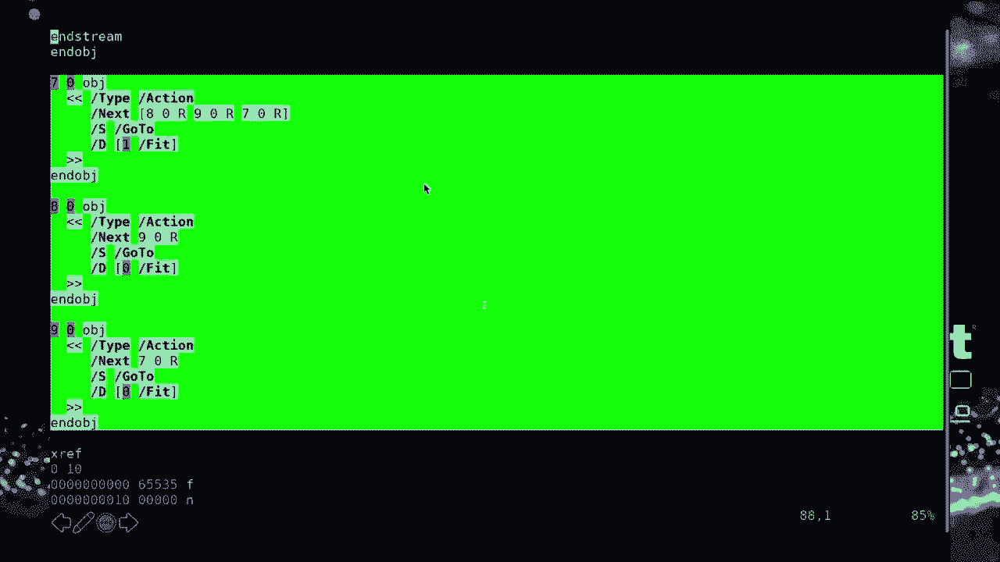
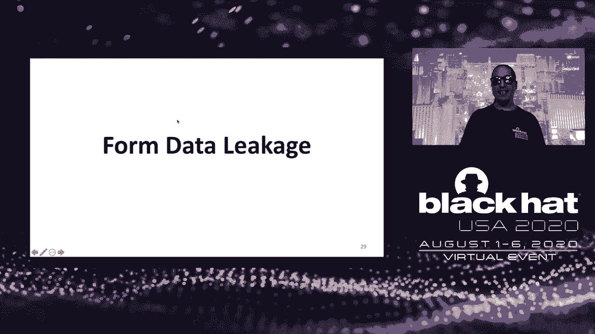
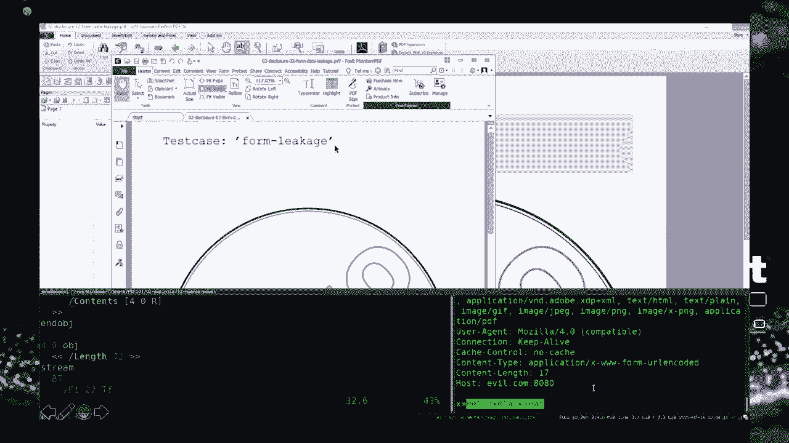
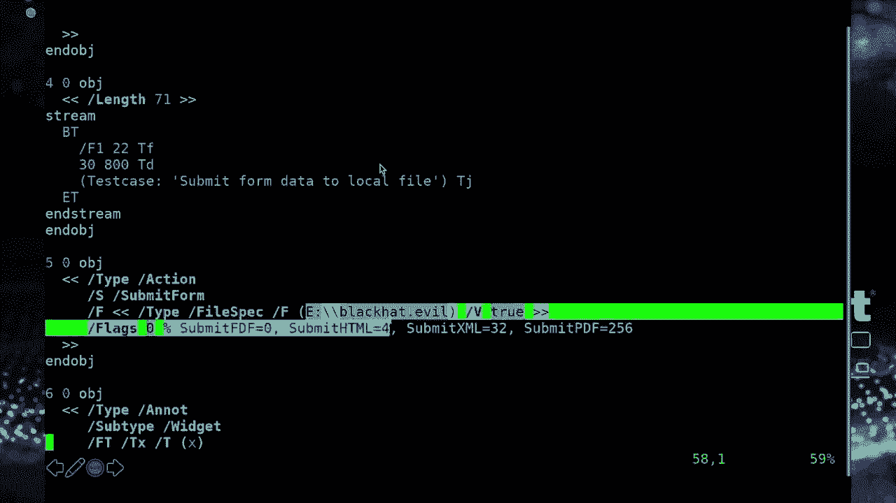
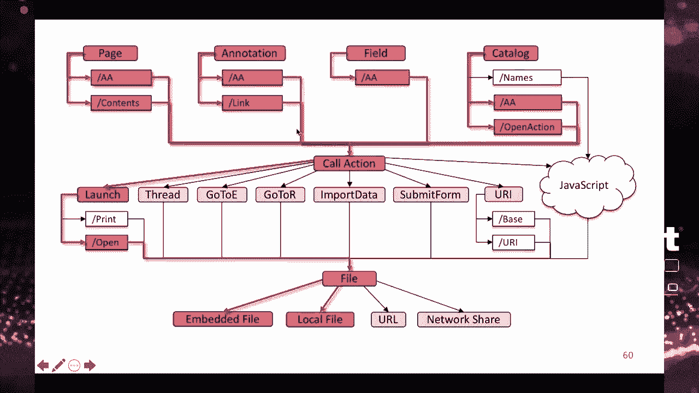

# P42：43 - 可移植文档漏洞 101 - 坤坤武特 - BV1g5411K7fe

[MUSIC]

>> 大家好。欢迎来到本次演讲，便携式文档 101，在奇怪的时代举行的视觉黑帽会议。

我叫 Jens Miller，是德国波尔霍尔姆大学的博士生。今天我将向大家介绍我们的当前研究，这是一项来自波尔霍尔姆的联合工作，关于 PDF 的危险特性。所以在这个简报中，我们将一起深入研究 PDF 规范中鲜为人知的特性，这些特性可能导致严重的安全漏洞。所以 45 分钟后，你可能会说，哦，我不知道 PDF 真的可以做那样的事情。好吧。那么，让我们戴上拉斯维加斯的太阳镜，开始吧。另外，我为本场演讲引入了一条新规则。所以，每当我要展示一个演示时，我们都会一起喝一杯或一杯啤酒，而且真的会有很多演示。好的，这是今天演讲的概述。首先，我将为您提供一些关于 PDF 文档结构和特性的背景信息，这样您就能更好地理解接下来的攻击。然后，我将介绍我们的四个攻击类别，基于恶意文档，基本上会导致拒绝服务，影响处理文档的主机。信息泄露攻击，将个人数据从受害者的计算机中泄露出来。数据操纵，甚至是在受害者机器上执行代码。最后，我将提供对这些攻击的评估，针对 28 个流行的 PDF 查看器以及开发者的对策。好的，让我们从 PDF 的技术背景开始。

我猜我们或多或少都熟悉可移植文档格式，它基本上是一种用于电子文档交换的退化标准。所以 PDF 是在 20 世纪 90 年代由 Adobe 开发的，自 2008 年以来成为 ISO 标准，当前版本为 PDF 2.0。根据 Adobe 的数据，他们的产品在一年的时间内打开了 2500 亿个 PDF 文档。所以我想说，PDF 几乎被所有公司和机构使用，这绝对值得深入了解潜在恶意文档的能力。好的，让我们首先看看一个简单的 PDF 文档。这是一个在 Adobe Reader 中打开的最小“你好，世界”PDF 文件。然而，您也可以使用像 V.I. 这样的文本编辑器打开这个文件。正如您所看到的，我们可以实际地读取和编辑文档。可能会有一些二进制部分，比如图形或压缩数据流，但 PDF 文件的结构基本上是纯文本，所以您可以读取字符串，比如“你好，世界”。在抽象层面上，每个 PDF 文档由四个部分组成。首先，它是一个标题，只包含一行，包含文档的 PDF 版本，比如 1.7。一个交叉引用，抱歉，一个正文，包含文档页面的定义及其实际内容。这是最重要的部分。还有一个交叉引用部分，其中包含一个索引表，定义了该文档中所有对象的偏移量。最后是一个结尾，其中包含一些更多信息，例如对文档根元素的引用。所以 PDF 文档实际上是自下而上处理的。

现在让我们看看一些相关工作。所以过去当谈论 PDF 安全性时，我们看到了各种各样的事情，例如，我们看到了对 PDF 加密和 PDF 签名的攻击，我们去年都演示了。但也在 PDF 的背景下，公司和个人经常发布一些内容被编辑得相当糟糕的 PDF 文档，从而泄露了敏感信息。这通常发生得非常频繁，因为内容对象通常不会被删除。如果文件被编辑，它们只是不再被引用，然后这允许您恢复文档的先前版本。例如，Simon Gaffinkle 和许多人进行了全面的研究。我们还看到了一些元数据问题，泄露了文档的原始作者，这并不总是希望看到的。例如，Shima Alonso 在 2008 年的黑帽会议上介绍了这些问题。最后，我们看到了对多语言 PDF 文件的大量研究，这些文件也是有效的图像或其他文件类型，因为 PDF 标头不必从文件的开始处开始。例如，Orch Ibertyni 展示了这一点。现在，在本场演讲中，我们将重点关注 PDF 的不安全特性。当您研究 PDF 规范以查找有趣的功能时，您会很快发现 PDF 动作，它们用于各种目的，例如外部链接或导航到文档中的特定页面。甚至 PDF 中的 JavaScript 实际上被定义为 PDF 动作。现在，所有这些可以通过使用原生 PDF 事件（例如打开、关闭或打印文档时）触发的动作都可以触发。大多数动作都可以将 PDF 文件规范作为目标，例如 UAL，以定义超链接。

好的，所以我们系统地研究了 PDF 规范中的 PDF 动作和可以触发它们的触发事件。然后我们试图可视化所有这些发现，结果是我的白板被填得满满的混乱。所以这里有一个更干净