# P43：44 - Breaking VSM by Attacking SecureKernel - 坤坤武特 - BV1g5411K7fe

 [MUSIC]。

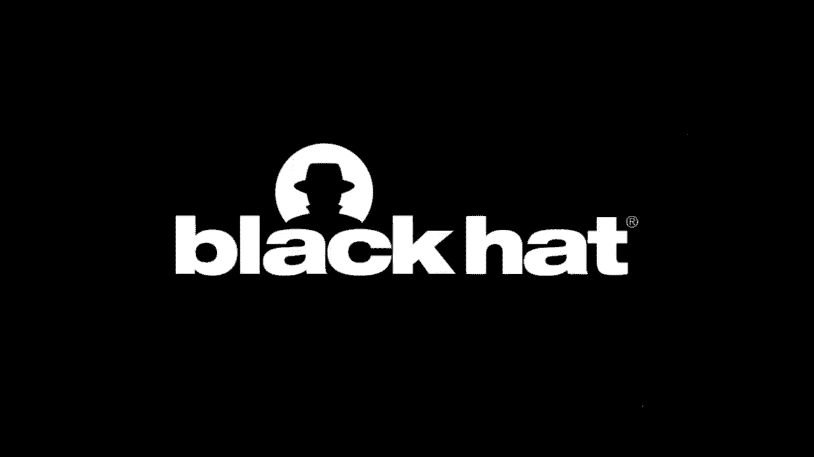

 >> Hi and welcome to Black in VSM by Black in Secure Cannon。 We are Saramarindani and Kim。

 security researchers from the MSOC， and we are very excited to share today our story about。

 how to secure kernel to authentic research。 We have so much to grab today。

 We are going to see the shortest introduction ever to。

 the architecture of VSAM and the secure cannon。 Then we are going to talk about two of。

 the vulnerabilities that we found， but by fuzzing and may statically auditing the code。

 We're going to have some final kind of， betrécote execution in the secure cannon by。

 exploding both of those vulnerabilities。 Then of course， some takeaways。

 What you can take from the stock in， order to kick off your own secure kernel research at home。

 and what we can take from the stock as， Microsoft in order to build the security in our products。

 So without any further ado， let's talk about VBS。 So with no architecture of Windows 10 and VBS。

 we use virtualization in order to enforce isolation and， restrictions in the operating system。

 VSAM introduces VTLs which are virtual class levels。

 which we use in order to isolate the operating system， into different isolated security contexts。

 As for today， we have two VTLs。 We have VTL0 for the normal world and VTL1 for the secure world。

 In the normal world kernel space， we have endos kernel just as you know it。

 and we can call it now the normal kernel。 In the normal world user space。

 you have your own user space， you have your programs， IDEA， etc。 In the secure world。

 we keep all of the most， privileges and tasks components which we really want to protect。

 and isolate from the normal world。 So we actually assume here that attackers already gained。

 rid of the primitives in the normal world kernel space， and we want to restrict them as possible。

 And all of that has been managed by Hyper-V。 So you have endos kernel runs in running zero VTL0。

 You have the secure kernel runs in running zero VTL1。

 and Hyper-V exposes two hypercalls for normal calls。

 and secure calls which are services provided by each kernel， to the other。

 The normal kernel clearly needs many services， from the secure kernel for all of the most privileges。

 and functionalities it can no longer do。 And the secure kernel still needs many services。

 from the normal kernel because most of the functionalities。

 are actually remained in the normal kernel， because you really want to keep the secure kernel。

 as small as possible in order to decrease its attack surface。 OK。

 now the hypervisor exposes hypercalls， for the secure kernel to restrict VTL0。

 And the secure kernel uses the cyber calls， in order to restrict VTL0 access to the both of the physical。

 level space and the system registers。 This is exactly what lets us create great mitigations。

 such as HVCI， which means that all of the pages that。

 are marked as executable in a VTL0 EPT have to be signed。

 It's meant that we can hide secrets in a secure world。

 user space and mark all of the pages as unreadable to VTL0。

 And clearly compromise of either one of the secure kernel。

 or of the hypervisor bypasses those mitigations， and break the model guarantees。

 And this is a motivation for this research。 OK， so our story begins with a great demo。

 Daniel wrote an amazing fuzzer called Hypersid。 Its main purpose was to fuzz the hyper calls interface。

 exposed by Hyper-V。 I really encourage you to catch this talk with you。

 and Daniel from OffensiveCon 2019。 It was absolutely amazing。 They found many issues in Hyper-V。

 And when I joined the team， I just saw this incredible work。 And I ping Daniel and I ask him， hey。

 do you try to use Hyper-V to fuzz the secure services， interface exposed by the secure kernel？

 Because this interface is actually very similar to the hyper， calls interface exposed by Hyper-V。

 And two ex-sator Daniel here just got back to me， which， hey， I just found five different bugs。

 VTL0 to VTL1。 It was absolutely amazing。 It moved to us that there is still much to cover in this area。

 So we teamed up， we found more bugs， and now we have a great story to tell。

 Now bugs aren't really interesting if we can exploit them。 So let's talk about exploitation。

 And before we start to do this classic circle of life。

 let's stop for a minute and ask ourselves what we can do。

 assuming that we can read the right primitives， in the Xero VTL1。

 And in order to answer this question， we really need to talk about mitigations。 Because as you know。

 we have great mitigations， in the normal kernel。 But unfortunately， not all of those mitigations。

 make their way into the secure kernel。 For instance， the secure kernel image binary。

 does go through a randomization on every boot， but there are still many hard-coded addresses。

 We don't have CFI， and unfortunately， we don't have start enforcement， which。

 is one of the key features of VBS。 So let's begin here。

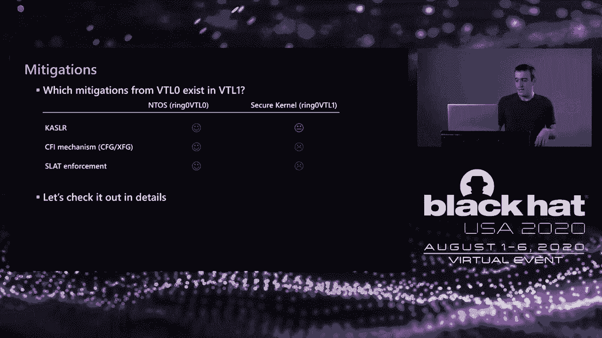

 All of those addresses are hard-coded in a secure kernel。

 There are even more addresses which aren't hard-coded， but they are still can be predicted。

 because of the so predictable and deterministic boot， losses of the secure kernel。

 I really wanted to take a closer look into this shared page， VTL0 mapping。

 This is a very special page as it's， one to one mapping of the shared page from VTL0。

 to this fixed virtual address in VTL1。 And therefore。

 every byte that you write through the shared page。

 in VTL0 simply appears at this fixed virtual address， space in a secure kernel。

 This introduces a great expedition primitive， of controlled content， et cenote， and non-adress。

 which， we usually need to invest some time， before we can gain such a primitive。

 And there is the pursuit of that。 In the first debugger， which is attached to endos kernel。

 we just write arbitrary value。 In the second debugger， which is attached to the secure kernel。

 we just read this value， and everything works great。 OK， let's talk about that enforcement。

 In our model， we only have EPT enforcement， on lower VTLs from higher ones。

 This is exactly how we implemented， mitigations such as HVCI， Kardashian and God， and et cetera。

 But this means that the secure kernel being the most。

 higher VTL that we have today isn't a PTE enforce， which。

 means that the PTE in VTL1 have the final say。 This actually tells us that given the arbitrary write。

 primitive in a secure kernel， we just， can create a read write execute chunk of memory。

 in the secure kernel。 And we don't even need a read primitive for that。

 because the PTE is best fixed。 OK， this is super interesting。

 And it just actually raises another question。 What about Rix Oix？ Because as we know。

 many researchers found several addresses。 It was marked as both writeable and executable。

 in the VTL0 PTEs。 And this is actually fine， because HVCI。

 does a great job of mitigating this by start enforcement。 But if we could find this pattern。

 the same behavior， in VTL1， then we'd really have something here。 And indeed。

 we found four different addresses in VTL1， that were marked as both writeable and executable。

 in the PTEs。 We fixed them all by now， of course。 But this is just another great value of this research。

 OK， let's talk about setup。 Setup is super important。 We chose to use hypoSID。

 It's super convenient。 We can write all of the POCs and exploits in user space。

 And we have our own kernel space driver， which， wraps all of the secure calls for us。

 If you don't want to go through all of the rubbles， you can simply debug and discard。

 the breakpoint and key functions， and patch the registers。

 and memory in runtime to trigger certain flaws， in the secure kernel。

 We don't shift the secure kernel， release binaries with the debug stuff compiled in。

 But you can still achieve that。 And your own machine is set home by using nested virtualization。

 KVM， KVM， many researchers are doing that。 Here are some names that you can follow。

 And now with this new spirit， let's go over to Daniel。

 which will tell us about the first vulnerability， and the first aspect。 Thanks， sir。

 for the introduction。 I am Daniel。 Now let me walk you through the first one， orbit A and exploit。

 In this talk， we will discuss two one orbites。 They are very different from each other。

 The only common part is that they are in the same function。 The one-order-row function is named。

 ASCII and Mm Obtain Hot Patch and Doodable。 It is a long name， but you can tell it is related。

 to the Hot Patch implementation。 The function obtains an undo table。

 This table describes addresses that will be affected， by reverting a hot patch。

 The first one already is an autobund right。 It is found by fuzzing with hyperseed。

 The second one already is related to MDR and MABY。 It is found by source code review。 Generally。

 secure calls use transfer MDR to transfer data， from VTL0， the Anthos world， to VTL1。

 the secure world。 Those transfer MDRs are fully controlled from VTL0。

 Here in this vulnerable function in VTL1， it will first map the transfer MDR to VTL1， address space。

 It then construct a new MDR and initialize it， with the content stored in transfer MDR。 At last。

 it will un-mipe and clean up this MDR。 The security guideline here is to sanitize。

 R-refills at rate from VTL0， including the bad count field， in transfer MDR。

 This is where the first one already。 This code snippet shows the first one already。

 The bad count field passed from the VTL0 can be annual。 And it will be used as the allocation。

 lines for the newly allocated and do MDR。 And do MDR should be at least 48 bytes。

 as an instance of MDR data structure。 Guess what will happen if bad count is smaller than 48？ Yeah。

 you're right。

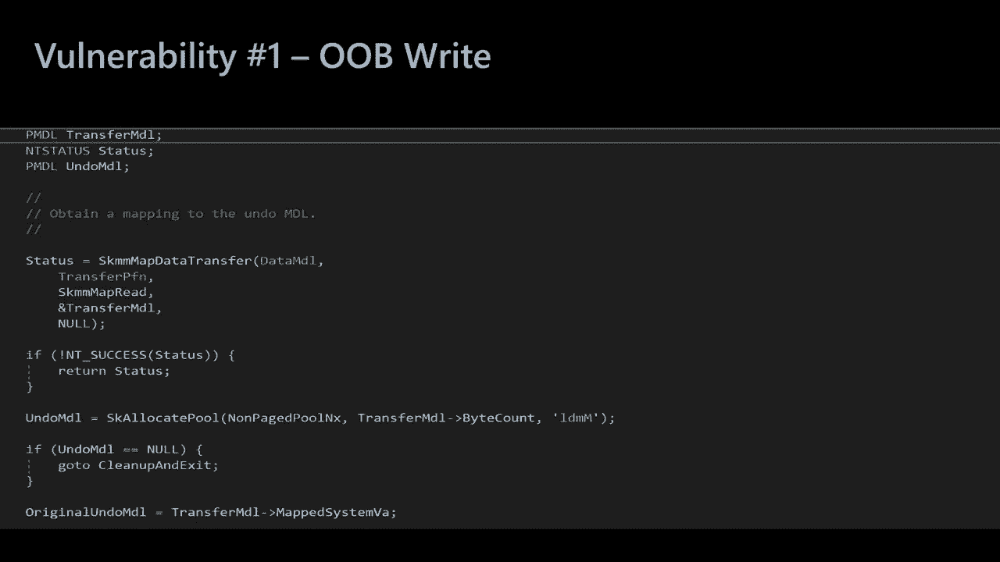

 Auto bound right will happen。 Let's see the MDR data structurally out。

 It represents information for our buffer in physical memory。 It consists of two parts。

 The fixed HIDR and wearable P-affin array。 The fixed HIDR occupies the first 48 bytes。

 and contains several important fields。 Next is a pointer to another MDR。 In this way。

 several MDRs can be chained together， into a single-link list and as list。

 Size is the total length of the whole data structure。 Map the system with a points to the buffer。

 After getting mapped into the address space， bad count is the length of the buffer。

 Transfer MDR describes a piece of buffer， transferred from VTL0 to VTL1。 Here。

 the transfer buffer happened， to be another MDR instance。

 The vulnerable function gets the bad count， as the transfer buffer length and allocate a new MDR。

 with the same length。 If we specify the bad count to be 16， then a 16 bytes。

 a coconut pool will be allocated for the MDR。 Here， I only discussed the situation。

 that MDR is allocated in way as keep。 I will explain the reason later。

 We can see that the next pool allocation， is also shown here in blue color。 With 16 bytes。

 we as chunk HIDR。 The transfer MDR gets mapped into the VTL1 address space。

 Then mapped system V8 can be used， to access the transfer buffer directly。

 We call this transfer buffer the original MDR。 Original MDR is also fully controlled from VTL0。

 The undo MDR will be initialized， according to the original MDR。

 Now we see how the auto bound right happened， when calling a MAM initialized MDR。

 The next pool allocation will be overrated， with the original MDR。

 The all writing capability is 16 bytes。 We see that the we as chunk HIDR is still intact。

 after the all write， which is very good for exploitation。

 since this all write won't be detected by pool system。 If we try the PLC for the first one already。

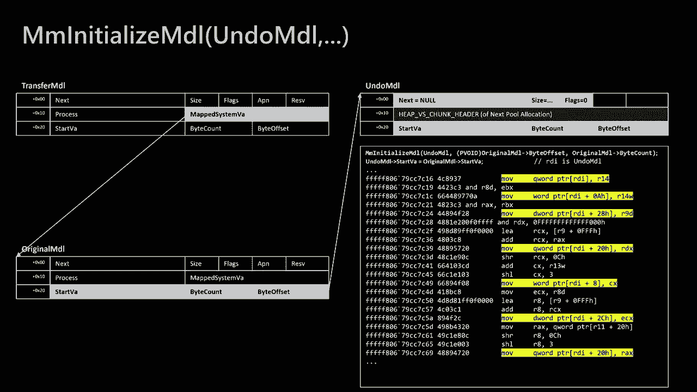

 we will see the typical backtrack caused by access violation。

 and we will see the GSOD for windows inside the build。

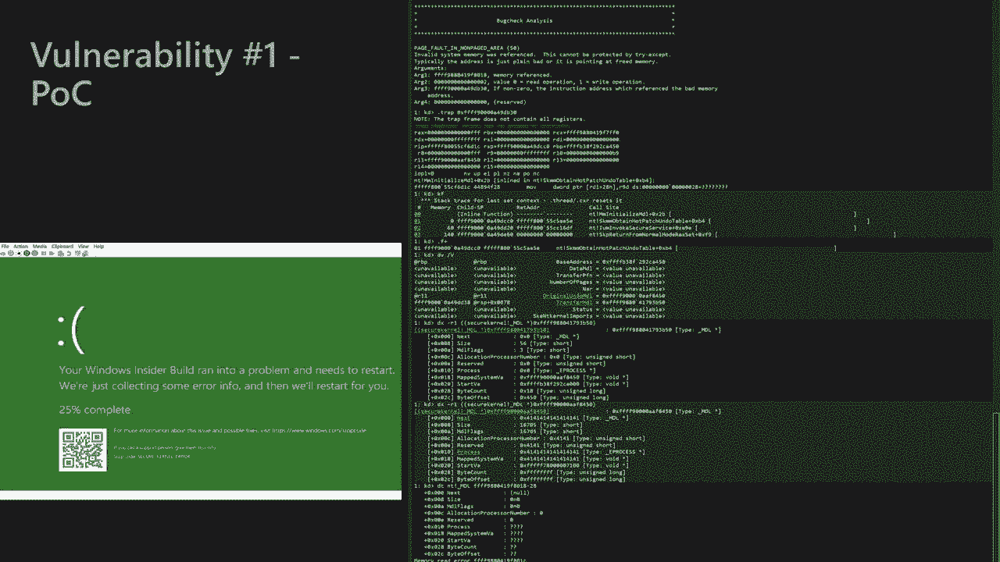

 The fix for the first one already is also straightforward。

 Stop further precising if back count is smaller than 48。

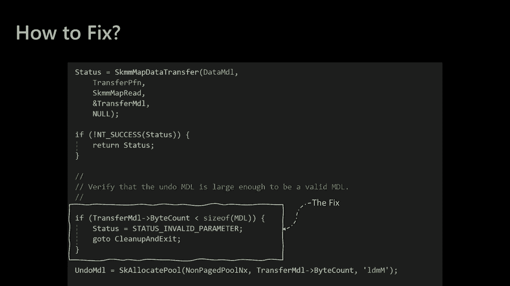

 The fix is more intuitive by comparing other PLC FGs。

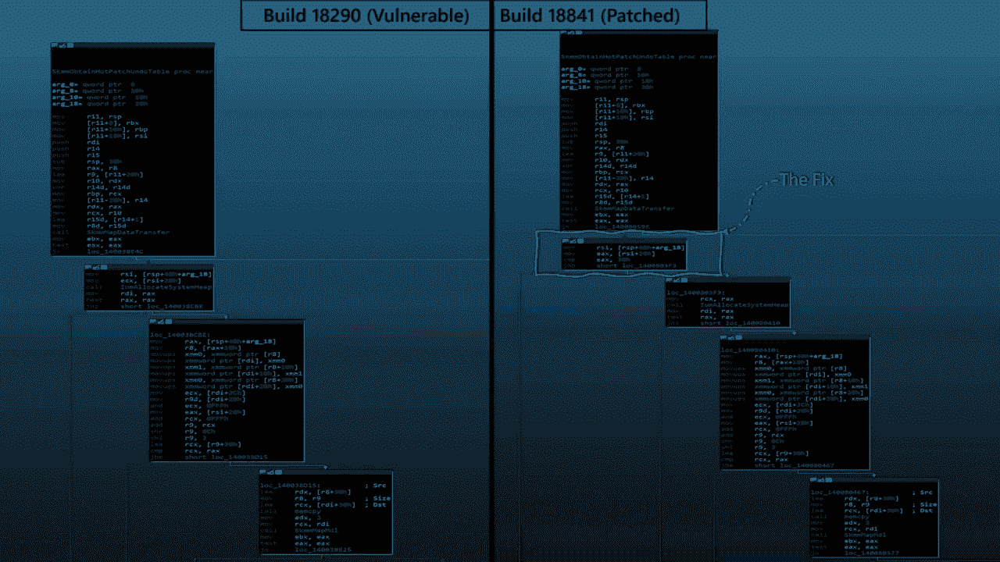

 What can we do with this up to write to the VTL1 world？ SARS has some considerable insight。

 This is all what a hacker need。

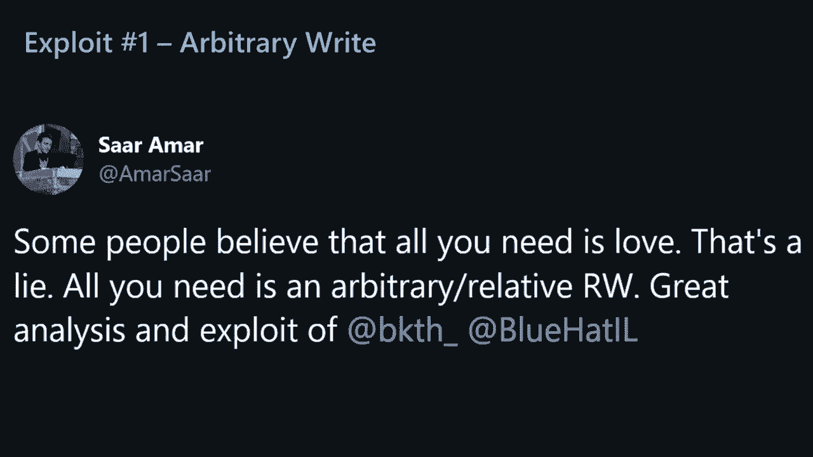

 Let me show you why。 Now I have the capability to overwrite the neighbor pool allocation。

 What should I do first？ Yes， I should select a good neighbor to be the overwritten victim。

 Since I am already familiar with MDR data structure， why not choose another MDR as the neighbor？

 We can overwrite the first 16 bytes of the victim MDR， including the next pointer， size and flags。

 The initial primitive is ready and seems promising。

 Let me show you more essential backgrounds for the final exploit。

 Let me introduce the SKPG context a little bit。 It is a core data structure used for secure kernel hyperguard。

 We already know that its address is predictable， a very good stable target。

 I should take advantage of this fact。 There are quite some interesting fields in it。

 including two callback routine function pointers。 I have to be very cautious since it is self-protected。

 There is an un-bited timer in it。 The timer routine will be invoked when dual time comes。

 The timer routine will trigger the runtime check routine。

 The later will verify the data integrity of the whole data structure。

 It will fast fail if anything wrong。 Crafting any fields of SKPG context will be noticed by the runtime check routine。

 except those two callback pointers。 In fact， if I replace one of those two function pointers。

 the whole self-protection is bypassed。 Those two callback pointers are good candidates。

 for redirecting control flow to shell code。 I have mentioned secure kernel pool。

 Now let's take a closer look。 Secure kernel use segment heap。

 which is typically comprised of variable size heap and low fragmentation heap。 In weight as heap。

 allocations of different sizes are put together side by side。 In our FH heap。

 allocations of the same size are put together。 And allocations of different sizes are separated from each other。

 In secure kernel， the tag and put type arguments are ignored。

 Pools are always allocated in page pool。 Since I do MDOW is 16 bytes。

 while I cannot make the victim MDOW smaller than 48 bytes。 If I want to put them together。

 I have to use the "we" as heap。 During the exploitation， the main challenge here is in secure world。

 There is too few allocations。 I create two when the back JavaScript extensions。

 to help dump out the "ofh" and "we" as heap layout。

 You don't need to understand the meaning of every fuse here。 I just want to show you half-scars。

 the pool allocations are in secure world by default。 In the upper screenshot， only 15 after 129。

 of each buckets are activated。 They are highlighted in right。 In the lower screenshot。

 only 22 segments used in the "we" as heap。 Each segment ranges from 16 to 64 pages。

 The fewer the pool allocations， the lesser possibility for push-aping。 For good push-aping。

 I have to find out a persistent and controllable pool allocation。

 Create secure image secure call can be used for this purpose。

 It can allocate arbitrary sized pool allocations。 The minimum allocation size is 48 bytes。

 A handle to each create secure image is returned to the "we" 0。

 Closing this handle will free the corresponding secure image allocation。

 I can use this allocation to make host of 16 bytes。 Another secure call。

 "lavdamp start" will allocate a list of "mdiles"， with controllable "mdiles" size。

 Those "mdiles" are good candidates for being victim "mdiles"。

 There are two challenges clear during push-aping。 First。

 there is a guard page after each "we ask heap" segment。

 If the "mdile" is allocated at the end of the segment。

 it will corrupt the guard page and cause backtrack。 Second。

 I cannot make too much allocations of the same size。 Otherwise。

 it will activate "rfh bucket" if a word threshold。

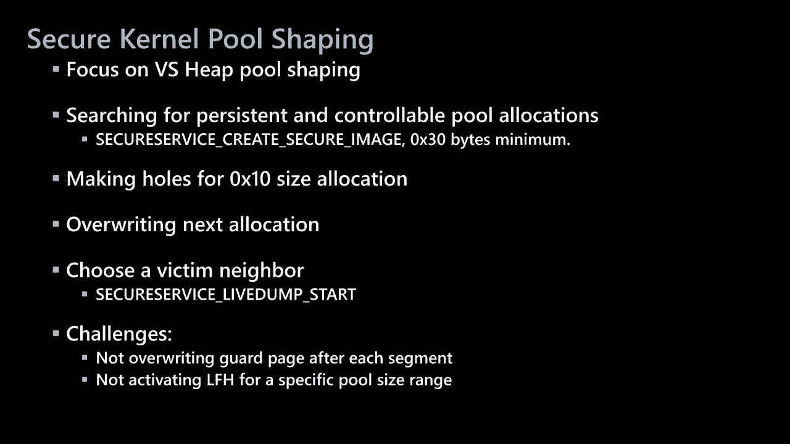

 This is how I do the push-aping。 I help facilitate some passenger scripts here for reference。 First。

 I make two series of "pull allocations"， with great secure image/secute calls of different sizes "a" and "b" repeatedly。

 Then I replace all of the "b" allocations with the "lavdamp/mdile" of the same size。

 Then I replace all of the "a" allocations with smaller "d" allocations， making 32 bytes "holes"。

 which is suitable for "andu" "mdile"， including the "we ask" chunk "hido"。

 Further "andu" "mdile" allocation will be allocated in these "holes"。

 and "crapped" the "neighbor/lavdamp/mdile" with the first one already。

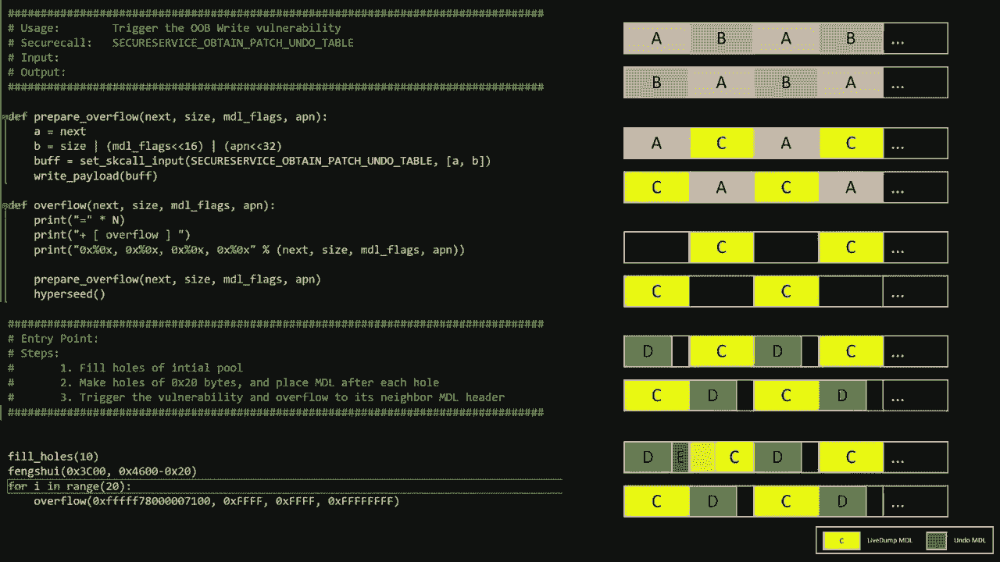

 "Askelavdamp" starts。 This secure call will allocate a list of "mdiles"。

 and change them into the "singular linked" list。 "Askelavdamp/mdile/avdamp/mdile" will allocate a target "mdile" from the "aslist"。

 and "right" to the "paffin array" at "andu" of that "mdile"。 "Lavdamp/contacts" is a global symbol。

 It contains a pointer to the "aslist"。 "Pages id" in the "lavdamp/contacts" determines where to write to when calling "lavdamp/mdile/avdamp/mdile"。

 at buffer。 But count in each "mdile" determines its capacity。 After filling up its capacity。

 the "right" cursor will be moved to the "next" "mdile/anaslist"。

 The calculation of "right" cursor is demonstrated here with this "surgical"。

 With the "pushing" approach I discussed， it is possible to make the "lavdamp/mdile" the "wicked"。

 "mdile" and allocate it after the "andu" "mdile"。 Trigger the "rto-bound" "right" will modify the "next"。

 pointer of the "wicked" "mdile"。 "Aslist" will be diverted to a "powered" "mdile" and "over-control"。

 If we make the "powered" "mdile" in the "shared" memory， which is "right" from "wickedile" zero。

 we can fully control its content， including the "next" pointer and "bad count"。

 This modification will be reflected to the "wickedile" one in real time。

 which can be used for repetitive， adjustment of the "next" pointer and "over-right" to "up-to-read" address。

 But the "shared" page is read only from "wickedile" one。

 Writing to the "pivin array" of the "power-time" "gia" will backtrack due to the "access"。

 violation。 There is a trick here。 We can modify the "bad count" to be smaller than "page size"。

 which makes the "power-time" "gia"'s capacity zero。

 and it will be "scaped directly to the "next" "mdile"。

 Now we have fully control of the "power-time" "gia"。

 and we can re-tag it "worker-mdile" by modifying "next"， pointer。 We can write to "anywhere"。

 but we need to know where to modify the "next" pointer。

 We use the "second-shared" memory as the "worker-mdile" and detect if its "pivin array" has been。

 overwritten after we call the "lovedamp" "ad buffer"。

 Once we detect it that the "worker-mdile" has been， overwritten。

 we add "power-time-gia" "bad count" with "page size"。 It makes sure next time we call。

 "lovedamp" "ad buffer"。 We are still writing to the beginning of the "worker-mdile's" "pivin array"。

 In theory， we can write to "anywhere"。 The only constraint here is the "worker-mdile" "bad count"。

 should not be smaller than "page size"， otherwise it will be "scaped"， and writing will be。

 redirected to its "next" "mdile"。 Normally this constraint can be bypassed。 If we can find some。

 non-zero content before the "or writing" target， crafting a "worker-mdile" there and adjusting the。

 writing cursor by changing the "bad count" accordingly。 You can see， I take fully at the。

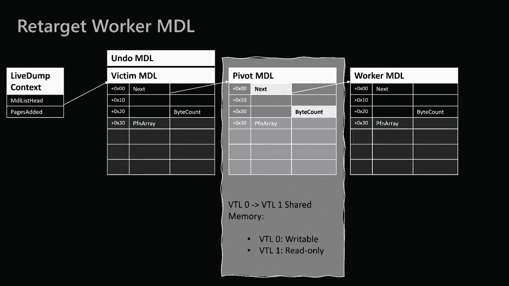

 one page of the "shared pages"。 I use the first "shared memory" to craft "power-to-mdile" and modify。

 "worker-mdile" repeatedly。 I use the second "shared memory" as the tentative overwritten target。

 and determine the "good timing" to modify the next pointer when the "worker-mdile" has been。

 activated。 After the "worker-mdile" has been activated， I can do "repeatable" write what "where"。

 "Where" is determined by the next pointer and "bad count" of the "power-to-mdile"。 Writing cursor。

 is pointing to the overwritten target。 "What" is parsed as "parameters" to the "loved-up" at。

 buffer secure core。 Here， I use just one page-frame number， which is exactly one key word。

 This is the overwriting content。 "Trigger the left-amp" at buffer secure core。

 which will do the final， overwrit。 In this way， I can do the "read what "where" trick accurately and repeatedly。

 Little summary here。 First， I craft the next pointer of the "mdile"。 Get one up to write。

 Then I fake a "power-to-mdile" in the "shared page" where I can modify repeatedly from "vtile 0"。

 by design。 With this "apture write"， I corrupt a note in the "loved-amp" context， "mdile" chain。

 and make it point to the "power-to-mdile" in "shared page"。

 "Call Loved-amp" at buffer to trigger the "apture write"。 Changing the "shared page" content。

 to adjust the overwriting target。 "Call Loved-amp" at buffer again to trigger another "overwrite"。

 With this "apture write" capability， I modify page table entry of the "shared page" to "executable"。

 Place a piece of shellcode there。 Then I modify the "askkpg" contact callback routine。

 and jump to the shellcode。 In this way， "apture code" execution is achieved。

 This is the "demo" shellcode。 It first modifies the "askkpg" contacts callback routine。

 Then it leaks the "secular-know" base pointer back to "vtile 0" through "shared page"。

 It resets timer。 Configures 5 seconds relative deal time。 Shellcode will be invoked every 5 seconds。

 And shellcode is fully controlled from "vtile 0"， and can be refactored for any purpose。

 The first vulnerability was fixed in January 2019。

 The "secular-know" pool then switched to "segment heap" in the middle of 2019。

 And the exploit "proshaping" depends on the "segment heap"。 This "demo" is against。

 built in May 2020， where the first vulnerability has already been fixed。 A trick to undo the fix。

 is by "when debug" command。 This command will erase the "fix" code to not slide。

 So this exploit approach works well and latest built。 But the vulnerability is already gone。

 No customer will be at risk with this demo， since "no build" is both vulnerable and exploitable。

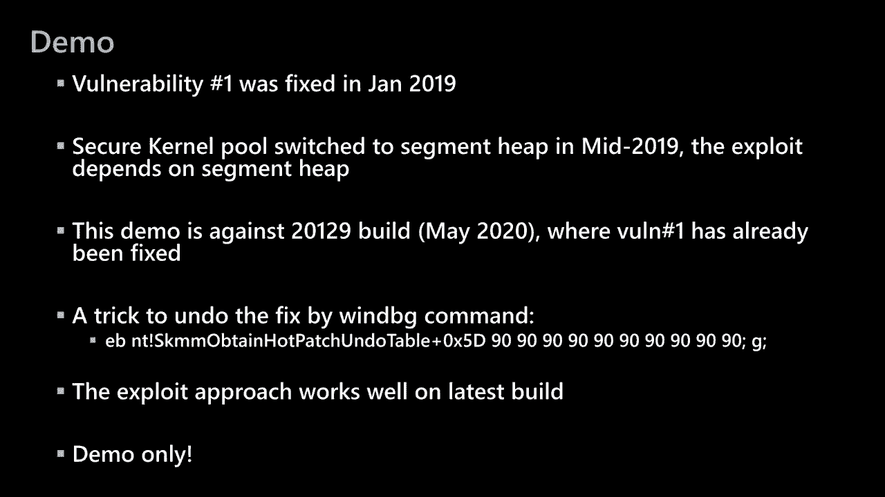

 Here is the demo。 I help test screenshots of important output here as background。

 I will play the demo video。 This video has been edited to look smoothly。

 "secular-know" debugger is attached here， and the fix has been unpached by the debugger command。

 Before the exploit， the shell page is filled with "zeros" rather than the shellcode。

 and the shell page is not executable。 I will play the demo video now。

 I run the first pass-in script， which will do the "push shaking"。 Place "loved-up"。

 MDL after the whole， and trigger the first vulnerability and modify the MDL next pointer。

 It takes some time for the "push shaping"。 Then I run the second pass-in script。

 which will detect if the tentative shared memory， has been modified or not。 If it has been modified。

 I can do further up to read what were。 The third pass-in script will modify the "shard-page-pte" to "execute-able"。

 and the last pass-in script， will redirect the "ask-kpg-contacts" callback routine to the shellcode I prepared in the "shard-page"。

 After the deal time comes， the shellcode gets executed successfully。

 Now the "shard-page" is "executable"， and it is filled with the demo shellcode。

 and this piece of shellcode is invoked by redirecting the "ask-kpg-contacts" callback routine。

 And this shellcode will get executed periodically。 I can modify the shellcode from "vt。0 freely"。

 at any time for any purpose。 In this way， arbitrary code "excusion" is achieved。

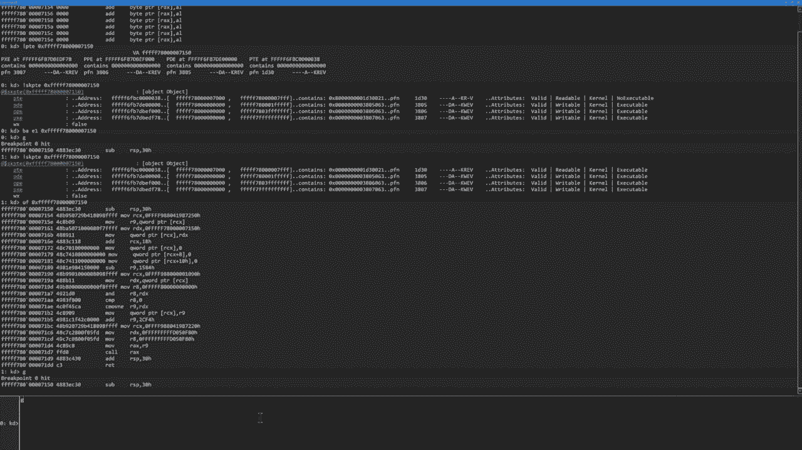

 Okay， this is my part。 I will transfer control to "sar"。 Thank you。

 Thank you so much Daniel for this great analysis and exploit。 So we fixed this issue now。

 We make sure that the transfer MDL byte count is valid。 But there is something else， which is。

 super interesting in the general flow in this function over here。 And this is something which。

 is related to the way that we map and unmap VTL1MDLs。 Let's take a closer look。

 So this is the general， flow in "skmm" obtained "hot-page-undotable"。 And as you can see。

 we just allocate some chunk， in a secure kernel heap。

 We copy the entire transfer MDL into this new chunk。 We make some， integrity check。

 And if this check passes， we call "skmmmapmdl" to map this new MDL into the， VTL1 other space。

 And if this check fails， then we do go to cleanup， we take the bell out flow。

 and we hit the call to "skmmmmapmdl"。 Now the problem here is that we don't make sure that we。

 indeed call "skmmapmdl" if we're calling "skmmmapmdl"。 And this is exactly what is going to happen。

 if the integrity check fails。 Now， since we can control over the entire undo MDL over here。

 we can make this integrity check fails。 And therefore。

 we just summed up to be the ability to call "skmmmmmmmplmdl"， on a fully controlled MDL by VTL0。

 Okay， great。 And here you can see the code。 At the beginning， you can see the integrity check。

 At the end， you can see the call to "skmmmmmplmdl"。 And right there， in the middle。

 there is the call to "skmmmapmdl" which we clearly skipped。 Okay， POCs。 We have。

 two I-POCs for everything that we find because otherwise everything is meaningless。 So let's。

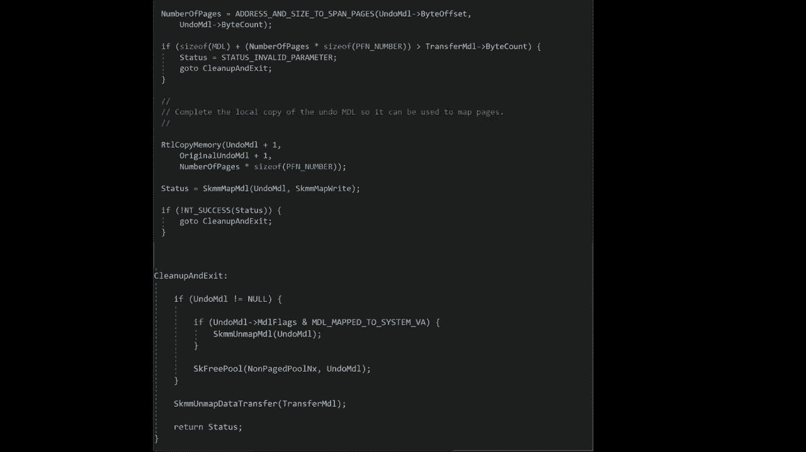

 cover the MDL， set our phone for one in the virtual address in the map system VIA。

 trigger the vulnerability and boom。 We got the exact expected call stack in the crash from the。

 vulnerable function to "skmmmmmmmmplmdl"。 And then page 14 of the area on the virtual address AOA。

 which is the PTE address of the virtual address for one for one from the MDL。 This happened because。

 "skmmmmmmplmdl" resolves the PTE address of the virtual address in order to write zero into the PTE。

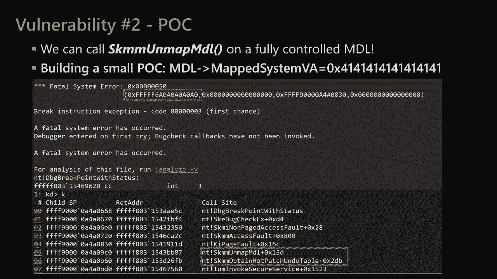

 Okay， great。 Knowing this， we can create another POC。 Let's try to cross some arbitrary flow in。

 a secure kernel。 And for this to happen， we really need to find some virtual address which。

 is being used by something in VTL1。 I just show the share page。 VTL1 has its own share page。

 It's this fixed virtual address。 Set it up in the MDL trigger the vulnerability and again we got a。

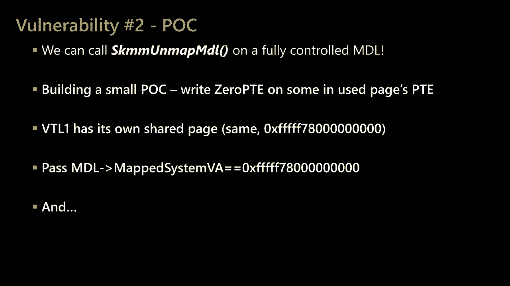

 crash in some arbitrary flow in a secure kernel。 In some thread， it tried to dereference the share。

 page and of course this page is no longer present because we wrote zero on its PTE。 Okay， great。

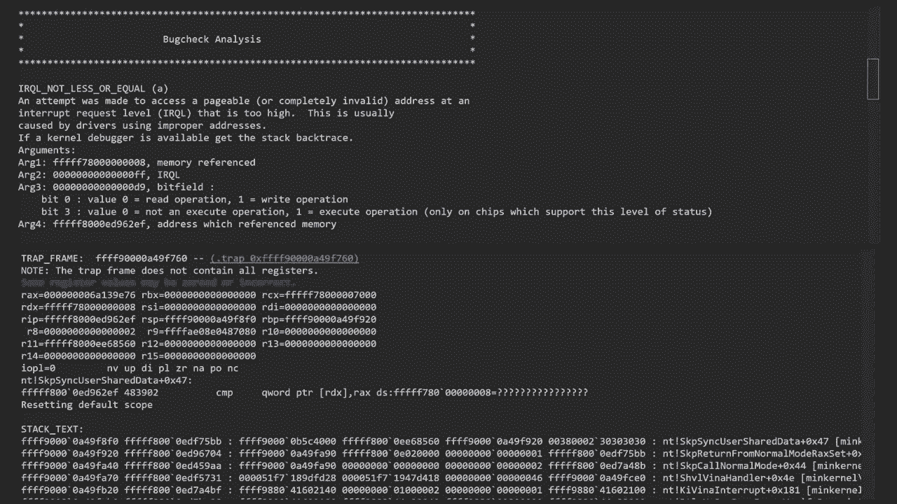

 So we have the vulnerability， we have the POC， we know everything and now it's the time to get to。

 the actual work starting。 So please note that we don't have here a memory corruption with a。

 controlled content primitive yet but we can clearly build one。 And in order to build one。

 we really need to understand the functionality of SKMmmmmmdl。 Now this happened to be super simple。

 This function simply scans all of the PTEs discovered by the MDL。 It tracks zeros over all。

 of the PTEs。 Please note that after this step， every the reference to every single page discovered。

 by the MDL will panic because all of the present bits in all of the PTEs are zeros。 And then we can。

 choose if you want to take the call to SKMmmmmmmmmmmmmmmmml。

 Which in addition to the zeroing out of all， of the PTEs goes to the bitmap and clear all of the relevant bits just to indicate to the PTEs all。

 of the PTEs are ready to be reclaimed and reused。 Okay， great。 Please note that all of the writes。

 done by SKMmmmmmmmmmdl are safe in the sense that all of the writes to all of the PTEs will for。

 sure fall inside the PTEs range due to the nature of the calculation which converts from the virtual。

 address to the PTE address and all of the writes to all of the pages left can't wait for sure fall。

 inside the PTEB range due to an XVC check in the code。 But we don't really need that。 We can zero。

 out our virtual PTEs and therefore we can clearly create a new after-face scenario by replacing the。

 underlying physical page。 And if we want this to happen it will be very good of us to take the call。

 to this camera is unknown PTS just to make sure that the PT allocator can reuse those PTs。 Okay。

 now it is time to talk about some structures。 And the secure tunnel maintained some structure。

 in order to manage its own virtual outhouse space， makes sense。 One of those structures is。

 the PT range。 These structures， certainly discussed， a range of PTs of a certain user。

 there are some examples right over here。 And this structure has exactly what you expect。

 for me to have。 It has a pointer to all of the PTs， it has a pointer to the bitmap。

 which indicates which one of those PTs are free and which one is in use。 And this is really。

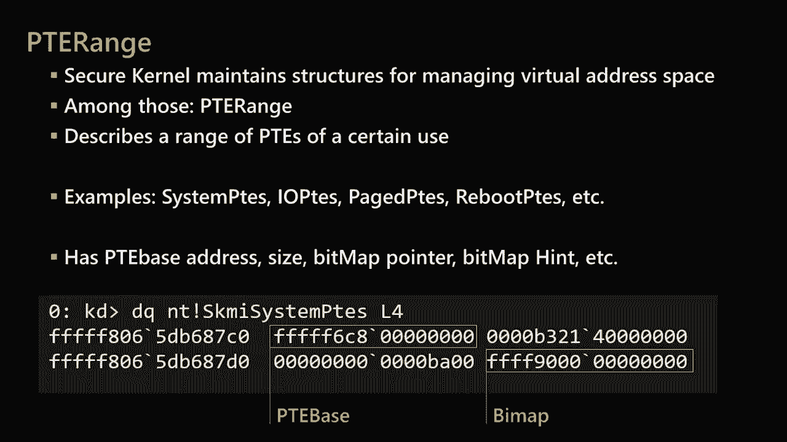

 important for us here because the function skmar release unknown PTs try to resolve the PT range。

 which contains the PT address of the virtual address from the MDL。 And here you can see that。

 this function only looks for specific 3 PT ranges， which absolutely don't cover the entire virtual。

 outhouse space。 There are more PT ranges。 And even after this function chooses one。

 it doesn't really make sure that the PT address is inside the PT range。 It's only check against。

 the base。 So I can just choose a virtual address which is PT address is outside of all of those。

 3 PT ranges， set it up in MDL。 And therefore， I gain the ability to write relatively to the。

 bitmap of one of those PT ranges。 So we gain a relative write primitive， fantastic。 And there。

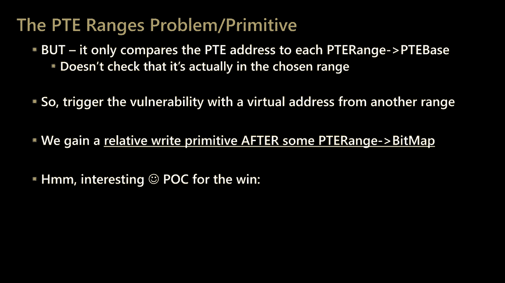

 is the POC。 For the vulnerable function， this came in， I'm up MDL and then， and then page。

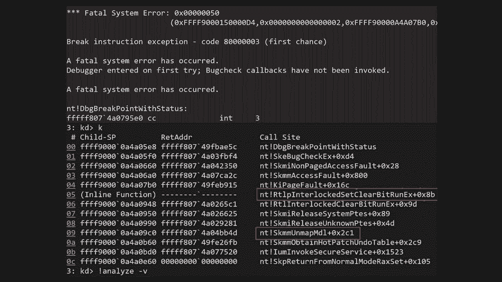

 quality not page area during the clearing of the bitmap。 Okay， fantastic。 This is super great and。

 it's really cool and really awesome but it actually doesn't help us a lot because there are so many。

 pages outside of all of those bitmaps of those specific 3 PT ranges that aren't mapped and there。

 are not in use at all。 So I really could make it work of course but I really prefer to do。

 better tricks。 And therefore， I just do the use after free idea。 It would be much， much better。

 And I'm going to target the SKMI system PTs since it's the main PT range in the secure kernel。

 So we are exactly what we have to do， right？ We need to find some internalised instruction。

 We need to trigger the vulnerability in unmapped， like underline physical page。 Reclam the PT。

 use after free， perfect， fantastic。 And it would be a very。

 small idea of us to understand the allocator involved here because we need to reclaim the PT。

 So let's talk about the PT allocator。 This happens to be very， very simple。 There are two。

 functions， the allocation function and the free function。 And the allocation function simply checks。

 out the bitmap hint value from the relevant PT range and it uses this value as the first index。

 to scan from in the PT is bitmap and just looks for sequence of enough zeros。 Note that this bitmap。

 hint value wraps around only when the allocation function reaches to the end of the PT range。

 And you can see this in those debug traces。 You can see that all of the locations are continuous。

 independent of all of the phrase in the middle。 Okay， great。 Now。

 we really want to get a good crash。 I， page body knowledge really isn't good enough and it really doesn't interesting。

 So I have here two options。 I chose not to allocate the target search of myself because if I read。

 I will also need to spray a lot in order to make the bitmap hint to wrap around。

 And I really prefer， to do a bit of tricks and stable exploits。

 So I simply can rely on the fact that the secure， kernel boot process is so predictable and so deterministic that actually every time after boot。

 I have about the same bitmap hint。 So I can just look over the entire address space that I have。

 after the bitmap hint that I have after boot and just see if I have already existing structure。

 and that it's in use and that it comes after the bitmap hint。 And of course， I found the。

 PLCB structure which is great candidate for memory corruption exploit。 Please note that I。

 can't corrupt specific data。 I have to corrupt at least one page due to the nature of the vulnerability。

 But it's actually fine because this structure is very very large。 It spends over a few pages。

 And I can of course choose the specific page which is best for me to corrupt。 Okay， wait。

 so we know， what the high level plan here is， right？ Okay， let's see it in action。

 So this is the bitmap of all， of the PTC in SKMI system PTCB range。

 There is the bitmap hint that I have after boot right there。

 So let's pray just to get closer to the PLCB pages to regular vulnerability on the expected。

 virtual address and keeps playing in order to reclaim the PT of this single page inside the PLCB。

 pages。 And by implementing this in code and run the PLC， we got finally a great crash of。

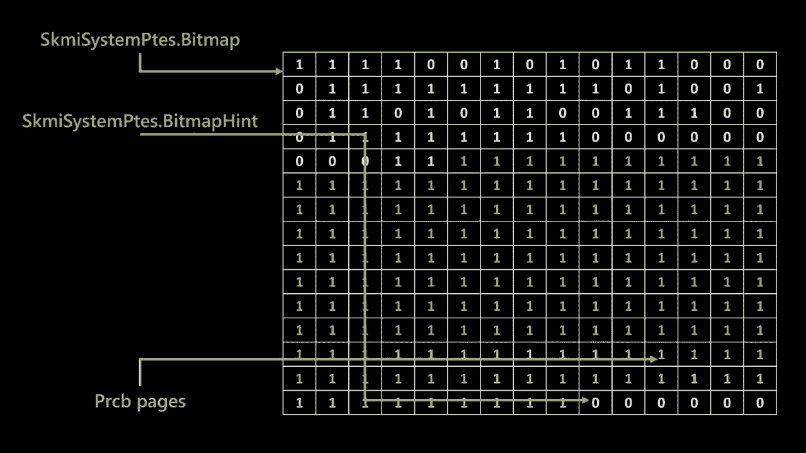

 dereferencing arbitrary pointers。 From this point， it's very trivial to gain read/write primitives。

 And from this point， we know exactly what we need to do。 We don't have time to see the， for X-write。

 but we already saw what we can do with read/write primitives， so it's game over。 Okay。

 now let's talk about what we can do after we gain arbitrary code execution。 So of course。

 we can bypass both HVCIN， Crowdationary Guard， as we said， because the secure kernel by design。

 have the ability to issue a hyper-calls for the hyper-vizor and requesting setting arbitrary。

 permissions in the slots。 Of course， fantastic。 We keep work on how the secure kernel。 We fixed。

 all of the issues we found in this research。 We truly believe that there is so much high values。

 in developing end-to-end exploits。 And one of those is to support an important behavior to change。

 So we made this for both write-able and executable addresses to be non-writeable。

 We are investigating right now options for randomization of secure kernel regions。

 There are actually more surprises to come， so please stay with us。 And of course， if you have， bugs。

 please submit to us。 We really want to work together。 And just like we said。

 DOS isn't in scope because VTL0 can of course by design DOS in VTL1。 So we need to find POCs。

 which actually can leak sensitive data or can crop memory and etc。 Okay， great。

 These researchers could not have been done without a great fork。 So thank you。

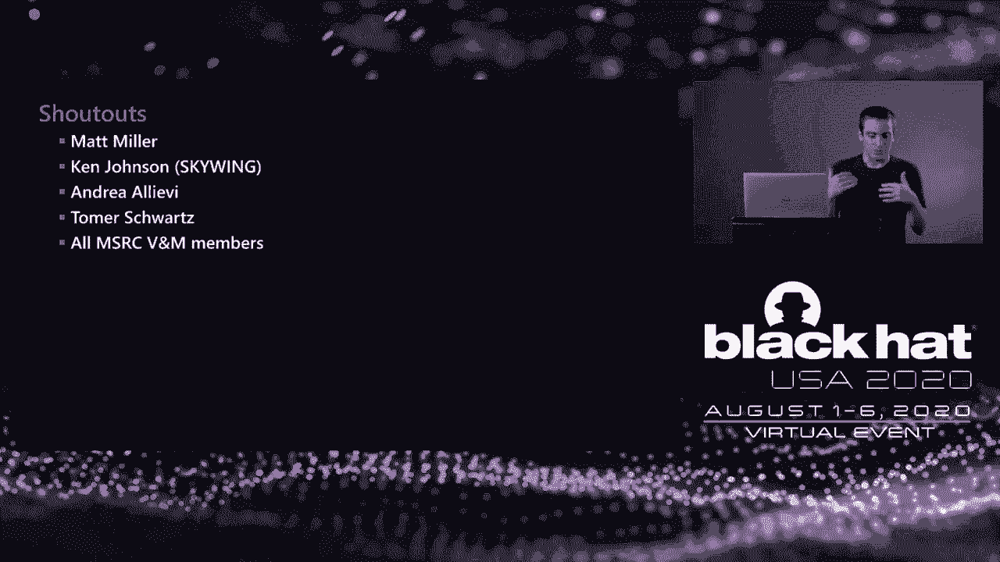

 all so much。 And now would be the time for Q&A。 Thank you so much。

 Thank you。 Hi， thank you so much for attending the talk。 We don't see any questions that we。

 didn't answer。 If there is some clarification that you want to make， some questions， some issue。

 please， write it right now in the chat。 It might be worth to mention that we are about to upload the slides in about。

 five minutes also。 So you can find it on Twitter。 Are there any questions？ [silence]， Okay。

 so you could find the slides again on Twitter。 It will be on the MSOC， GitHub。

 And thank you so much。 Thank you。 Oh， wait， I see。

 Are there plans to extend the VTL0 mitigations to VTL1 SQL kernel？ Yeah。

 so this is a very good point。 Yes， as I said， at the end we are working on。

 porting some of the normal kernel mitigations into the SQL kernel。

 We are starting with investigating some， randomization for all of the fixed addresses and all of the predicted bell ones。

 And there are some more surprises to come。 The devs team are the cooking on that。 Stay tuned for。

 some interesting news in the near future。 Yeah， so just like I said， case allowed， we'll also。

 they are working on it right now。 CFI， it's an interesting point。 Yeah， we definitely。

 want to have CFI done。 Then the interesting point is that unlike the K CFG that we have in。

 the normal kernel， and we can protect the bitmap with the extended page debels。

 we can't do that for， the SQL kernel because there isn't that enforcement。

 But we can share have a normal CFG there。 It might happen in the future as well。 Okay。 Great。 So。

 thank you so much again and enjoy the rest of the break。 Bye bye。

