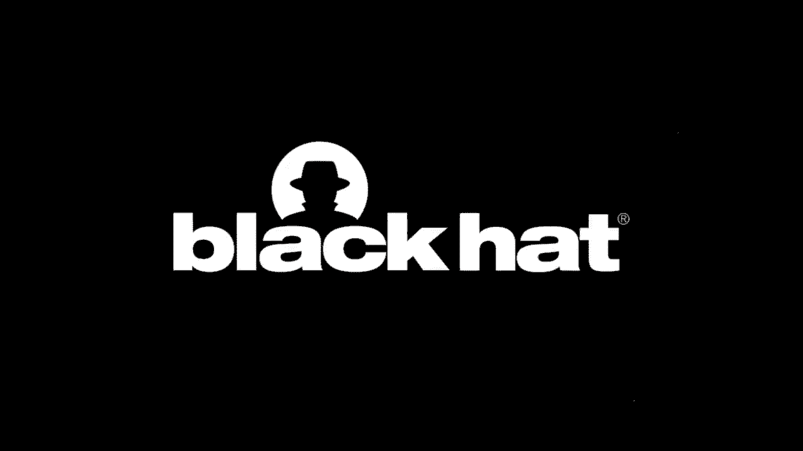
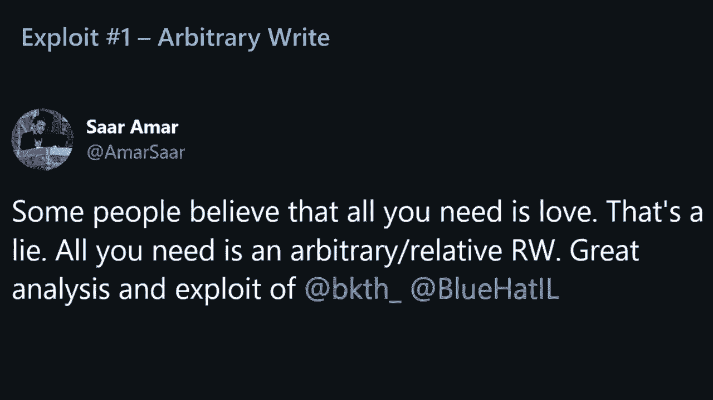
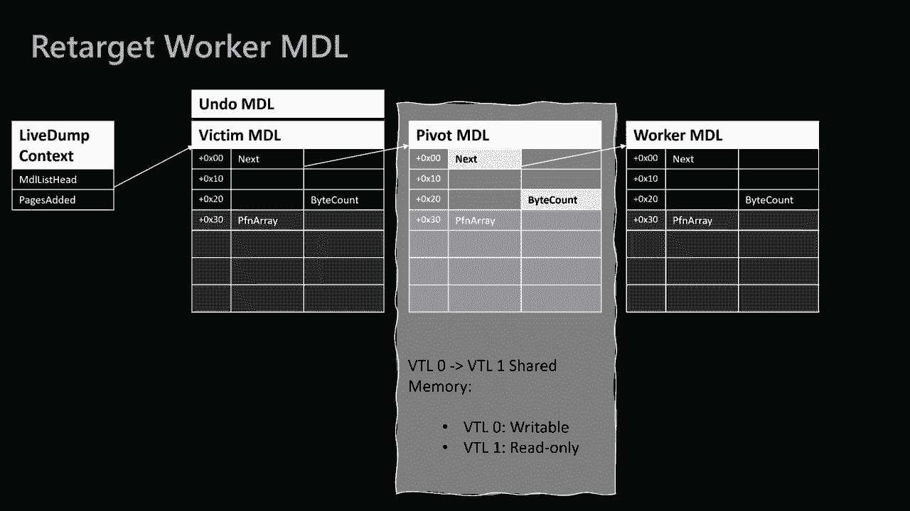
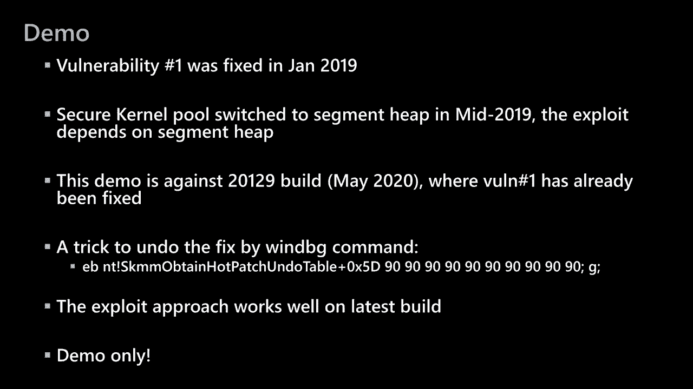
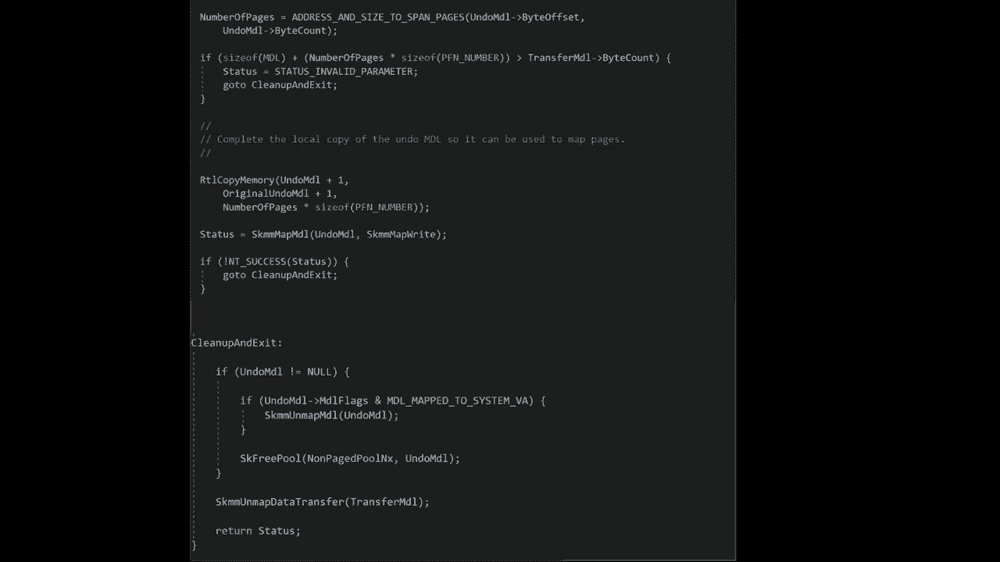
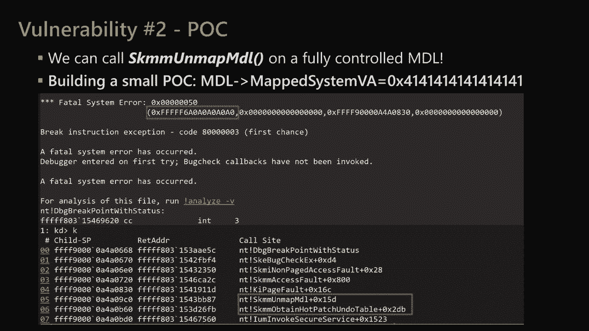
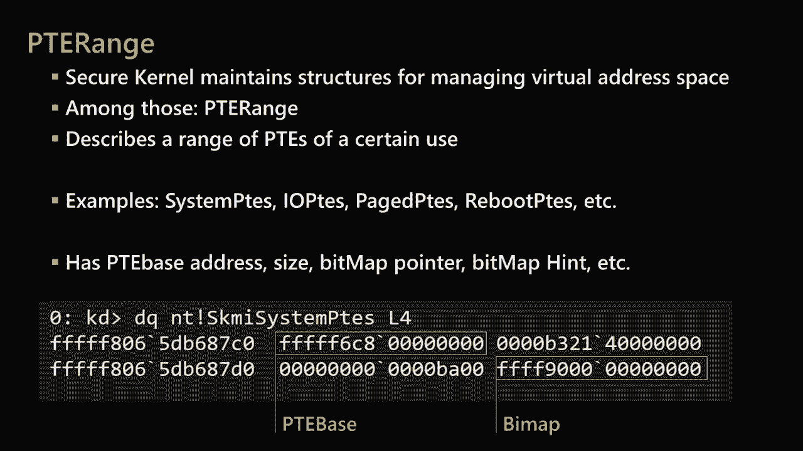
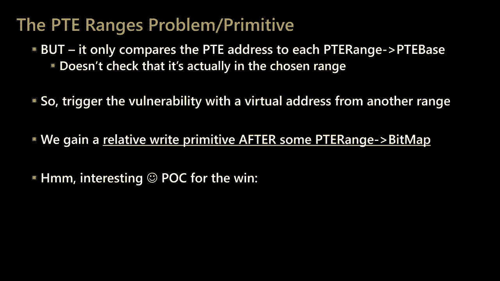

# P43：44 - 通过攻击SecureKernel破坏VSM - 坤坤武特 - BV1g5411K7fe

## 概述

在本节课中，我们将学习如何通过攻击SecureKernel来破坏VSM（虚拟化安全模块）。我们将了解VSM的架构、SecureKernel的漏洞以及如何利用这些漏洞。

## VSM架构

VSM使用虚拟化来强制隔离和限制操作系统。它引入了VTLs（虚拟类级别），用于将操作系统隔离到不同的安全上下文中。目前有两个VTLs：VTL0（普通世界）和VTL1（安全世界）。在普通世界内核空间中，我们有一个endos内核，而在普通世界用户空间中，我们有用户空间、程序、IDE等。在安全世界中，我们保留所有最特权任务组件，以保护它们免受普通世界的侵害。

## SecureKernel漏洞

研究人员发现了两个SecureKernel漏洞：

1. **自动绑定错误**：当bad count小于48时，会发生自动绑定错误。
2. **MDL映射漏洞**：通过控制MDL，可以调用`skmmmapmdl`函数，从而在VTL0中控制VTL1的内存。

## 利用漏洞

研究人员使用Hypersid模糊器发现了这些漏洞，并开发了相应的利用方法。以下是一些关键步骤：

1. **创建MDL**：通过控制bad count，创建一个MDL，并将其映射到VTL1的地址空间。
2. **修改MDL**：修改MDL的内容，使其指向共享页面。
3. **触发漏洞**：通过调用`skmmmapmdl`函数，触发漏洞。
4. **执行任意代码**：通过修改页表项，将共享页面设置为可执行，并跳转到shellcode。

## 总结

本节课中，我们学习了如何通过攻击SecureKernel来破坏VSM。我们了解了VSM的架构、SecureKernel的漏洞以及如何利用这些漏洞。这些知识对于安全研究人员和开发人员来说非常重要，可以帮助他们发现和修复潜在的安全漏洞。