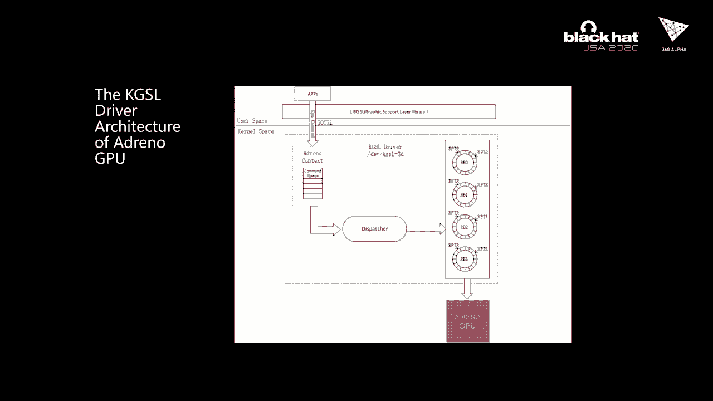

# P44：45 - TiYunZong Exploit Chain to Remotely Root Modern Android Devices - Pwn Andro - 坤坤武特 - BV1g5411K7fe

## 概述

在本节课中，我们将学习如何利用TiYunZong漏洞链远程获取现代Android设备的root权限。我们将深入了解该漏洞链的原理和实现方法。

## 1. Google Pixel手机的安全性

**以下是Google Pixel手机安全性的分析：**

- **价格因素**：Android漏洞链的价格高达500万美元，高于iOS漏洞链。
- **更新频率**：Google Pixel手机通常比其他Android手机拥有更多的更新和版本，这使得它们更难被攻击。

## 2. 远程攻击分析

**以下是远程攻击智能手机的分析：**

- **攻击类型**：远程攻击可以分为通过互联网和通过相邻网络两种类型。
- **攻击向量**：通过互联网的攻击通常更容易实施，而通过相邻网络的攻击则更具破坏性。

## 3. TiYunZong漏洞链

**以下是TiYunZong漏洞链的概述：**

- **漏洞数量**：该漏洞链包含3个漏洞，可以远程获取root权限。
- **攻击目标**：该漏洞链可以攻击包括Pixel设备在内的Nexus设备。

## 4. 漏洞分析

### 4.1 RCE漏洞

**RCE漏洞分析：**

- **漏洞类型**：远程代码执行漏洞。
- **漏洞原理**：通过利用Chrome V8引擎漏洞，可以在Chrome渲染进程中执行远程代码。

### 4.2 EOP漏洞

**EOP漏洞分析：**

- **漏洞类型**：越界读取漏洞。
- **漏洞原理**：通过利用Chrome媒体组件中的漏洞，可以访问GPU驱动程序。

### 4.3 Root漏洞

**Root漏洞分析：**

- **漏洞类型**：越界写入漏洞。
- **漏洞原理**：通过利用Qualcomm KGSL驱动程序中的漏洞，可以修改系统文件，从而获取root权限。

## 5. 漏洞利用

**以下是漏洞利用的步骤：**

1. 启动一个Web服务器。
2. 被害者访问恶意链接。
3. 建立反向shell连接。
4. 执行下载数据，获取load shell。
5. 运行load exploit，获取root权限。

## 总结

本节课中，我们学习了如何利用TiYunZong漏洞链远程获取现代Android设备的root权限。通过深入了解该漏洞链的原理和实现方法，我们可以更好地保护我们的设备免受攻击。