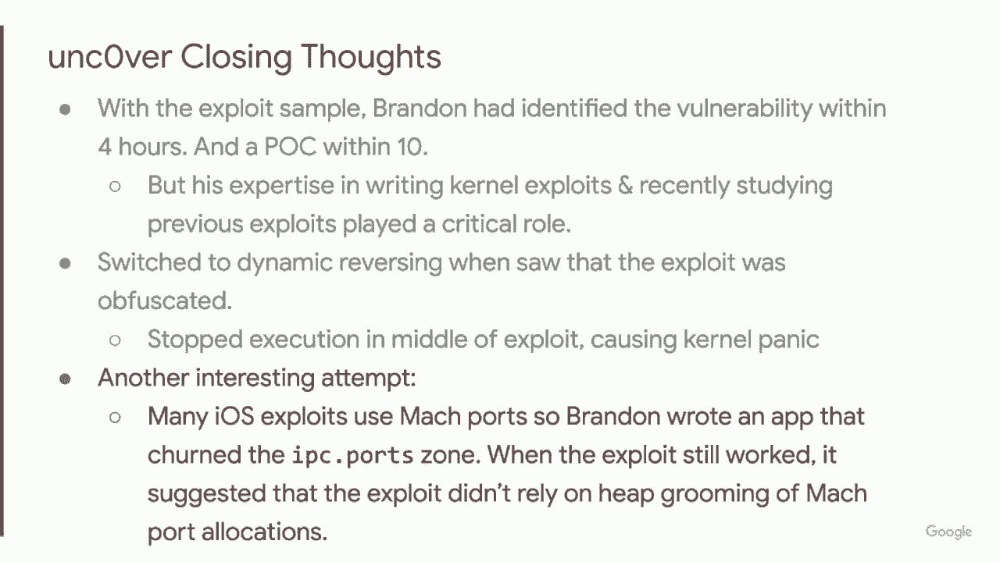
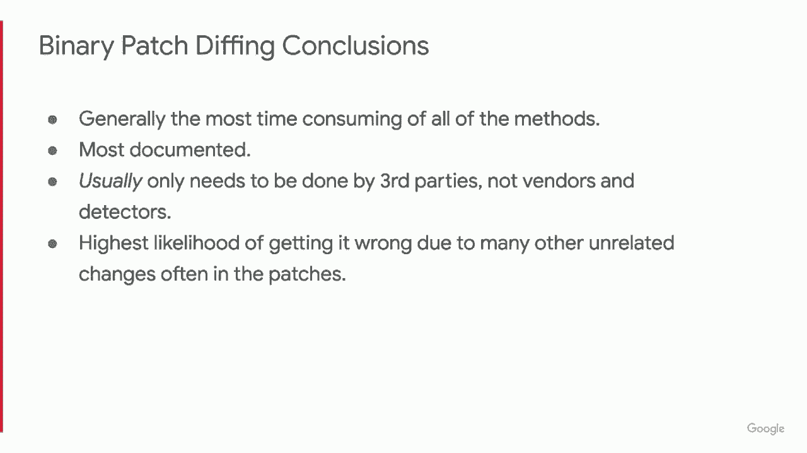
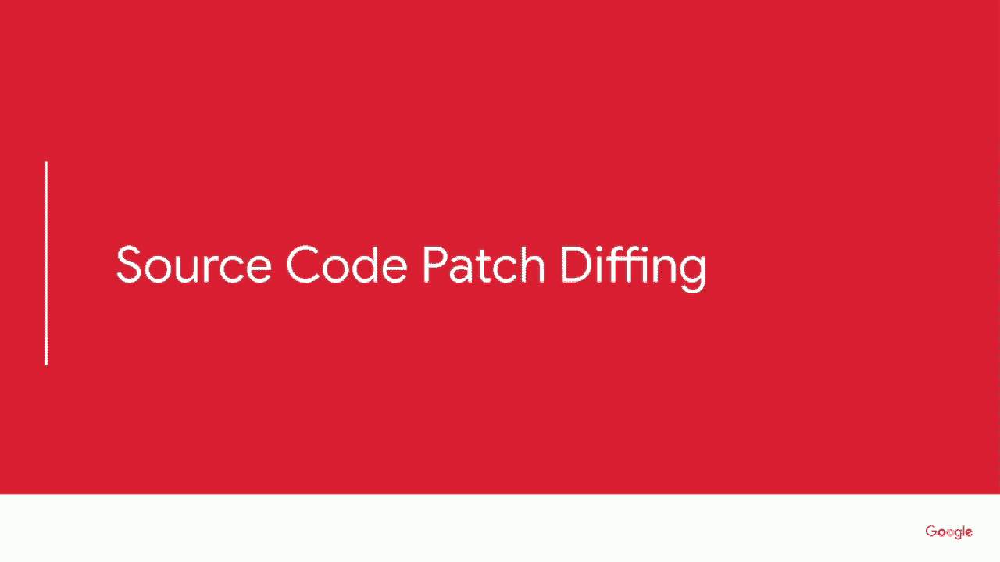
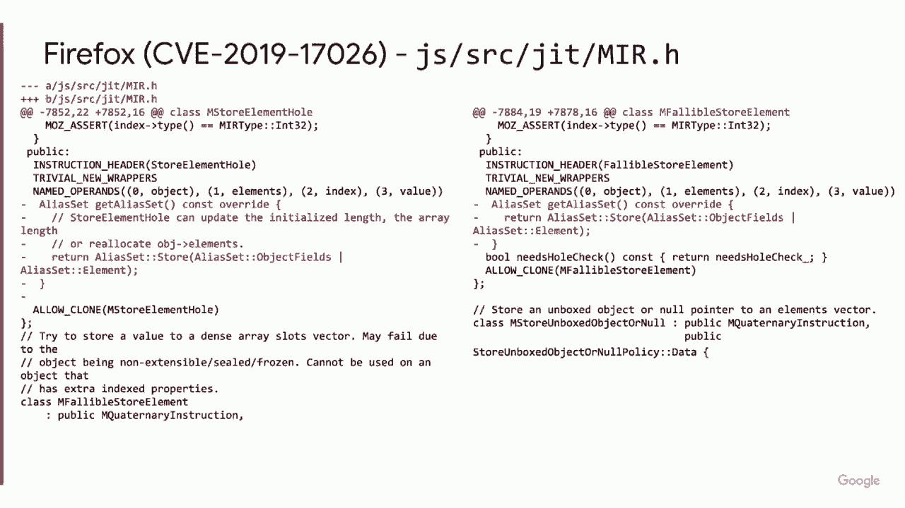
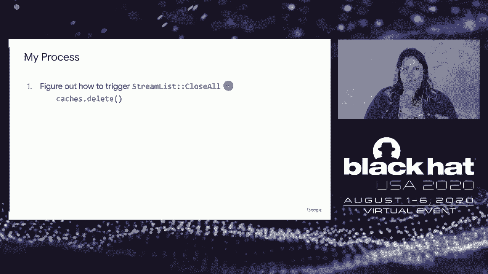

# P46：47 - Reversing the Root - Identifying the Exploited Vulnerability in 0-days Used - 坤坤武特 - BV1g5411K7fe

## 概述

在本节课中，我们将学习如何识别和利用零日漏洞。我们将探讨不同的技术方法，包括逆向工程、二进制补丁注入和源代码补丁注入，以及如何通过这些方法来识别和利用漏洞。

## 核心概念

**公式**：

- **逆向工程**：通过分析软件或代码来理解其功能和原理。
- **二进制补丁注入**：通过修改二进制文件中的代码来修复漏洞。
- **源代码补丁注入**：通过分析源代码补丁来理解漏洞的原理。

## 基本技术

以下是四种基本技术：

1. **逆向工程漏洞样本**：通过分析漏洞样本来理解其功能和原理。
2. **二进制补丁注入**：通过修改二进制文件中的代码来修复漏洞。
3. **源代码补丁注入**：通过分析源代码补丁来理解漏洞的原理。
4. **基于漏洞细节的漏洞挖掘**：通过分析漏洞细节来识别和利用漏洞。

## 案例研究

### 1. Windows JScript 漏洞

**案例描述**：

CVE 2019 1367、CVE 2019 1429 和 CVE 2020 0674 是一系列 Windows JScript 漏洞，它们都是通过脚本引擎处理内存中的对象来实现的。

**解决方案**：

Yvonne 使用了一个自定义测试用例模拟器来识别触发漏洞的代码行。

### 2. iOS Uncover 漏洞

**案例描述**：

iOS Uncover 漏洞是一个用于越狱的漏洞，它依赖于内核漏洞。

**解决方案**：

Brandon 使用动态逆向工程来分析漏洞，并使用 Checkra1n 和 Pungo I/O 来修复漏洞。

### 3. WhatsApp 漏洞

**案例描述**：

WhatsApp 漏洞是一个缓冲区溢出漏洞，它允许通过 RTCP 数据包执行远程代码。

**解决方案**：

作者使用二进制补丁注入来分析漏洞，并使用 Freida 工具来理解补丁的功能。

### 4. Firefox 漏洞

**案例描述**：

Firefox 漏洞是一个 JIT 编译器漏洞，它可能导致任意代码执行。

**解决方案**：

Samuel 使用源代码补丁注入来分析漏洞，并确定了漏洞的原理。

### 5. Android Binder 漏洞

**案例描述**：

Android Binder 漏洞是一个基于漏洞细节的漏洞挖掘案例。

**解决方案**：

作者使用漏洞细节来识别和利用漏洞。

## 总结

本节课中，我们学习了如何识别和利用零日漏洞。我们探讨了不同的技术方法，包括逆向工程、二进制补丁注入和源代码补丁注入，以及如何通过这些方法来识别和利用漏洞。希望这些知识能够帮助您更好地理解和应对零日漏洞。