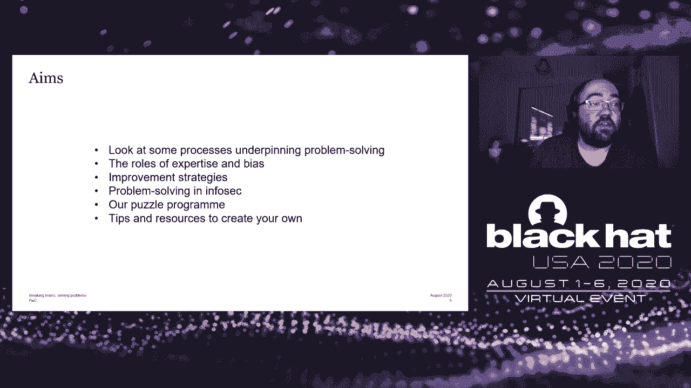
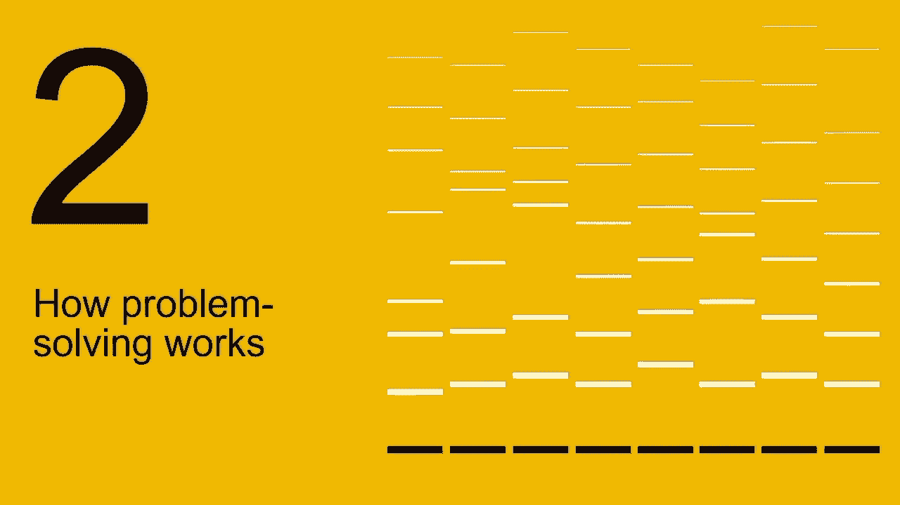
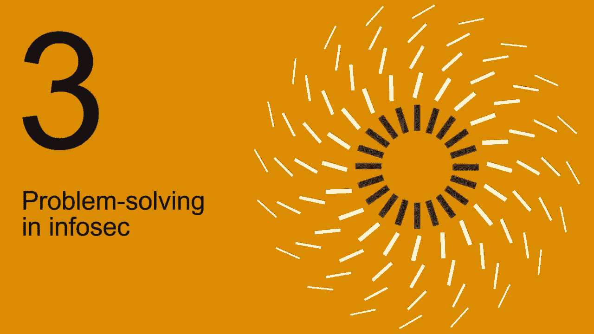

# P47：48 - 破解大脑，解决问题 - 两年设置谜题和视频的经验教训 - 坤坤武特 - BV1g5411K7fe

[音乐]

**引言**

在本节课中，我们将学习如何通过设置谜题和视频来提高信息安全领域的解决问题的能力。我们将探讨解决问题的过程、专家和偏见在其中的作用，以及一些改进策略。

**解决问题的过程**

* **理解**：理解谜题的刺激，形成心理结构来表示问题。
* **搜索**：找到或计算解决方案。

**解决问题的策略**

* **前进策略**：线性过程，选择操作符，测试其是否影响状态，并确定是否为解决方案。
* **反向链接**：从已知解决方案开始，尝试找出如何到达最终状态。
* **子目标**：选择操作符，尝试使其适应，如果它不适应，则尝试使其适应，使其成为到达最终状态的子目标。
* **手段和目标分析**：确定当前状态与最终目标之间的差异，并尝试减少该差异。
* **洞察力**：导致问题空间本身发生变化。

**解决问题的能力**

* **解决问题的能力可以通过时间、方法、舒适度、模糊性、不确定性和不可预测性以及特定的测试来衡量**。

**专家在解决问题中的作用**

* **专家通常知道更多的问题模式**。
* **专家可能比新手更快，但关键差异可能是他们犯的错误更少**。
* **专家通常比新手更好地进行自我监控，并估计过程的难度**。

**偏见**

* **经验偏见**：依赖过去经验做出决策。
* **自我服务偏见**：相信我们做出逻辑和理性的决策。
* **事后诸葛亮偏见**：对已知结果赋予更高的概率。
* **锚定**：避免认知失调。
* **确认偏见**：优先考虑证实我们信念的证据，而不是优先考虑或给予挑战我们信念的证据较低的重要性。
* **沉没成本谬误**：认为我们已经投入了这么多，所以我们应该继续前进。

**改进策略**

* **做更多**：像任何认知技能或运动技能一样，你做得越多，你就越好。
* **测试假设**：认识到你有一个特定的视角，并且这个视角可能会阻碍解决方案，而不是产生解决方案。
* **自上而下细化**：从更大的图景中看问题。
* **避免陷入困境**：记住你为什么下去，以及如何出去。
* **自我解释或橡皮鸭调试**：向自己解释问题，就像向别人解释一样。
* **自发思考**：让问题在你脑海中自由流动。
* **认识各种偏见**：包括前面提到的偏见，以及认识到我们倾向于通过主导结构看待世界。

**信息安全中的问题解决**

* **信息安全中的问题通常是知识丰富的，需要超出问题本身的知识**。
* **信息安全中的问题可能定义不明确**。
* **信息安全中的问题涉及来自不同背景和经验水平的人员**。
* **信息安全中的问题具有多种模式**。

**PwC的谜题计划**

* **PwC的谜题计划旨在提高员工的解决问题的能力**。
* **谜题计划包括逻辑谜题、文字游戏、数学和概率以及技术挑战**。
* **谜题计划有助于提高文化、协作和合作**。

**总结**

在本节课中，我们一起学习了如何通过设置谜题和视频来提高信息安全领域的解决问题的能力。我们探讨了解决问题的过程、专家和偏见在其中的作用，以及一些改进策略。希望这些知识能够帮助你在未来的工作中更好地解决问题。