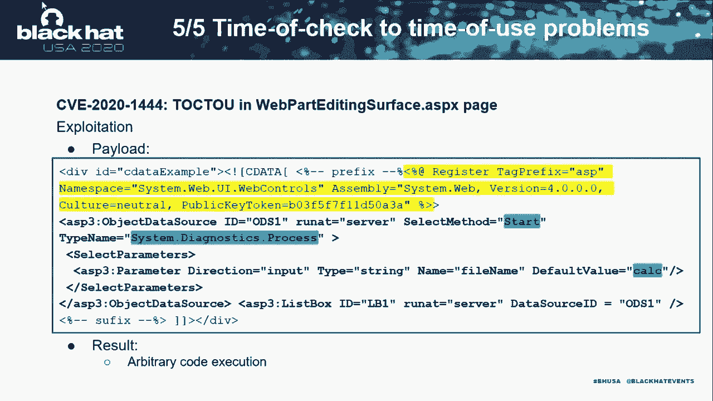

# P48：49 - Room for Escape - Scribbling Outside the Lines of Template Security - 坤坤武特 - BV1g5411K7fe

## 概述

在本节课中，我们将学习如何利用模板安全漏洞进行攻击。我们将探讨.NET和Java内容管理系统（CMS）中的安全漏洞，并展示如何绕过沙盒执行任意系统命令。

## .NET CMS 安全漏洞

### SharePoint 沙盒绕过

*   **沙盒限制**： SharePoint 使用沙盒来限制用户对敏感资源的访问。
*   **绕过方法**：
    *   **解析控制方法**： 通过绕过解析控制方法，可以执行任意代码。
    *   **不安全控件**： 使用不安全控件，例如 `objectDataSource`，可以执行任意代码。
    *   **XML 数据源和控件**： 可以读取任意 XML 文件的内容。
    *   **服务器端包含指令**： 可以包含任意文本文件的内容。
    *   **验证密钥**： 可以使用验证密钥生成有效用户状态，从而执行任意代码。

### 安全模式绕过

*   **安全模式**： SharePoint 使用安全模式来限制对动态内容的访问。
*   **绕过方法**：
    *   **解析控制方法**： 通过绕过解析控制方法，可以访问不安全控件。
    *   **不安全控件**： 使用不安全控件，例如 `objectDataSource`，可以执行任意代码。
    *   **XML 数据源和控件**： 可以读取任意 XML 文件的内容。
    *   **服务器端包含指令**： 可以包含任意文本文件的内容。

### 动态内容访问

*   **动态内容**： 动态内容通常意味着可以访问某些对象的属性或属性。
*   **绕过方法**：
    *   **属性过滤**： 通过绕过属性过滤，可以访问不安全的属性或属性。
    *   **嵌套属性访问**： 通过访问嵌套属性，可以绕过安全限制。

### 安全反序列化

*   **安全反序列化**： 安全反序列化问题与将文本或二进制数据转换为对象有关，其中对象的类型或类由攻击者控制。
*   **绕过方法**：
    *   **反序列化攻击**： 可以使用反序列化攻击来执行任意代码。

### 时间检查到时间使用问题

*   **时间检查到时间使用问题**： 当服务器验证某些输入，但可以在服务器使用之前更改输入时发生。
*   **绕过方法**：
    *   **验证控制**： 通过绕过验证控制，可以执行任意代码。

## Java CMS 安全漏洞

### 模板引擎沙盒绕过

*   **模板引擎**： 模板引擎用于解析和扩展动态内容。
*   **沙盒**： 模板引擎通常使用沙盒来限制对方法的访问。
*   **绕过方法**：
    *   **对象查找**： 通过查找上下文中的对象，可以绕过沙盒。
    *   **类加载器**： 通过访问类加载器，可以加载任意类或资源。
    *   **实例管理器**： 通过访问实例管理器，可以实例化任意类型。
    *   **Spring 应用程序上下文**： 通过访问 Spring 应用程序上下文，可以访问应用程序逻辑。

### 模板引擎绕过

*   **FreeMarker**： FreeMarker 是一种流行的模板引擎。
*   **绕过方法**：
    *   **类加载器**： 通过访问类加载器，可以加载任意类或资源。
    *   **实例管理器**： 通过访问实例管理器，可以实例化任意类型。
    *   **Spring 应用程序上下文**： 通过访问 Spring 应用程序上下文，可以访问应用程序逻辑。
*   **Velocity**： Velocity 是另一种流行的模板引擎。
*   **绕过方法**：
    *   **类加载器**： 通过访问类加载器，可以加载任意类或资源。
    *   **实例管理器**： 通过访问实例管理器，可以实例化任意类型。
    *   **Spring 应用程序上下文**： 通过访问 Spring 应用程序上下文，可以访问应用程序逻辑。
*   **JinJava**： JinJava 是一种模板引擎。
*   **绕过方法**：
    *   **类加载器**： 通过访问类加载器，可以加载任意类或资源。
    *   **实例管理器**： 通过访问实例管理器，可以实例化任意类型。
    *   **Spring 应用程序上下文**： 通过访问 Spring 应用程序上下文，可以访问应用程序逻辑。
*   **Pebble**： Pebble 是一种模板引擎。

## 总结

在本节课中，我们一起学习了如何利用模板安全漏洞进行攻击。我们探讨了.NET和Java