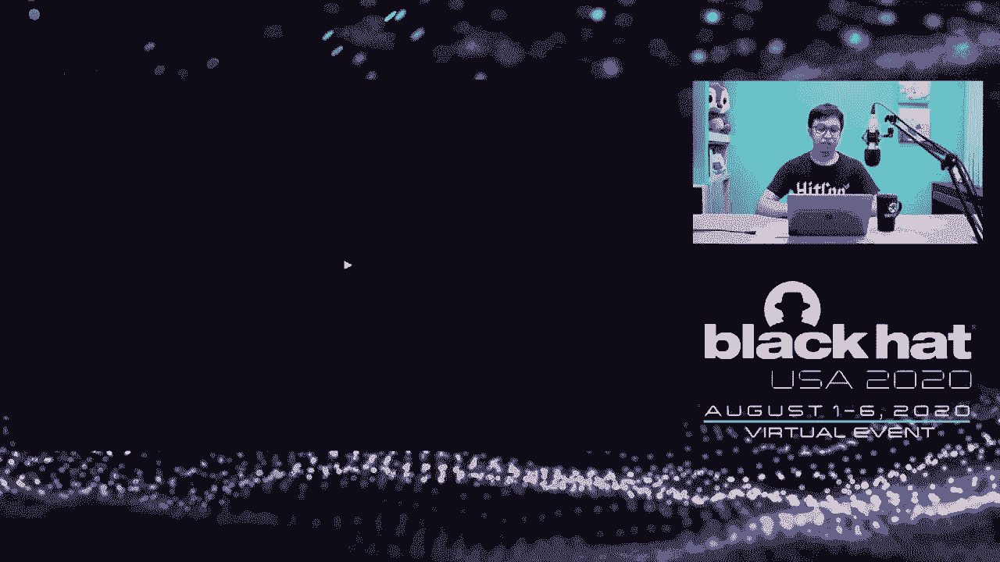
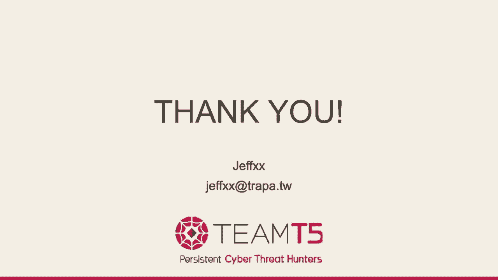

# P49：50 - Breaking Samsung's Root of Trust - Exploiting Samsung S10 Secure Boot - 坤坤武特 - BV1g5411K7fe

 Hi everyone。 Today I will show you how I exploited Samsung Secure Boot to retrieve sensitive data in the Galaxy S10。

 My name is Jeff Zhao。 I have been playing in CTF in Shikon CTF team for 10 years。

 I am also a member of Change Boot。 Taiwan's private security study group。

 I now focus on mobile and IoT security。 This is my agenda。 In the beginning。

 I will play a demo video to show a scenario where the vulnerabilities could be exploited。

 That I will introduce how Samsung enhanced the security in Android with their own framework， Nox。

 And quick guidance to see previous research on Nox framework。 With the background knowledge。

 I will explain the vulnerabilities I found and how to exploit Secure Boot by these vulnerabilities。

 And finally， I will discuss how further damage can be caused after exploiting Secure Boot even without passcode。

 Before we start， let's watch a demo video。

 [Music]。

 [Music]， [Music]， [Music]， [Music]， [Music]， [Music]， [Music]， [Music]， [Music]。

 Let me start by giving you a brief introduction of the Samsung Security Framework， Nox。

 Nox is a huge， complicated， persistent security enhancement based on trust zone。

 It contains team-martial-zone based interpretive measurement architecture。

 Real-time kernel protection。 Team-mart periodic kernel measurement。

 S E E Nina's enhancement and many other things to prevent privilege escalation and unauthorize access to the phone's data。

 Since we are taking the Boot Loader， we will only discuss the most relevant part， Secure Boot。

 The Android Boot procedure starts from the primary boot loader， also called PVL。

 It will load the second stage boot loader。 In Samsung devices， it is called Secure Boot。

 also known as S Boot。 Secure Boot will bring up the operating system from the boot image。

 Each boot stage will verify the signature before proceeding to the next stage。

 The verified key is stored in hardware domain factory。

 Primary boot loader only runs Secure Boot if the signature is valid。

 We cannot change the primary boot。 Thus， the phone can only put the official Secure Boot image。

 Next， Secure Boot will launch the boot image or the cloud image if its signature is valid。

 If the signature is not valid， Secure Boot will boot the image with additional action。

 which is blowing the next bit。 What will happen if the next bit is set？

 The provision of Samsung's warranty depends on the next bit， also called the warranty bit。

 Trying to boot an unofficial boot image will tamper with the next bit。

 It is a one-time-right ball memory。 There is no way to recover it。

 Some services in TrustLong cannot be launched if the bit is set， such as Nox container。

 Samsung Pay and Trustee keystore。 After the GLS9， Samsung equipped the storage with the 4th 18th。

 Only after the first time unlocking the screen， the storage gets decrypted。

 The Inclusion key is stored in the TrustLong application。

 We cannot equip the storage without unlocking the phone， even if we have boot privilege。

 How do they land a storage encryption key？ There is lots of critical information that can only be decrypted by TrustLong。

 Once the Nox bit is set， most of them will no longer work。

 This is a diagram of the UntrustLong exception level。

 Traditional boot methods only get exception level 1 in non-secure world。

 The data encrypted by TrustLong cannot be decrypted if Nox bit is set。

 The way to get sensitive data is privileged escalation to exception level 1 in secure world。 Or。

 trick the device into thinking that the Nox bit is still safe。

 There has been a lot of research into breaking Nox's protection。 I will show you some previous work。

 First， at Brayerhead USA 2017， returns me defeated Nox real-time control protection。

 which is designed to prevent previous escalation from non-secure world exception level 0 to non-secure world exception level 1。

 And second， at Brayerhead Europe 2017， Tenxin level demoed a vulnerability to exploit a sense-on-pay trust that in TrustLong。

 Resulting in a yes is collected privilege level from non-secure world exception level 0 to secure world exception level 1。

 Next year， Quark's level demoed some amazing work that shattered the trust long protection。

 Resulting in privilege escalation all the way from non-secure world exception level 0 to secure world exception level 3。

 But all of this work means that this non-secure world exception level 0 privilege。 So。

 how if the device is turned off and we don't know the past code？ In this talk。

 we are discussing the scenario in which we can exploit the locked phone and keep sensitive data luchable。

 In general， sense-on-secure boot will verify the boot image and boot into kernel after setting up secure monitor and initializing hardware。

 But secure boot will enter old mode if we press the button down and power button's delete booting process。

 The old mode allows user to flash stock firmware to manually update the phone。

 It not only verifies the signature but also checks the version number。

 Old mode does not allow the user to flash previous versions or unofficially firmware。

 This is post a channel for interacting with secure boot。 In old mode。

 we found several vulnerabilities which can achieve arbitrary co-excusion。

 The first one can only get co-excusion on older models like the Galaxy S8。

 Oldian request is very simple。 We send the integer as operation code。

 The operation code specifies the function we want to use in old。

 And then we follow that with another integer， sub operation。 To tell oldian。

 whether we are going to set， get， or initialize something。 And finally， we can have some argument。

 In oldian flash image command， the image size is provided by the user。 And there is no check for it。

 Even if oldian decides the buffer location by the size， it has an integer above the bar。

 So we can choose which buffer location we want。 What data is stored behind the buffer？

 They are the secure boot code segment， VSS， Staker and Keep。 Due to the lack of size check。

 we can override everything and control the code segment， stack and heap。 Since the Galaxy S8。

 Samsung has tightened a new table and set the code segment to read only。 Fortunately。

 USB devices have the lottery memory access。 We are now restricted by a menu control。 And next。

 we must deal with the cache in convenience problem。 Since the USB manipulate memory directly。

 we cannot affect the cache data。 Unfortunately， while receiving data。

 the CPU keeps tracking the USB event， which is in a while loop。 Obviously。

 this code is cached by the CPU。 Therefore， we cannot affect the code data。

 But there are some memory segments which are not set to be cached， and no segments are the heap。

 In the for loop， it will access a heap pointer。 Since the heap is not cached。

 once we overwrite heap data with all new bytes， it will access address 0 and trigger data a boot。

 Once data a boot is triggered， it will jump to the error handler immediately。

 The error handler function has never been executed。 Thus， it is not cached。

 We can just put jump-slide on the error handler， and we put the circle in front of the code segment to ensure it will not be affected by the CPU cache。

 In conclusion， we overflow the memory according to the layout。 Then。

 we can achieve arbitrary code execution in secure boot。 But we are not able to exploit S9 later。

 Because the buffer location is changed to another address。

 which is far from the secure boot code segment。 We had figured out a potential exploit path to exploit a newer marketer。

 In S9 later， Oden changed the buffer location to a big address， which is behind the code segment。

 That is because Oden added parallel download feature to make the transfer speed faster。

 To use this feature， secure boot need boot up another two CPU cores。 If the core boot fails。

 secure boot will fall back to normal download mode。

 which change the buffer to the original location。 So。

 we try to find a way to make the CPU boot fails。 In secure boot。

 the CPU boot function will not put the core。 If there are more than three cores activated。 Thus。

 if we can put another core before entering Oden mode。

 we can make the secure boot fall back to normal download mode。 That is amazing。

 There is really a way to achieve it。 Secure boot has another mode， which is called UART debug mode。

 The mode has a command that can boot another core for testing。 Most importantly， when it's done。

 it will not decrease the count of booted cores。 We can keep increase the count of booted cores until it exists the limit。

 And the UART mode has another command download。 We can enter into Oden mode。 So。

 if we can enter UART mode， we can exploit S10 with the vulnerability。

 We find that secure boot will check the resistor in the USB cable if the resistor makes a specific value。

 It will enter UART mode。 But even some researchers successfully enter UART mode in Galaxy S7。

 The method was not no longer work in Galaxy S8 and later。 Because the cable was trained to type "G"。

 we have tried many other methods， such as making a type "C" cable connected with a pro-dung and pro-aproly system。

 Or making a type "C" cable in S7 remote。 Or trying communicate with S10 by the vendor defime M3。

 Or if this work all failed， secure boot cannot detect the resistor。 So， six months later。

 we stopped trying and reported the bug to send some， bug guys August 2019。 And several days later。

 sent some bug back to me and told me that this issue was duplicated。

 This was a real problem to me and I changed my research target to other areas。 Several months later。

 sent some released the patch。 The title is " Potential Interjouable Phone"。

 After reading the description， I guess the reporter did not notice that the bug can lead to arbitrary code execution。

 The patch description said it fixed the unsigned compression issue。 But actually。

 S7 did not only make the compression unsigned， but also added a size check to prevent bug overflow。

 After looking at the patch， I was wondering if layer was any way to bypass the check。

 Several days later， I found another vulnerability， last came by past the check。

 After looking more deeply into the function related to USB receive。

 I found that the provided size is calculated as a line size with a strange value。

 After cross-flavoring the list value without the areas of the system。

 we found that it can be changed by all the new quests。 According to the debug message。

 we know it is used to specify the size of data packets。 The value does not have any checks。

 Therefore， if we set the size of data packets to a larger amount。

 we can bypass the check last Samsung aided in October 2019， and exploit the same bug again。

 This time， I reported the bug immediately。 Several months later。

 Samsung released the patch in January 2020。 They added a check to ensure the size of data packets cannot be logged in at 100。

000 in hex。 The patch gave me an idea。 And three hours later， I figured out another exploit。 So。

 let's discuss the third vulnerability。 This time， we can exploit the Galaxy S10。

 Odin has another operation command。 It can flash the partition information table。

 The table is small。 Thus， Odin only allocates a heap buffer to store it。

 instead of using the big buffer in front of cross-segment。 We cannot directly overflow it。

 Because there is a check to make sure that the size is smaller than the heap buffer。

 to prevent buffer heap overflow。 Remember the second vulnerability I just mentioned？

 We can use the size of peckey data to enlarge the receive size。

 Although the patch added additional check to the size of peckey data， the limit is 6F in hex。

 But the heap buffer size for the partition information table has only 2000 in hex。

 which could lead to heap overflow。 This is the pseudo code that shows what happens when Odin tries to receive data。

 According to the pseudo code， we can see the USB received will receive the peckey data size variable。

 only if the request size is bigger than 6F in hex。

 Or if the first receive attempt cannot get enough data。 This is what we need to achieve。

 But the USB receive function will keep receiving data until the pest size is reached。

 Even if we send data in huge intervals， the device will still be waiting for data。 Actually。

 we found the bug at the very beginning。 But we thought it was an exploitable vulnerability。

 We cannot make the USB receive function get insufficient data。 So。

 we wasted all time on vulnerability 1。 But after seeing the patch of vulnerability 2。

 I was struck by lightning。 I had a light ball movement。 This time。

 I can't have a little idea which was to send only a very small amount of data。

 And then remove and reinstitute the USB cable。 The first USB receive return insufficient size。

 which allows us to reach the second USB receive。 This time。

 it's received with the size of peckey data。 Allow us to overflow the heap buffer。

 It's turned into a heap overflow challenge。 We use the traditional heap exploitation technique。

 house of spirit， to achieve arbitrary code execution。

 There is no check for the doubling heat list for the heap。 So。

 we can fact the chunks and overwrite the heap's metadata to insert our fact chunk into the heap。

 Once we can insert the fact it chunk into the heap and free it， we can overwrite arbitrary edges。

 But there's a limitation。 The unused bit must not be zero。 Since the throughput is 64-bit。

 we can now overwrite the dirty entry， function pointers in data segment。

 Because the unused bit is in the higher part of the address。

 which always be zero when the data is a pointer。 The only chance is to overwrite the return edges and stack。

 If we can cancel the first local variable in the functions。

 But there are only three function calls after we free our fact heap chunk。 Luckily。

 one of those is the old incumbent handle。 The old incumbent buffer is the first local variable in the handle。

 The incumbent buffer is in our control， which means we can fulfill the limitation and set unused bit to non-zero。

 Now， we can execute arbitrary code in secure boot。 What's the next step？

 Since we overwrite the BSS stack and heap with all new bytes， it's hard to recover the data。 Thus。

 we restart the booting process in secure boot to recover this data。

 But we only get exception level 1 in non-secure world。 Some data in trust zone already initialized。

 We cannot init it twice。 Therefore， we must skip the trust zone related code to keep trust zone stable。

 And we continue the booting process until loading kernel to memory。 In this step。

 we replace the kernel image with a custom one。 So， this is our exploit step。 First。

 we set the size of peckey data to a big number。 Second。

 we send the old MPIT-FRASH command to trigger USB data receive。 Third。

 we remove and reinsert the USB cable。 Trigger the second USB receive。 This time。

 we overwrite the metadata of heap chunk。 Fourth， we send another old incoming to trigger main lock and free a heap buffer。

 Finally， the free action overrides the return address on stack。 Then we can jump to our share code。

 The share code will put custom kernel to get loot privilege。 Now。

 we got the exception level 1 in non-war world。 The data in secure world is still eligible since the not speed is safe。

 But we don't have the screen pass code。 The phone is still locked。 We can not loot sensitive data。

 The storage is still encrypted。 The encryption key for storage is stored in the gatekeeper translate。

 Some data also cannot be looged。 For example， credit card information in Senson page translate。

 There are many ways to looge the data。 We can wait for the user to unlock their phone as shown in the demo video。

 Since we are in non-secure kernel mode， we also can destroy the requests from non-secure user mode to secure world。

 Furthermore， it is supposed to take service for us。 Since the not speed is safe。

 the data stored in secure world still is safe。 There are many mobile abilities that we can explore to get into the secure world。

 Our team found more than 10 vulnerabilities in 2019 and still find the oldest in 2020。

 Outside of our team， there are 10 times more vulnerabilities found by other researchers。

 All of these vulnerabilities need at least kernel-rich privilege in non-secure world。 For example。

 we can attack the gatekeeper translate to decrypted storage。 In May 2019。

 we reported a vulnerability in gatekeeper translate。

 which allows us to brew forth the screen pass code。 According to our test。

 it takes only a few hours to try all possible patent codes。

 Combined with the vulnerability in gatekeeper translate。

 we can unlock the phone and looge the sensitive data。 In conclusion。

 even with the data is stored in secure world， it still doesn't mean it's 100% secure。

 But it actually made it's void in harder。 We need multiple vulnerabilities to retrieve the protected data。

 We need a lending exploit， maybe a remote execution， or local secure body exploit。

 Followed by a kernel exploit to achieve privilege escalation to non-secure world kernel mode。

 After getting the loot privilege， we still need a vulnerability in transit。

 to break into secure world exception level zero。 If we want to go all get all sensitive data instead of one specific piece。

 we need a secure OS vulnerability to control the floor device。 Without all of this。

 the data in the phone is still safe。 This is a timeline for all the report times and page dates。

 Thanks everyone。 Thank you for listening。 And if you have any questions。

 please don't hesitate to ask me or looge out to me by email in the future。

 Thank you。 What's the best book？ Okay。 Hi。 I want to answer the question。 What's the best book？

 You said model。 Let me see the other questions。 If a user rebooted their device。

 will the device prepare to put the original firmware？ Yes。 We don't change the firmware。

 so if the device reboot， it will reboot the original firmware。

 What were the two SVs on the next two desk slides？ Let me check the slides。 Sorry。

 I cannot find the quiz SV you mentioned。 John， can you ask again？ Oh， for carries questions。

 Sensible multiple versions of layer phones with different hardware。

 We exploit the hardware with USA。 I think for， the S10， S9。

 S8 with SNOS models all affected by the vulnerabilities。 And for the take-off question。

 how were you able to view the full information？ Just reverse the full image。 Yeah。

 just reverse the full image。 Secure put。 In demo video。

 We just enter the old mode and we can build a booty mode for the measure。 And for John's questions。

 SV， let me check。 No， I will answer you in the test box。 Any other questions？ Okay， thank you。

 Thank you。 Thanks everyone。 [ Silence ]。