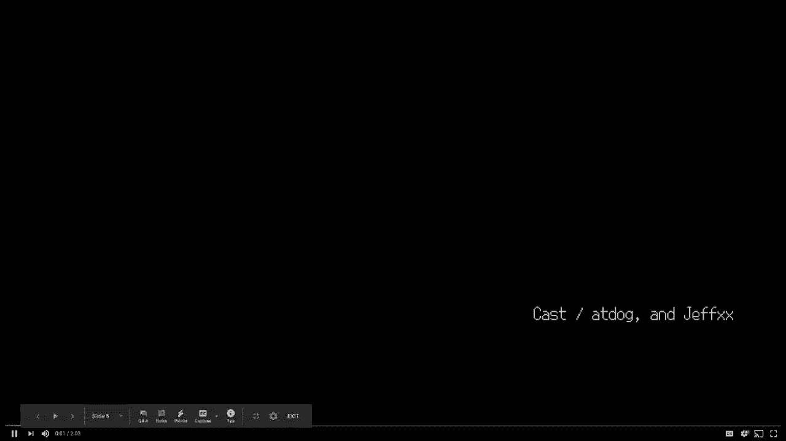

# P49：50 - 破解三星的信任之根 - 利用三星S10安全启动 - 坤坤武特 - BV1g5411K7fe

## 概述
在本节课中，我们将学习如何利用三星S10的安全启动漏洞来获取敏感数据。

## 教程内容

### 1. 介绍
大家好。今天我将向大家展示如何利用三星安全启动漏洞来获取Galaxy S10中的敏感数据。

### 2. 讲者介绍
我的名字是Jeff Zhao。我在Shikon CTF团队玩CTF已经10年了。我也是Change Boot的成员，这是台湾的一个私人安全研究小组。我现在专注于移动和物联网安全。

### 3. 演示视频
在开始之前，让我们先观看一个演示视频。

### 4. 三星安全框架Nox
Nox是一个基于信任区的巨大、复杂、持久的安全增强框架。它包含基于团队 martial-zone 的解释性测量架构、实时内核保护、团队 martial 定期内核测量、SE Nina 增强以及许多其他功能，以防止权限提升和未经授权访问手机数据。

### 5. 安全启动
Android启动过程从主引导加载程序开始，也称为PVL。它将加载第二阶段引导加载程序。在三星设备中，它被称为Secure Boot，也称为S Boot。Secure Boot将从引导映像启动操作系统。每个启动阶段在进入下一阶段之前都会验证签名。

### 6. 漏洞和利用
在了解了背景知识后，我将解释我发现的漏洞以及如何通过这些漏洞利用Secure Boot。最后，我将讨论在利用Secure Boot后，即使没有密码，也可能造成的进一步损害。

### 7. 演示
我将演示如何利用这些漏洞来获取敏感数据。

### 8. 总结
本节课中，我们一起学习了如何利用三星S10的安全启动漏洞来获取敏感数据。