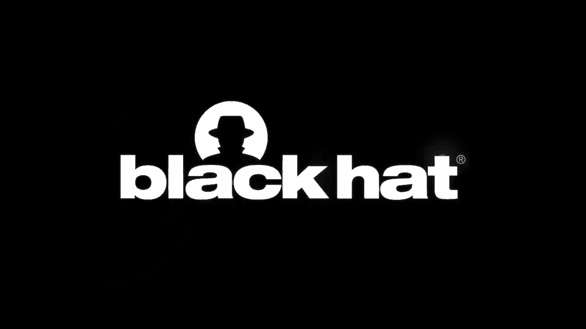
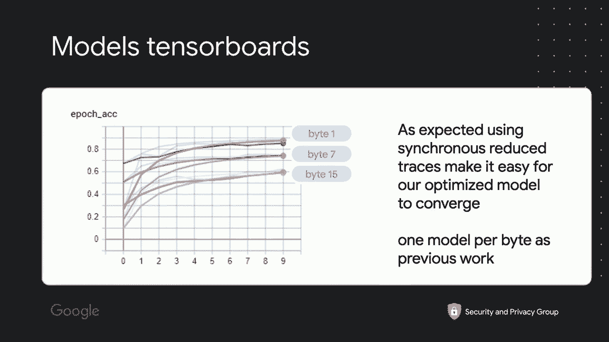
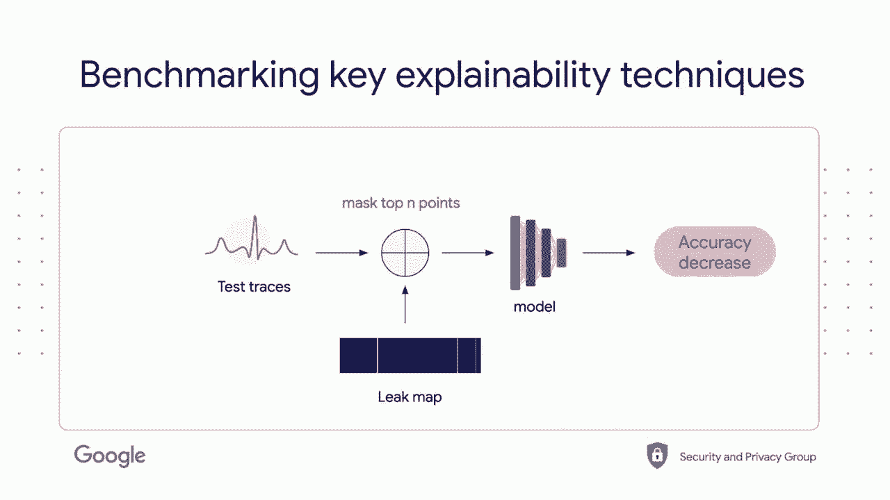

# P5：05 - 使用深度学习减少侧信道攻击面的黑客指南 - 坤坤武特 - BV1g5411K7fe

## 概述

在本节课中，我们将学习如何使用机器学习来减少侧信道攻击面。我们将探讨侧信道攻击的原理，以及如何利用深度学习和动态分析来定位和修复漏洞。

## 侧信道攻击

**侧信道攻击**是一种间接测量计算结果的方法，通过辅助机制进行。它通常用于攻击加密硬件，因为它攻击的是实现的漏洞，而不是算法本身。

**侧信道攻击的例子**：

* 从硬件比特币钱包中提取比特币钱包的私钥。
* 在安全硬件上进行会话攻击。

**侧信道攻击的漏洞**：

* 软件和硬件之间的交互。
* 算法的实现细节。

## 深度学习与侧信道攻击

**深度学习**可以用于自动化侧信道攻击，并提高攻击效率。

**深度学习在侧信道攻击中的应用**：

* 使用神经网络代替模板攻击。
* 自动化攻击过程，减少对领域专家的依赖。

## Cold：侧信道攻击泄露检测器

**Cold**是一个用于检测侧信道攻击泄露的软件工具。

**Cold的功能**：

* 定位泄露的来源。
* 辅助调试侧信道攻击。

## 使用Cold进行侧信道攻击检测

以下是使用Cold进行侧信道攻击检测的步骤：

1. **收集数据**：使用示波器或其他工具收集目标硬件的信号。
2. **预处理数据**：将收集到的数据转换为适合机器学习的格式。
3. **训练模型**：使用收集到的数据训练深度学习模型。
4. **预测泄露**：使用训练好的模型预测泄露的位置。
5. **解释结果**：使用可解释性技术解释模型的预测结果。

## 可解释性技术

**可解释性技术**可以帮助我们理解模型的预测结果，并确定泄露的来源。

**可解释性技术的例子**：

* **梯度加权类激活映射（Grad-CAM）**：突出显示模型关注的部分。
* **遮挡技术**：通过遮挡数据来观察模型的行为。

## 动态执行

**动态执行**是一种用于分析程序执行过程的技术。

**动态执行在侧信道攻击中的应用**：

* 模拟目标硬件的执行过程。
* 定位泄露的代码行。

## 总结

在本节课中，我们学习了如何使用机器学习来减少侧信道攻击面。我们探讨了侧信道攻击的原理，以及如何利用深度学习和动态分析来定位和修复漏洞。

**本节课中我们一起学习了**：

* 侧信道攻击的原理和漏洞。
* 深度学习在侧信道攻击中的应用。
* Cold：侧信道攻击泄露检测器。
* 可解释性技术。
* 动态执行。

**希望您对本节课的内容感到满意**。