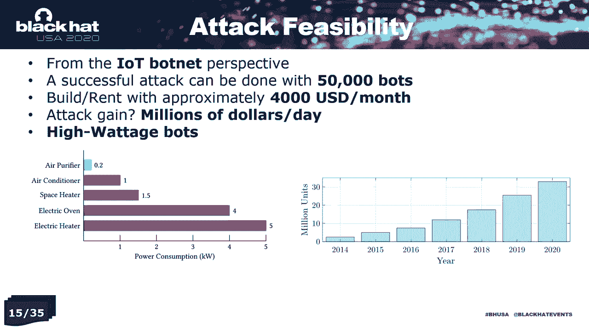

# P50：51 - IoT Skimmer - 通过高功耗物联网僵尸网络进行能源市场操纵 - 坤坤武特 - BV1g5411K7fe

[MUSIC]

## 概述

在本节课中，我们将学习如何通过高功耗物联网僵尸网络进行能源市场操纵。

## 物联网Skimmer团队

我们是一支来自乔治亚理工学院通信保证与性能小组的研究团队。我是Tui Chikari，博士候选人，我的实验室伙伴Leina Rin帮助我在数据分析方面。我们两人都由实验室主任和我们的博士导师Dr. Bea指导。

## 电网结构

通常，每个电网有三个主要部门：发电、传输和分配。在发电部门，客户所需的大部分能源由大型生产商（如核电站、风力农场、太阳能农场、水力发电厂）产生。然后，产生的电力通过输电线路或输电部门传输到长距离。当它接近客户时，电压降低，并通过配电线路或配电部门将能源分配给最终用户。

## 能源市场

传统上，从发电、传输到最终用户和配电系统的一切都由政府拥有的实体拥有。但在20世纪90年代末，引入了重新构建电力系统的概念。基本概念是将政府拥有的实体转移到私人拥有和竞争环境。在这种新环境中，发电公司和零售商可以参与市场，并报出他们的价格。

## 物联网僵尸网络

物联网僵尸网络最近被引入到网络安全领域。最著名的是2016年8月发现的Mariah僵尸网络。它包括超过600,000个受感染的设备。它被间接用于攻击其他领域，即使这些领域得到了适当的保护，例如网络安全记者Brian Krebs的网站。此外，它还用于另一组分布式拒绝服务攻击。

## 攻击可行性

从物联网僵尸网络的角度来看，成功的攻击可以用尽可能低的50,000个僵尸网络完成。当然，你拥有的僵尸网络越多，你造成的损害或从市场中获得的利润就越多。但较低的僵尸网络数量不会危及攻击的一般结构。

## 攻击策略

以下是攻击策略：

1. **隐藏攻击**：将攻击隐藏在市场运营商的视线之外。
2. **攻击频率**：不要每天发起攻击，因为风险太高。
3. **子最优攻击场景**：选择子最优攻击向量，使市场分析师更难检测到攻击。

## 数值结果

为了评估目的，我们没有实施这种特定的攻击。我们预计实践将因为对市场有巨大的财务影响而避免法律相关的后果。但我们使用真实世界的数据分析来展示攻击的影响。

## 结论

本节课中，我们介绍了基于物联网僵尸网络的电力市场攻击。这是文献中第一个可用的市场操纵服务器攻击。其影响在两个样本大型电力市场（美国加利福尼亚州和纽约市场）上进行了分析。通过我们的数据分析，你可以获得超过2400万美元的年收入利润，作为恶意市场参与者。即使是国家行为者，你可以在市场上造成高达3.5亿美元的经济损失。

## 总结

本节课中，我们一起学习了如何通过高功耗物联网僵尸网络进行能源市场操纵。希望这节课对你有所帮助。