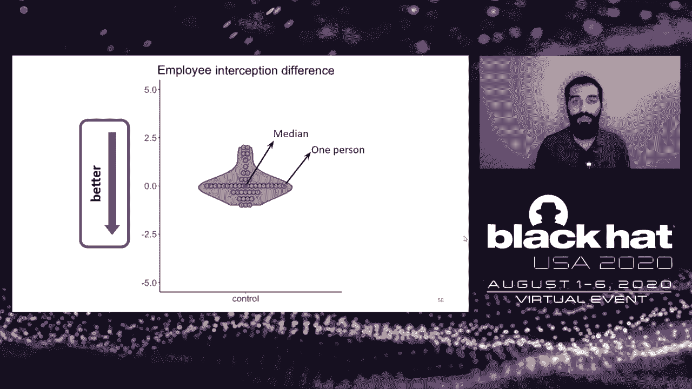
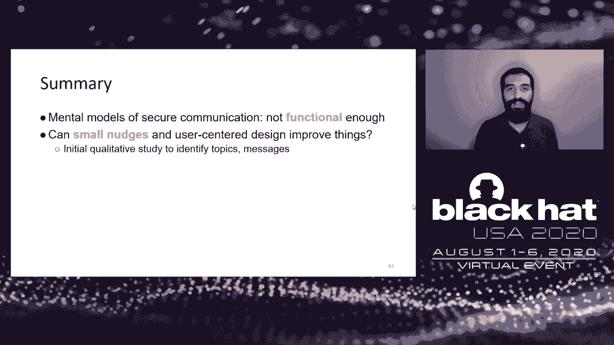

# P51：52 - Improving Mental Models of End-to-End Encrypted Communication - 坤坤武特 - BV1g5411K7fe

 [MUSIC]。

 >> Hello everyone。 Welcome to our talk。 My name is Wei Bai。 I'm a software engineer at the Google。

 Today， Omre and I are going to present， our work improving mental models of end-to-end encrypted communications。

 This work is a joint efforts together with Shuri， Michael。

 and Professor Mitra Manswerk from University of Maryland， as well as Dr。

 Patrick Gitch-Kale from Google。 So the contents we present today are our own opinions and。

 we do not represent the view of Google。 Okay， so what is end-to-end encryption？ Well。

 this talk is not about， the technical details about end-to-end encryption or E2E。

 And I believe you all know what E2E is and why it's important。

 So your messages are protected from end-to-end， and you can protect the users from various malicious actors。

 such as hackers， governments， misbehaving employees， or the companies people do not trust。

 In this talk， we would like to talk about the adoption of end-to-end encryption。

 But this talk is not focusing on the people in this room。 Now。

 I said this talk is not for the security experts or people with high， computer literacy。

 because we think these people already have enough。

 knowledge to make informed decisions about when and how to use this such E2E tools。 Similarly。

 we are not targeting people with special needs of security privacy， such as lawyers， journalists。

 or activists who may face life and death scenarios， if the security and privacy breaks。 Well。

 these people are very important。 But since they have special needs。

 they should be studied and designed for separately。 So these are not the focus in our talk。

 This talk is about very general users， and we're interested in。

 the later adoption of E2E tools because it improves the privacy for the masses。

 And all of our studies present today recruit people with minimal knowledge of encryption。 So。

 do general users adopt end-to-end encryption tools？ Well。

 at least we see a trend of adoption increase over the past two decades。

 and the whole community has helped them to conquer many hurdles in front of them。

 One of such hurdles is the UI design。 The better UI design may make this system hard to use。

 However， this has been improved significantly over the past two decades， through a lot of hard work。

 Another hurdle is about the key distribution and the management。

 This is still some problems in certain ways， but centralized directories。

 or we call the key directly based models here that have been deployed by many。

 popular messaging services。 And even though there are some issues like key revocation or key validation。

 but generally speaking， it's had been solved kind of well。

 And another hurdle is about the social norms。 Well。

 encryption used to be perceived as weird or even paranoid。

 And that may imply that you have something to hide or even your criminal。 But now。

 since the widespread deployment for the instant messaging services like WhatsApp， signal。

 Facebook Messenger secret chat like this， so this has made the situation much better。 Okay， however。

 recent research has repeatedly identified that， incorrect mental models of A2E have become the biggest hurdle now for adoption for the general users。

 What are mental models？ Well， mental models describe how a user thinks about the problem。

 It's basically a person's perception about how things work。

 And people use these models to make decisions about the effects of various actions。

 Bodies down to security and privacy， users' mental models makes users to make security decisions。

 And by understanding the users' mental models， it can help the community to。

 categorize and understand the security problems that result from these decisions。

 And more specifically about adoption of end-to-end encryption tools。

 why do incorrect mental models matter here？ For adoption。 Well。

 here are at least the several evidence that we found from the recent research。 First。

 people perceive end-to-end encryption incorrectly in both directions， both overestimate。

 and underestimate its capabilities。 For example， some users think encryption can protect them。

 from anything， while some other users think encryption can be trivially broken by anyone。

 who works in the IT industry or even have an IT background。 Secondly。

 incorrect mental models make it difficult for users to make thoughtful and informed decisions。

 about what to use to communicate。 For example， some users think SMS is the most secure messaging。

 service。 To that end， if these users really want to send some information important and private。

 and they may choose a tool that they think is secure。

 but actually are not as secure as they expected。 Finally。

 some users do struggle to complete some tasks within these E2s。 Well。

 their struggles are not mainly because of the UI design， but more because of their broken。

 mental models。 That's why they have to do these tasks and what security benefits they can get。

 from these tasks。 One of such examples is performing the authentication ceremony within the E2s。

 and here is screenshots about this scenario in WhatsApp。 So to recap。

 incorrect mental models can inhibit， standard users using the end-to-end encryption tools constantly。

 proactively， and correctly。 So this really motivates our research that we would like to improve users' mental models。

 and help them get the basic understanding of E2E and also the threats into E10 and cannot protect。

 against。 So that users can have enough information to make judgments about how to communicate。

 but our educational process would not expect to turn everyone into crypto experts。

 We understand it's neither possible nor desirable。 And also， we do not expect people to sign them。

 for some training modules because we think that in real life， people may not have enough time and。

 motivation to do so。 So our efforts want to improve the user mental models naturally in a sense that。

 we hope to provide useful information in small doses directly while they're using end-to-end encryption。

 tools。 So our research involves multi-stage efforts from the lab study to a field study。

 The first step is the lab study where we invite participants to our lab and learn an in-depth。

 tutorial。 And here we would like to understand what contents about E2E can be used in the educational。

 intervention。 Based on the lab studies results， we designed several messages about E2E that are。

 varying in lengths and contents。 And then we deployed online service study and to understand how people's。

 perceptions are shifted by these short messages。 Finally， based on the second service study， we。

 picked several candidate messages and feed these messages into the real app。 And then we deployed。

 a field study where we asked our participants to use in real life for around three weeks。

 And by getting their feedback， we hope to understand whether our educational intervention works or not。

 So next， I'm going to talk about the lab study and Omar will present the details from the survey。

 and a field study later。 So lab study， to recap， the goal of this lab study is to understand what。

 contents of E2E can be used in the educational intervention。 And more specifically， we're。

 interested to get a user's perspective about what information is important in pricing to them。

 And what contents about E2E can be used to convey to others。

 We recruit 25 non-expert participants from Washington DC area， and each participant was。

 shown a short tutorial about end-to-end encryption。 And before an after-reading tutorial。

 each participant was giving a short quiz assessing their understanding of E2E。 So here。

 we not only care about their quiz answers， but also more importantly about their。

 reasons behind why they choose certain answers。 So by comparing the answers and the reason is。

 before and after reading the tutorial， we hope to understand what part of the contents。

 in the tutorial went through or not。 And then we give each participant a short discussion。

 and explicitly ask them their feedback about what contents in the tutorial is important。

 in pricing to them and worth mentioning as if they were teaching E2E to others。 Next。

 we give each participant a two short existing explanations about E2E， where we got from six。

 real apps。 And we got these explanations from the apps descriptions of official websites。

 As well as white papers if available。 And we ask our participants to mark any places they like or。

 dislike so that we can get feedback what contents matter to them。 Finally， we give each participant。

 a short design task and ask them to design a sample message about E2E education intervention。

 as if they were teaching E2E to their friends or family。 So with this whole chain of steady， setup。

 we hope to get rich feedback from the participants to achieve our goal。 As we mentioned previously。

 the tutorial was designed by us。 And we designed tutorial in a， module based fashion。

 where we included four modules。 A high level overview of what E2E is。

 A bulk of risks that E2E can and cannot protect against。 And we got these risk risks from the。

 risk communication literature。 And also， the third module is some common misconceptions about， E2E。

 where we also got from prior research。 And finally， a high level description of how E2E works。

 But here we want to emphasize that our goal is not to assess the tutorial itself because。

 the outcome of the study is not to develop a tutorial that can be used for the educational。

 intervention。 But rather， we are interested in what information is worthy and important to our。

 participants so that we can include these specific contents in the further educational。

 intervention in a natural scenario。 So as a result， different participants saw different。

 subsets of these four modules so that we can have a better understanding of how each module。

 shifted its person's， I mean， user's perceptions about E2E。 Next。

 I'm going to highlight a couple of high level findings from the study。 And for the full， findings。

 please refer to our paper。 First， we found that to our participants。

 confidentiality is the most significant factor。 Well， even though it's a little bit less。

 rising to us， but to at least to our participants。

 they think it's really important to grasp concept， of E2E。 At this participant set。

 the internet service provider and the app company may still get。

 a copy of the message that is protected by this wall that is nearly impossible to break。

 So they can see you send a message， but they can't see what the message says。 Well， within this。

 module， we also found some scientists were surprising to our participants and even surprised to us。

 For example， some participants were surprised that ISPs are even in the message path and E2E can。

 protect against them。 Next， we found that explaining risks clearly to our participants is really useful。

 In particular， our participants really liked comparison between E2E versus non-E2E。

 in a sense that how， E2E is better。 At this participant set。

 knowing the risks of the non-E2E and then really comparing it， to how it is better。

 that's really the most important。 As we mentioned previously that we all in the risk， module。

 we also detailed what types of the risks that E2E can and cannot protect against。

 And to our participants， it's really important to clarify the weaknesses of E2E as well as benefits。

 And we think it's important because it can correct the wrong mental models of both overestimating。

 and underestimating the E2E capabilities。 However， our endeavors about explaining integrity and。

 authenticity were somehow not really successful。 And this concept is still confusing to our participants。

 Some participants were still， I mean， conflated authenticity with username and password protection。

 At this participant set， E2E protects against the message modification and impersonation。

 not even user names and/or passwords can be stolen or guessed， which is clearly wrong。 Finally。

 our module to explain how E2E works in the high level is a little bit less。

 interested to our participants and can even create more confusions。 For example， after learning to。

 tell real some participants were concerned about the attacker's ability to afford the private keys。

 As this participant said， if you're working in a locksmith's office， you might not have somebody's。

 key but you would be able to get into the house because you are an expert and you know how to。

 manipulate systems。 So to recap with this high level pieces of information about successful。

 and non-successful information during the initial study， we found that explaining。

ality is the most significant factor and explaining risk clearly to our users is really。

 useful and in particular， our participants really likes the comparison between E2E versus。

 9-2E in a sense how E2E is better and also important to clarify the weaknesses of E2E。

 together with its benefits。 But in the same time， we also found some pieces of information may not。

 worth mentioning， including integrity， authenticity and how E2E works。 At least in our study。

 we do not， find strong evidence that these contents can improve the mental models very well。

 So next， Omar will present how our findings from the lab study can be applied to the large。

 scale and I'm going to hand off to Omar。 Hi everyone， I'm Omar， I'm a graduate assistant at。

 the University of Maryland and I'll be presenting the rest of this talk。

 So like we mentioned before， this effort of trying to shift mental models of users about end-to-end encryption。

 it's a three-stage， approach。 The first was a lab study。

 we already described that now we're going to move on to the， online survey study。

 So the results we obtain from study one， they feed directly into study two。

 The questions we're going after here are pretty similar， we're still trying to shift。

 mental models of users， mental models users have about end-to-end encryption。

 But this time we're trying to shift them with short messages that can be easily integrated into。

 applications。 We designed a couple different length messages， we have the long message。

 which is intended to cover basically all the points that we found effective from study one。

 It's intended for say an application's info webpage， kind of like a more about page。

 We have short messages that cover single concise talking points， kind of like the modules from。

 the tutorial， it just talks about one thing。 And these are intended to be used in loading screens。

 or you know as tooltips or maybe notifications， so easily integrate them into the application。

 We have medium length messages， which are somewhere in between， they don't cover all the topics。

 but they cover more than one topic。 We are interested in how effective these messages are。

 how the different lengths compare， and for what purposes they can be used for。

 It's important to note here that we don't want to oversell security， and so an encryption is great。

 but it also has its limitations， and we definitely want to， communicate that。

 Now let's look at the setup of study two。 Well， it's an online study， and we。

 recruit our participants through crowdsourcing。 We recruit specifically from a platform called。

 Prolefic， and we have 461 participants who participate in this study， so it's a more large。

 scale study。 We designed a couple different messages for each message length， and we'll get back。

 get to that later。 These messages all refer to a hypothetical messaging app called TextLight。

 and we do this to remove any brand bias that people might have towards certain messaging brands。

 messaging apps。 It's a between-subjects design， which basically means that。

 each participant gets to see one version of the message， and they don't know the existence of。

 the other messages。 This allows us to compare the different groups to each other， and basically。

 be able to compare the different messages and reason which one was better。 We quiz our participants。

 before， and after reading the message， this is how we measure their changes in their mental models。

 The quiz essentially asks about various adversaries and their capabilities over the application。

 and asks participants to indicate how much they agree with certain statements about these adversaries。

 and their capabilities。 We measure the change in score by essentially subtracting the scores they。

 got from the after quiz。 We subtract the after quiz from the before quiz， or it's the other way。

 around。 We subtract the before quiz on the after quiz。 All right。

 So from the participants point of view， this is what it looks like。

 They see the adversary capability questions。 So for instance here， it says。

 "indicate whether you agree or disagree that hackers who have compromised the。

 text-like servers have the following abilities。 The first ability is being able to see that a。

 message was sent without seeing the content。" And this person is in the middle。 They read the。

 message about end-to-end encryption， and then they take the exit survey， which is again the same。

 questions。 Here you can see they say they agree that they can know that the message was sent without。

 knowing the content。 All right。 So that's it for the participants。

 Now let's look at some of our message， types that we've developed。 Like I said。

 there are a couple different lengths。 The short ones。

 the first short message talks about how only you and the recipient can see the messages。

 This is kind， of a general overview of what end-to-end encryption is。

 The second one talks about metadata risks。 For instance。

 the employee adversary being able to see a message was sent。 We also talk about endpoint risks。

 So this is just referring to the fact that end-to-end encryption。

 can't do much if the endpoints are compromised。 We talk about the key lock metaphor。 This is。

 again similar to one where it gives an overall view of what end-to-end encryption is without。

 giving any technical details。 And then we have the last one。

 which is comparing end-to-end encryption， to tools that are not end-to-end encrypted。

 We have two medium-length messages， and these are。

 basically combinations of the short messages without including all of them。 The long message。

 has all of the short messages in it。 It has a better flow and it has extra emphasis。

 It talks about all the points to provide a more complete view of what end-to-end encryption is。

 We also have a control message， which is there to essentially compare to all the other message types。

 so that we can see if they were effective or not。 It just describes non-security features of。

 text lights such as group chats or how it's great for sending means and stuff like that。 All right。

 let's look at some of our short messages。 This is the first one， so this is supposed。

 to give an overview of what end-to-end encryption is。

 It reads messages and text light are end-to-end， encrypted。

 This ensures that only you and the person you're communicating with can read the。

 messages you send and receive。 Nobody in between can see the content of your messages。 We have。

 another one。 Again， this is similar to short v1。 Before a message ever leaves your device。

 it's secured with a lock and only you and your recipients have the keys to open the message。

 and read it。 Again， it's just trying to give the same guarantees here。 All right， so before we。

 move into our results， we're gonna I want to talk about this plotting scheme that we use pretty often。

 First of all， we can see that this is referring to the participants that were in the control group。

 so that's the text down below。 Up top， we can see which adversary we're talking about and what。

 capability。 In this case， it's the employee adversary， so the malicious employee and their。

 capability of reading or interfering， altering messages。

 The dots you see here on the graph indicate， the differences for each participant。 Again。

 that's the after quiz score minus the before quiz score。 This one person is right in the middle。

 They didn't change their idea about this adversary， capability pair。

 You can see that the median is the red square。 It's in the middle here。

 And this big red arrow shows the direction we would expect the mental models or we would hope。

 the mental models to shift in。 So in this case， we would want them to shift negative。 This is the。

 control group， so it just pulls in the middle， which is what you would expect。 All right。

 let's look at。

 our results。 Well， we see that for the long message indicated with the red box here that it。

 almost always works better than control。 So over here， you can see that we expect the mental models。

 to shift negative and the difference is to shift negative。 And that's exactly what we see the long。

 is more it's bulging towards the negative compared to control。 With medium length messages， we see。

 a similar case to long。 It's again better than control。

 The longs here are indicated with the golden， box。 And it's not much worse than long。

 It's actually pretty comparable to long。 Sometimes the， significance levels。

 the effect sizes aren't as big， but it's pretty comparable。 So it's still。

 shifting negative as we would expect。 What about the short messages？ Well， with some of the short。

 messages， there is a similar case to the mediums。 For instance， with these two short v1 and v4 that。

 we read earlier， compared to control， it's better。 And they're not much worse than long。 It's still。

 shifting negative， which is great。 We also see that short v1 and v4 indicated here。 They outperform。

 some of the other messages because they give a more general overview。 They outperform them just。

 in a general sense。 We see that when we talk about specific adversaries， and the message is。

 topical to this adversary or this capability， that the short messages can outperform all the other。

 message versions。 For instance， short v2 here and short v3， they target specific adversaries and。

 capabilities。 Short v2 was targeting the metadata capability。

 Short v3 was talking about the endpoint， adversaries。

 which is what malware is if it's on your phone。 You can see they're both shifting positive。

 which is what we would expect， as you can tell from the arrow direction。 Now。

 there is some additional risk of overcorrecting， and we see that in our results。

 this is not only true for shorts， but also for longs and mids。

 You can see that these two are kind of， sort of the short v1s highlighted here with the blue are kind of shifting towards the negative。

 but we would expect we would want it to shift positive， which is not great。 We need to take。

 care of that。 Okay， what are our takeaways from study two？ Well， it's that the messages work in a。

 controlled environment。 So quiz， show the messages quiz again。 It's very controlled。 There aren't。

 many external factors。 The messages work great。 We see that the short messages work surprisingly。

 well， especially when they're topical， when they're referring to a specific adversary or capability。

 We think we can show these messages one by one in order to not overwhelm users。

 just easily integrate it into the UI of an application。 And this would also， because we're。

 showing all the messages， it would form a complete mental model。 All right， so we're done with this。

 survey study。 Now we're going to move on to the field study， which is the last study we're going。

 to talk about today。 So the results again from study two， they feel it directly into study three。

 Are the questions we're asking about here is how well would messages we've identified from study two。

 integrate into the application work in the real world？

 We are also interested in going after why these messages might work in an application。

 why it might not， and how we can improve it further perhaps。 Okay。

 so here's what our setup looks like， for a study three。

 We incorporate successful messages from the online study into the app。

 You can see a short message integrated in the screenshot to your right。 Well， you don't have to。

 read the message。 It's in the blue box。 We read it earlier。 It's the same message。

 When you click on， it， it opens the long message。 Again， you don't have to read it。

 It contains the messages from earlier。 And in order to integrate these messages into an encrypted app。

 we actually， we modify signal， we rebrand it。 So this is what signal looks like on the Google Play Store without any modifications。

 and this is what text light looks like。 So it's quite different。 Again， this is done to remove any。

 brand bias。 This is by no means intended to be a product。

 We're just trying to come up with something， for our experiment。 In fact。

 it's not on Google Play anymore。 All right， so we also develop a control。

 version of the application， which is there so that we can compare the experimental group to something。

 and see the changes in mental models。 We ask our participants to use the app for three weeks。

 They do short texting sessions daily with a researcher， although they don't really know that。

 We measure the changes in mental models of encryption just like in study two。

 so quiz before and after。 So for the participants point of view， this is what it looks like。

 They would be introduced to， text light and be told that it's end to end encrypted。

 They would be quizzed about certain， adversaries and capabilities。

 Then they would remotely install text light， register to it。 They would use it for a daily chat。

 They would send messages back and forth every day。 And then after 20 days， about three weeks。

 they would take an exit survey， which is again the same， adversary capability questions。

 And we would optionally interview some of our participants， from the experimental group。

 And that's it for the participants。 Well， how did the experiment go？ Well。

 we had 61 participants and 32 of them were in the experimental group。 The rest of them were。

 in control， as expected。 We see that there was no usability difference reported when we tried to。

 measure the usability of the application。 This just means that the messages we've added about。

 end to an encryption didn't change the usability， or at least we couldn't measure any difference。

 Participants use the app on average about 18 and a half days。 The median was 20， so almost。

 everyone used it during the entire duration every day。 On average。

 one participant during the entire， three weeks spent 2。6 hours just looking at the app。

 The standard deviation is quite high， so， some people spent 10 hours， some people spent one。

 Our participants were required to send about 100， messages and they ended up sending about 138 on average。

 so they did more than that was expected， from them。 Alright， let's move into our results。

 We see that statistically， unlike in the survey study。

 there is no almost no difference between the experimental and the control groups。

 Although there's more to say about this， it's kind of similar to what we see in the survey study。

 in some aspects。 The interviews also tell us more about this。 Now， this is all of our results。 The。

 grays are the control group， the brownish red colors are the experimental， you see them as in pairs。

 and you see that almost all the pairs are basically the same shapes， the same lines。

 except these three right here。 Let's compare these to the survey study。

 So here I put the graphs about the same adversary capabilities in the survey to the right and from。

 the app study to the left with the purples。 First， let's talk about the top four up top here。 So。

 note that the direction we expect mental models to shift is negative here。 We see that the employee。

 and the government adheries series with interception or you know being able to read messages。

 it's shifting in the right direction， just like in the survey study。

 What's interesting here is that， these adheries series show the biggest effect sizes from the survey study。

 which just means that， these were the easiest to learn about in the survey study。

 And that kind of makes sense that this effect， that was the easiest。

 it was easiest to learn in the survey study and people also learned it in the， app study。

 Looking at the plots down below here， this time the error direction is reversed。 So。

 we're talking about the metadata and to an encryption isn't that great against metadata。 So。

 we would， expect these mental models to shift positive， but they shift the wrong way。

 And this is again， similar to the survey study。 We try to not fall into this pit of overselling security。

 but， unfortunately we do。 And again， you can see the long message in the survey study。

 the brown one is， kind of shifting towards the negative。

 And so is the experimental version in the metadata， oh sorry in the app study。 Alright。

 what about the interviews？ Well， we interviewed 19 out of 32， experimental participants。

 And 10 out of 19 participants were able to generalize the concept of enter。

 encryption to some degree。 For instance， this person said it protects from probably anyone who。

 would interrupt or interfere in between the messaging in between where you sent it and someone else。

 received it。 We see that 14 out of 19 participants knew the unlocked phone。

 And this is just someone， having access to your phone， which is unlocked。

 They knew that this adversary was quite powerful， which is great。 We see that nine out of 19。

 so almost half of our participants got at least， something wrong about enter encryption。

 For instance， this person said it protects from people hacking。

 into your phone from either reading their messages or altering the contents of the message。 So this。

 person is clearly confused about the capabilities of enter encryption。

 If the endpoint is compromised， say with with a malware on your phone。

 then enter encryption can't do much against it。 We see that， again。

 the same number of participants said they didn't read the messages or they simply weren't。

 interested in these messages。 This person voiced it with saying， I obviously didn't pay a lot of。

 attention to it。 All right， what are our takeaways here？ Well， statistically。

 there are no significant， changes in mental models， but we see that the strongest effect sizes。

 so the things that are， easiest to learn about in the survey study。

 they show themselves in the app study as well。 We see there are some overselling what enter encryption can provide。

 And we also see that some， participants had decent mental models when we interview them when we talk to them。

 We think， messages might have to be made more obvious。

 This is even if this means sacrificing usability a bit。 We think this because some of our users。

 in fact， almost half of our users simply ignore the messages。 All right。

 so those are our takeaways from study three。 To sum up the entire presentation。

 what we know is mental models of sphere communications， especially intimate and encrypted ones。

 are not functional enough。 People have misconceptions and they can't make adequate decisions because of。

 this。 We investigate small nudges that are easily integrated into existing systems and user center。

 design can improve things。 User center design is again just basically involving participants in。

 the process。 And we think it maybe can。 Our initial qualitative study was done to identify topics and。

 messages that users might be interested in and think are worth learning about。 We conducted an。

 online study to examine messages that we specifically craft based on study one。

 And we design a study， that's done over a period to test real world effectiveness of these messages。

 We identify these， key items to teach users in study one。 We see that in a controlled environment。

 these messages work， well about end to end encryption。 They do change mental models。

 And we see that integration into， applications might need to be more obvious。

 perhaps by sacrificing usability a bit because， again。

 some users signal simply ignore these messages about end to end encryption。 All right。 So with that。

 that'll be the end of my presentation。 I'm happy to take any questions。

 You can always email me or whey。 And I'll talk to you in a bit。 Hello。

 Thanks for listening to the talk。 I hope you got something from it。 Sorry about the choppy。

 video at the very end。 There were a couple of questions， minor clarification questions。

 which I think we， answered in the chat。 We'll be happy to hang around for a couple more minutes。

 see if anyone has other， questions。 You can always reach us at our emails。 My last name at UMDU。

 I'm not sure what way yours is。 I think we changed yours。

 I think it's listed in the slides that have been posted。 Yeah。 Yeah。

 You can also reach me on Twitter if that's a minor thing。 I don't really use Twitter。 But yeah。

 thanks a lot for joining。 Anything else you want to add， Wei？ Yeah。

 I think maybe anyone has some questions or any comments。 You can simply put in the chat。

 channel that we can monitor and answer quickly。 Yeah。 For sure。 And I'm free to meet with anyone。

 If anyone wants to。 I hope you to reach out。 Yeah， me too。 Yeah。 [BLANK_AUDIO]。

