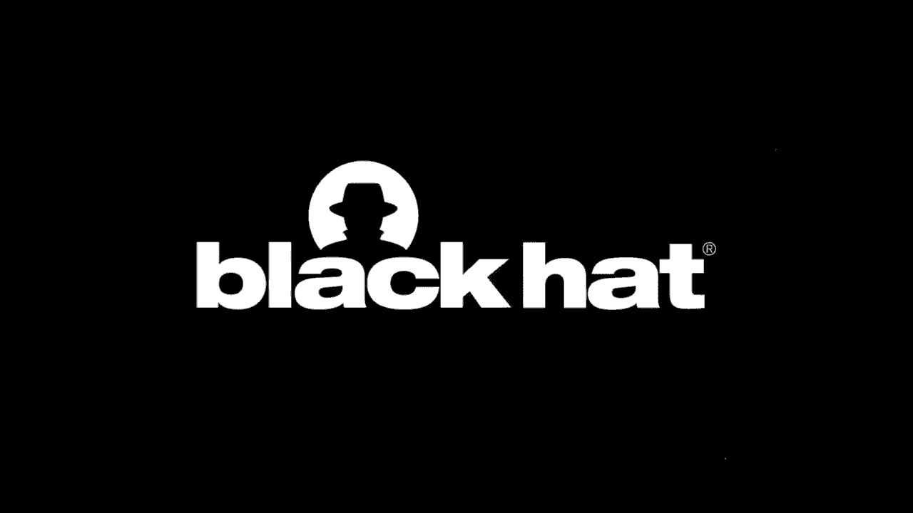
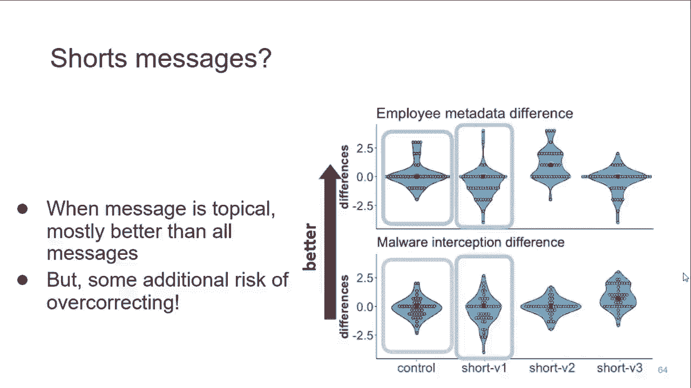

# P51：52 - 改进端到端加密通信的心理模型 - 坤坤武特 - BV1g5411K7fe

## 概述

在本节课中，我们将学习如何改进端到端加密通信的心理模型，以提高用户对加密工具的理解和采用率。

## 端到端加密

端到端加密（E2E）是一种通信方式，确保消息在发送者和接收者之间传输时不会被第三方窃听或篡改。以下是E2E的一些关键特点：

* **端到端加密**：消息在发送者和接收者之间加密，中间节点无法解密。
* **保护隐私**：防止黑客、政府、不良员工或不受信任的公司窃取或篡改消息。
* **提高安全性**：使用强加密算法，如AES和RSA。

## 心理模型

心理模型是指用户对某个问题的认知和理解。在本例中，心理模型描述了用户对端到端加密的理解和期望。

### 心理模型的问题

* **过度估计或低估E2E的能力**：一些用户认为E2E可以保护他们免受任何攻击，而另一些用户则认为E2E很容易被破解。
* **难以做出明智的决定**：由于对E2E的理解不足，用户可能无法选择最安全的通信工具。
* **难以完成任务**：由于对E2E的理解不足，用户可能无法正确使用加密工具。

## 改进心理模型的方法

为了改进用户对端到端加密的心理模型，我们可以采取以下措施：

* **提供教育材料**：向用户解释E2E的工作原理、优势和局限性。
* **改进用户界面**：使加密工具易于使用。
* **进行用户研究**：了解用户的需求和痛点。

## 研究方法

本研究采用了以下研究方法：


* **实验室研究**：邀请参与者学习E2E教程，并评估他们对E2E的理解。
* **在线调查**：向参与者展示不同长度的E2E信息，并评估他们对E2E的理解。
* **实地研究**：将E2E信息集成到应用程序中，并评估其在现实世界中的效果。

## 研究结果



* **教育材料有效**：教育材料可以有效地提高用户对E2E的理解。
* **信息长度很重要**：较长的信息比较短的信息更有效。
* **信息内容很重要**：解释E2E的优势和局限性比解释其工作原理更有效。

## 总结

本节课中，我们学习了如何改进端到端加密通信的心理模型。通过提供教育材料、改进用户界面和进行用户研究，我们可以帮助用户更好地理解E2E，并提高其采用率。

**公式**：

* E2E = 加密 + 端到端
* 心理模型 = 理解 + 期望

**代码**：


```python
# E2E加密示例
def encrypt_message(message, key):
  # 使用AES加密算法加密消息
  encrypted_message = aes_encrypt(message, key)
  return encrypted_message

# 解密消息
def decrypt_message(encrypted_message, key):
  # 使用AES解密算法解密消息
  decrypted_message = aes_decrypt(encrypted_message, key)
  return decrypted_message
```