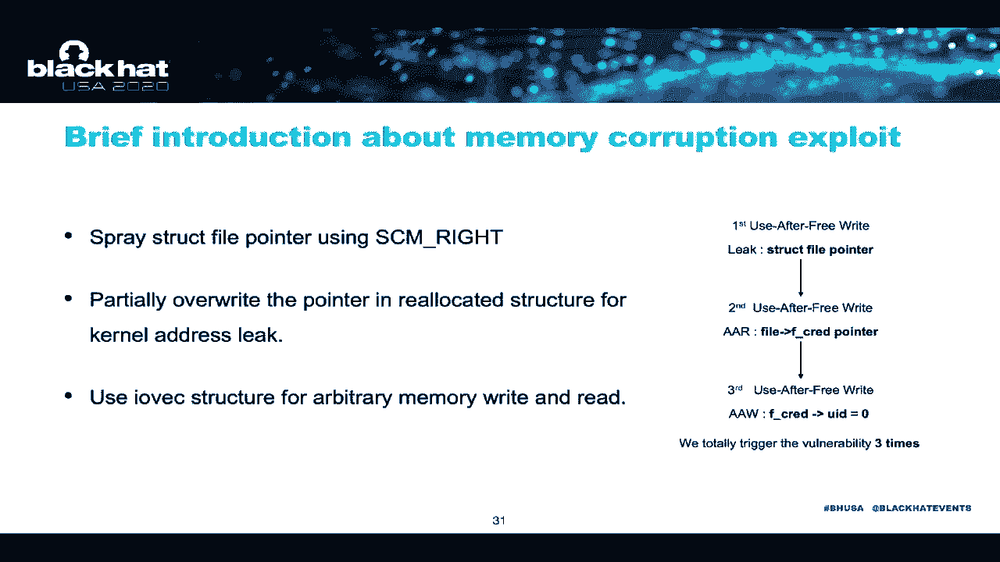
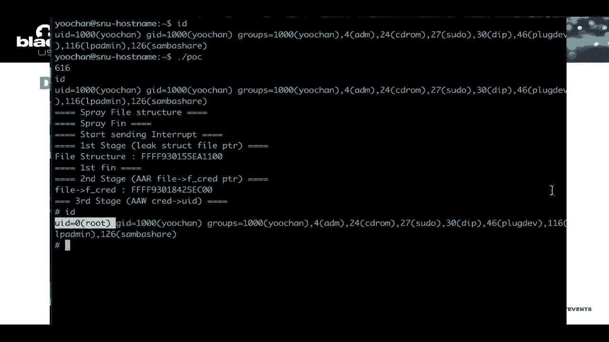

# P52：53 - Exploiting Kernel Races through Taming Thread Interleaving - 坤坤武特 - BV1g5411K7fe

 Hello， my name is Yuchen from the Southern National University and today our present。

 our talk is pointing Kano Lake through Taming Street in Don't Living。

 And this is the joint work with Professor Premier Li and Professor Chang-Mou Min。

 With present our talk in lovely three steps。 First。

 we briefly introduce the lace condition as a background and then we classify the lace。

 conditions into several types to explain which type of lace condition is unexplainable。 Finally。

 we present our new method to transform such lace condition exploitable。

 Let's start with the lace condition。 The lace condition is a kind of bug that is persisted since the only days of multistreat。

 development but only recently getting increasing attention from the security community。

 Taking some representative examples。 Rader was developed by academia in 2019 and found more than 30 lace bucks。

 And in the same year， Google developed their own color concresisynotiger and found more。

 than 300 lace bucks。 As a result， like other types of bugs。

 the number of lace condition bugs found by lace， colors solely increased in 2019。

 maintaining its upward trend。 So what is the lace condition？

 Basically lace condition occurs when multiple processes access the same memory location。

 and it reaches different memory state depending on the access order。 For example。

 suppose two instructions AMB are executed by core 1 and 2 respectively and。

 each of them leads and writes the same memory location。 In this setting。

 we can think of two excusions in R-I-V-S。 One that the instruction A is executed。

 before the instruction B and the other is vice versa。

 With the former single-view produced Lijert X while the latter scenario produced Lijert， Y。

 we call these kind of situations the lace condition。

 The Lijert can be the value stored in the memory or the value led by the leading instruction。

 But all lace conditions are not necessarily the burn-elibilities。 In fact。

 such a situation casually happens in most of producer， consumer， spreading patterns。

 A lace condition is regarded as a burn-elibility when it are told the counterflow or the data。

 flow and eventually ledered in the memory coefficient。 At this time。

 the lace condition consists of two or more pairs of lace instructions。

 When it comes to the burn-elibilities， they do not occur when the inverted lace instructions。

 are mainly executed but only when they are executed in a specific order。

 The problem is that we cannot always enforce such a desired order。

 As the multiple thread arts scheduled in a non-diftramministic fashion， in this sense。

 executing them in a specific order is pure luck， just like hitting the jackpot in a slapped。

 motion game。 The good news is that computer programs never demand us to insert the coins to keep executing。

 it。 So， we can try brute forcing it until we get the desired effect。

 This boils down to the question that whether such a desired order can even happen eventually。

 Specifically， even if a lace condition ledered in memory coefficient that costs other weeks。

 or RIP control link， it cannot be exploitable even if we cannot enforce such a problematic。

 execution order。 One may think that this is not an important issue because brute forcing will somehow trigger。

 the instructions in the desired order but we will show that some lace conditions have。

 the execution order that cannot be triggered by brute forcing。

 Now let's look at the types of lace condition burn-elibilities and their exploitability。

 We first classify the lace conditions by the number of variables that are in burped in。 Mainly。

 if a lace instruction pair access the single variable or multi variable。

 The single variable lace condition is the most basic type of lace condition burn-elibility。

 where every lace instruction pair centers around the single variable。 For example。

 the figure shows two lace instructions between the instruction A and B and the instruction， B and C。

 And they both interact with each other by a single variable。

 This type of lace condition burn-elibility occurs when the instruction A， B and C are。

 executed in order。 Specifically， the instruction B should be executed after the instruction A and before。

 the instruction C。 And we refer the time between them to the time window or lace window。

 The figure on the right describes a single variable lace condition burn-elibility found。

 in the Linus tunnel。 This burn-elibility consists of two pairs of lace instructions and both are accessing the。

 same header inclusion variable。 To see how this lace condition lingers in memory coefficient。

 suppose the header inclusion， variable is 1 when the instruction A is executed。

 You can see that this leaves the variable called RFP uninitialized。 Now。

 if the instruction B is executed and write 0 to the header inclusion variable， the。

 instruction C will then leave 0 from the header inclusion variable。

 Which literting the memory coffee function calls with the uninitialized RFP variable。 In this type。

 the lace condition is more likely to occur as the time window between the instruction。

 A and C is larger and it is less likely if the time window is thin。 However。

 because there is an old that such an execution order happens no matter how unlikely， it is。

 Bruce person would eventually trigger the lace condition， aligning us to exploit the。

 burn-elibility。 The other type of lace condition is multi- variable lace condition。

 And it is more common in the lower world than the single variable lace condition。

 The multi- variable lace condition may also consist of multiple pairs of lace instructions。

 But at this time， each pair access the different variables。 For example。

 the figure is those two lace instruction pairs between instruction A and B and instruction， C and D。

 While the instruction A and B access the memory 1， the instruction C and D access the memory， 2。

 In this type， the memory coefficient occurs when the instruction B and C are executed after。

 the instruction A and before the instruction D。 We have already seen that the time window between the instruction A and D that is supposed。

 to contain the other instructions in core 2。 But since there are two instructions in core 2。

 the instructions has its own time window。 Let's call each time window X and Y respectively。

 We noted that when explaining a multi- variable lace condition， the relationship between these。

 two time window is very important。 So let's further classify the vertebral lace conditions into the inclusive one and non-inclusive。

 one according to whether the time window X contains the time window Y。

 If the time window S contains the time window Y， it is classified as an inclusive multi- variable。

 lace condition。 On the other hand， if the time window X does not contain the time window Y。

 it is classified， as non-inclusive multi- variable lace condition。

 Similar to the single variable lace condition， the likelihood of triggering the inclusive。

 multi- variable lace condition also depends on the size difference between the time window， X and Y。

 As the size difference between two time window is smaller， the lace condition is less likely。

 to occur。 However， like single variable lace condition。

 Bruce Furtzing will eventually manage to trigger， the lace condition because there is an odd no matter how thin it is。

 However， this is not the case in the non-inclusive lace condition。

 The example shows non-inclusive multi- variable lace condition found in the linear column。

 Basically， the color uses uninitialized memory if only the instruction B and C in core two。

 is executed between the instruction A and D in core one。 However。

 notice that the instruction A and D locate back to back with each other without， any branches。

 which suggests that the time window between them is very thin。 Eighteen cycles to be specific。

 On the other hand， there is a huge time margin of 2250 cycles between the instruction B and， C。

 The instruction D will always be executed before the instruction C。 In other words。

 it is simply impossible to trigger this Bernardo T by Bruce Furtzing。

 it unless core one stops the execution between the instruction A and D and extend the time， window。

 Since this kind of Bernardo T cannot be triggered by normal Bruce Furtzing， it has been difficult。

 to find it through Furtzing。 In fact， this kind of Bernardo T has begun to be discovered only after Furtzing integrate。

 the mechanism that arbitrarily stops the kernel execution。 However。

 it is still impossible to trigger this type of Bernardo T in a real world because。

 the attacker cannot control the execution of the kernel when explaining it。 Therefore。

 most of these Bernardo T's are way too exploit。 However。

 there are a handful of methods to measure this problem under certain circumstances。

 The first method is using the different core latency。

 There are CPUs that have cores with different frequencies such as Kirkland Snapdragon 845。

 It has two sets of cores and each set contains four 2。5GHz cores and four 1。6GHz cores respectively。

 If you place the spread， this time window needs to be extended on a slow core and place the。

 other thread on a fast core， you can reduce the difference between the time window and。

 the instruction can be executed in order。 However。

 this method is only possible if the target systems use such a CPU with different， core frequencies。

 Also， to the best of our knowledge， since there are no CPUs with extremely different latency。

 between cores， if the difference between the time window is large， it cannot apply cable。

 The second method is using the thread scheduler of the kernel。 For example。

 in the Linux kernel where the config printer option is enabled， context switching。

 occurs even if it is operating in the kernel mode。

 Jan Hoon used this method and demonstrated how one can extend the latest window。 Specifically。

 the sched set of finiti function in the kernel， prints the thread in another。

 core and inject a thread to it。 By injecting a thread between the time window X。

 one can postpone the execution of the instruction， D which leads to the extended time window X。

 To visually demonstrate how it works， suppose the instruction A is executed first， then。

 core 1 receives the request to reschedule from core 0。 Upon receiving the request。

 core 1 changes the status of current thread to wait and then。

 it performs context switching to the thread requested by core 0。 Meanwhile。

 the instruction B and C are executed in core 2。 By the time the instruction B and C are executed in core 2。

 core 1 finishes the thread that， core 0 only is easily requested。

 Lijim the thread in the wait queue hence executing the instruction D。 However。

 this is only possible in kernels with the config print option enabled。

 But the Linux kernels use the config print voluntary option by default。 In other words。

 this method does not work for most of Linux systems。 As you can see。

 all previous methods have obvious limitations and are hardly useful in， general。 So。

 what we did is a new method to extend the time window that can be used in general setting。

 To design such a method， we first think about how to extend the time window。

 It turns out that it all boils down to stopping the core while executing the instruction A。

 and D or degrading the performance of the core。 However。

 the first method cannot be used because users cannot control the operation of the hardware。

 so we choose the second method， namely degrading the performance of the core。

 The key idea of ESP-LACE is to keep lazing interrupts to indirectly alter kernel stress。

 in interleaving。 We noted that the stress immediately executed interrupt handler whenever it received an。

 interrupt。 This suggests that if the interrupt handling happens to the time window we are targeting。

 the size of the time window will be extended while handling it。 To demonstrate this idea。

 we found two types of interrupts that can affect the corner mode， execution。

 Interprocessor interrupts and hardware interrupts。 Let's call them IPI and IRQ in short。 However。

 both IPI and IRQ cannot be directly sent from the user mode。 They are only used in the corner mode。

 Therefore， ESP-LACE attempts to indirectly send interrupts using system calls that internally。

 transmit IPI and IRQ。 The system calls that send an IPI and system calls that send requests to the device which。

 eventually send an IRQ。 So we found the system calls that perform TLV shutdown internally transmit IPI。

 Since each CPU core has its own TLV， all TLV entries across different cores should be。

 synchronizing multi-processor systems。 TLV shutdown is a process to synchronize the TLV of each core。

 For example， when amapping the address or modifying the permission of the address in， one core。

 first the core flush its own TLV and find another core that may have the same。

 address in the TLV and send an IPI to flush them。 Finally， upon receiving the IPI。

 the core flushes the address through the IPI handler。

 To use TLV shutdown in extending the time middle， an additional process is required to。

 send IPI to the target core。 In this figure， the process C is the one-standing IPI and the process A is the one that contains。

 the time middle we want to extend。 The important thing here is that the process A and C must have the same memory map and processes。

 that shouldn't receive IPI must have different memory maps。

 If three processes have the same memory map， IPI is delivered to both core 1 and 2 at the。

 same time。 Which literton extending both time windows？

 If the process A and C have the same memory map and the process B has a different memory， map。

 IPI is only delivered to core 1。 So only the time middle X will be extended。

 And the second method is hardware interrupt。 In the first step， we need two steps。

 The first step is checking the core affinity of each IRQ。

 The core affinity of IRQ can be checked through the file shown in the figure。

 This file has a lead permission for the non-privileged user so autaker can find out the specific。

 core。 The second step is pinning the thread that has the time window needed to be extended to。

 that core。 If the process C calls the system call that send the request to a device and IRQ is delivered。

 in the middle of the time middle X， the time middle X is extended by interrupt service。

 and we can execute the instructions in the desired order。

 Now let's look at the efficiency of ESP-LACE。 We measure how many cycles are extended through ESP-LACE。

 As a result of measuring the extended cycle due to the IPI， the IPI extends from 1。5，000， to 20。

000 cycles。 The reason for a wide link is that it can only flush 1Kb at a time。

 The reason for a large delay is to flush it。 It takes longer because it is flushed several times。

 The amount of memory is being flushed， the longer the time window is extended。

 Hardware interrupts extend the time window by about 15，000 cycles。

 One introducing IPI and IRQ together is that two interrupts can be used at the same time。

 IPI send an interrupt to the core where a process with the same memory may be learning。

 and the IRQ is sent to a specific core so the conditions does not overlap。

 In both methods at the same time， the target core is interrupted more often。

 This means the probability that an interrupt is transmitted while the time window access。

 learning is increased。 And if IRQ and IPI are listed at the same time。

 the interrupt that comes first is handled， first and then another interrupt is handled。

 At this time， the time window is extended up to 200，000 cycles。

 Now let's exploit the non-inclusive multi-belly-on-lays condition vulnerability through the XP/lays。

 Here is the non-inclusive-lays condition vulnerability found in Linux kernel。

 The user-free vulnerability occurs as the instruction A is executed before instruction。

 B and C and the instruction C is executed before instruction D。

 But there are two problems in exploiting this vulnerability。

 The first is non-inclusive-lays condition so no memory option would be triggered if an。

 exploit only used normal brute-first thing。 The second is that there is no time to layer locate。

 To exploit the user-free vulnerability， the allocate step must be required。 However。

 this vulnerability cannot be allocated because all location and free must be done。

 almost location step and free step and use step must be done almost simultaneously。

 The SP/lays can serve two problems at once。 According to our measurement。

 the time taken from the instruction B to allocate is about， 3。 According to our measurement。

 the time taken from the instruction C to layer locate is， about 3，000 cycles。

 As I mentioned earlier， the time window is extended at least 15，000 cycles due to SP/lays。

 So if the interact is received in correct timing， the vulnerability will modify the memory that。

 should not be modified。 Now we can use the free write to layer locate buffer。

 Since this presentation is not focused on memory option exploit technique， so I will explain。

 it briefly。 First， we spray the file structure pointer and we partially override data pointer and。

 we partially override data pointers in layer locate step structure so that it leaves。

 right earlier and lick the file pointer。 And we use IOBCE structures for arbitrary address read and arbitrary address write。

 So here is the demo。 First check the current ID and first。

 spray the file structure and then create the process。

 that send an interrupt and trigger the vulnerability and lick the file pointer and lick the correct。

 pointer of the current process。 And finally， we trigger all the vulnerability one more and override 0 to UID variable。

 And we got the root permission。

 And in conclusion， there is a type of lace condition vulnerability that cannot be exploited。

 with normal brisk person。 And we introduced a new lace exploit technique， the SP/lays。

 Create the SP/lays which turn unexplainable lace into the exploitable lace。

 We can exploit the unexplainable lace condition。 The SP/lays utilize the hardware's basic interrupt mechanism。

 So it is not affected by the kind of configuration or the specific hardware。

 So it is generally a plate cover。 So it is generally applicable regardless of the corner configuration or specific situation。

 Thank you。 The question is， is there a white paper on this？ Not polish now。 The next question is。

 I wonder how many cases is the private technique in order to be sure， it is in the SRS-SD。 Yes。

 we tested on Windows and MegWest and it practically worked。

 And we tested Word and Title 10 lame lace and books or proof that the general general is。

 And I think it is a plan to make the exploit public。 I think about that。

 After working white paper published， I will publicly open the exploit。 [ Silence ]， [ Silence ]。

 [ Silence ]， [ Silence ]， Next question， do you have Git Hub over Twitter to follow for future list from you？

 I don't have a PolyKit Hub IDE to enter。 Follow our left side。 [ Silence ]， [ Silence ]。

 [ Silence ]， [ Silence ]， [ Silence ]， Thank you for your link。 Our presentation。 [ Silence ]。

 Thank you。 [BLANK_AUDIO]。