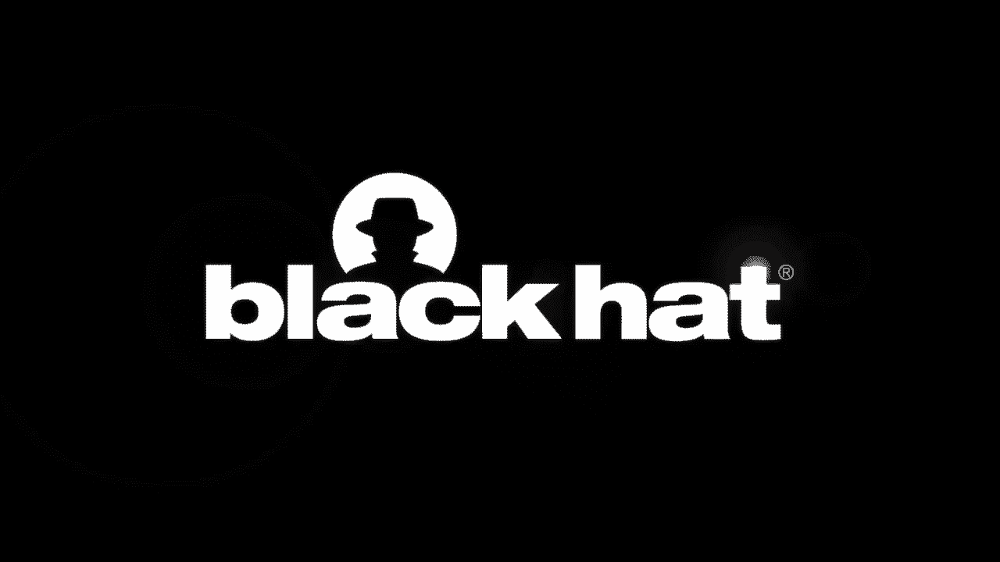
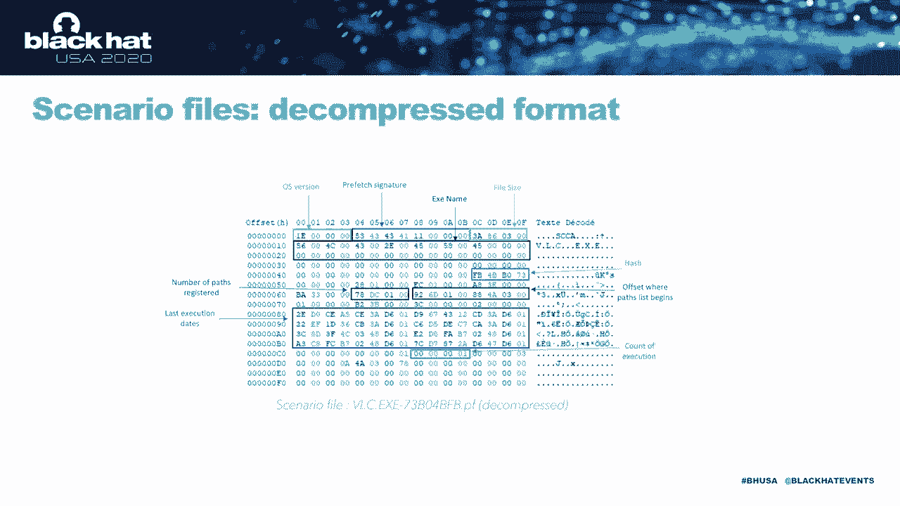
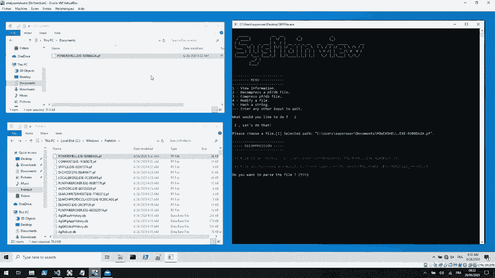
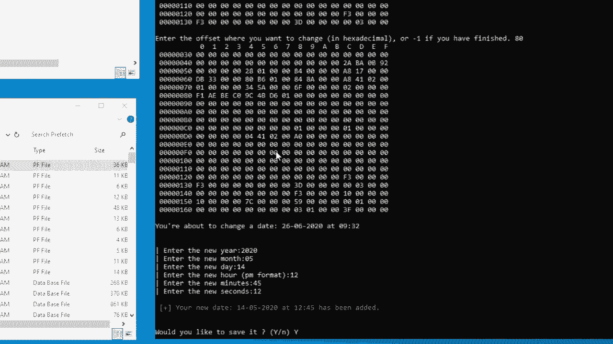
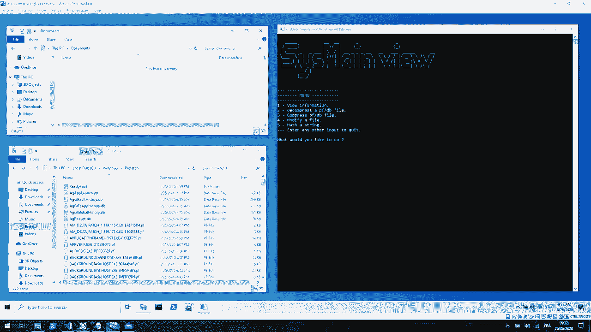
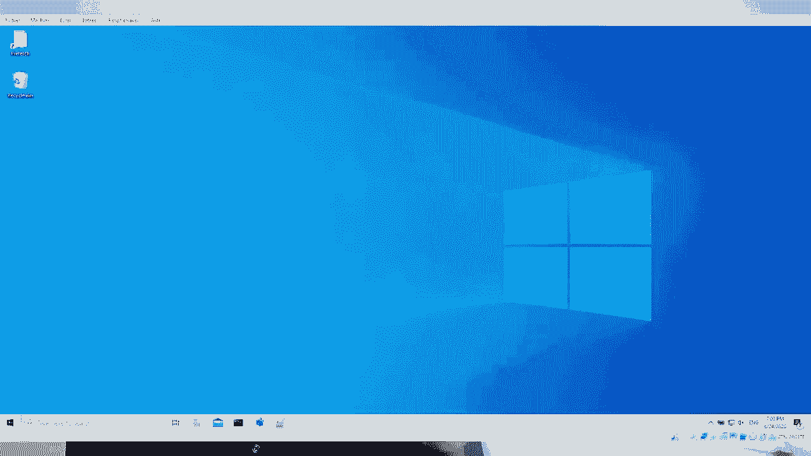
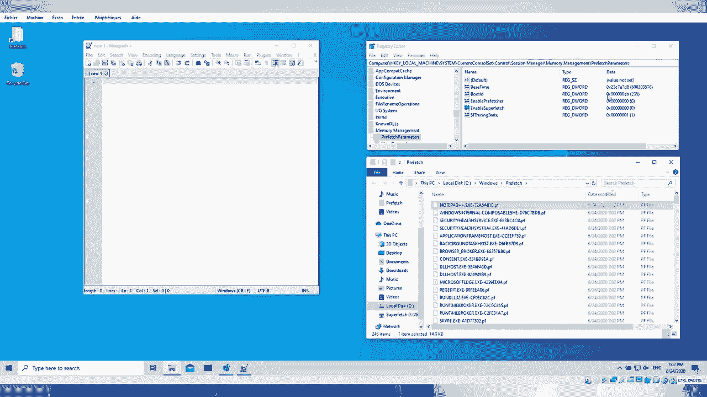

# P53：54 - Fooling Windows through Superfetch - 坤坤武特 - BV1g5411K7fe

 [Music]。

 Hello everyone and thank you all for being here。 Today we're going to introduce you to the best friend you。

 never had the chance to meet。 This little guy is called Superfest and trust me he knows more about。

 you than your brother's friends do。 Before getting acquainted with him let us introduce ourselves。

 I am a， typical master student and this is best his baby a PhD student。

 We both work at the SL laboratory in， Nava， France。

 If you have one day wondered what means 10 by memory in the resource monitor or。

 we might have a solution。 Actually this memory is composed of perody process and really fine。

 even if you never ask for this process to be launched or since time to be touched。

 How is it possible that， the system really is something in memory even if you did not ask for it。

 Actually the system， tries to waste what you are going to use but how is it possible？

 It takes everything to a system， greater style which spies on you every hour of every day。

 Its name this makes sense。 This service， tries to make your life easier actually and by two the first one is optimizing the boot and the。

 server one is analyzing your daily software use so it can predict and pronounce what you might need next。

 time。 For instance if every day as soon as you turn on a computer you go through your web。

 application or tomorrow morning you're always ready to execute this application before you even。

 think about it。 The two clear things are super fetch is just a part of the sys main service but the。

 missus of language is often made because until windows 8 the whole service used to be called super。

 fetch。 The place of sys main is located on c windows with prefetch and there are many things in this。

 territory。 If you first add a directory called very boot this is related to the driver's activity。

 called pretty boot you add the majority dot b and dot b and dot b and the traces of the course。

 activity and you've got a file named lia dot uni let's have a closer look at it。 This is a list。

 representing the best order for your OS to load files when booting and of course it begins with。

 the kernel because with that it won't be able to load much。 The rest of super fetch performance。

 is based on reducing memory operation but do you understand this concept first need to make sure。

 everybody knows what is memory fetching and how does it work。 So every process is dividing into。

 pages which are same size below of the data containing the instructions of the program etc。

 and these pages will be mapped usually into the hub which is a physical memory but it could also be。

 mapped into the virtual memory。 Every process has also what we call a page table which is another。

 associating the page number which is the index of the physical address to the frame number which is。

 the index of the virtual address into the physical memory。

 When you launch the program the CPU has to， first figure out where the instruction is so it goes to the page table with the page number。

 gets the frame number associated and then execute the instruction but what would happen if the page。

 is not mapped into the physical memory but into the virtual memory well the page table come resolve。

 the address of the frame number since the page is not mapped into the physical memory so a page。

 holds occurs。 To deal with that the west will first find a page into the virtual memory then it will。

 bring it back into a free frame and then it will update the page table with this neural tree so。

 the process can be written on again。 The old point of SuperFetch is to avoid this old process of handling。

 page holes because there are not there also pictures of normal parts of memory management。

 but actually they do require times and memory impressions so this is the system。 To avoid that。

 SuperFetch a reference is the page accesses the page holes so it could directly map to the physical memory。

 the page holes that happen once and to avoid them to happen again。 Let's check how it works。

 SuperFetch or system makes a race is composed of different components and among all these components。

 there is five very important ones which are called agents so we are going to focus on。

 introducing every agents。 The first agents is called agent context， AGC for fault。 This one。

 is based on user information that's why he is dealing with seed and took her enough to zero。

 Its main focus is concentrating on context change which means when you are going to be， an agent。

 when it's computerized going to stand by mode or when you are changing session。 You have。

 two way of changing session。 The classic one which is disconnecting from your current session。

 going to the new session and so basically disconnect which means from your current session going to。

 the new session directly and what's the final is when you are changing the session actually this。

 agent is going to take a snapshot of your session so that when you are going back from the new session。

 to the original one this is a snapshot which is used to improve the performance。 The second agent。

 is agent B FennDB for batch time number of the device which is a very important agent。 This one。

 is going to focus on two information which is allowed to log every batch board to know which file。

 is does matter for a given process and it is about to log every access to memory batch。

 in a process。 So from what insight of many pages all these pages can be in different。

 clicks modifilis and values， free lists， free lists， all of these pages are actually monotone。

 in a way by this agent so that you can guess or know which page is a matter of our process which。

 means if you have loaded the file in memory and this file is not accessed a lot it doesn't make。

 sense to keep recording it but gives that file loaded as a lot of access by memory for a given。

 process it makes sense to give that information and in addition it adds text to the page of memory。

 which are tracked in memory。 This page pre-vay memory is a spare IH share memory， committee memory。

 or if this page is coming from a back home application or a back home application making。

 sense that back home application does not need the same responsiveness the same ability to。

 be running fast rather than a back home application。

 I'm not going to process that at the same way because， the needs are not the same。

 Exactly and we are another agent which is important which is。

 important agents this one is responsible to monitor every process to be notified that this process is。

 using that file etc and actually from all this information provided is making statistic with。

 a map of changed process to define pattern of views from a memory point of view of a given process。

 but approach is very focused on every process。 There is a lot of global review if we really want。

 to deal with agents with a bigger view we have got a robust performance agent， a GFP for short。

 this one issues the relevance of all the database which are recalled。

 Actually it's often a full range， of the system。 Yeah it's definitely a set of threshold to make a mark and calculate if the。

 file is relevant or not。 Yes actually let's suppose you have on the system software we are using during。

 three days it makes sense as the fourth day that system is guessing that you are going to reuse it。

 so it's going to pre-load it in memory so that when you are launching a software it's much faster。

 but best suppose now after three days of intensive use you are no more using that software anymore。

 after one week or two weeks super-fetch and robust performance agents is about to guess that this。

 software is no more relevant to be pre-loaded memory that's why we should remove it from just。

 pre-load list。 So this is for another agent which is very strong flora which has not really defined。

 gore except supporting an overall agent is global agent。 This one is very important because in。

 management of things like this tool is a collection of scenarios fine and scenario size for short。

 this is a way that super-fetch is predicting which batch could be used by a given process etc。 So。

 scenario very central。 Yes it's very important to the root of a TADI。 Yes it defines a phase per。

 day so this is a service which tries to know how you live with your computer when the morning starts。

 Yeah but why are they scheduled for the night？ Yeah for you for your use and it's。

 important to check to guess that if you are in a working day you are supposed to use that software。

 but we can maybe you are using theogant or stuff like that so that is going to change for Saturday。

 and Sunday how you are going to use your computer so that it can pre-load what makes sense for you。

 during weekends or during morning or evening。 So this is an agent which knows you very very efficiently。

 Reusing approach this agent has to side more than just statistic is the agent responsible for pre-loading。

 memory for short making the page in the standard analysis。 So that's for all the。

 other particular ones in different agents but agents are for all of them different tasks。

 The preferred frontier for true which is a part of the system collecting statistic making prediction。

 or this scenario。 Yeah so this is an unstoppable but the risk of all different jobs one is about saving。

 makes periodic sales。 If you are going to check on internet you can read sometimes that these sales。

 are performed every three days at least thickness because all the self depends on the type of data。

 during date user activity etc etc it depends if it's really strictly database， post or file etc。

 and it can be controlled by registry values。 So it's starting to be a great to say it's every three days。

 I also have task which is a relevant task。 It means a specific circumstances low CDUs。

 low memory use， consumption。 When your computer is about to do nothing。

 superfetch is taking hands to perform highly resource consumption tasks like updating and。

 t-mailing， making math， making different notation of a regular drive。 So this is very interesting。

 task but this task only performs if it's all a supply for your computer which means that if you。

 are on a laptop because this is highly resource consuming task windows don't hold and work to decrease。

 performance of the autonomy of your laptop。 So that's why if it's poor or surprised only。

 or this either task can be performed。 Another fact which can be fun in a way is that superfetch is。

 using more than 22 registry keys and values to make communication or synchronization。

 We was a driver which is supplying it a lot of information which is a fine offer。

 This key can be used to exchange data perferor， strings or just for synchronization creating。

 one value， the things that you write after。 So this is not the usual way of communicating with。

 drivers。 So that's a bit fun。 Maybe it could be due to retrocompet editing。 We don't really know。

 but it was kind of surprising。 Yes but yeah that's true。 I've also seen is that superfetch has。

 five different types of database from all different agents collecting different information。 Even。

 if this is different information in their shape， in their data they are all stored in files which。

 are the same format。 Technically speaking superfetch in this main service using a set of。

 internal functions sort of internal API if you want which are collecting from different information。

 processing all these information so that they can be saved in the same shape of file and the same。

 format of database。 So on these pictures we made the links between the different internal functions。

 which I used to perform all these tasks。 This leads us to another pillar of superfetch which。

 marri is perfetch likes。 It includes the dot DB and the dot PFIs and the first thing you need to。

 know about them is that they are almost all compressed within the dot content function。

 after compressed buffer and with the express customer algorithm but it was not always the case and。

 it used to be as an anti-1 so it might as well change on the future。 Let's first focus on the。

 database files。 They are the dot DB and they are related to the agents activities。 Actually they。

 are the way for a superfetch to rebuild the internal database for the agents。

 So when agents might have， more than one dot DB associated since one agent might need more than one DB for its internal operation。

 Please note that our note was present on the directory which makes the really much more complicated。

 and this might also explain why the format was not documented so far。

 Their name haven't been explained， as well so here is a list of what we could come up with。

 So we've got the AGC-Eaks which is followed by， a huge number actually。

 This number corresponds to the sale of a user on your machine。 So you might。

 have more than one if you have a new user machine。 You have also the AGGL file which is followed by。

 some application you have the FG which refers to problem application as we say they do matter to。

 know where the have come from。 You also have the UAD which actually might refer to user activities。

 but unfortunately we do not have a means to check that so this is only an assumption。

 So have we have seen previously all the databases are connected to each other。

 so they followed the same reading process for each file in our engine screen。 The reading process。

 is divided into three steps。 The first step is if you get into view of the file you compress the。

 buffer then you've got the initialization of the internal device in dark view and after that you。

 filter that super patch builds the database with the information contained into the file。

 Regarding the database itself when you open it you first see the compressed format。

 So this is a buffer with a magic number specific to the batch files and then the compressed size。

 and checks and to make sure there is no other thing or option。 When you decompress the buffer。

 you have many informations among them the most important are the header size because the error。

 size is useful to calculate offset between the files so without any offset calculation to not。

 mean anything and you've got the database parameter file type。

 This name has an internal table of 16 sets of eight numbers which are the parameters。

 The file parameter file type shows actually the index into this table to find the corresponding。

 parameters and those parameters have two measured uses。 The first one is offset calculation within。

 the file and the second one is setting some sizes into the internal database corresponding。

 So the details of the calculation within the files are just in here。 The problem。

 bar round one is useful to calculate the beginning of string one from the end of the header and。

 see me not really the round two is useful to calculate the beginning of string two from the end of string one。

 So from all the data that are told in this DB file。

 so that it has to create something that more involved with like scenario files。 So from all。

 the data collected from the system is going to create a process here process all this information。

 so that is a way to make us of what should be followed what is used by this process except， below。

 To do so is going to create scenario files。 Name files are always the same shape of name。 First。

 they are stored in C windows professional directory and then this is always the name of the type。

exe， dash， A digits and Df extension。 Actually there are traits of an application and one application。

 can have one or more scenario file depending on the context of the execution of the given application。

 One interesting thing is that this directory and these files especially are ruled by。

 key in the registry and especially values in that key。

 Among the values which are present in that key， which is software Microsoft Windows NT， RnV。

 professional professional。 There is a max prefetch file key which is by default set to。

 250th and it corresponds to the maximum number of scenarios file which are stored on the disk。

 And for each file there is a key which is max prefetch file size which gives us the maximum size。

 in bytes of a file。 So this is a way by quickly playing the two values to know the maximum size。

 that superfetch can use for scenario files。 So once we know that how our manage scenario files。

 we can try to understand how they interact with superfetch。 But as opposed to programming。

 as long as it means that the process is created and in a way on the zone。 There is a notification。

 performed by the operating system， file for if you want to explain to superfetch status。

 process information that a new process is created。 From that process creative。

 superfetch is going to check if it exists for this process scenario onwards。 How is it possible？

 Simply by just requesting if the file already exists or not。 So it needs to know in which context。

 is being launched。 First superfetch is identified with a full application path and in addition parameters。

 provided to the application。 For instance you have a common line like no。 The diff line。 Yes。

 diff line。 And you can add parameters like dash s dash b stuff like that。

 So all these parameters are provided to superfetch。 So that is a long string。

 From this long string there is a sort of hash function。 Actually this is far from being。

 photography， please secure hash function。 It's much more like homemade hash function。 So it's just。

 linear for some of every characters。 Interesting on Windows 10。 We have reversed。 This is based。

 on the string constant which is pi constant which is 3。1459 etc。

 So this is interesting but it doesn't， correspond to order version of Windows。

 So from time to time this is a new result of change。 Yeah。

 there are some modules and other operation or some different depending on the value of the。

 seed etc。 So what is happening when there is no file？ Actually superfetch is about to create a new。

 file。 There is no one for events scenarios。 But there is one superfetch is about to really。

 information。 Actually it is only relevant information from him in that file。

 And then taking into account we have access to the scenario。 We need to know how to provide new。

 information because your process is running。 And since running things can happen and all this。

 activity can be monitored to enrich the content of a scenario。 To date as this is done via。

 as a camera alone component which is final which is the file mini filter driver。

 which is the version of legacy filter on driver for file。 It's mentioned of his driver。 It's。

 supervised by name and information mostly read/write or name change operations。

 Different files touched by all the process of the system。 So how is it possible for the。

 strength of simplicity we can explain that in the mini filter driver technology you can add context。

 to each file for when you create a quantification of file access。

 Or removing the context when the file is no more used。

 So that when there is read or write operation， the context is used to know that this is that file which is targeted。

 And doing that this driver， is allowed to recall which part of the file has been read which part of the file has been written。

 So this is a lot of very relevant information as professional what should be loaded from。

 file not a full file but maybe it's a relevant part of the file。 So it's three make sense。

 And from all this information from time to time， Final， This is both raw school and a different。

 Unfortunately we do not really know what does it mean but we can， achieve is normalize something。

 And should be for normalize。 From scenario files actually。

 all this data is processed to be installed in scenario file which owned by PF suffixes as a spending。

 Actually they are managed almost a sample database so it means it's compressed。 If you take。

 compressed you have a lot of real information or vice versa。

 And you have the name of the application。 In our example we have decided to use VSC which is a media movie player。

 And so that's why it's written， VSC。 We have a lot of information which are relevant to one which is very relevant from a。

 forensic point of view。 In the last days when this software has been used so that we can know exactly。

 when you are using a software morning evening or which days or frequency you are using it。

 So it might be interesting。 Yeah also what you have done yesterday and before it and all of。

 the steps so all your schedule actually。 Yes this is very good to spy on you。 Well you have also。

 a number of times it's exhibiting but more interesting。

 You have a file which has been touched by your， application。

 There are different rules to be recorded in scenario files because not all files。

 are recorded first because it's for the chem purposes of the speed of your computer。 The。

 exhibit servers lose every time they are deal。 So a lot of files regarding scenario files are， deal。

 Also given process but you've got also recent files such as personal file。 In okay this is a very。

 famous movie that has been recorded directly in the scenario file。 So that we know exactly which。

 movie you have watched and combined with information from Final Four we know exactly which part has。

 been read from the files from the movie。 So it means that we can know which part do you prefer or。

 who finish the one that movie etc。 So this is very relevant information about you but there is more。

 And actually it works also with the songs the photos the text document we also add the names。

 of the directories the names of the files there it tells everything about you。 You also have the。

 cache files and this is really specific because they are the result of the cache， neural management。

 You have the example of the reference to the directory of the cache。

 The cache for the record is a memory management and that aims at storing pieces of data to reduce。

 their access time later on。 It is also designed to do stream caching so this implies the data stored。

 could be the contents of the file。 And here's a proof with wing half updates。 This is a dot 60。

 document and the content of the document is written in clear text。

 So this is a nice way to find your， personal contents from any text document。 Actually。

 Superfit does not have the content that shows you， the way to do so。 So let's sum up。

 Now you know what is this name and how it works。 You know which， file you are using。

 Yeah and what is interesting to extract from that the account of execution the。

 days the times the names of any locations of each file etc。

 So from a foreign sequence of you this is， a wonderful opportunity to try and improve。

 But it also means that you could be effective of that。

 So what if you want to protect yourself from it？ Well it's our pleasure to announce you it's time。

 to fool your voice。 The first step to do that is to find a way to access to the data。 In 2010。

 NFSOT has released a tool named WinPreveGEU that allows you to have an overview of the prevegett。

 scenarios and you can see the details of each scenarios in it。 This is really user friendly and。

 this is really useful to have this overview。 But when we used it we faced three problems。 The first。

 one is the two-disc closed source so you don't really know how the data is processed。 And you can。

 change it if there is an update in SuperfitGEU。 Yeah so this was one of the major problems。 The。

 other one is the information is only about the dog。 Yeah so even if the dog did not reflect much。

 about your habits such as the scenarios they do matter and this was something bothering us。

 And last but not least you can't edit the data。 So it's really useful。 Yeah there is no way to。

 change whether the scenarios revealed by TrueVecetara and this was the goal。

 So to solve these problems we， have created our own tool in C that allows us to have the full control on any kind of prevegett。

 device。 You can compress， they compress any buffer you can view the information and you can。

 edit the information。 Of course it's open source and you can also hash really the SuperfitGEU。

 algorithm。 But what we are really interested in is food in your OS and food in Sys main。 So the。

 ROAS run map is pretty simple。 We will pick any program scenarios。 We will open it scenarios。

 the compressates， edit the information and then we will compress it， save it and reintroduce it。

 into the professor tutorial。 They will try to make it。 Yeah。 Let's do them。

 So this is an example with， Porsche。 We execute。 Yeah we get the scenarios。

 copy and paste it as well and the professor tutorial。 And then we open it with our tool。

 So it offers you to decompress and view the information。

 So we've got the information we told about the counter execution and the date。 It's currently the。

 26th of June and it's 932。 So let's try to change the state。

 Okay so we open the decompressed buffer。 We set the right offsets and change the dates。

 So let's say it's the 14th of May。 Okay we save it。

 compress this new refer so it could be reprocessed by Sys main and we put it back into the pre-fetch。

 directory with the original name。 So that would be erased so original fact。 Yeah and let's see how。

 the OS reacts。 Put it back into the pre-fetch， replace it。 Okay now let's launch once more。

 the form shell to see how this scenario goes。 So let's go to Porsche now。 Okay。

 let's check what changed in Porsche's scenario。 We could be invested elsewhere。

 I stayed last time with open it with our tool and let's see the information。

 Here it is。 You've got the date falsified and the OS to just realize it has been falsified。

 So you can wipe any traces with that。 So we can full-fetch the tool based on， superfetch。

 Yeah you're always an aggressive tool because the OS does notice that。

 So here is a way to protect yourself and food the OS and trick everything。 But what if you want。

 to completely prevent yourself from any system and track？ Well actually Windows Intel also would。

 advise you to edit the registry value called enable_prefiture and set it to zero。

 But let us show you what we have seen。 Okay so we open the registry and get to the values。

 So not only is it two values are set to three， which means another。 Yeah directly。

 So they are set to three when we launch not bad。 The scenario is， written as usual。

 So we are going to remove this value to zero so that the service should be disabled。

 Let's remove the system to make sure the change has been to come into account。

 We're looking。 So we have accelerated power because it's going to be restored。 Yeah it's pretty。

 not good。 A we're back。 So first we are checking in the registry that the two values in the。

 system are still zero。 That's the case。 Going to pre-fetch。 Okay so it's zero。

 And I will try to relaunch not that as we have just been doing before and see what happens。

 The scenario is still updated so it may be consistent。 It does not actually even with this value。

 Another example is the function from Siss me。 Be it as the super fact check and enable and。

 even though the name space for itself and let's see what the function is doing。 So it opens the。

 registry key we have just enabled to fetch and it uses the reg set value to set this registry value。

 to three。 So it actually doesn't care about the initial value and at one moment you can super。

 fetch the enable super fact value is going to be three again。 So this value do not have any。

 impact on Siss me。 To be honest the solution is quite basic。 You can disable Siss me manually。

 through a disorder is cultural manager or any card line。 But please keep in mind that it's going。

 to be a standard cost-free preference because even though Siss me tracks you and knows you。

 and you have it it gains preference。 Actually it's like the first time you are having。

 style your operating system。 You see the same performance so it's not all slow。 But you don't。

 get access to the improvement of performance provided by Siss me to keep your privacy。

 It's a bit like when we're brosar and you want to use it in pre-write mode。

 This is exactly the same。 I mean both for your operating system。

 We really think we have contributed to the， comprehension of Siss me and we are glad to have built tool that exploit these functionalities。

 and be more than happy to have your suggestion if you experience it on your own you can download。

 it on our GitHub。 And yeah contributed if you have any suggestion it would be really welcome。

 We also think it would be really rewarding to go further on the interactions with the drivers。

 such as Final Four and also dive further on the Windows cache because it hasn't been explained。

 a lot so who knows we might find more about your personal content。 Thank you for attention。

 and if you have any question it's time。 It has been a great time for you。 Hi guys it's me again。

 Do you have any questions？ It's my pleasure to help you。 Hi。 So we have answered questions at chat。

 Notably if the GitHub link will be provided so there will be。

 it's presented at the end of the slide but if someone needed we can maybe post it on the chat directly。

 There was a question a lot of malware。 Yes， yes please。

 So yes there was a question about malware detection。 Yes actually superfetch can be used to do that。

 You can you can you can make malware detection with that easily because most of malware don't。

 think about to avoid superfetch to do it yourself。 So this is a great way from。

 a forensic point of view to make the detection。 So okay I'm reading the chat to have questions。

 Yes you can edit the DB file directly without tool so this one is open source so if you want to。

 contribute and modify and improve it it's no problem actually。

 Yes you can you can modify a lot of file。 The most interesting are scenarios directly but yes you can modify also DB。

 Yeah， I just posted GitHub link。 Actually I will open it to the public in a few minutes but now you。

 have the link。 What exactly can you change in prefetch file？

 Actually we can change a lot of things like， name of the executable or the time when it has been used and above time it has been used and the。

 file has been constructed。 So the file which has been touched by your application。

 You also have all， the information we have seen on the header such as the time executed the count of execution so it can。

 tell us a lot about you。 If you have a malware let's take this example and it has been executed。

 just once well you know that it's not likely to be launched again and all of the stuff about your。

 habits and your usual programs。 And actually there is no way for the file to be modified。

 Even if it's from modified。 So security is not very present in the file it's just regular files that you can edit。

 Once you， know how to read them this is a goal mine and yes we have reversed the hash actually and。

 but the hash is it's a losing data hash it means you cannot from the hash value retrieve the original。

 strings but that's not a big deal because actually this is far to be a cryptographic。

 hash you can perform if you want a collision the reason just a linear transform and yes。

 the GitHub links may have issues we are going to to to put and then try it available as well。

 It should be fine now。 I'm going to test it。 Yeah let me know if there is still an issue。

 That's a very good point for us and we will have preferred to be present physically but。

 is the link available？ Yeah the link should be working now let me know if you have。

 We have one more question。 Does the windows system record that the scenario file has been。

 randomly changed？ Actually not at all that means if you re-enject the file you have just modified。

 but with the original name that's to say or to allows you to change the file but the extension。

 just before the extension you will have like result compressed to tell you if the file is compressed。

 or not and if as if it has been modified well if you re-enject this modify file into the preferred。

 directory let's not notify it and it will windows will process it as any other prefetch file。

 and that's the magic part of it。 So there is two we'll try to to to to also them first。

 These are both super fetch yes it's like， being a previous mode in web browser so it's forms a full system but yes that's the clue that you。

 are you know that super fetch is enabled and you want to avoid forensic and the last question。

 does malware has the ability to inject itself in search well actually super fetch is running with。

 system privilege which means you have to be an administrator of the machine so once you have。

 once you are on the instructor or on the other side of the airwatch so it means the security is。

 already broken so but yes if malware has an instructor or rice you can disable super fetch or full super。

 fetch by itself yes of course so we hope you enjoyed this presentation we enjoyed to do it and thank you。

 for your attention。 Yeah if you have any question you can contact us and it would be your pleasure to answer。

