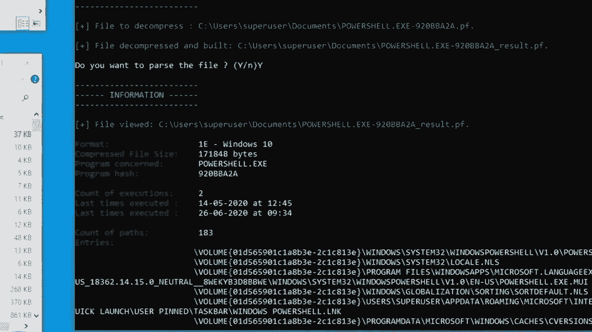
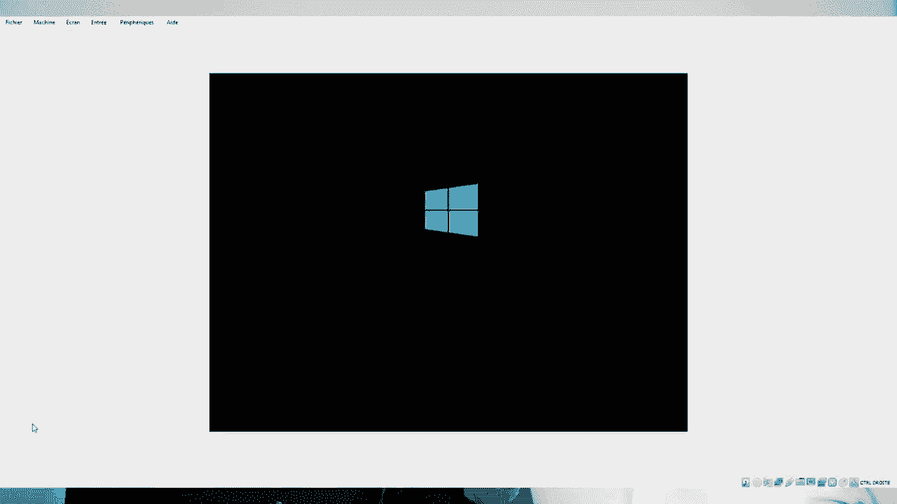

# P53：54 - 通过Superfetch欺骗Windows - 坤坤武特 - BV1g5411K7fe

[音乐]

大家好，感谢大家的到来。今天我们要向大家介绍一个你从未有机会认识的最佳朋友。这个小家伙叫做Superfest，相信我，他对你的了解比你哥哥的朋友还要多。在认识他之前，让我们先介绍一下自己。

我是，一名典型的硕士研究生，这是他的宝贝，一名博士研究生。我们都工作在法国纳瓦的SL实验室。

如果你曾经想知道资源监视器中的“10”代表什么，或者我们可能有一个解决方案。实际上，这种内存由周期进程和非常精细的进程组成，即使你从未要求启动此进程或触摸它，时间到。

系统怎么可能真的在内存中保留一些东西，即使你没有要求呢？

实际上，系统试图浪费你将要使用的东西，但这是怎么可能的？

它将所有东西都带到系统，一种更大的风格，它每小时都在监视你，每天都在监视你。

它的名字很有意义。这个服务试图让你的生活更轻松，实际上，有两个目的：第一个是优化启动和服务器，第二个是分析你的日常软件使用情况，以便它可以预测和预测你下一次可能需要什么。

例如，如果你每天一打开电脑就会浏览你的网络应用程序，或者明天早上你总是准备好在思考之前执行此应用程序。

两个明显的事情是，SuperFetch只是sys main服务的一部分，但语言上的误解经常发生，因为在Windows 8之前，整个服务都被称为SuperFetch。

sys main的位置在c windows with prefetch，这里有很多东西。如果你首先添加一个名为very boot的目录，这与驱动程序的活动有关，称为pretty boot，你添加majority dot b和dot b和dot b和课程活动的痕迹，你就有了一个名为lia dot uni的文件。让我们更仔细地看看它。这是一个列表，表示操作系统在启动时加载文件的最佳顺序，当然，它以内核开始，因为没有它，它将无法加载很多。

SuperFetch性能的其余部分基于减少内存操作，但首先你需要确保每个人都知道什么是内存检索以及它是如何工作的。所以每个进程都被分成页面，这些页面具有相同的大小，包含程序的数据、指令等。

这些页面通常映射到hub，这是一个物理内存，但它也可以映射到虚拟内存。每个进程还有一个我们称之为页面表的东西，它将页面号（物理地址的索引）与帧号（物理内存中虚拟地址的索引）关联起来。

当你启动程序时，CPU必须首先找出指令的位置，所以它去页面表，用页面号，获取关联的帧号，然后执行指令。但是，如果页面没有映射到物理内存而是映射到虚拟内存会发生什么呢？页面表会解析帧号，因为页面没有映射到物理内存，所以会发生页面错误。

为了处理这种情况，Windows会首先在虚拟内存中找到一个页面，然后将其带回一个空闲的帧，然后它会更新页面表，以便进程可以再次写入。SuperFetch的旧版本是为了避免这种处理页面错误的旧过程，因为它们不是内存管理的正常部分，但它们确实需要时间和内存印象，所以这是系统。

为了避免这种情况，SuperFetch会引用页面访问，以便它们可以直接映射到物理内存，一次发生页面错误，以避免它们再次发生。

让我们看看它是如何工作的。

SuperFetch或系统由不同的组件组成，其中最重要的五个组件被称为代理，我们将重点介绍每个代理。

第一个代理称为代理上下文，AGC for fault。这个基于用户信息，这就是为什么它处理种子并将其设置为0。

它的主要重点是关注上下文变化，这意味着当你将要进入代理，当计算机进入待机模式或当你更改会话时。

你有两种更改会话的方式。一种是经典的，即从当前会话断开连接，进入新会话，所以基本上是断开连接，即从当前会话直接进入新会话。

另一个是当你实际上更改会话时，这个代理将拍摄你的会话快照，这样当你从新会话返回到原始会话时，这就是一个用于提高性能的快照。

第二个代理是代理B FennDB，用于批处理时间数和设备，这是一个非常重要的代理。这个将关注两个信息，它允许记录每个批处理板，知道哪些文件对给定进程很重要，并且它将记录进程中对内存批处理的每个访问。

因此，从许多页面中，所有这些页面都可以在不同的点击、修改和值、空闲列表、空闲列表中，所有这些页面实际上都是单调的，以便你可以猜测或知道哪个页面是给定进程的文件。

这意味着如果你已经将文件加载到内存中，并且这个文件没有被大量访问，那么保留它就没有意义，但如果给定的进程大量访问该文件，那么提供这些信息就很有意义。

此外，它还向内存中跟踪的页面添加文本，这些页面是备用IH共享内存、委员会内存或如果这个