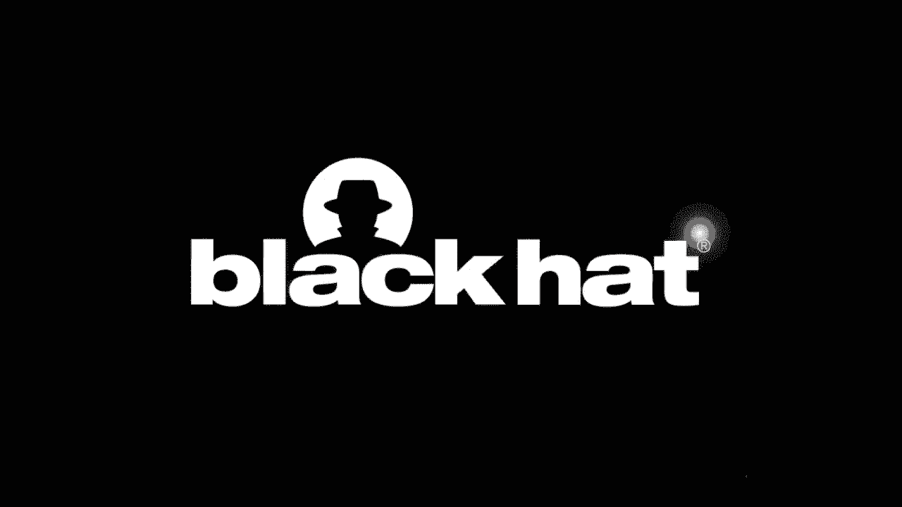
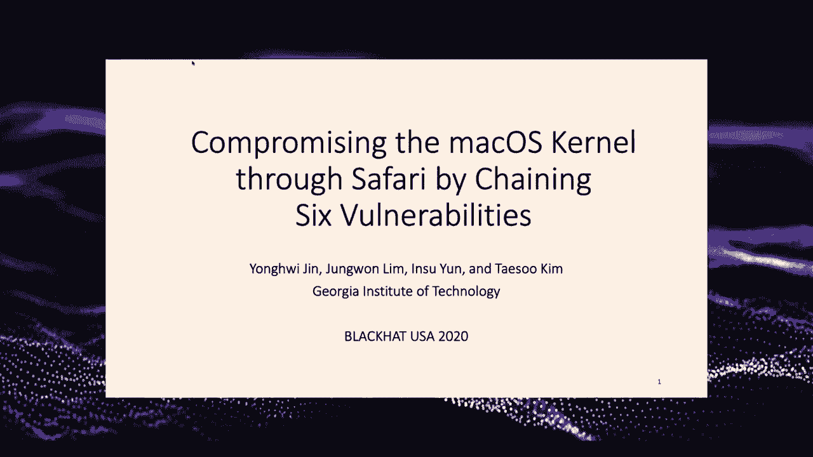
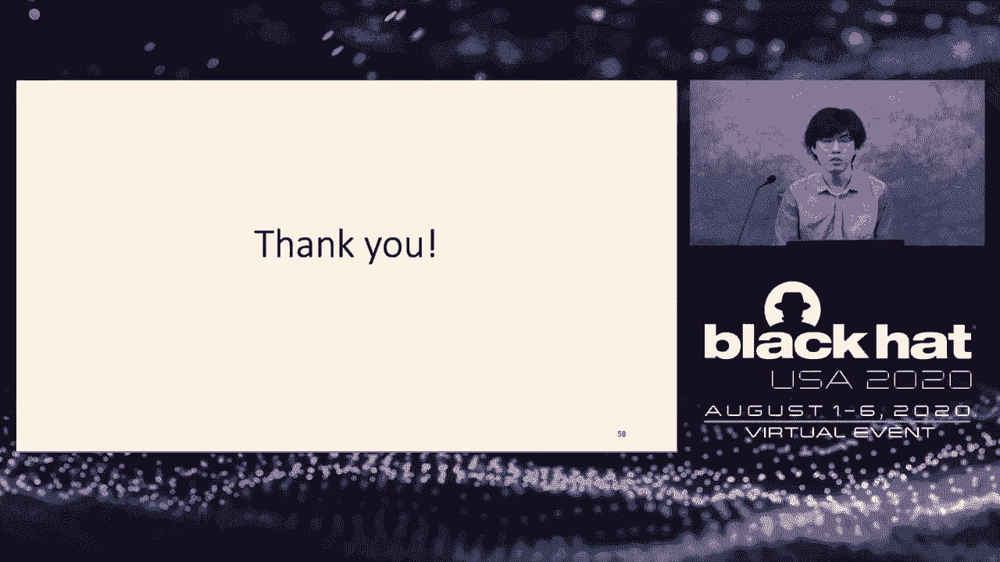

# P54：55 - 通过Safari利用六个漏洞链式攻击macOS内核 - 坤坤武特 - BV1g5411K7fe

## 概述
在本节课中，我们将学习如何通过Safari利用六个漏洞链式攻击macOS内核，实现代码执行和权限提升。

## 团队介绍
我们来自乔治亚理工学院，是Tazucaim教授的学生。我们团队在GATEK的SSL应用中工作，并相信我们是世界上最好的Promagion安全实验室之一。我们还参加了DTF团队，并在2018年赢得了DEP-QR-UT1比赛。在PON2 2020中，我们通过展示利用链的力量获得了RCE，并在沙盒中逃逸后提升权限到root。

## 漏洞利用链
我们的漏洞利用链使用了六个独特的漏洞：

1. **JavaScript引擎中的RCE漏洞**：通过访问我们的网页，利用JavaScript引擎中的错误解包模型，在Safari的Web进程中获得RCE。
2. **逻辑漏洞**：利用Safari支持进程中的逻辑漏洞，执行我们的应用程序。
3. **Z-Brim服务器漏洞**：利用Z-Brim服务器漏洞，获取我们的代码执行。
4. **堆溢出漏洞**：利用GBM服务器中的堆溢出漏洞，绕过第一次应用程序保护。
5. **条件竞争漏洞**：利用CF-PREF-STEMON中的条件竞争漏洞，提升权限到root。
6. **内核扩展加载二进制漏洞**：利用内核扩展加载二进制漏洞，获取内核代码执行并禁用SIP。

## 漏洞利用细节
### 1. JavaScript引擎中的RCE漏洞
该漏洞利用JavaScript引擎中的错误解包模型，通过访问我们的网页，在Safari的Web进程中获得RCE。

### 2. 逻辑漏洞
利用Safari支持进程中的逻辑漏洞，执行我们的应用程序。然而，由于Mega OS中的第一次应用程序保护，我们的代码执行被阻止。

### 3. Z-Brim服务器漏洞
利用Z-Brim服务器漏洞，获取我们的代码执行。然后，我们使用第二个漏洞，在Safari支持进程中执行我们的应用程序。

### 4. 堆溢出漏洞
利用GBM服务器中的堆溢出漏洞，绕过第一次应用程序保护。现在，我们作为无特权的用户获得了代码执行，并且没有沙盒。

### 5. 条件竞争漏洞
利用CF-PREF-STEMON中的条件竞争漏洞，提升权限到root。

### 6. 内核扩展加载二进制漏洞
利用内核扩展加载二进制漏洞，获取内核代码执行并禁用SIP。

## 总结
在本节课中，我们一起学习了如何通过Safari利用六个漏洞链式攻击macOS内核，实现代码执行和权限提升。这个漏洞利用链展示了保护大型和复杂系统所面临的困难，并开源了我们的利用链以促进进一步的研究。