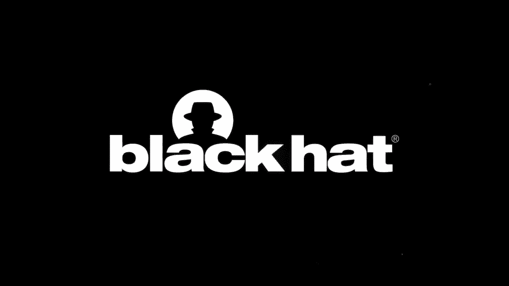
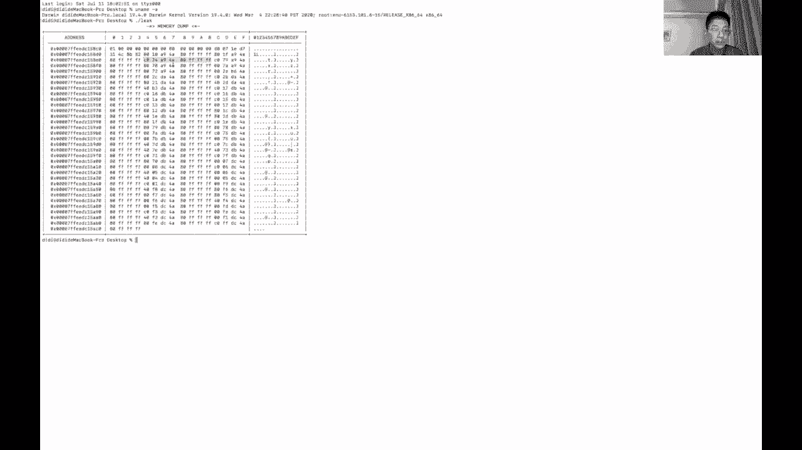
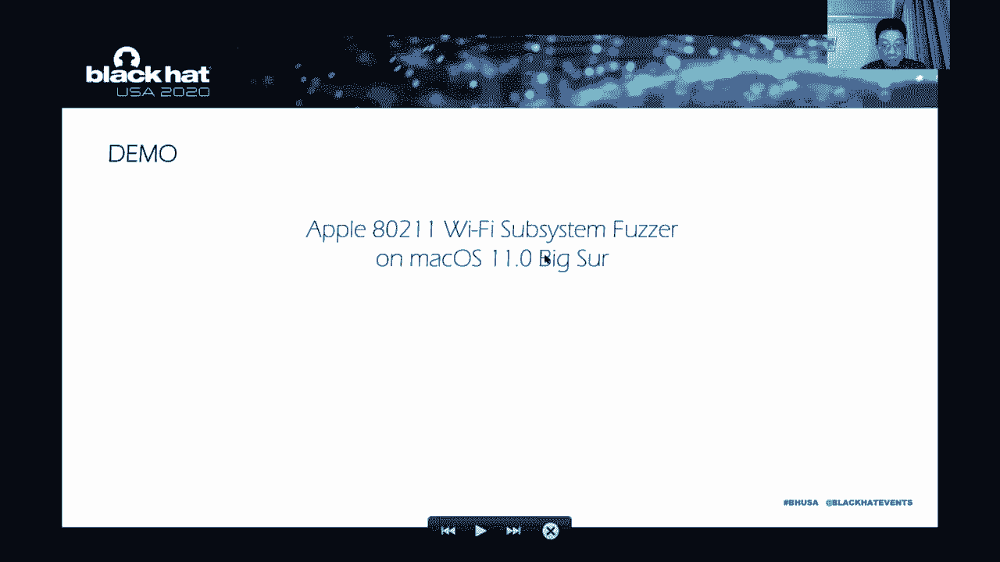
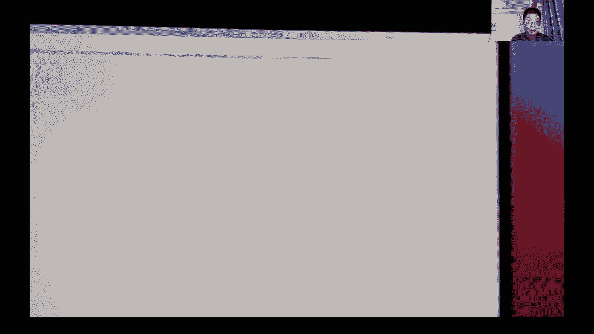
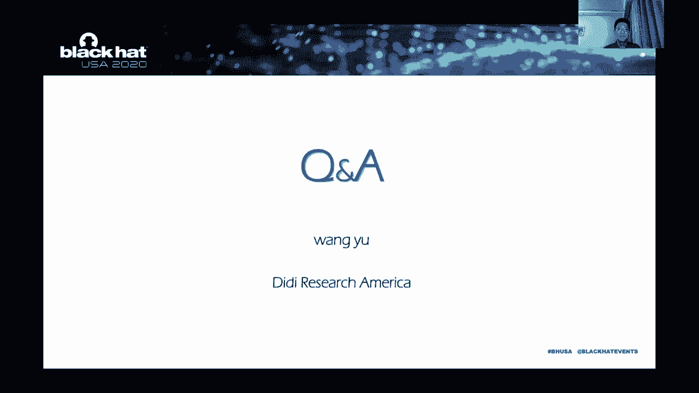

# P55：56 - Dive into Apple IO80211FamilyV2 - 坤坤武特 - BV1g5411K7fe

 Hello， everyone。

 Welcome to my presentation。 Today my topic is related to the Apple Wi-Fi subsystem。

 The title is "Diving to Apple I/O80211， Family Version 2。"。

 My name is Wang Yui from DD Research America。 I can be reached through this email address。

 In the first part of the presentation， we will focus on the architecture of the subsystem。

 I/O80211 family is a very old kernel component， but things have changed since last year。

 Apple refactored the architecture of the Wi-Fi client drivers and renamed the new generation。

 design to version 2。 So our questions follow。 Why does Apple need to refactor the code？

 What are the new changes and what is the impact of this change？ For us。

 we may pay more attention to security impact。 I will try to answer these questions。

 I hope this presentation will help you better understand the architecture and the security。

 challenges of the Apple Wi-Fi subsystem。 If we call the previous generation as version 1。

 we will see that， version 1 and version 2 as family drivers play a very important role in Apple's communication。

 model。 They are responsible for managing almost all Wi-Fi communication functions。

 Here are some specific examples。 For example， we need to set up and the manager SSID channel and in a rate。

 something like， that。 With this basic concept in mind。

 let's examine the subsystem from a higher perspective。

 The above management features are common to the two generations of design， but soon。

 we will find some differences。 Here I list some typical modules of version 1 era from user mode to kernel mode。

 For the demo， we have airport。 After entering the kernel。

 we have the version 1 family kernel extensions and plug-in drivers。 In short。

 version 1 is mainly designed to support Apple， airport and related equipment。

 We can also find this from the name of plug-in drivers like airport。 However。

 with the development of mobile devices， we can see that the design concepts of the。

 Wi-Fi subsystem has changed。 I/O80211 family version 2 is mainly designed for communication and data sharing between。

 the new generation mobile based Apple devices。 And airport no longer appears in the name of the kernel extensions。

 So removed。 Here are two examples。 We can see that the new subsystem is better spotted。

 such as Skywalk。 Reverse engineering shows that many functions integrate at least three branches。

 which lead， to different subsystem。 And the Skywalk is the one that was recently introduced。

 Our new features， Sidecar， was recently introduced as well。 Two conclusions here。 Number 1。

 family version 2 is a brand new design for the mobile era。 Number 2。

 family version 2 and WLAN Core integrate the original airport Broadcom drivers。

 with more features and better logic。 One more thing is that please also keep in mind。

 New features always mean new attack services。 If we want to further understand the Wi-Fi subsystem。

 where should we start？ My approach is that I followed the two articles by Jonathan。

 These two articles try to build a Wi-Fi compatible framework from scratch。 Through this project。

 we can quickly become familiar with the user mode of the entire。

 Wi-Fi subsystem and the interface of the kernel layer。 Personally。

 I have learned a lot from the compatible framework project。 In this。

 you might say that I'm familiar with this matter because we did many similar projects。

 on Windows platform。 For example， in order to combat rootkits and kerneling like hook。

 we have tried such， solutions in the file system and the network related functions。 Yes。

 you're right。 But before we start， I would recommend reading the following projects like Intel Wi-Fi for。

 Mac OS and the Udu Wi-Fi。 In the next section， we will focus on attack surface and security assessment。

 First of all， we should consider all inputs are potentially dangerous or we can call it， zero trust。

 For kernel， the attack surface can be divided into at least two categories。

 From remote and local firmware to operating system kernel and from demon and framework。

 to operating system kernel。 The third category belongs to some exceptions。

 So I listed it as all other handlers and the puzzles。

 For the category from remote and firmware to kernel， I have two examples。

 The first one is from the research of Google Project Zero。

 Shell Biniami discovered a large number of vulnerabilities caused by handle event packets。

 This function can be reached remotely。 The second example is handle firmware trap。

 This function handles requests and events from the firmware。 They are all excellent attack surfaces。

 The other direction from user mode to kernel。 As early as 2007。

 magazine only informed had an article about the set scan request of， vulnerability。

 which is well worth reading。 In addition， we also have examples for airport， broadband， and IC。

 The two links below are from ZDI。 For the third category， it covers a wide range。 For example。

 AWD-L protocol， Skywalk， and the routing handle data packet。

 These are the attack surfaces that I discovered during daily debugging。

 And then are often very complex designs。 Two years ago， I wrote a kernel extension called KIMUN。

 In addition to monitoring features， KIMUN has an in-life hook engine， which can hook almost。

 any kernel function you want。 The source code can be found on GitHub。 And last year。

 I practiced the macOS， IPC， and XPC communication monitoring based on this， project。

 Here is a link to Blackhead Artinar 2019。 And in order to learn more about the attack surfaces of the Wi-Fi subsystem。

 I wrote several， sniffers based on KIMUN。 So that's why I introduced KIMUN to you。

 This picture is one of them。 It can intercept all GAT and the SAT requests sent to the Wi-Fi family drivers。

 Because KIMUN has pre and post-cobbed capabilities。

 I can pass the input parameters and other useful， information in the pre-cobbed handler。

 As we can say， I can capture process name， type， user buffer， and the lens。 User buffer lens。

 I can also modify return data of the target function in the post-cobbed handler。

 Like the compatible framework project， these sniffers happily mean a lot。 So let's make a summary。

 Since I have KIMUN in hand， I can perform code coverage analysis on the closed source， drivers。

 I implement several sniffers， but I can convert them to passive fuzzers。 For example。

 I can do bit flipping of input parameters easily。 I have compatible frameworks。

 so I can also convert them to active fuzzers。 In practice。

 I found that combining the two fuzzing methods often has better results。 In the next section。

 we will discuss the latest vulnerability cases that I found this year。 So far。

 I have reported a total of 18 vulnerabilities of the Wi-Fi subsystem to Apple security。

 The four of them were repelled at the end of May。 The types of vulnerabilities covered heap overflow。

 heap data， OOB access， kernel information， disclosure， stack overflow without cookie protection。

 It can be said that I have been dealing with all kinds of stranger panics in the past few， months。

 I can classify this vulnerability from another perspective。 Like number one。

 vulnerabilities affecting Olin version two。 And vulnerabilities affecting both version one and version two。

 And number three， vulnerabilities affecting Olin version one。 Further。

 if we deeply analysis the first category， vulnerabilities affecting Olin family， and version two。

 we can find that it can be disassembled as 1。1。 Introducing the way to when part existing with one features and 1。

2。 Introducing to when implementing new features。 We will discuss them one by one。

 Let's start with CBE 2020 9。834。 This belongs to category 1。1。 Generally speaking。

 when I run fuzzer for the first time， usually nothing happens。

 I need to spend a lot of effort to find out what is the reason for not having panics。

 Maybe the target is really robust or maybe the cold coverage rate of my fuzzer is too， low。

 But this time， this time was different。 I got a panic report。 At the same time， I ran the fuzzer。

 And after an hour， there were too many reports to handle。 I have four cases here。 To save time。

 let me skip the case 1， case 2， because they are all non-pointy reference， issue。 In case 3。

 the last panic log seems pretty good。 Its call stack is clear。

 And the instruction that caused the crash seems full of hope。 So we can control the REX register。

 Then I started to tailor my fuzzer。 I narrowed down the scope step by step。

 until I found the routing set scan request。 In the output of the eta hex 3 on the right。

 we can see that on lies 34 and 35。 The input from user mode should not be greater than 94。

 This is a very large input structure。 To understand the root cause of the problem。

 we need to figure out the detail of the structure。

 So one challenge I faced at the time was whether this input structure could be clarified through。

 remote engineering。 Soon I found a method。 Reverse engineering is visible。

 I found debugging information including set scan request here。

 In which a lot of readable strings were submitted to the function CC log string。 For example。

 on the right side， we can see that offset 34 of the input structure should。

 be a member called scan type。 And the 44 should be a member called number of channels。

 So we can have a table， we can make a table。 As the program continues to execute， we will continue。

 we will come to a routing called， few scan parameters。

 This function is responsible for extracting external parameters and feeling the input into。

 an internal structure。 The data structure on the left is passed by colors and we can trade it as untrusted or。

 tinted data。 The data structure on the right is the internal data structure of few scan parameters which。

 is merge external inputs。 I audited each member's copy process one by one until I saw the code on the right。

 I found a photo error。 On the first line of the picture， which is 179 of the data HACC3 code。

 The program extracts data from the 44 offset of the input buffer。 Combining the previous knowledge。

 we know that the private symbol of this member is， number of channels。

 The value of number of channels will be stored at offset 3C of the internal structure。

 The key point is the do well loop that starts at 185。

 The loop starts at zero and accumulates until it equals number of channels here。

 So is there an upper limit for number of channels？ Unfortunately。

 I don't see such logic in the code。 In other words。

 the external input number of channels determines the number of execution。

 of the do well loop which can be zero or can be Henry's thousand。

 You know Henry's thousand is absolutely unacceptable。 It's a heapable floor。 And by the way。

 there is an interesting fact in this code。 On Li188。

 we can see that when the code reads data from the input buffer， it will escape， C bytes each time。

 This detail is actually very important。 In writing exploit code。

 we need to set the memory layout according to this feature。 After having all these analysis。

 we finally got a sense of this heapable floor vulnerability。 In the input buffer on the left。

 if we layout memory like this， we will have full write capability， to the target internal structure。

 And because number of channels can be fully manipulated， so we can precisely can show the。

 number of bytes over floor。 Okay， let me summarize the root cause of CVE 2020， 9834。

 The vulnerable function lacks the necessary checks for the number of channels in the input。

 structure which leads to auto bound operations。 Auto bound operation has two places。

 source and destination buffer。 For source buffer， this means auto bound access。

 And for destination buffer， this means heapable write。

 The quality of this vulnerability is pretty good because the write primitive is relatively。

 complete。 And for one rehabilitative is incomplete， write primitive。

 Please refer to my previous write app。 So at this point。

 we can write the analysis report and even exploit code。

 But there are still some answer requests such as， why does the write primitive read from。

 the inputs every seapit？ And what is the remaining。

 meaning of the remaining fields in the input structure？ Usually， if I have a new task coming。

 I will leave a to do list here。 And maybe I will not touch it for years。

 But this year is really special。 Working at home is boring to me， so I found this。 The Apple SDK。

 From macOS X 10。1 to macOS 10。15。 It is interesting that the SDK header files of the Wi-Fi subsystem appeared briefly on。

 the 10。4， 5， and 6， 10。7。 These files have been removed。

 So we have a very small window to pick at what the 6 file contains。 And next。

 I found that there are some projects that did contain more recent Apple Wi-Fi SDK。

 header files like High Sierra or even Katrina。 So why？ Is Apple's SDK code leaked？ Not really。

 After comparison， I found that the code was not from Apple。

 They are more like the community's reverse knowledge sharing。

 In order to write compatible frameworks and better spot network devices， they reversed。

 a large number of kernel drivers。 For example， the interfaces here are all from reverse engineering of family kernel extensions。

 Well， maybe I can also contribute to the community。

 This is the 18 interfaces added by macOS Big Sur。 This interface represents the latest change in the platform。

 So together， we can make the community a better place。 Without further ado。

 let's go back to the vulnerability。 With the support of the Apple SDK。

 we can get all the necessary information。 Including unknown fields。 The previous question was。

 can also answer it。 The reason for reading every C bytes is because there is a substruct array in the definition。

 of scan data。 And the vulnerable routing only wants to copy the channel members。 In addition。

 we can see that here is the definition called Max Channels， which is 64， inside。

 So the vulnerable code does not follow the requirement here。

 I think you may have a similar preference as I did a few months ago。

 Why can such an obvious vulnerability survive to 2020？

 The answer is that this vulnerability was introduced into way two when porting the existing。

 feature of way one。 And there is no problem with way one related function。

 We can say in the picture on the right。 There is a limit on the size of the array on macOS Mojave。

 For unknown reasons， IO8011， family Washington removed the binary check。

 So this is a brand new vulnerability introduced by developers。

 A more interesting fact is that this is not the first time that the set scan request function。

 is vulnerable。 If you read the article OSX kernel mode exploitation in a weekend before。

 you will find this function， was attacked 13 years ago。 So if other had a time machine at that time。

 I would suggest flying to 2020。 This year is so special， it will be surprised。

 The next case is also interesting。 It belongs to the category 1。2。 I have three pictures here。

 The first picture mainly says the driver lock is over 200 bytes to a buffer called the trapping， 4。

 But please note that there is no initialization at this stage。 In the second picture， on the right。

 we finally say the initialization process of this buffer。

 A routing named a handle firmware trap will fill in the trap in 4 with information written。

 by the firmware。 The third picture actually sends this information to the caller。 In short。

 we have three functions and three steps， allocation， initialization and extraction。

 So my question is， can you support the hidden vulnerability among them？ Yeah。

 I know boring question。 Let me speed up。 I already have 40 minutes。 This codes make an assumption。

 The expected execution order is step 1， 2 and then 3。 So my question can actually be changed to。

 is it possible to extract information before， it is initialized？ The answer is yes。 It is possible。

 The leaked heap data can exit 200 bytes， including kernel data function pointers。

 And we can say a large number of kernel objects leaked on the right。

 We need to beat KASR when writing exploit code。 I also tried it。 In the figure。

 we can say that the destination is the buffer to be returned to the user mode。

 The source is trapping for buffer。 And at here， the base address of the trapping buffer has been leaked through heap finishing。

 You can see here， this address， this data is actually the base address of trapping for buffer。

 And then KASR will become meaningless。 I have a demo of this one reliability。

 Please let me play the video。 The operating system is unpatched。 It is an older version。

 And let me run the exploit。 We can see a large number of kernel functions， function pointers leaked。

 They are all kernel objects。

 The following two vulnerabilities belong to the second category。 Let me make the long story short。

 I found this problem both on old and new family drivers。

 The root cause is still related to improved validation。

 These are the panic logs of the two versions。 We can say when I passing， for example， DABiv。

 The function set scanning state will read all of the bonds。

 This vulnerability can be used to detect heap data or memory layout。

 But I have to say its quality cannot be compared with the previous one。

 The third category is vulnerability affecting only one。 In other words。

 version two fixes one of all functions。 Unfortunately。

 these important improvements have not been synchronized with other system， platforms。

 So we can use them to attack targets like the latest Mac OS Mojave and the Mac OS High， Zero。

 Apple plans to address this case in a future security update。

 In addition to the above vulnerabilities， I have at least a dozen new zero days waiting。

 to be fixed。 But I cannot share their details this time。

 Being the future I will share this interesting and powerful vulnerability with you through， blog。

 Let's work together to protect the endpoint security of Apple platforms。 Thanks。

 I mentioned I implemented several Wi-Fi fuzzers。 So let's say how it works on Mac OS Big Sur。

 Please let me play the video。 Okay。 Yes， this video。

 This is a target machine。 And the OS is the latest Mac OS Big Sur。

 We can say the build number is 4-3-00b。 It's the latest one。 And let me run my fuzzer。 Yes。 Okay。

 After a few seconds， the system crashed。 This is the target machine。

 And on the left set is the LIRDB remote debugger。

 You can see the current instruction shows that this is a panic。 Okay。 Okay。 Yeah。

 Another interesting question is， does this vulnerability affect iOS？ The answer is yes again。

 We just need to add an entitlement to the POC， like com。apple。wlan。 authentication。

 And then for CVE 2020， 9834， we can get such a panic on iOS。 The version number is iPhone OS 13。

 build number is 175。0。 It's a people will write one reliability。 Okay。

 Let's move to the last section of today's presentation。 Takeaways。

 The first point is related to the architecture of the Wi-Fi subsystem。

 Family in version 2 and the WLAN core integrates the original L-port Broadcom drivers with more。

 features and more reasonable logic。 The second I want to say is new features always mean new attack surfaces。

 And number three， the Apple SDK helped me a lot。 For me。

 combined reverse engineering and the Apple SDK means better life。 The last one。

 we reviewed several brand new kernel vulnerabilities。 And in the future。

 we will have some more interesting cases。

 Time's up。 Thank you very much。 Thank you for your time。 Thanks。 Hi。 Hello everyone。

 Welcome to my presentation。 Yes， we have one question。 My funding method consists of three parts。

 The first one is I wrote my own IO Apple 802。11 compatible framework according to the method。

 of a Jonathan。 This project can be transformed into an active method。

 And I implement Wi-Fi request stevers based on K-Mon。

 This project can either be transformed to passive。 For example。

 I can do this living for the whole subsystem。 And I also implement a simple code coverage analysis tool based on K-Mon's in a hook engine。

 So right now， the kernel version is still very basic。

 The kernel version works at the function level and it's about a hand trace of IO control。

 handlers and of normal exit branches。 But this version already helped me find kernel vulnerabilities。

 So yes， I combined two different ways together。 And I have a simple code coverage analysis solution。

 Yes， that's my funding method。 Okay。 Another thing I want to mention is that in this slide。

 I have three different ways。 I have two different ways。 I have two different ways。

 I have two different ways。 I have one more thing。 I have two different ways。

 I have two different ways。 I have two different ways。 I have two different ways。

 There are three different ways。 I have two different ways。 I have two different ways。

 One is to use the other one。 I have two different ways。 I have two different ways。

 I have two different ways。 And I have two different ways。 I have two different ways。

 I have two different ways。 So I have two different ways。 I have two different ways。

 I have one more thing。 I have two different ways。 I have two different ways。

 I have two different ways。 And the CVD number 9。834 is related to the function of Apple， B， C， M， W。

 and Core。 So in other words， the entire kernel cost stack of IO Wi-Fi version 2 has been found。

 to have problems。 So to me， I think there is still room for improvement。 That's it。

 Thank you for your questions and thanks for watching。

