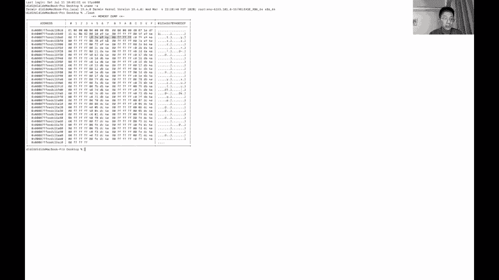
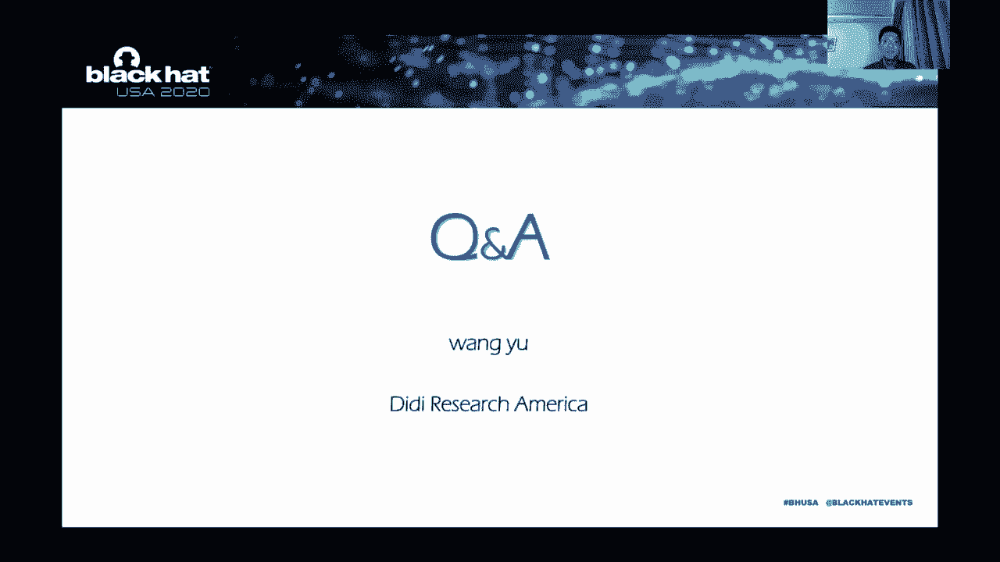

# P55：56 - 深入探索 Apple I/O80211FamilyV2 - 坤坤武特 - BV1g5411K7fe

## 概述

在本节课中，我们将深入探讨 Apple Wi-Fi 子系统，特别是 I/O80211FamilyV2 的架构和安全性挑战。

## 子系统架构

### I/O80211FamilyV2 简介

I/O80211FamilyV2 是 Apple Wi-Fi 子系统的一个核心组件，负责管理几乎所有 Wi-Fi 通信功能。它主要设计用于新一代基于移动设备的 Apple 设备之间的通信和数据共享。

### 版本比较

与上一代版本 1 相比，版本 2 在架构和功能上都有所改进。以下是两个版本的主要区别：

* **设计目标**：版本 1 主要支持 Apple AirPort 和相关设备，而版本 2 则针对移动设备。
* **架构变化**：版本 2 集成了原生的 AirPort Broadcom 驱动程序，并增加了更多功能和更合理的逻辑。
* **安全性**：新功能总是意味着新的攻击面，因此需要更加关注安全性。

## 安全性挑战

### 攻击面

Apple Wi-Fi 子系统存在多个攻击面，包括：

* **远程和本地固件到操作系统内核**：例如，通过处理事件数据包或固件陷阱。
* **用户模式到内核**：例如，通过设置扫描请求或机场宽带。
* **其他处理器和异常**：例如，AWD-L 协议、Skywalk 和路由处理数据包。

### 安全评估

为了评估 Wi-Fi 子系统的安全性，我们可以使用以下方法：

* **零信任**：假设所有输入都可能是危险的。
* **代码覆盖率分析**：使用 KIMUN 等工具分析闭源驱动程序的代码覆盖率。
* **模糊测试**：使用 KIMUN 等工具进行模糊测试，以发现潜在的安全漏洞。

## 漏洞案例

在本节课中，我们将介绍一些今年发现的 Wi-Fi 子系统漏洞案例，包括：

* **CVE-2020-9834**：堆溢出漏洞，由于输入结构中通道数量的错误检查导致。
* **CVE-2020-9835**：堆数据泄露漏洞，由于驱动程序锁中的缓冲区未初始化。
* **CVE-2020-9836**：堆数据泄露漏洞，由于改进的验证。
* **CVE-2020-9837**：堆数据泄露漏洞，仅影响版本 1。

## 总结

在本节课中，我们一起学习了 Apple Wi-Fi 子系统，特别是 I/O80211FamilyV2 的架构和安全性挑战。我们探讨了攻击面、安全评估方法和漏洞案例。希望这些内容能帮助您更好地了解 Apple Wi-Fi 子系统的安全性。