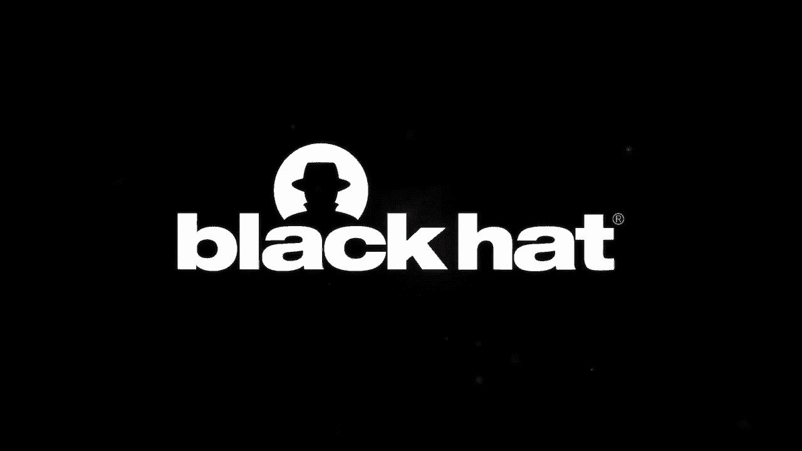
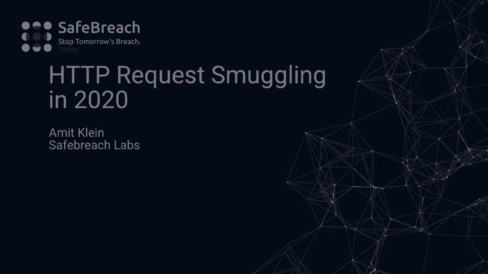
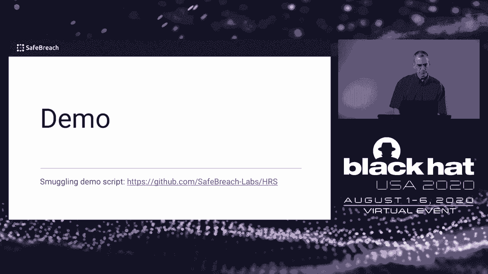
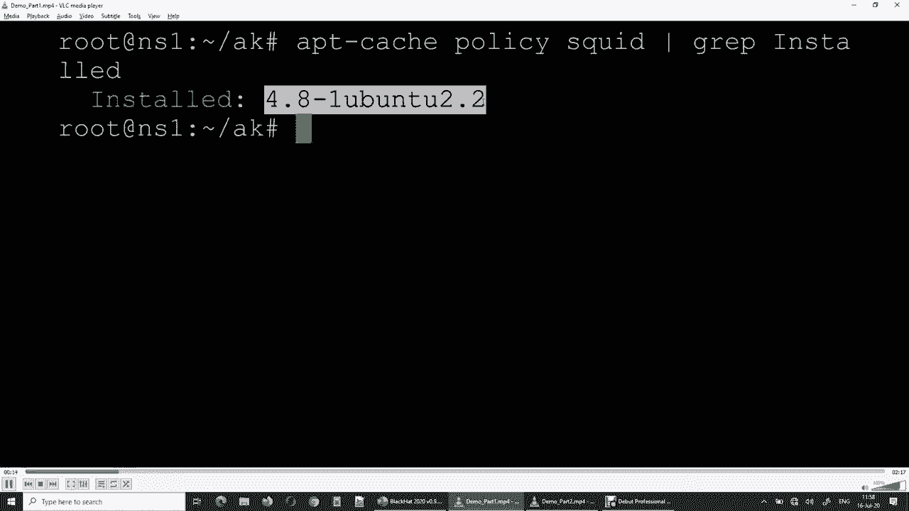
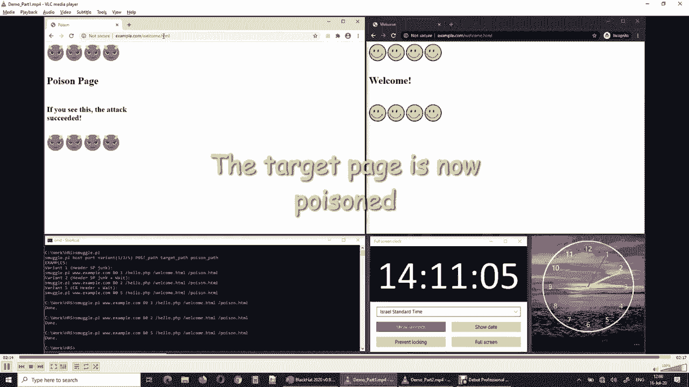
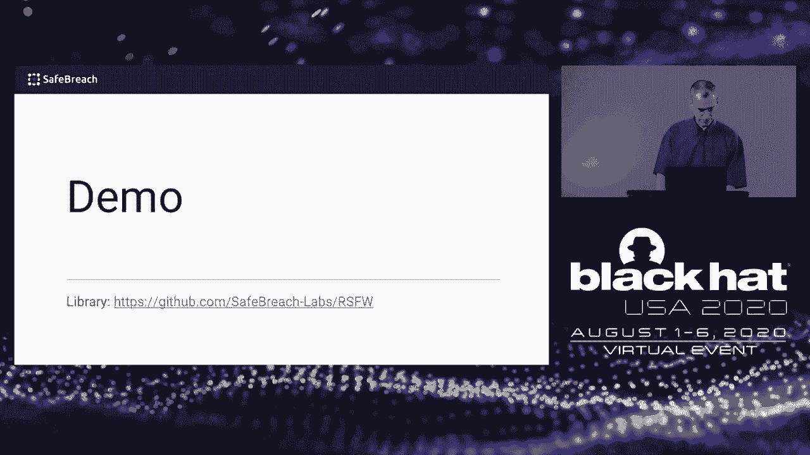
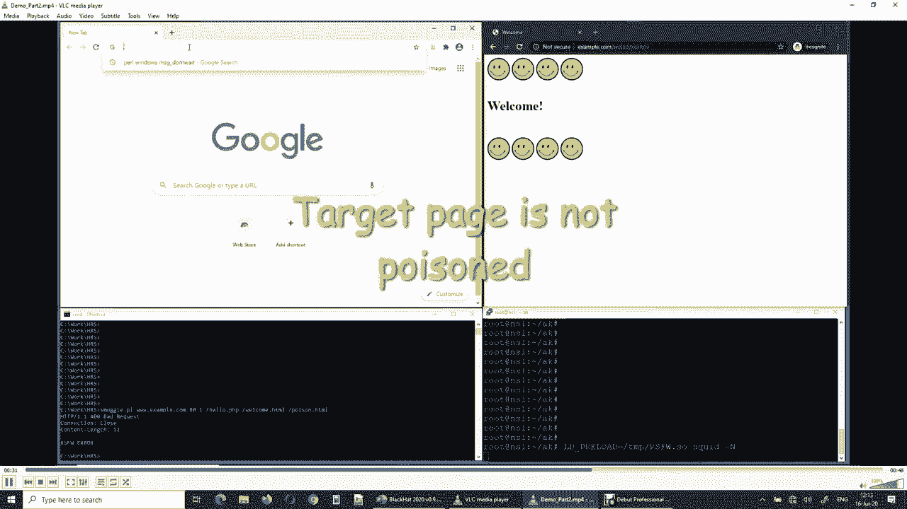
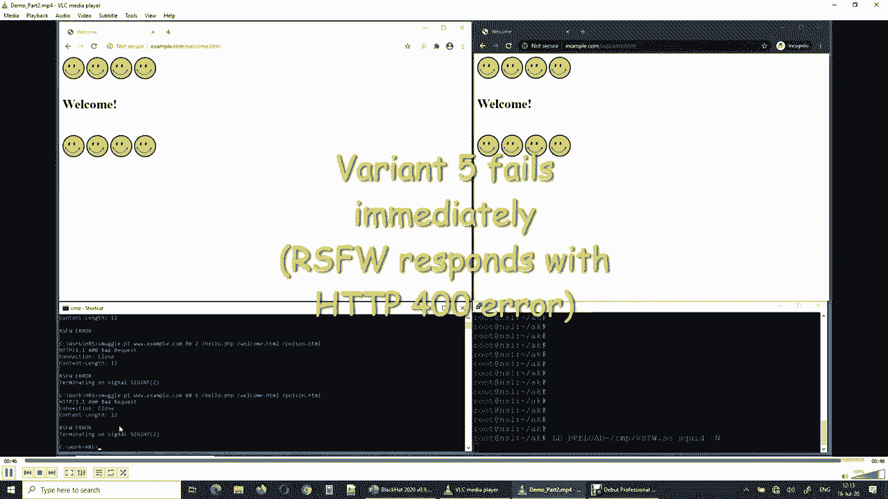

# P56：57 - 2020年HTTP请求走私：新变体、新防御和新挑战 🧐

## 概述

在本节课中，我们将学习2020年HTTP请求走私的新变体、新防御和新挑战。HTTP请求走私是一种攻击，涉及三个参与者：攻击者、代理或防火墙以及Web服务器。

## HTTP请求走私攻击

### 攻击参与者

* **攻击者**： 实际上是一个客户端。
* **代理或防火墙**： 介于攻击者和Web服务器之间。
* **Web服务器**： 最终接收请求的服务器。

### 攻击过程

1. 攻击者连接到代理，并通过端口发送HTTP流，该流由三个部分组成：A、B和C。
2. 代理将A和B视为第一个请求，将C视为第二个请求，并将它们转发到Web服务器。
3. Web服务器将A、B和C视为一个请求，并响应A和BC。
4. 代理缓存AB的响应，并缓存BC的响应。

### 攻击结果

* **Web缓存中毒**： 代理缓存了Web服务器为BC生成的响应，导致Web缓存中毒。

## HTTP请求走私变体

以下是几种常见的HTTP请求走私变体：

1. **内容长度头后跟空格或换行符**： 例如，`Content-Length: 20` 后跟空格和垃圾数据。
2. **部分请求**： Web服务器可以处理部分请求，即使完整的请求体尚未接收。
3. **ModSecurity + CRS绕过**： ModSecurity + CRS可以提供基本的保护，但存在绕过方法。
4. **零字节包装**： Squid忽略以回车符开头的内容长度头。
5. **内容类型为text/plain**： ModSecurity + CRS将内容规则设置为忽略整个请求体。

## 防御措施

以下是一些防御HTTP请求走私的措施：

1. **严格验证HTTP请求**： 对请求行、头部和请求体进行严格验证。
2. **使用Web应用防火墙**： 使用专门针对HTTP请求走私的Web应用防火墙。
3. **开发轻量级解决方案**： 开发专门针对HTTP请求走私的轻量级解决方案。

## 总结

在本节课中，我们一起学习了2020年HTTP请求走私的新变体、新防御和新挑战。HTTP请求走私仍然是一个严重的安全问题，需要采取适当的防御措施来保护Web应用程序。