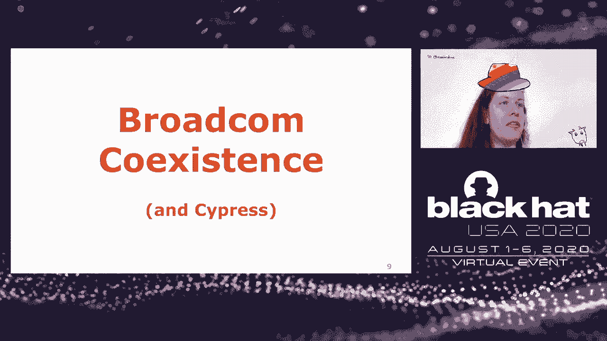
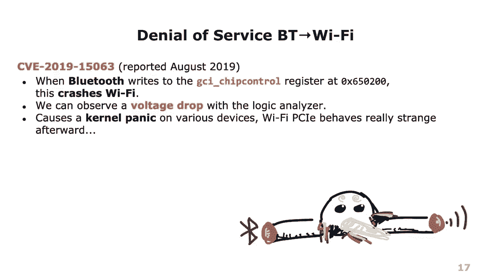
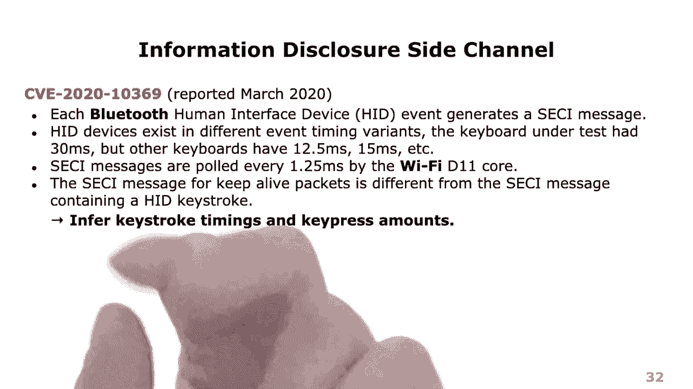
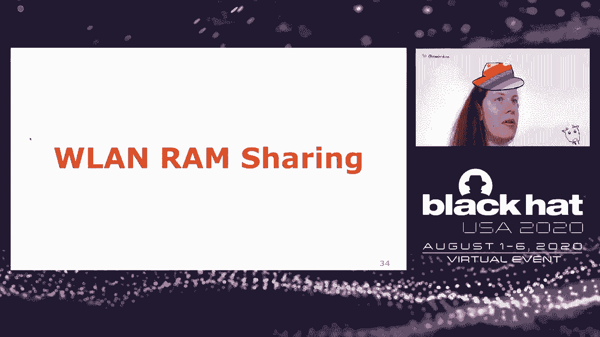
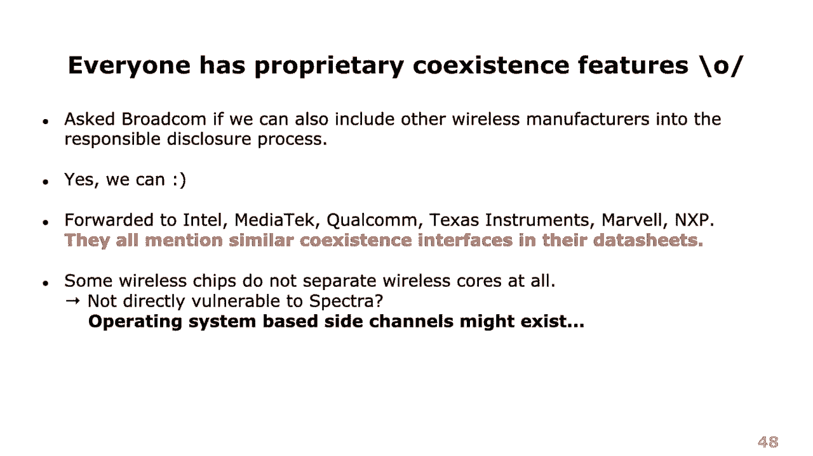

# P58：59 - Spectra - 突破无线芯片之间的隔离 - 坤坤武特 - BV1g5411K7fe

大家好，欢迎来到OITalk Spectra，突破无线芯片之间的隔离。

这是一个我和Francesco一起研究的话题，Francesco是Wi-Fi和其他无线技术的专家，而我主要研究的是蓝牙。在这场演讲中，我们将结合我们的能力，实践不同无线芯片之间的隔离。我先从动机说起。不久前，我在一个综合芯片中找到了一个部分RCE，然后后来我的一个学生Jan构建了Frank Nstein，他用这个工具实际上在综合芯片中发现了更多的完整RCE。现在这是一个很酷的事情，我说：“嘿，让我带着我的独角兽去环游世界，告诉每个人，‘是的，我们有蓝牙RCE，蓝牙不安全，等等。’”，然后人们说：“是的，但你知道蓝牙，它已经发展了22年，是昂贵的迭代开发，而且它几乎像魔法一样不可区分。是的，我们知道它不安全，我们就这样接受了它。”，实际上，正因为如此，我们尽可能地沙盒化蓝牙。你知道它实际上只是与UI连接，它不使用PCI Express，而且你也能用蓝牙RCE弹出kayak吗？所以，是的，人们说：“你知道，你有一个蓝牙RCE，但真正酷的是如果你有一个Wi-Fi RCE。现在一个选项当然是将模糊器和我们拥有的所有东西移植到Wi-Fi，然后再做同样的事情。但实际上，Wi-Fi RCE已经在过去被不同的技术发现，所以这不会是新的东西，而且有点无聊。然后我想，‘是的，也许我们可以做另一件事，那就是实际上打破芯片隔离。’。也就是说，我有一个蓝牙RCE，我能攻击Wi-Fi吗？或者甚至LTE，而不是一直升到操作系统？所以我打电话给Francesco说，‘是的，你知道，让我们构建一个叫做Speculator，Transmission的东西。’，这就是最初的攻击。

**名称或想法**：因为Wi-Fi、蓝牙和LTE，它们都在2.4 GHz频谱中共享频率，即使它们不共享相同的频率，它们仍然有谐波会相互干扰等等。在现代智能手机中，所有东西都是按照这种形式构建的，因此你需要 somehow仲裁信道访问。嗯，这实际上是一种性能优化，因为它们在传输期间共享频谱，它们需要 somehow告诉对方，“我现在正在使用这个频率，我现在正在发送数据包，因为它们不能同时进行，否则会导致干扰。”，这也被称为共存机制，想法是利用这个作为侧信道，例如，在Wi-Fi或蓝牙中投机地发送数据包，然后告诉另一个正在做什么。最后它变得有点宽泛，所以我现在更倾向于称之为通过频谱传输，但不管怎样。总体攻击模型是，攻击者有代码执行权限，我们在蓝牙中有，在这种情况下，我们使用我们用来发现漏洞的技术，然后利用这个前提条件以某种方式攻击其他无线核心。虽然这是一个相当强的前提条件，但它也是一个相当强大的攻击原语，因为这些芯片有硬连接，这些连接可以在不通过操作系统检查的情况下使用。所以为了展示这一点，这里是一个现代iPhone的示例。在那里，你可以看到蓝牙芯片正在运行，Wi-Fi芯片正在运行，它们在独立的ARM核心上运行，一个是Cortex M3或M4，另一个是Cortex R4，例如。它们有一个接口在这里，串行增强共存接口，这是两个之间的高带宽连接，然后在这个蓝牙Wi-Fi组合芯片中，还有一个连接到RT芯片的连接，它是MWS移动无线标准。现在我们在这个上面得到了一些新的攻击路径。例如，攻击者可以从蓝牙核心开始，然后从那里的RC提升到Wi-Fi核心，然后一直升到操作系统，我们有我们知道的传统的攻击，比如进入操作系统，或者我们也可以有知道蓝牙和Wi-Fi帧之间的定时是某种硬编码的而不是随机的应用程序，也许它们也可以使用这个硬编码的定时来提升中间的某些东西，并推断一些信息。影响可能因芯片和共存实现的差异而有所不同，所以明显的一个是服务中断，也就是说，我必须传输并阻止其他或通过发送数据包的元信息来泄露一些信息，这些信息可能包括发送数据包的定时，也许如果实现真的很糟糕，攻击者可能会获得代码执行权限。

**攻击名称**：由于在互联网上很难找到，所以有点复杂，因为Bactra已经是一个词，所以你可能也会坚持使用这个备选名称。

**攻击示例**：以下是使用逻辑分析仪的示例，它有点加速，因为实际上需要一分钟。在左侧，你可以看到我写入偏移量400的寄存器，在右侧，你可以看到Wi-Fi立即停止工作，ping停止，然后稍后重新启动。这是在最新的macOS Catalina上，芯片是在2019-2020型号中。