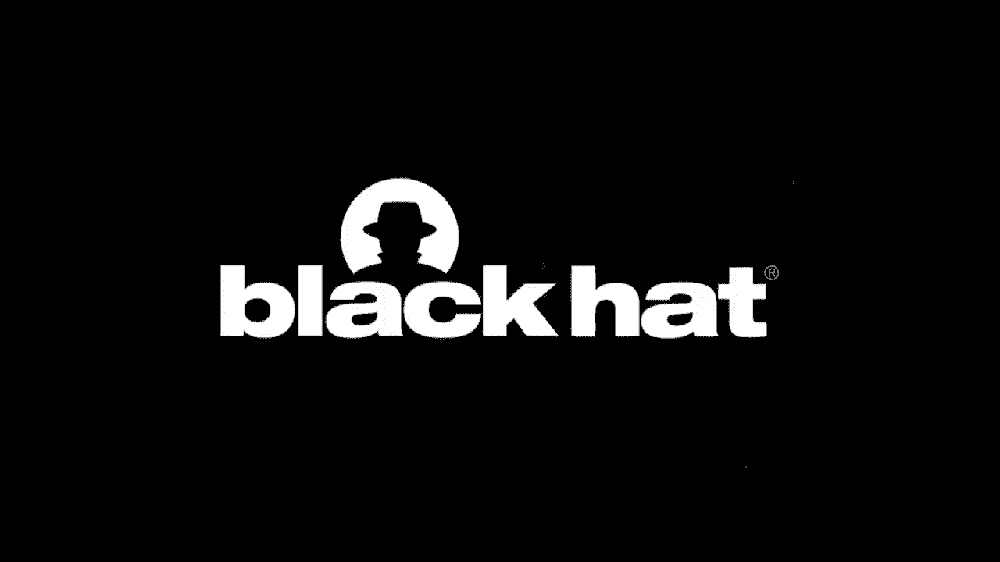
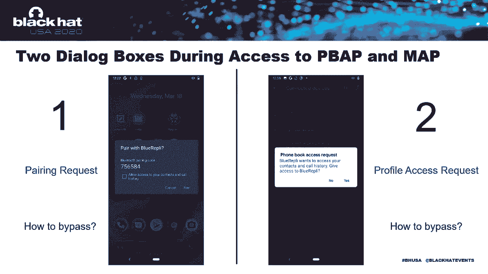
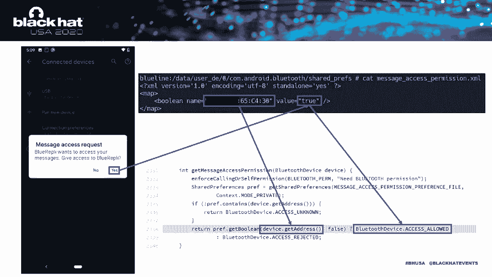
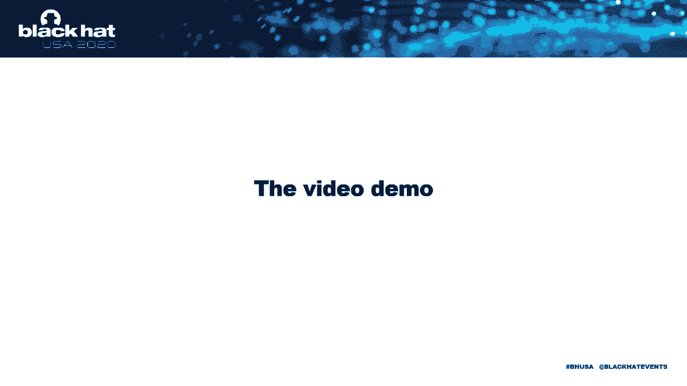
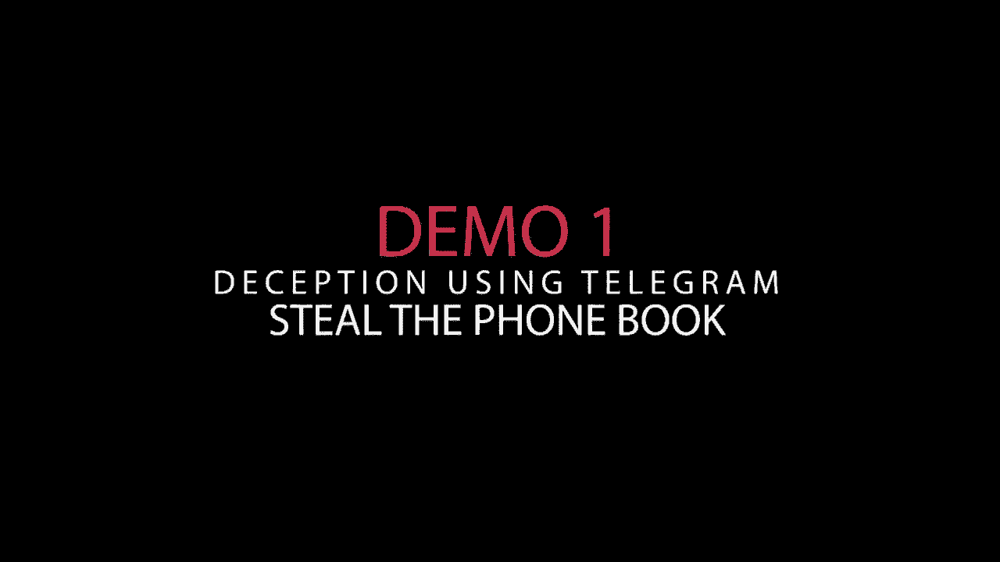
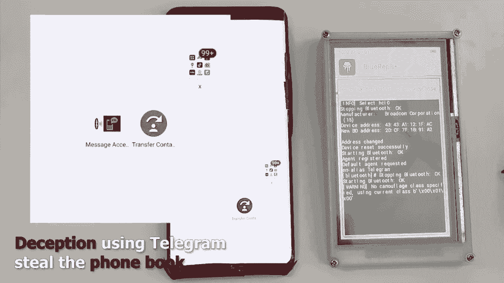
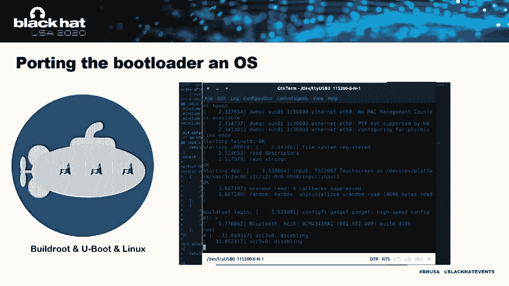
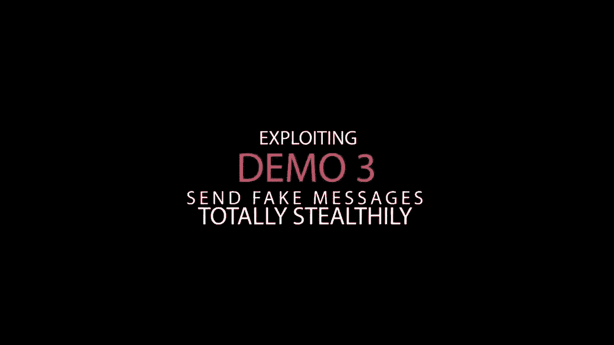
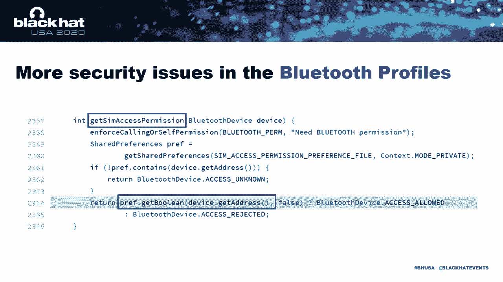

# P59：60 - 静默访问安卓手机 - 绕过蓝牙认证 - 坤坤武特 - BV1g5411K7fe

[音乐]

大家好。感谢大家的参与。我们在这里非常兴奋，这是我们在Black Hat的第一次演讲。

在与老板快速讨论后，他说：“也许你可以尝试参加Black Hat。”现在。

这实际上发生了，能在这里和大家分享感到非常荣幸。以下是一些说明。

我是Sosia Oshu，来自DBA，Security Head Live的物联网安全研究员。

我非常愿意为像P-WAP-LUZ和P-WAP-GAT这样的开源项目做出贡献。

还在Blue Scan项目上，一个强大的蓝牙智能收集器。

希望你们会尝试它，我迅速发现了这个漏洞。这是我的搭档，Xinxin。你好。

我是Xinxin。这个名字在英语中听起来更有用，但中文的意思是自信。

我在这个项目中担任硬件开发工程师，并将我的部分工作贡献给了开源社区。Blue rapidly是一个惊人的发现。

我的搭档将解释如何发现它以及它是如何工作的。所以，实际上。

静默访问安卓手机可能对我们每个人都会发生。

因为我们很难弄清楚应用程序背后在做什么。例如。

今年6月，中国权威媒体CCTV揭露了一些令人震惊的Android应用程序的越界混乱。

那就是一些知名应用程序在短时间内频繁启动。

然后访问用户文件和读取电话簿。显然，这是可怕的。正如你所看到的。

这些越界版本，如读取电话簿，都是基于已安装的应用程序。所以。

我们会变得更糟。例如，如果应用程序事先没有安装。

攻击者根本不接触手机，电话簿、短信等仍然会被传递。我试图从安卓手机的无线系统开始，比如Wi-Fi。

移动网络，NFC。最后，蓝牙压力到配置文件。TBAT。

电话簿访问配置文件，我是A。T。消息访问配置文件。正如他们的名字所说。

这两个配置文件为已删除的蓝牙设备提供服务。

删除本地电话簿和短信。让我们看看是否需要这两个配置文件可以实现我们的目标。

让我简要介绍一下蓝牙配置文件。那么，什么是蓝牙配置文件？

蓝牙有许多应用场景，其中大多数都是简单的小功能。

例如，电话簿同步，短信同步。

有几种方法可以实现这些功能，但为了允许来自不同制造商的设备在不同应用场景中协同工作。

我们需要一个规范。这些规范被称为蓝牙配置文件。例如。

PBAP用于同步电话簿，IAP用于操作短信。更详细地说。

PBAP防御工具角色，PIC和PCE。提供电话簿的设备是PIC。

例如，安卓手机，需要电话簿的设备是PCE，如蓝牙耳机。

智能可穿戴设备和汽车电脑。IAP还定义了两个角色，MSE和MSE。

类似于PSE和PCE，但用于短信。此外，具有强大功能的设备。

例如，安卓手机，可以同时充当服务器或客户端。

这是关于安卓手机实现的蓝牙配置文件的研究。坏蓝牙。

去年发现的。想法是成为一个恶意蓝牙设备。首先。

使用激励配置文件连接目标手机。然后，在适当的时候。

我们切换到高权限配置文件以接管目标手机。例如，首先。

讨论作为无害的蓝牙耳机。使用免提配置文件连接到目标手机。然后。

我们使用HRAE配置文件转换为蓝牙线。所以，控制目标手机。

坏蓝牙攻击模型需要一个预先安装的恶意应用程序。

因为PBAP和MAP的攻击模型方向相反。

它无法达到我想要的效果。因此，在没有安装恶意应用程序的情况下。

获取电话簿和短信，并使目标手机完全无反应。那么，预安装可以做什么？

对于几乎所有安卓手机，它仍然可以通过切换与通话记录和短信进行交互。

另一个攻击者可以使这种交互非常具有欺骗性。对于一家知名制造商。

可能不止一家，它可以实现相同的功能，但完全隐秘。

它还可以使用目标手机向其他人发送假消息。好的，让我们深入了解。

对于正常使用，我们将访问远程手机的PBAP或MAP。它将弹出两个对话框。

第一个对话框是父请求。在用户同意配对后。

安卓手机将弹出PBAP或MAP访问请求对话框。

当两个请求都得到用户的批准时，我们可以访问PBAP和MAP。因此。

使用PBAP和MAP窃取电话簿和短信。

本质上是要绕过这两个对话框。让我们首先谈谈父请求。

父请求在哪里弹出？第一个原因是我们没有有效的链接密钥。

在我们连接到手机后，由于没有有效的链接密钥，安全简单父级，SSP。

需要根据协议规范执行。一旦SSP完成。

链接密钥将在两个设备之间共享。它将被用于后续的连接认证和流量加密。

另一个原因是安卓手机的默认L能力显示是/否。此外。

根据蓝牙规范，两端设备应使用LAMRIIC比较。

作为认证方法。也就是说，两端设备应显示六个数字供用户比较和验证。

那么，当六个数字出现时，父请求会弹出。然而。

蓝牙规范还定义了其他认证方法。

如输入密码或即插即用。如果我们使用即插即用怎么办？

为了使用即插即用。

我们需要讨论我们的I/O能力，没有输入，没有输出。这可以通过BT代理实现。

在流量方面，从这种简单的是/否到没有输入，没有输出的转换。

可以直接使用RUSCHOCK。就像这样。然后你就没事了。

父请求对话框消失了。不。只剩下配置文件访问请求。

正如你所看到的，我们可以简单地假装成知名应用程序的名字。所以。

这个对话框将变得非常具有欺骗性。就像我们聊一次来访问你的联系人。

Skype想要访问你的联系人，或者10 grams想要访问你的消息。

在我们讨论如何绕过第二个对话框之前，有一点需要提及。

它将在以后变得很重要。没有输入，没有输出，即插即用。

然后即插即用调用AOSP使用临时绑定。

那么，配置文件访问请求为什么会弹出？

对于正常使用。

当我们请求访问已删除手机的PBAP或MAP时。

它将使用我们的蓝牙地址在shell首选项中检查，我们是否已经有了权限。

如果没有找到相应的记录，AOSP将弹出对话框。如果用户点击是。

或地址，并将权限记录在shell首选项中。因此。

下次我们请求权限时，对话框将不再弹出。

简单来说，这个权限验证机制的问题很明显。

那就是我们可以伪造蓝牙地址，只需使用蓝牙即可实现它。但是有一个问题。

那就是前面提到的副作用。我们使用没有输入，没有输出来绕过第一个对话框。

这导致即插即用，反过来导致AOSP使用临时绑定。

然后临时绑定将长时间传递到上层系统蓝牙应用程序。

当设置蓝牙应用程序收到这个状态时。

它清除由蓝牙地址获得的权限。在这种情况下。

我们将无法继承权限。为了防止设置蓝牙应用程序清除权限。

我们可以类似地修复设备类，以及HIB指向设备。

根据左侧的条件语句。

BT绑定状态长不会传递到特定的蓝牙应用程序。

因此，权限不会被清除，我们可以成功继承权限。

到此为止，我们已经绕过了第二个对话框。

上述方法确实允许我们继承权限。

但还有一个问题。那就是AOSP也会从临时绑定变为持久绑定。

持久绑定不会自动接受配对请求。所以。

这两种绕过方法互斥。换句话说，如果我们绕过配对请求。

我们就无法绕过配置文件访问请求。或者如果我们绕过配置文件访问请求。

我们就无法绕过配对请求。这非常令人沮丧。

但既然结果很好，对于知名和未知的制造商。

可能不止一家，他们还没有成功绕过将BT绑定状态长传递到特定的蓝牙应用程序。

所以，我们想要的权限将不会被清除。

这使得目标永远不会感觉到攻击。同时。

媒体报道称，使用客户安卓系统的设备在3月份达到了1亿台。

所以，这就是Blue Rabbit的全貌。

由于Blue Rabbit非常适合近距离攻击。

最好有一个基于协议的硬件工具而不是命令行工具。接下来。

我将把麦克风交给Xinxin。在这里，我们将介绍硬件工具。是的。

Blue Rabbit是一个美好的发现。我们相信它对便携式设备的效果会更好。

我们试图在便携式设备上运行Blue Rabbit以验证实战能力。一般来说。

我们将使用树莓派来实现这个目标。但在这个项目中。

树莓派确实有一些缺点。与基于树莓派的设计相比。

我选择了一个更具挑战性的解决方案，为它设计了一个全新的硬件平台。如果我们这样做。

设备应该具有以下功能。

有足够的ROM和RAM来运行Linux内核和Python解释器。

具有可修改的蓝牙无线电基带，可以添加到电池供电的操作环境。

具有易于使用的HTML地图。此外，它应该足够小。

基于这些需求。

我们需要选择一个CPU，一个蓝牙空间带，以及一些必要的、实用的设备。

偶然间。

我发现了一个非常令人惊讶的形状。它被称为Winner S3，这是一个高度集成的形状解决方案。

将基于单核Cortex-A7的SoC与108 MB DDR3 RAM集成在一个小BGA封装中。

这种形状将简化携带硬件设计，集成DDR的携带硬件创造者也将使最终产品更小。

最重要的是，它具有运行Linux内核的能力。

无线电基带使用单独的BCM 43438，这是一个Wi-Fi和蓝牙2合1的形状。

支持NxM和内部蓝牙。这两个令人惊叹的项目使芯片能够操作物理层数据。

这意味着它适合这个项目。Magdizan还等于一个电源管理芯片和一个eMMC存储芯片。

用于Lion，电池和数据存储。但如何将它们结合起来？

使用这个？不，不，不，不。

这行不通。我们需要EDA工具。硬件调试工作更复杂，耗时更长。

每个版本的设计都需要两周的时间才能从PCB原型制造中获得样品。

最糟糕的是，我发布了六个版本的这种神奇布局。

但最终。

我设法将一个2.5x5cm的PCB整合进去。拥有一个工作板只是第一步。

它没有锯子。

锯子是软件。由于某些原因，Winner没有公开发布其芯片的BSP包。

如果我们想使用它，我们需要签署一些NDA合同，这让我感到烦恼。

我们是安全研究员，我们，这样想，我下载了内核源代码。

以及一些链接到电池的链接，并打开了decongular。

我编写了一些必要的驱动程序并修复了一些开源驱动程序的错误。

包括显示驱动程序，LCD控制器，蓝牙，非音乐中断控制器。

最后。

我将U-boot移植到其0.04和Linux长期5.3。

到目前为止。

我们有一个操作系统，我们的可移植性研究员在哪里都熟悉。

感谢开源社区，上面提到的所有驱动程序都已发布在Magidhar。

构建路由简化了交叉比较必要包的任务。不久。

一个路由失败，生成了一个与原始POC运行环境不兼容的兼容性路由。

现在是时候关注POC本身了。我们需要一个基于UI的任务屏幕。

没有这样的芯片可以运行一个重XOR服务器，或者传统的D。

QT嵌入式是商业许可，所以这不是最佳选择。最后，我遇到了LVGL。

LVGL的演示真的很酷。你是唯一的一个，我认为。

但我没想到一个仰慕者会是一个人。对于一个没有自动的GUI框架。

所见即所得的编辑器。开发过程充满了恐慌。

这里有一些使用它的代码行。但幸运的是，它变成了现实。

我们为它做了一个完整的盒子。它不是很漂亮，但它是有效的。

我们的PLA打印机完成了这项工作。

这里是我是如何做到的。还有展示和螺丝钻。

这里是Blue Rabbit与您的便携式设备一起工作的视频。

您可以在描述中看到链接。这个视频不是一个大视频。

您可以在描述中看到链接。我们有一个关于如何将新模型带到模型的视频。

您可以在描述中看到链接。您可以在描述中看到链接。

请订阅我们的频道。请订阅我们的频道。请订阅我们的频道。

请订阅我们的频道。请订阅我们的频道。请订阅我们的频道。

请订阅我们的频道。请订阅我们的频道。请订阅我们的频道。

请订阅我们的频道。请订阅我们的频道。请订阅我们的频道。

请订阅我们的频道。请订阅我们的频道。请订阅我们的频道。

请订阅我们的频道。请订阅我们的频道。请订阅我们的频道。

请订阅我们的频道。请订阅我们的频道。请订阅我们的频道。

请订阅我们的频道。请订阅我们的频道。请订阅我们的频道。

请订阅我们的频道。请订阅我们的频道。请订阅我们的频道。

请订阅我们的频道。请订阅我们的频道。请订阅我们的频道。

请订阅我们的频道。请订阅我们的频道。请订阅我们的频道。

请订阅我们的频道。请订阅我们的频道。请订阅我们的频道。

请订阅我们的频道。请订阅我们的频道。请订阅我们的频道。

请订阅我们的频道。请订阅我们的频道。请订阅我们的频道。

请订阅我们的频道。请订阅我们的频道。请订阅我们的频道。

请订阅我们的频道。请订阅我们的频道。请订阅我们的频道。

请订阅我们的频道。请订阅我们的频道。请订阅我们的频道。

请订阅我们的频道。请订阅我们的频道。请订阅我们的频道。

请订阅我们的频道。请订阅我们的频道。请订阅我们的频道。

请订阅我们的频道。请订阅我们的频道。请订阅我们的频道。

请订阅我们的频道。请订阅我们的频道。请订阅我们的频道。

请订阅我们的频道。请订阅我们的频道。请订阅我们的频道。

请订阅我们的频道。请订阅我们的频道。请订阅我们的频道。

请订阅我们的频道。请订阅我们的频道。请订阅我们的频道。

请订阅我们的频道。请订阅我们的频道。请订阅我们的频道。

请订阅我们的频道。请订阅我们的频道。请订阅我们的频道。

请订阅我们的频道。请订阅我们的频道。请订阅我们的频道。

请订阅我们的频道。请订阅我们的频道。请订阅我们的频道。

请订阅我们的频道。请订阅我们的频道。请订阅我们的频道。

请订阅我们的频道。请订阅我们的频道。请订阅我们的频道。

请订阅我们的频道。请订阅我们的频道。请订阅我们的频道。

请订阅我们的频道。请订阅我们的频道。请订阅我们的频道。

请订阅我们的频道。请订阅我们的频道。请订阅我们的频道。

请订阅我们的频道。请订阅我们的频道。请订阅我们的频道。

请订阅我们的频道。请订阅我们的频道。请订阅我们的频道。

请订阅我们的频道。请订阅我们的频道。请订阅我们的频道。

请订阅我们的频道。请订阅我们的频道。请订阅我们的频道。

请订阅我们的频道。请订阅我们的频道。请订阅我们的频道。

请订阅我们的频道。请订阅我们的频道。请订阅我们的频道。

请订阅我们的频道。请订阅我们的频道。请订阅我们的频道。

请订阅我们的频道。请订阅我们的频道。请订阅我们的频道。

请订阅我们的频道。请订阅我们的频道。请订阅我们的频道。

请订阅我们的频道。请订阅我们的频道。请订阅我们的频道。

请订阅我们的频道。请订阅我们的频道。请订阅我们的频道。

请订阅我们的频道。请订阅我们的频道。请订阅我们的频道。

请订阅我们的频道。请订阅我们的频道。请订阅我们的频道。

请订阅我们的频道。请订阅我们的频道。请订阅我们的频道。

请订阅我们的频道。请订阅我们的频道。请订阅我们的频道。

请订阅我们的频道。请订阅我们的频道。请订阅我们的频道。

请订阅我们的频道。请订阅我们的频道。请订阅我们的频道。

请订阅我们的频道。请订阅我们的频道。请订阅我们的频道。

请订阅我们的频道。请订阅我们的频道。请订阅我们的频道。

请订阅我们的频道。请订阅我们的频道。请订阅我们的频道。

请订阅我们的频道。请订阅我们的频道。请订阅我们的频道。

请订阅我们的频道。请订阅我们的频道。请订阅我们的频道。

请订阅我们的频道。请订阅我们的频道。请订阅我们的频道。

请订阅我们的频道。请订阅我们的频道。请订阅我们的频道。

请订阅我们的频道。请订阅我们的频道。请订阅我们的频道。

请订阅我们的频道。请订阅我们的频道。请订阅我们的频道。

请订阅我们的频道。请订阅我们的频道。请订阅我们的频道。

请订阅我们的频道。请订阅我们的频道。请订阅我们的频道。

请订阅我们的频道。请订阅我们的频道。请订阅我们的频道。

请订阅我们的频道。请订阅我们的频道。请订阅我们的频道。

请订阅我们的频道。请订阅我们的频道。请订阅我们的频道。

请订阅我们的频道。请订阅我们的频道。请订阅我们的频道。

请订阅我们的频道。请订阅我们的频道。请订阅我们的频道。

请订阅我们的频道。请订阅我们的频道。请订阅我们的频道。

请订阅我们的频道。请订阅我们的频道。请订阅我们的频道。

请订阅我们的频道。请订阅我们的频道。请订阅我们的频道。

请订阅我们的频道。请订阅我们的频道。请订阅我们的频道。

请订阅我们的频道。请订阅我们的频道。请订阅我们的频道。

请订阅我们的频道。请订阅我们的频道。请订阅我们的频道。

请订阅我们的频道。请订阅我们的频道。请订阅我们的频道。

请订阅我们的频道。请订阅我们的频道。请订阅我们的频道。

请订阅我们的频道。请订阅我们的频道。请订阅我们的频道。

请订阅我们的频道。请订阅我们的频道。请订阅我们的频道。

请订阅我们的频道。请订阅我们的频道。请订阅我们的频道。

请订阅我们的频道。请订阅我们的频道。请订阅我们的频道。

请订阅我们的频道。请订阅我们的频道。请订阅我们的频道。

请订阅我们的频道。请订阅我们的频道。请订阅我们的频道。

请订阅我们的频道。请订阅我们的频道。请订阅我们的频道。

请订阅我们的频道。请订阅我们的频道。请订阅我们的频道。

请订阅我们的频道。请订阅我们的频道。请订阅我们的频道。

请订阅我们的频道。请订阅我们的频道。请订阅我们的频道。

请订阅我们的频道。请订阅我们的频道。请订阅我们的频道。

请订阅我们的频道。请订阅我们的频道。请订阅我们的频道。

请订阅我们的频道。请订阅我们的频道。请订阅我们的频道。

请订阅我们的频道。请订阅我们的频道。请订阅我们的频道。

请订阅我们的频道。请订阅我们的频道。请订阅我们的频道。

请订阅我们的频道。请订阅我们的频道。请订阅我们的频道。

请订阅我们的频道。请订阅我们的频道。请订阅我们的频道。

请订阅我们的频道。请订阅我们的频道。请订阅我们的频道。

请订阅我们的频道。请订阅我们的频道。请订阅我们的频道。

请订阅我们的频道。请订阅我们的频道。请订阅我们的频道。

请订阅我们的频道。请订阅我们的频道。请订阅我们的频道。

请订阅我们的频道。请订阅我们的频道。请订阅我们的频道。

请订阅我们的频道。请订阅我们的频道。请订阅我们的频道。

请订阅我们的频道。请订阅我们的频道。请订阅我们的频道。

请订阅我们的频道。请订阅我们的频道。请订阅我们的频道。

请订阅我们的频道。请订阅我们的频道。请订阅我们的频道。

请订阅我们的频道。请订阅我们的频道。请订阅我们的频道