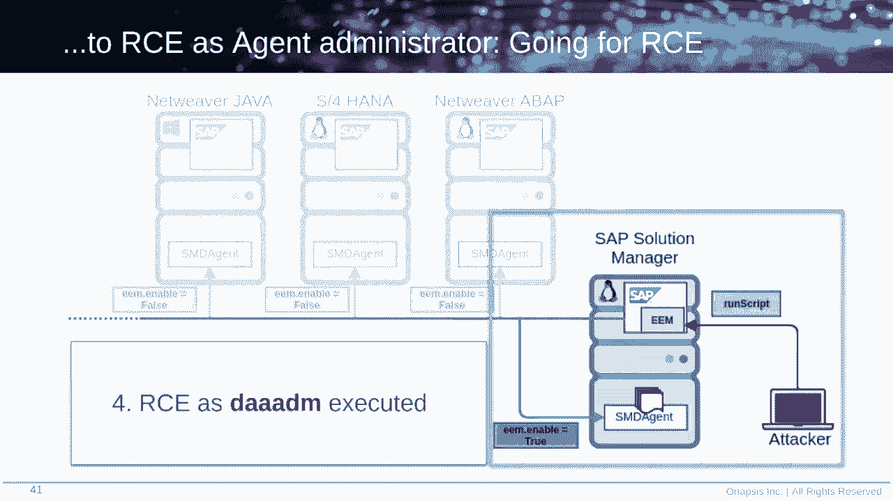
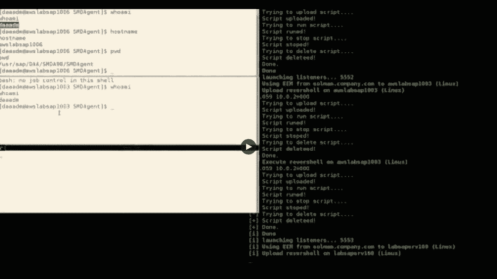
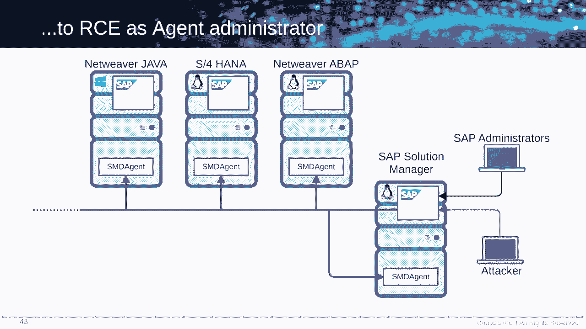
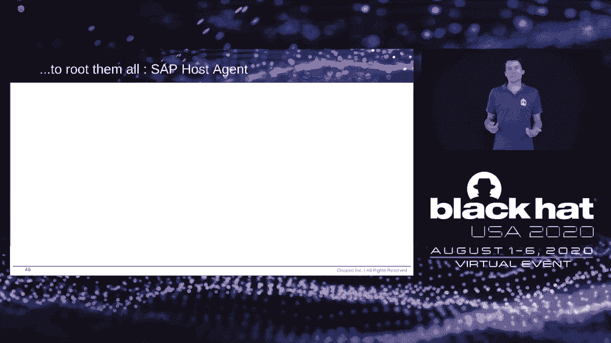
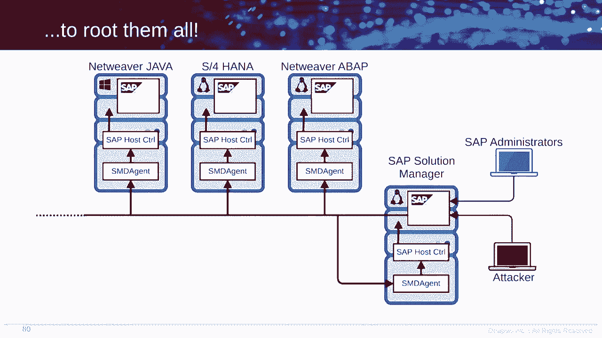
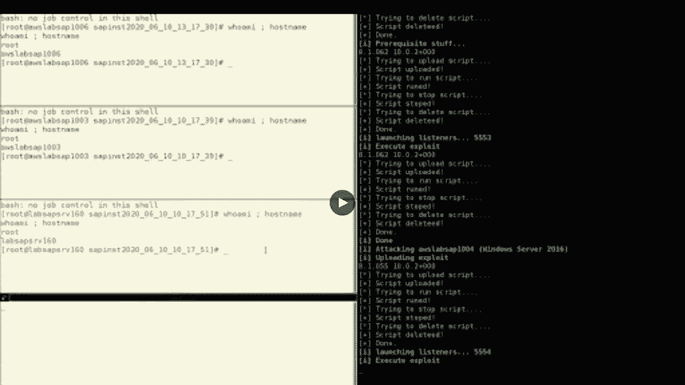
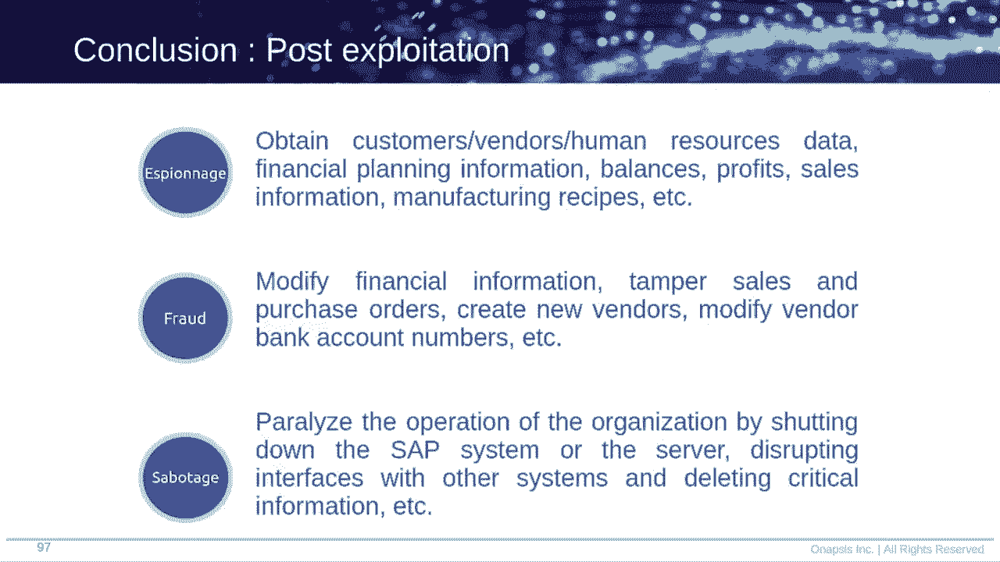
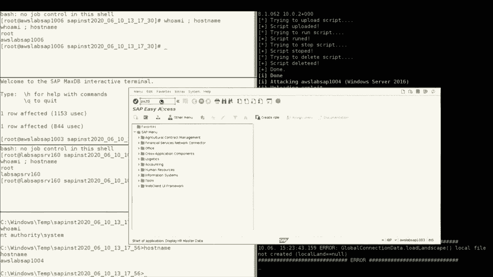
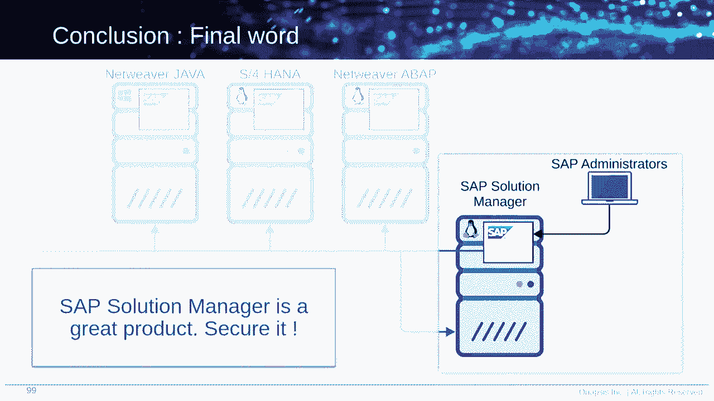

# P60：61 - An Unauthenticated Journey to Root - Pwning Your Company's Enterprise Software - 坤坤武特 - BV1g5411K7fe

## 概述

在本节课中，我们将学习如何攻击企业软件服务，特别是SAP系统，以获取root访问权限。我们将深入了解SAP Solution Manager的漏洞，并学习如何利用这些漏洞进行攻击。

## SAP简介

SAP是全球最大的企业软件供应商之一，其产品被广泛应用于全球各地的企业。SAP系统处理着全球77%的交易收入，并且所有财富500强公司都在使用SAP进行日常业务。

## SAP Solution Manager

SAP Solution Manager是一个技术SAP系统，用于管理整个SAP系统环境。它类似于Microsoft的域控制器，是SAP系统环境中的核心组件。

## EM应用程序

EM（End-User Experience Monitoring）应用程序允许SAP管理员创建脚本模拟用户操作。攻击者可以利用EM应用程序的未授权访问漏洞来执行远程代码执行。

## 攻击步骤

1. **收集信息**：攻击者收集SMD代理的信息。
2. **启用EM功能**：攻击者修改EM启用属性，将其设置为true。
3. **上传脚本**：攻击者上传包含远程代码执行的脚本。
4. **执行脚本**：SMD代理执行脚本，攻击者获得root权限。

## 支持代理

支持代理是一个SAP主机上的组件，用于提供实时SQL任务。攻击者可以利用支持代理的漏洞来执行任意操作系统命令，包括root命令。

## 防护措施

1. **为EM应用程序添加身份验证**。
2. **安装SAP发布的补丁**。
3. **限制对Solution Manager的访问**。
4. **更新SAP系统版本**。
5. **监控日志文件**。

## 总结

在本节课中，我们学习了如何攻击SAP系统以获取root访问权限。我们了解了SAP Solution Manager和支持代理的漏洞，并学习了如何利用这些漏洞进行攻击。我们还讨论了防护措施，以帮助您保护您的SAP系统免受攻击。