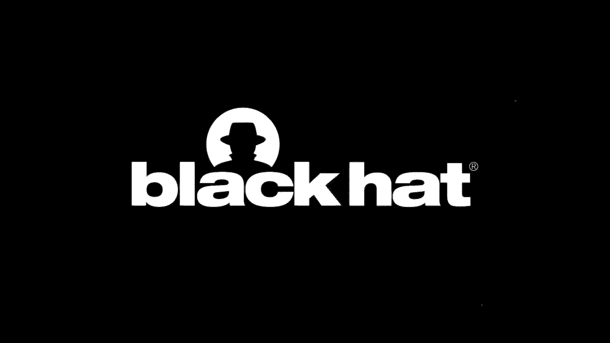
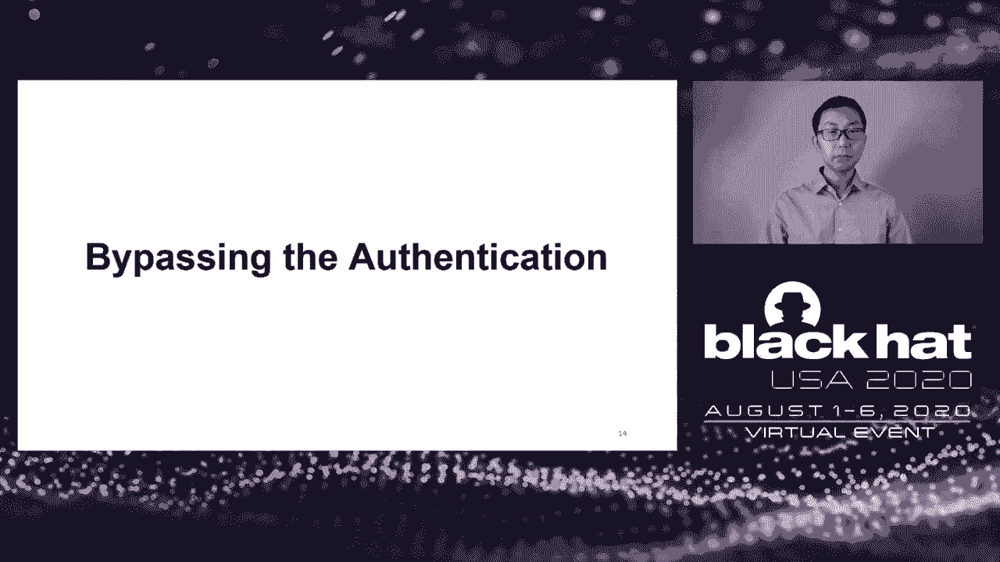

# P61：62 - You have No Idea Who Sent that Email - 18 Attacks on Email Sender Authentic - 坤坤武特 - BV1g5411K7fe

## 概述

在本节课中，我们将学习电子邮件伪造攻击，特别是针对电子邮件发送者身份验证的18种攻击方法。

## 电子邮件伪造攻击

电子邮件是日常生活中广泛使用的通信方式，也是各种攻击的常用攻击向量。近年来，我们看到了许多使用电子邮件伪造和钓鱼攻击来破坏企业网络或政府官员账户的攻击。

为了解决这个问题，现代电子邮件服务和网站部署了发送者身份验证协议，如SPF、DKM和DMARC，以防止电子邮件伪造。

## 发送者身份验证

为了理解本节课的内容，我们需要了解电子邮件协议中的两个重要概念：发送者和身份验证。

### 发送者

在电子邮件中，发送者通常指的是消息的作者。然而，我们通常看到的发件人地址只代表消息的作者。还有一个不可见的部分，称为SMTP信封，它代表传输消息的用户。

### 身份验证

电子邮件协议最初设计时，身份验证机制较弱。任何人都可以在hello、mail-from或from字段中声称另一个地址。为了解决这个问题，提出了各种电子邮件身份验证机制，如SPF、DKM和DMARC。

## SPF、DKM和DMARC

### SPF

SPF使用IP地址来验证发送者。它的工作分为三个步骤：

1. 发送服务发布DNS记录，指定哪些服务器IP地址可以发送该域的电子邮件。
2. 接收服务获取hello和mail-from字段中的域，以获取IP列表。
3. 接收服务检查发送者的IP是否与获取的IP列表匹配。如果匹配，则SPF通过。

### DKM

DKM使用公钥加密来验证发送者。它的工作分为四个步骤：

1. 发送服务在DNS记录中发布其公钥。
2. 发送服务使用相应的私钥对消息进行签名，以生成DKM签名头并将其附加到消息中。
3. 接收服务获取S.domainkey.d以获取公钥。
4. 接收服务使用获取的公钥验证DKM签名。如果签名有效，则电子邮件通过DKM身份验证。

### DMARC

DMARC旨在解决SPF和DKM中的对齐问题。它要求发送服务在发布DMARC策略时执行标识符对齐测试，以检查from头域是否与SPF或DKM验证的域匹配。

## 攻击方法

我们已经发现了18种攻击方法来绕过身份验证。

### UAM不匹配攻击

这种攻击利用了接收服务识别攻击者标识符进行验证，而邮件用户代理（MUA）则选择SPF标识符并显示给收件人的不一致性。

### 域名共享攻击

这种攻击利用了攻击者标识符和伪造标识符共享相同域的情况。

### 复杂格式攻击

这种攻击利用了电子邮件协议中标识符的复杂性和处理复杂性。

## 总结

本节课中，我们学习了电子邮件伪造攻击，特别是针对电子邮件发送者身份验证的18种攻击方法。我们讨论了SPF、DKM和DMARC等身份验证协议，并介绍了各种攻击方法。我们还讨论了电子邮件协议的复杂性以及如何简化协议以减少攻击的可能性。

希望这节课能帮助您更好地了解电子邮件伪造攻击及其防御方法。