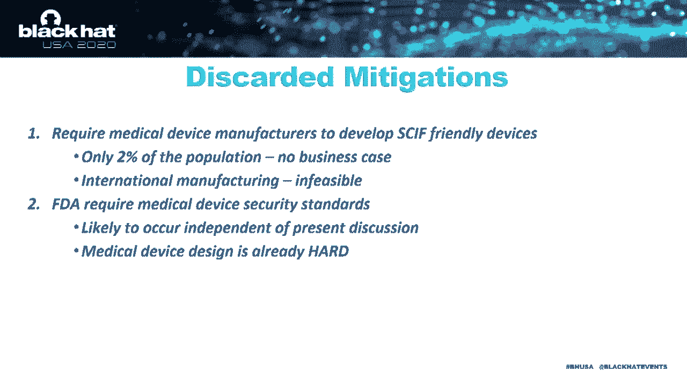

# P62：63 - Carrying our Insecurities with Us - The Risks of Implanted Medical Devices - 坤坤武特 - BV1g5411K7fe

 [MUSIC]。

 Hello everyone and welcome to a talk about unwitting insider threat。

 My name is Alan Michaels and I'm a researcher at， the Virginia Tech HUMS Center where we're helping train。

 the next generation of national security practitioners。

 This topic was a small portion of an 18-month undergraduate research effort we。

 called Skip of the Future where we work to evaluate the myriad technical， policy。

 social and political constraints of protecting information within a secure facility。

 Most of our work focused on threats where a malicious adversary could exploit a specific。

 vulnerability in the infrastructure， processes or people operating in a secure。

 compartmented information facility or SKIF to gain access to classified information。 Well。

 most of that is not appropriate to discuss here。 We did drill in on a specific niche question about implanted medical devices or IMDs。

 As an emerging class of PEDS， that's portable electronic devices in the facilities。

 So this presentation is really about answering the question of how we safely manage。

 and support our bionic man like Steve Austin here and permit his presence in a。

 SKIF without becoming an unwitting insider threat to national security。 Now。

 before we go much further， I would like to recognize the student team that worked， on this effort。

 So， Kudos， Zoe， Paul， Eric and Stephen。 I'd also like to acknowledge a journal paper we developed on this topic which was recently。

 published by the National Intelligence University。

 It's a more concise version of the white paper that accompanies this talk。 Finally。

 I'd like to throw out two caveats for the discussion going forward。

 First is that all of the data here is openly accessible。 So， no secrets。

 The second is that I am a wireless security guy。 So， when I talk about IMDs。

 please understand I'm not that type of doctor。 Okay。 Let's dive in。

 The motivation for our work can be boiled down to one figure where we consider the simultaneous effects。

 of an aging national security workforce that is fundamentally struggling to build and retain。

 the expertise needed to support the nation， as well as the rapid evolution of implant。

 and medical devices that are leveraging all the benefits of the connected Internet of things。 Now。

 looking at the national security workforce， we're talking about an older than average。

 cross-section of the population， which has undergone extensive background checks and。

 intends to have very specialized expertise。 Put it simply， I've got more than my share of gray hair。

 I'm still on the younger end of the spectrum for most defense workforces。 Now。

 looking at the implant and medical devices， we're finding that more than five million such devices。

 have been installed。 And they're helping improve the quality of life via better hearing。

 better mobility， or quite simply making life possible in the case of things like pacemakers。

 Fundamental concern for these devices that they are now connected to the outside world。

 using IoT communication protocols like Bluetooth。 Before we started this project。

 I never imagined I would see a wireless connection to help manage a hip implant。 It's just weird。

 Now， putting these observations together and making a small leap of faith of these -- the overlap of the statistics。

 we come up with an estimated 100，000 cleared people in the national security workforce that have an IMD。

 That's a sufficiently large population that it's hard to ignore the associated risks。

 arriving from policy exemptions。 So， let's start with IMDs that we understand the potential targets。

 We found a few dozen different types of IMDs， though I'll only highlight a handful to give you a flavor。

 First of all， I have to say， I am in awe of how small and capable some of these devices are。

 I remember as a college student sitting with my then-83 year old grandfather and playing out。

 Matlab-generated tones to tune a graphic equalizer for his audio system。 It worked great for him。

 but we found out that the resulting audio sounded like garbage to me。

 It was also a mismatch for grandma's hearing aids。 Well， now smart hearing aids。

 cochlear implants like the White X Evoke， they're incorporating cloud-based AI algorithms that collect feedback from population of users。

 and then roll it out with optimized corrections unique to each user。 Now， below it is Adam。

 This is a wearable health sensor that helps users monitor breathing patterns。

 and provides an early warning of potential asthma attacks。 While not implanted。

 these and the smart hearing aids are clearly items that improve quality of life for their users。

 Next one over is OpenAPS。 This is the work of an entire ecosystem of open source code developers supporting insulin pumps。

 No longer is this just a closed loop feedback on a single device like the one on top。

 but rather we have communication to real-time diagnostic units。

 enabling a user to modify their behaviors。 And next up is a subcutaneous implantable cardiac monitor。

 It detects all kinds of heart irregularities。 Has capability to alert the user via Bluetooth connection to a smartphone。

 or it also has the ability to do like an ET phone home capability。

 that directly pushes the results to the user's physician。 And while it is a wireless and below it。

 sorry， is a wirelessly connected pacemaker with similar capabilities。 Well。

 let's shift over to what makes a skiff a skiff。 Within ODNI。

 that's Office of the Director of National Intelligence。

 there is a 174 page specification that defines a construction and security guidelines for a skiff。

 In general， you can think of this as the collection of design criteria and policy guidance。

 for a building to protect classified information。 Beyond the guidelines。

 each agency also has leeway and implementation， which can lead to facility-specific rules。 Well。

 physical security is really pretty straightforward。

 These guidelines help keep people out in any type of signals， conversations。

 other classified information in。 Given security monitoring and the response timelines。

 really nothing short of a SEAL team is going to cause， gain the entry， use and brute force。

 and if they do， it's not going to be quiet。 Sorry， Tom。

 you'll have a harder time than in the movies。 The second part of security is mostly about people。

 One， making sure only authorized people are allowed in， and second。

 making sure that we minimize risk。 Skipping over the intentional insider threats。

 the kind that result in orange jumpsuits， there is a large focus on the personal electronic device。

 PEDS， that we carry with us。 Those PEDS， and particularly those that interact with outside systems。

 they're acknowledged as one of the highest risk factors in a facility。 Now。

 most of the traditional PEDS have obvious risks。 Nowadays。

 a modern smartphone is almost synonymous with a laptop computer。 Our fitness tracker， smartwatches。

 all that， they're not far behind。 The biggest risks here are two-way communications in the bazillion sensors。

 that are squeezed into such a small package。 Just think， maybe Siri。

 give me the documents for Project Triple Z。 Coming right up。

 would you like the full specification or just the classified appendix？ I don't know。

 maybe that's a little far-fetched。 Capability is certain there。 Now。

 other common items that we all carry with us include things like key fobs， toys， batteries。

 Even things like shoes and e-cigarettes are now getting Bluetooth on them。 A little scary。

 Practically， that means that it's incumbent upon all clear personnel。

 to understand the technologies， underlying any of the devices。

 They bring them into a secure facility。 So， when we consider the risks of these PEDS。

 we take into account the mitigations， that can be put in place。

 A simple example is that it's pretty easy for me to leave my cell phone in a metal box outside the facility。

 and then collect it upon leaving。 Not much risk there。

 The skiff guidelines break risk into qualitative low， medium， and high categories。

 where you can think of low as just simply being acceptable， medium as being permitted。

 but with some restrictions， and high， they're just not allowed。

 One of the most important parts for our discussion are the two-way transmitters。

 in particular Bluetooth， that is common to many of the IMDs and clearly a high-risk item。 So。

 as I just said， these high-risk devices aren't allowed into the facility。 So。

 shall we automatically restrict cleared personnel with IMDs from the facility？ Thankfully。

 that's not the answer。 There are a number of long-standing workforce protections where employers are required。

 to make reasonable accommodations， enabling the workforce to perform the work。

 that they're otherwise capable。 Two primary ones are the American with Disabilities Act and the Rehabilitation Act of 1973。

 Those protections are then reiterated in a variety of intelligence community memos， policies。

 executive orders， take your pick。 Those are effectively the foundation for the medical exemptions that I'll discuss later。

 So， given how hard it is to recruit and retain talent in the national security sector。

 we really want to be careful not to disqualify good people from continuing their service。

 And while this remains a difficult question， on the other side。

 we have to consider what the critical adjective "reasonable" means。

 because protecting our workforce and protecting classified information are both important。 Okay？ So。

 I want to dig into the functionality of these devices a little bit。

 and I somewhat loosely include the wearable devices that are intended to be worn regularly。

 You'll quickly notice that most of them use Bluetooth to connect to the outside world。 Now。

 Bluetooth is a wonderful protocol for the low-energy utilization of these devices。

 They even call it Bluetooth Low Energy。 Yet， it leaves a lot to be desired in terms of security。

 Well， Bluetooth is actually the baseline protocol that we hand to undergrads。

 Give them a cheap software to find radio and $120 Uber-2 or 3。

 And then we teach them protocol reverse engineering。

 And what we found is basically in terms of the wireless exploits for IMDs。

 it was almost virtually the same as inexpensive IoT devices。 So， a few examples。

 The Bluetooth pairing process offers access to critical information。

 like frequency-hopping parameters in crypto keys。 They're all passed in the clear。

 Manufacturers often use static or short passwords as well as crypto keys。 These are easy to crack。

 Bluetooth is also easy to perform man-in-the-metal or relay attacks。

 with some software stacks even supporting privilege escalation into other parts of the device。

 One of the simplest tags， and I prefer simple stupid ones personally。

 it's to draw down the device's battery by repeatedly sending pairing requests。

 That's a real problem when recharging means surgery。 Really。

 none of this is new or terribly surprising to those in the field。 So， beyond Bluetooth。

 I'll note that some of these devices， gain their benefits from cloud connectivity。

 ensuring that the user data is shared with third parties。 In our case。

 that's a built-in tunnel for getting information to the outside world。 So。

 simple example is if a hacked device can trigger a call for something like an ambulance。

 Things get real messy when that ambulance shows up at a classified facility。 Okay？

 The second observation is that most of the devices have sensors and transducers。

 that monitor the outside world。 Audio receptors have the obvious risk of collecting classified conversations。

 while access to RF and other environmental sensors could offer actionable intelligence。

 about specific facilities。 Next up are GPS receivers。 Those are integrated into many of the devices。

 though I will say it's more prevalent， in the wearables than in the implanted devices。

 The location data that's collected is routinely shared in monitoring application downloads。

 presenting a real upset concern in revealing the user's daily patterns of life。

 and potentially even the location of on-acknowledged facilities。 Now。

 a less obvious threat is the overall manufacturing chain for IMDs。

 While we found that many companies in the U。S。 perform the design。

 most manufacturing is actually performed overseas。 So。

 as we've seen in recent days with the race to create a COVID vaccine。

 there's a real risk of entangling national security interests with global health interests。

 suggesting the opportunity for exploitation of a device before it's even implanted。 So。

 let's extend that a little bit further。 Evidence has already been shown that some of these medical devices can be hacked。

 Combine the technical aspects of hacking with social engineering。

 that coerces someone to steal secrets。 And again， we have a real problem。 I don't know about you。

 but getting a threat that someone would hack in and fry my pacemaker。

 that would really linger in the back of my mind。 Now， in all this。

 I do want to give credit to the policy developers。

 for recognizing medical devices as having unique benefits。

 within the overall class of portable electronic devices。

 And the guidance that has evolved over the last decade， demonstrates a concrete awareness。

 The rationale behind these changes， and quite honestly， our research。

 is the conflict with the applicable HR policies like the American with Disabilities Act。

 Rehabilitation Act， and IC policies like 110。1。 All of these seek to ensure reasonable accommodations and protections。

 for otherwise capable individuals to do their jobs。 However。

 when we attempt to apply the previous security guidance to modern， connected IMDs。

 it's virtually impossible to deny that the devices， in and of themselves。

 fit into the high-risk category。 Moreover， many of the embedded devices have operational lifetimes up to 20 years。

 Think of a pacemaker， you don't want to pull that out。

 That's a lot of time for me to devise attacks and/or take advantage of new techniques that come out。

 As such， we've tried to put a qualitative scoring for the devices。

 after current mitigations written into policy。 As I mentioned before。

 a cell phone poses minimal residual risk， because we assume it sits outside in a metal box and never enters the facility。

 Leaving our items at the door is the primary mitigation for almost all personally。

 unportable electronic devices。 For IMDs， however， there is no practical way to temporarily remove them。

 meaning the risk remains with the user。 As technology continues to evolve。

 we anticipate this risk only increases。 Case in point， at the far left there。

 we have an open-source software ecosystem running on a platform with a two-way transmitter。

 I don't know about you， but that sounds a lot like one of the software-defined radios I have sitting in my lap。

 One final note before we move on is perhaps you look at the dates on these documents。

 and you think IMD mitigations will just get captured in the next revision。 Quite honestly。

 we hope they do。 But we also believe that the guidance and technical mitigations need to be specific enough。

 so that the IMD users do not need to worry about an approval for their device。

 only being good for their home facility。 So recognizing the risk of IMDs。

 we've tried to identify a family of mitigations， that range from nothing more than random physical inspections。

 and that's kind of like the status quo， up to an including denying entry to the facility。

 in the rare instances where the risk is still too high。

 We've laid these mitigations out in a way that simultaneously considers technical benefit to the facility。

 as well as risk to the user。 In the middle of this range。

 we have mitigations that hit the sweet spot， balancing risk or annoyance to the host and benefit to promoting security。

 Well， first up is really the status quo。 Just accept the device as is without any specific mitigations。

 It's possible that the device can be whitelisted to prevent false positives and facility scans。

 but no changes are required for the host coming or going。

 The second is the use of fancy sensors like ferromagnetic detection systems。

 You can use those to verify the presence of the device。 The sensors only cost about $10。

000 and they've proven themselves effective at identifying the presence。

 of virtually any foreign object。 But they don't directly mitigate the risks。

 if not coupled with secondary methods。 The third， and what I fall back on is another simple stupid solution。

 is RF shielding apparel that blocks portion of the body with an IMD。

 to reduce the overall signal levels。 It's kind of like wearing a foil safety vest as a crude approximation of a fair day cage。

 It's cheap and effective though。 I mean， I understand nobody wants to wear the 10 foil hat。

 The next option to consider are zeroization techniques。

 similar to how we approach a piece of test equipment。 While likely effective。

 this requires knowledge of each unique device， and has the potential to zero out important settings。

 Another approach is to hand over C2 authority to the facility owner when you enter。

 and then release it when you leave。 Well， that ensures that the device。

 if it's got high risk sensors or communication capabilities。

 they can be limited while in the facility。 And while maybe only applicable to removable items like hearing aids。

 an equivalent result can be obtained by having an interchangeable device。

 that is held inside the facility。 And it's managed program strictly by the security office。 Okay。

 Well， next we think many of the transducers can be disabled by the users。

 which is similar to the previous one。 Yet this assumes a level of technical sophistication by the user。

 Further， this is really difficult for items like hearing aids。

 where the transducer is integral to the device's operation。 Now。

 the last one that we feel fits in the feasible category。

 it's an active noise device that emits enough energy。

 and is specific to the IMD's capabilities to prevent it， from communicating to the outside world。

 Such devices can be transmitted only， more or less， making them safe by themselves。

 Yet the downside is if the noise causes excess processing by the IMD。

 resulting in a reduction of battery lifetime。 Okay。

 Taking that a little bit further with active systems。

 Number nine assumes that the facility records and tracks， all wireless activity of the IMD。

 and possible use of the sensors。 We find these methods to be much more cumbersome and have less。

 practical benefit than the others。 Okay。 The last one up is really the other simple approach。

 If an IMD poses such a risk that it cannot be mitigated。

 and I'm thinking something crazy like a bionic eyeball。

 then the best choice may be to simply deny access given today's， inability to limit risk。

 And since this is being recorded， I've included a little more。

 detail if you want to pause here for a couple seconds。

 You can read a little more about each of the proposed mitigations。 Okay。

 Now in addition to the mitigations we propose， I want to highlight two others that come up regularly when I talk to folks。

 First being that we require the device manufacturers to make a， SCIF compatible device。

 And the second being that the FDA levy specific security guidelines。 Well。

 given the relatively small portion of cleared IMD users， only about 2%。

 and the fact that many of the companies are not based， in the U。S。

 we simply don't see the first one as feasible。 The second one is a great idea。

 We think that parts of it will come naturally， but we also anticipate that any guidance coming from the FDA。

 it's going to be safety focused as opposed to security focused。

 We see the same in most government agencies when they evaluate any of the。

 new IoT technologies for use in critical infrastructure。

 Well， to wrap up this discussion， I want to hit a couple of takeaways。

 The fundamental one is that technology is rapidly how pacing policy。

 when you look at the devices that should be permitted in a secure facility。

 I haven't really given out much in terms of nefarious methods to exploit， that imbalance。

 because that really is not our intent。 But rather。

 we're advocating that policy should proactively address the， technology 5 years from now。

 rather than consistently being 5 years behind。 Now。

 most practitioners in the field can readily theorize or apply， any of the related attacks here。

 Second， currently we estimate on the order of 100，000 people included。

 in this category of cleared personnel with IMDs。 And that number is likely much higher when you consider recreational。

 fitness trackers or any other type of wearable device。

 This is a growing issue with many people involved and also very interested， in the outcome。

 whether they realize it or not。 So on the plus side。

 many of the proposed technical mitigations are both， sufficient and reasonable， we believe。

 to simultaneously address the constraints， of protecting the health of the national security workforce and。

 protecting the classified information that they work on。 This really shouldn't be a battle。

 nor should it be acceptable that HR， policy creates security vulnerabilities。

 So like many other aspects in life， this should be a balance between the。

 risks and benefits to make sure that we do not unwittingly become an。

 insider threat to the national security mission we've chosen to serve。 Well。

 thank you for listening to my presentation today。 I look forward to your questions and comments at our break。

 Good afternoon。 And more than happy to take questions。 I've answered a few that are coming online。

 I think first question is primarily about the white paper and slides。

 Looks like they will be available tonight。 But I'm more than happy to take any other questions on the topics。

 This has been a fun one for us。 Thank you。 (Silence)， (Silence)， (Silence)， (Silence)， (Silence)。

 (Silence)， Okay。 Question about mitigations and generally are we still doing research at Virginia Tech。

 We definitely are。 I think the focus is transitioning a little bit towards things。

 that we want to publish。 But I think the medical aspects we are getting greater， interest。

 And so we probably will create a follow-up project with some of the students。

 who haven't graduated yet。 The question about national security positions affected by IMDs。

 We actually don't have perfect numbers。 So the VIN diagram I showed earlier。

 we're more or less extrapolating that it's the same as the average population。

 which would say only one to two percent。 And while it sounds small， that's still 100，000 people。

 We are trying to get better numbers， but it actually is pretty well-guarded because of just。

 health regulations you don't want to share， even in a kind of anonomy sense。

 So I think we have to go with the extrapolation to start with。 EMP。

 I don't know that I've got a great answer on that。 I mean， I think we're talking。

 about small devices that nobody's thinking their military grade。

 I would be totally amazed if they'd survive any type of EMP。 And even then。

 you're not going to take them into a facility that has， high magnetic yields。 Forgive the EMP。 Yeah。

 the Mylar suit， that's a little bit of an exaggeration。 I think everybody would know that。

 We're looking at it as something where at least it's a visual。 Most of these devices， I mean。

 you're talking the size of coins。 So pretty easy to shield them。

 And pretty much if you can knock off 10 or 20 dB of the signal power。

 you're going to have a pretty easy time to reduce it to where it's no longer able to communicate。

 See， Darya， a question about thoughts for a solution of the issue。

 That actually is a really hard one。 And especially there are so many people involved in the question。

 that I think the device manufacturers， they're primarily looking at it as privacy。 Me。

 just as individual， if I have my GPS location known or you catch some of my conversation talking on the phone。

 I mean， it's not super high value。 I don't think that they or the FDA are going to start to really look at a security side of it。

 They're primarily looking at privacy or， you know， fundamentally the safety to the user。

 So I think this is a niche solution that the national security community as a whole。

 We have to be able to address this and kind of adapt to what devices are available。

 Question on the actual hacking side of us。 We actually decided not to attempt hacking any devices。

 Partially try to imagine what the IRB review would be on attacking a device that's in a live human。

 I'm sorry， I don't want to do that。 Now， you know， if I'm looking at individual chips， you know。

 say it's the Bluetooth chip that's inside a specific device。

 there actually are some fairly good results published already on attacking those。

 And you can extrapolate a lot， but I don't think anybody is going to perform or publish something about a specific device once it's implanted。

 And that is a gap in knowledge。 I mean， we're not going to know what the result is。

 but at the same time， you know， the risk to a human in performing the experiment。

 That's just not going to be acceptable。 Let's see。 Are they becoming more common？ Definitely。

 I think we were actually very surprised how many of them had become available。

 They largely are starting to address almost every ailment。 I think the most common ones， you know。

 ice ears， some of those， you know， have been around a long time。

 It's more that we're now connecting them to the Internet。

 So it's like an IoT device living in your body。 And that's the game changer that now makes the kind of legacy policy from a national security perspective。

 That's the big gap， I think， in trying to plan what technology will be five years from now。

 not what technology is today or looking back for past five years。 Question about doing。

 are we continuing to do work on mitigations？ We are， yes。 I think it is a little more limited。

 We're looking at other aspects of this security problem。 And partially。

 we will need to wait on policymakers to engage and kind of decide how they want to address because most of the policy restrictions。

 it's just a contention between the HR policy and the security policy。

 And I don't really think you can say one wins。 We're looking at it a little more from the physics approach of how do I。

 you know， prevent it from operating in the way that， you know。

 it's intending without adding a lot of rest to the user。 Question on IMD having geolocation。

 One of the interesting ones we found were the subcutaneous HARP monitors。

 and they could actually call at least one we found。

 I don't know if it currently does it or at least they're proposing it。

 I'm able to call an ambulance when they determine in the regularity。

 So they were converting a geolocation to something that then， if it was network connected。

 could help get a first responder to you pretty quickly。 Okay， Nick Surgeon looks like。

 Question about skips compatible devices not being compatible with FBA standards。

 I think it's primarily an interest of focus。 It's a very niche requirement， you know。

 trying to prevent any release or recording of data。

 especially when that recording is what makes the device do its function。 So， I mean。

 something like one of the earplugs， you know， and I'm trying to be able to record different sounds。

 allow it to then ship off that data to a cloud based processor and then report back in adjust the way that you receive it。

 It is going to be really hard when you don't have control over what that content is going back and forth。

 So， I don't think， at least personally， I don't think FDA is as concerned with that because they're primarily looking at the metadata content where theoretically all that data is abstracted。

 Is it？ I don't know， but we do know the data is being shipped off so there's access to it in places that from a security perspective。

 we don't want it to be。 Let's see。 So， next up， looks like Jacob。

 question about how the devices communicate between themselves。 Actually。

 we didn't consider any devices that talk from one device to another device in the body。

 We were primarily considering a device talking to an external source。

 So Bluetooth being most common， you know， the assumption is it's pairing with any other device typically it's set up for a phone。

 The fact that it can still convey data and it's not so important as to what the individual data content is。

 That's where we were most concerned。 Okay， question about the standards for deploying IMDs。

 I will admit， I know far less about what the existing processes are。 Everybody we've talked to。

 we basically found that they were most concerned with the human safety aspect and the fact that if the device failed any of the smart components that it would fail in a safe way。

 So， it may lose communication， but， you know， think of the fact that as long as it does its intended operation for the host。

 it hasn't failed in a truly dangerous way。 A precedent about someone's health。 Yes。

 is there a concern about legal liability of jamming messing with a square？

 I think there's a huge question。 I mean， I don't think any of the security officers want to have that responsibility or liability。

 I mean， either one， because an error， white simply means someone's health， potentially their life。

 I think that's why we have to look at the mitigations and we tried to score them in at least a qualitative way to say。

 you know， as I'm moving up the scale where it's a higher impact to the user higher risk。

 that makes it less desirable。 You know， it may still be an option in some cases。

 Maybe I do that for cochlear implants or something where the failure isn't a life-threatening one。

 But， you know， kind of the genesis of that is that's what we do with test equipment or other devices that go into the facility。

 So， you know， we're at least attempting to use approaches that have been used before。 Last question。

 it looks like question， how long have I been in this space？ Actually。

 I'm not a medical person by training。 I'm an IT security person。 So， you know。

 looking at communications about 15 years。 And since we're running out of time here。

 I'll say thank you。 And if you have questions， contact info is endless。

 I look forward to talking with you offline。 I'm not in between sessions in the hallway。

 but I'm happy to talk otherwise。