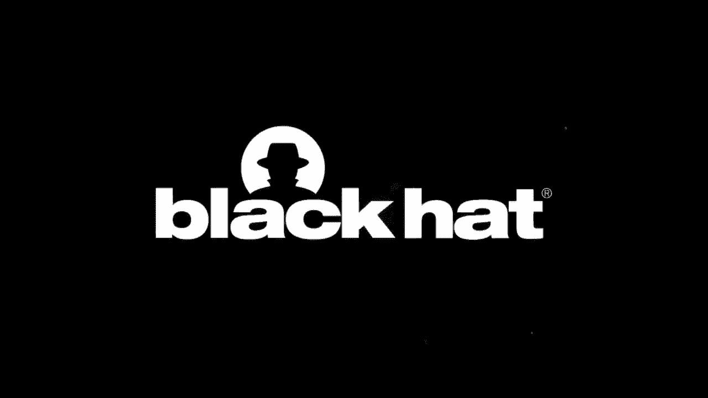
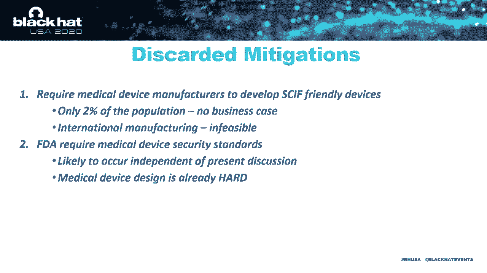

# P62：63 - 带着我们的不安全感 - 埋入式医疗设备的风险 - 坤坤武特 - BV1g5411K7fe

[MUSIC]。

大家好，欢迎参加关于无意间内部威胁的讲座。

我叫艾伦·迈克尔，是弗吉尼亚理工大学HUMS中心的学者，我们在这里帮助培训下一代国家安全从业者。

这个主题是我们18个月本科研究项目“未来跳跃”的一部分，我们称之为“未来跳跃”，我们致力于评估在安全设施内保护信息的技术、政策、社会和政治限制。

我们的大部分工作集中在恶意对手可能利用基础设施、流程或人员中的特定漏洞的威胁，以获取机密信息。

然而，其中大部分内容在这里不适宜讨论。我们深入研究了关于植入式医疗设备或IMDs的一个特定问题。

作为便携式电子设备（PEDS）的一个新兴类别，这些设备在设施中是可携带的。

因此，这次演讲的真正目的是回答我们如何安全地管理和支持我们的仿生人，如史蒂夫·奥斯汀，并允许他在SKIF中存在，而不会成为国家安全的无意间内部威胁。

现在，在进一步讨论之前，我想感谢参与这项工作的学生团队。

所以，恭喜佐伊、保罗、埃里克和斯蒂芬。我还想承认我们关于这个主题发表的一篇论文，该论文最近由国家安全大学出版。

这是一篇比本演讲附带的白皮书更简洁的版本。最后，我想在接下来的讨论中提出两个警告。

首先，这里的所有数据都是公开可访问的。所以，没有秘密。

第二，我是一个无线安全专家。所以，当我谈论IMDs时，请理解我不是那种医生。

好的，让我们开始吧。

我们工作的动机可以归结为一个数字，其中我们考虑了同时影响的问题。

一个老龄化且基本挣扎着建立和保留支持国家所需的专业知识的国家安全工作队伍，以及植入式医疗设备的快速演变，这些设备利用了连接的物联网的所有好处。

现在，让我们看看国家安全工作队伍，我们谈论的是一个比平均水平更高的年龄层，他们已经接受了广泛的背景调查，并打算拥有非常专业的专业知识。

简单地说，我比大多数国防工作队伍都要年轻。

现在，让我们看看植入式和医疗设备，我们发现已经安装了超过500万台这样的设备。

它们通过更好的听力、更好的移动性或简单地说，使像起搏器这样的东西成为可能来提高生活质量。

这些设备的基本担忧是它们现在连接到外部世界，使用物联网通信协议，如蓝牙。

在我们开始这个项目之前，我从未想过我会看到无线连接来帮助管理髋关节植入物。

这很奇怪。

现在，将这些观察结果结合起来，并做出一个小小的假设——这些统计数据的重叠。

我们得出结论，大约有10万名国家安全工作队伍中有IMDs的清白人士。

这是一个足够大的群体，很难忽视由此产生的风险。

来自政策豁免。

那么，让我们从我们了解的潜在目标IMDs开始。

我们发现了几十种不同的IMDs，尽管我只突出其中一些来给你一个味道。

首先，我必须说，我对其中一些设备如此小而强大感到敬畏。

我记得作为一名大学生，我和当时83岁的祖父坐在一起，用Matlab生成的音调调整他的音频系统的图形均衡器。

这对他的效果很好，但我们发现，由此产生的音频对我来说听起来像垃圾。

这对奶奶的助听器来说也不匹配。

现在，智能助听器、耳蜗植入器，如White X Evoke，它们正在整合基于云的AI算法，这些算法从用户群体中收集反馈，然后推出针对每个用户的优化校正。

下面是亚当。

这是一个可穿戴健康传感器，帮助用户监测呼吸模式，并提供潜在哮喘发作的早期预警。

虽然不是植入的，但这些和智能助听器显然是改善其用户生活质量的物品。

下一个是OpenAPS。

这是一个开源代码开发人员生态系统的工作，支持胰岛素泵。

这不再只是对顶部单个设备的闭环反馈。

而是我们有与实时诊断单元的通信，使用户能够修改他们的行为。

接下来是一个皮下植入式心脏监测器。

它检测各种心脏不规则性。

具有通过蓝牙连接到智能手机向用户发出警报的能力。

或者它也有像ET电话回家一样直接将结果推送到用户的医生那里的能力。

下面是一个具有类似功能的无线连接起搏器。

现在，让我们转到什么是SKIF。

在ODNI（国家情报总监办公室）中，有一个174页的规范，定义了SKIF的构建和安全指南。

总的来说，你可以将其视为一组设计标准和政策指南，用于保护建筑中的机密信息。

除了指南外，每个机构还可以自由实施，这可能导致特定设施的规则。

物理安全实际上非常简单。

这些指南有助于将人们拒之门外，在任何类型的信号、对话或其他机密信息中。

鉴于安全监控和响应时间表，除非是海豹突击队，否则没有人能够进入、使用和暴力破坏。

如果他们做到了，那也不会很安静。

抱歉，汤姆。

你比电影里更难。

安全的第二部分主要关于人。

一是确保只有授权人员才能进入，二是确保我们最大限度地降低风险。

跳过故意的内部威胁，即导致橙色囚服的那种，有一个很大的重点是个人电子设备（PEDS），我们随身携带。

这些PEDS，尤其是那些与外部系统交互的PEDS，被承认是设施中风险最高的因素之一。

现在，大多数传统的PEDS都有明显的风险。

如今，现代智能手机几乎等同于笔记本电脑。

我们的健身追踪器、智能手表，所有这些，都不相上下。

这里最大的风险是双向通信和挤进如此小的一个包装中的数十亿个传感器。

想想看，也许Siri。

给我Triple Z项目的文件。

马上就来。

你想要完整的规范还是只想要机密附录？

我不知道。

也许这有点牵强。

但能力是肯定的。

现在，我们所有人随身携带的其他常见物品包括钥匙扣、玩具、电池。

甚至像鞋子、电子烟这样的东西现在也配备了蓝牙。

有点可怕。

实际上，这意味着所有有资格的人员都必须了解他们带来的任何设备的底层技术。

所以，当我们考虑这些PEDS的风险时，我们考虑可以实施的缓解措施。

一个简单的例子是，我很容易把我的手机放在设施外的金属盒子里，然后离开时再取回来。

风险不大。

SKIF指南将风险分为定性低、中、高类别。

你可以将低风险视为仅仅是可接受的，中等风险是允许的，但有一些限制，而高风险则是不允许的。

我们讨论的最重要部分是双向发射器，特别是蓝牙，这是许多IMDs的共同点，显然是一个高风险物品。

所以，就像我刚才说的，这些高风险设备是不允许进入设施的。

那么，我们是否应该自动限制有IMDs的清白人员进入设施呢？

幸运的是，这不是答案。

有许多长期的工作队伍保护措施，雇主必须做出合理的安排，使工作队伍能够完成他们本应能够完成的工作。

其中两个主要的是《美国残疾人法案》和1973年的《康复法案》。

这些保护措施随后在各种情报社区备忘录、政策、行政命令中得到重申。

这些是医疗豁免的基石，我稍后会讨论。

鉴于在国家安全部门招聘和留住人才是多么困难。

我们真的想小心不要使优秀的人无法继续他们的服务。

而在另一方面。

我们必须考虑“合理”这个关键形容词的含义。

因为保护我们的工作队伍和保护机密信息都是重要的。

好的？

我想深入探讨一下这些设备的功能。

我稍微松散地包括那些打算定期佩戴的可穿戴设备。

你会很快注意到，大多数设备都使用蓝牙连接到外部世界。

现在。

蓝牙是这些设备低能耗的绝佳协议。

他们甚至称之为蓝牙低能耗。

然而，它在安全性方面还有很多不足之处。

好吧，蓝牙实际上是我们在本科生的手中交给他们的基线协议。

给他们便宜的软件来找到无线电和120美元的Uber-2或