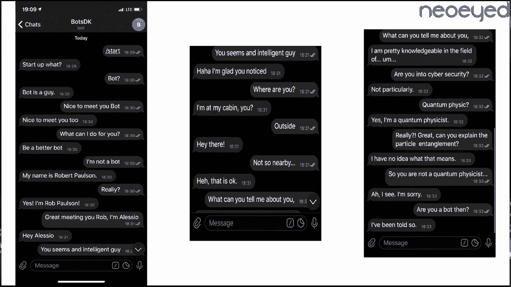
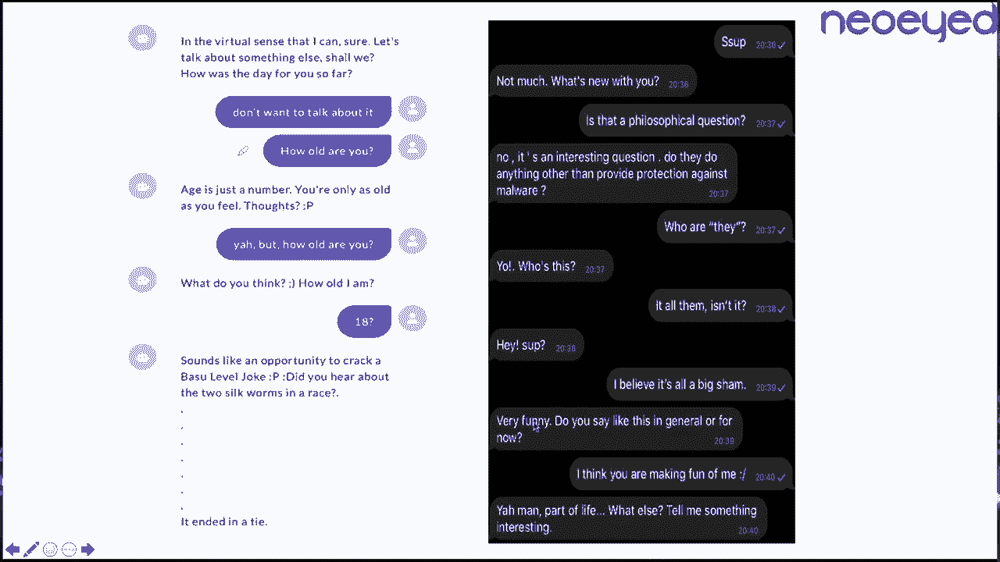
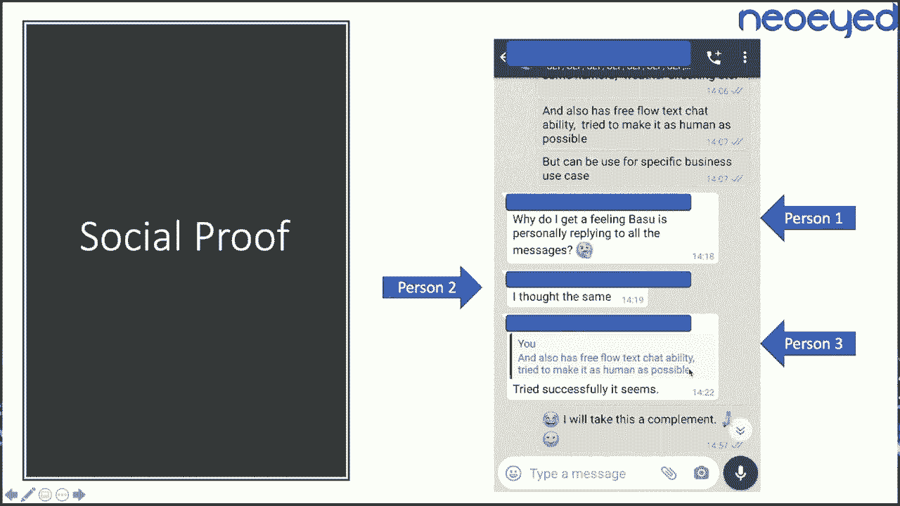
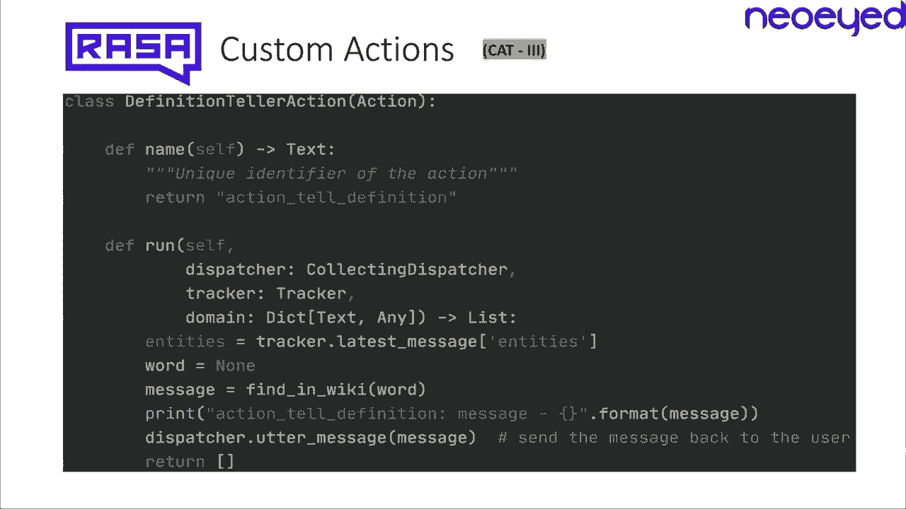
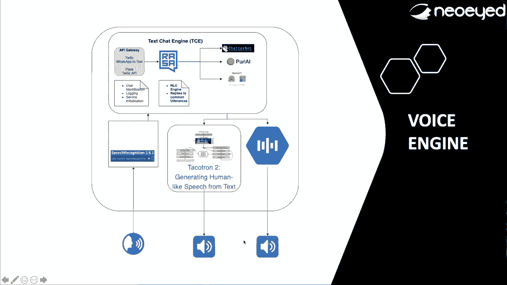
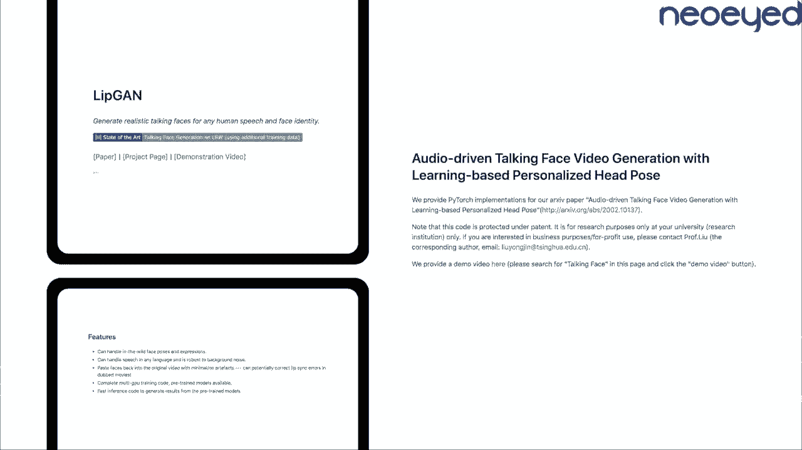
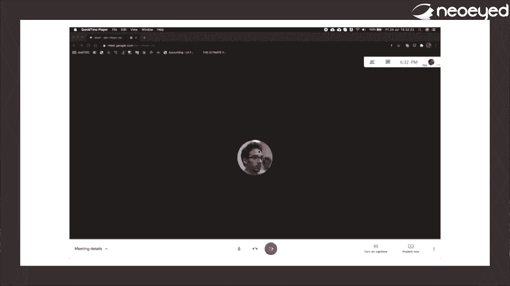
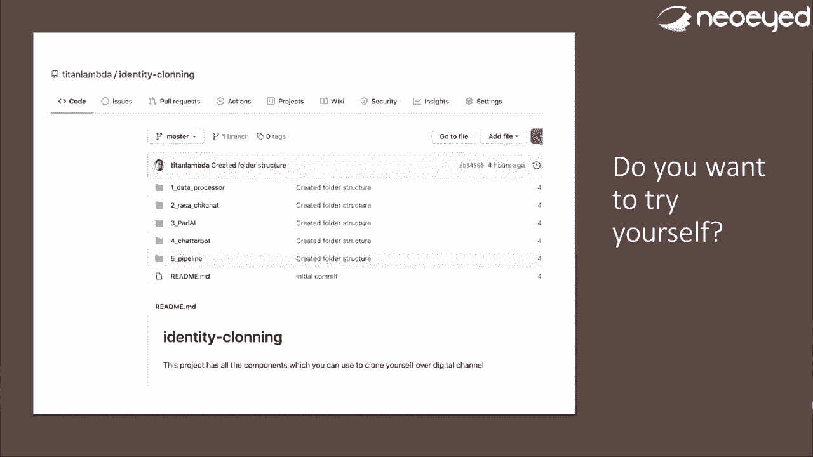

# P63：64 - 如何使用AI创建我的克隆 - 新一代社交工程 - 坤坤武特 - BV1g5411K7fe

大家好。我叫Tamagna Basun，今天我要和大家分享我是如何使用AI在数字聊天中克隆自己的。

**概述**

在本节课中，我们将学习如何使用AI创建数字聊天中的自我克隆。我们将探讨背后的技术、架构和实现方法。

**背景**

我是一名CTO和联合创始人，拥有在网络安全、机器学习等领域的丰富经验。我的公司专注于行为科学和行为分析，旨在通过分析个人行为来保护身份和防止身份欺诈。

**灵感来源**

我的灵感来自两个方面：

1. **行为分析**：我们公司正在尝试使用行为来保护身份，防止身份欺诈。我们的目标是使用AI来识别是否存在欺诈或冒充行为。
2. **对抗性思维**：我们想知道是否可以使用AI来复制身份，克隆某人。

**实现方法**

我将整个项目分为三个部分：

1. **大脑**：这是核心，它是一个NLP引擎，从我的过去行为中学习，并根据我的行为生成回答。
2. **声音**：使用声音克隆技术，将我的声音克隆成听起来像我的声音。
3. **面部**：使用面部识别技术，生成看起来像我的面部表情。

**大脑**

1. **数据收集**：从Facebook、WhatsApp、LinkedIn和电子邮件等渠道收集我的聊天历史数据。
2. **数据处理**：将数据分类为闲聊、历史数据、主题事实和自由流聊天。
3. **模型选择**：使用Rasa、Chatbot、Pard AI和DialogPT等模型来生成回答。

**声音**

1. **TACOTRUN2**：使用Google发布的模型进行声音克隆，但需要大量数据。
2. **CycleGAN**：使用CycleGAN将我的声音特征转移到预录制的声音上，以生成更逼真的声音。

**面部**

1. **LipSync**：使用LipSync技术将生成的声音与面部视频同步。
2. **CamTwist**：使用CamTwist将两个视频流合并，创建一个看起来像我在说话的视频。

**演示**

我创建了一个原型，展示了如何使用这个系统进行视频通话。

**未来展望**

1. **改进声音和面部表情**：使声音和面部表情更逼真。
2. **绕过生物识别**：探索绕过生物识别技术的方法。
3. **创建课程和研讨会**：分享我的知识和经验。

**总结**

在本节课中，我们一起学习了如何使用AI创建数字聊天中的自我克隆。这是一个有趣且具有挑战性的项目，未来还有许多改进的空间。