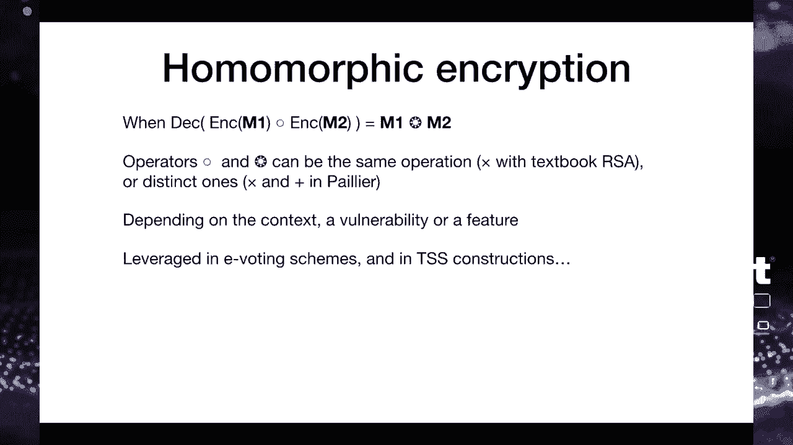
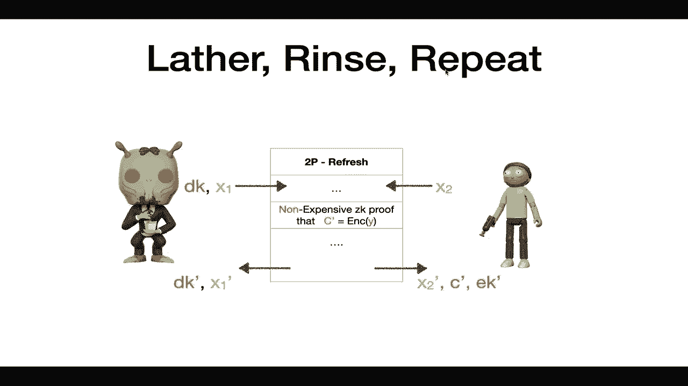

# P64：65 - 多方计算中的多个漏洞 - 打破加密货币的强安全性 - 坤坤武特 - BV1g5411K7fe

欢迎来到我们的讲座，我们将介绍对加密货币操作系统的新的攻击方法。

这是一个与Olga Shoma的联合展示，她发现了我们今天将要展示的大多数攻击。我们都有企业操作系统的经验，都对审计社会安全加密和VC产品的安全性感兴趣。

由于我们只有这么多时间，让我们从基本概念开始。首先，什么是钱包？钱包是保护您的数字资产、加密货币的方式。任何在区块链上运行的东西。如您所知，您并不是真的存储比特币，而是存储您将用于发起交易的私钥。如果您丢失了对这个私钥的访问权限，您将无法访问您的资金，如果有人声称您有私钥，那么他们可以花费您的资金。因此，您想保护这个私钥。

您可能熟悉不同类型的钱包。在手机上运行的移动钱包，本质上是在硬件钱包上，如Ledger或Trezor或提供相当高安全性的设备，以及当您打印出您的密钥并将其存放在安全的地方时使用的纸质钱包。企业钱包专门由银行和金融机构使用。它们有不同的需求，我们在幻灯片上描述了这些需求。

也许最大的一个是安全和隐私需求，因为如果您是一家银行，您存储数十亿的数据，并由您国家的监管机构进行监管，您受到审计员的审计，并且您想保护您客户的隐私，这会使事情更加复杂，也更有趣。

因此，您必须做的事情之一是分配信任。例如，在瑞士有一个名为4i-CTRL的法规，这意味着当您进行某种类型的交易时，您需要至少有两三个人参与并给出他们的批准。在加密货币的背景下，这意味着您有不同的实体，有不同的凭证，不同的访问权限来处理交易，更普遍的是，您想在不同的软件硬件组件之间分配信任，以避免单点故障。

因此，一种常见的方法是，如果您熟悉比特币，它是多签名的，但它有时很复杂，因为它将需要多个密钥，有时您有一个通用密钥，并且它对不同的区块链平台有不同的工作方式。因此，理想情况下，您希望有一种可以在不同的区块链上工作，例如比特币、以太坊和其他区块链的东西。

今天我们要介绍的是关于MPC和TSS的内容，它们是用于分配信任的文本，不使用硬件，不使用程序，而是使用基本的加密技术，这是不同的方法之一。

**MPC（多方计算）**：

从潜在的角度来看，它是一种协议，一种系统，您将接收输入，但以一种加密的方式接收，这样您实际上不知道输入值，但是您将能够贡献输出，即某些函数的结果。

**TSS（同态签名方案）**：

这是一种特殊的MPC，它允许将秘密分成不同的份额，在多个参与者之间共享，但没有任何一个份额可以提供完整的密钥值。它通常用于存储系统，其中有时只有一个密钥、一个账户，存储了大量的资金，通常是数十亿到数百亿美元。

**攻击方法**：

1. **忘记和原谅攻击**：攻击者通过控制一个实体，可以破坏TSS的安全性，导致资金被永久锁定。
2. **洗衣服重复攻击**：攻击者可以提取用户的密钥并窃取其资金。
3. **戈登鞋攻击**：攻击者通过发送一个恶意消息，使所有参与者都发送他们的秘密给攻击者。

**建议**：

- 最小化复杂性。
- 使用易于阅读的语言。
- 理解学术论文中的定义。
- 不要将NPC和TSS视为万能的解决方案。

**总结**：

本节课中，我们一起学习了多方计算和同态签名方案，以及它们在加密货币安全中的应用。我们还讨论了针对这些技术的攻击方法，并提供了避免这些问题的建议。