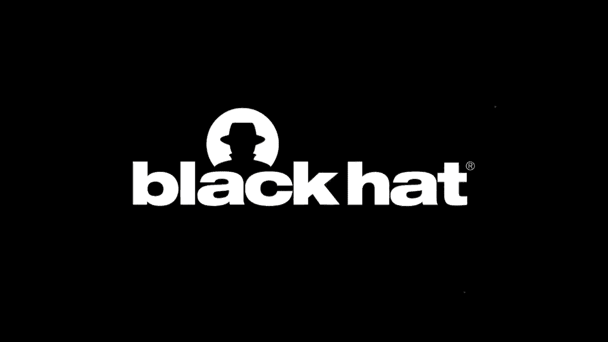

# P65：66 - 实时检测假4G基站 - 坤坤武特 - BV1g5411K7fe

[音乐]

>> Hi，感谢您参加这次Black Hat虚拟活动。今天。

我将与您讨论实时检测4G基站。

我叫库珀·昆汀。我是EFF威胁实验室的高级安全研究员。

我有一个幼儿，这应该可以解释为什么在这场演讲中您会听到这么多爸爸笑话。

我曾是青少年手机迷。我过去花了很多时间制作五彩缤纷的盒子。

这也许可以解释为什么我会从事现在的工作。如果您还没有听说过EFF。

我们是一个会员支持的非营利组织。我们每年的一半资金来自我们成员的个人捐赠。

我们捍卫与科技交叉的公民自由权。

我们认为您的隐私权和言论自由权在网上存在，就像在现实世界中一样。

我们从事这项工作已有30年，自1990年以来。

因此，我们积累了相当多的经验。当然，当然。

我还没有在那里那么久。我在EFF威胁实验室工作，我稍后会详细介绍。

但首先，我想谈谈我的同事约玛娜。我想对她表示衷心的感谢。

如果没有她的辛勤工作和奉献，这项研究将无法进行。

这既是她的项目，也是我的项目。不幸的是。

她今天不能和我一起站在舞台上。但如果您在虚拟Black Hat的虚拟大厅中看到她。

请为她买一杯虚拟啤酒或关注她的Twitter账号@rivalelf。

这是一张她的实际照片。她确实是一个非常兴奋的感知萝卜。

那么威胁实验室做什么呢？威胁实验室研究针对处于风险中的人的技术。

这是活动家、人权捍卫者、记者、家庭暴力受害者、移民。

性工作者、少数族裔群体，基本上是任何仅仅因为是他们自己或拥有他们所拥有的信仰而面临压迫的人。

压迫这些人的技术的目标通常是收集他们的情报或监视他们。

特别是如果他们离开了国家的边界。

这使得通过传统的动能手段监视他们变得更加困难，定位、存储、骚扰。

基本上是压制您不喜欢的人的自由表达和人权。

我们为什么要做这项工作呢？嗯，网络安全和反病毒公司。

主要关心影响其客户的那种恶意软件。

这通常是企业客户，比如勒索软件或银行木马。

金融攻击。这些是影响他们客户的事情。

虽然这些事情很重要，但我们更关心侵犯处于风险中的人的公民自由权和人权的技术。

我们喜欢将自己视为最需要安全却负担不起的人的安全团队。

我们之所以能够做到这一点，是因为我们为非营利组织工作。

我们不必担心保持和扩大我们的付费客户群。

我们的目标是什么？首先，我们想保护人们。

我们想确保人们能够自由地表达自己，确保人们的人权不受侵犯。

并确保人们在电脑和科技生活中，以及现实生活中感到安全和舒适。

我们想扩大我们社区对面临的威胁和防御的理解。

我们想让我们社区了解针对他们的威胁行动者的能力。

这些威胁行动者可能是谁，以及他们可以实际做些什么来保护自己。

我们想揭露坏人。我们想确保那些使用技术侵犯人权和言论自由的人被揭露。

无论是网络雇佣兵，还是违反人权的政府。

我们想确保他们被曝光并受到羞辱，不允许他们逍遥法外。

当然，因为我们是一家法律非营利组织，我们想制定更好的法律和更好的社会规范。

这样的事情就不会再发生。

过去，我们完成了一些项目。一个是我的同事伊娃·加尔普伦。

这是反对Stockawear的联盟。所以Stockawear或Spassware是一种专门针对您的恶意软件。

您会将其安装在与您关系亲密的人或配偶或重要他人身上。

以监视他们、控制他们。这种恶意软件以前没有被大多数反病毒供应商归类为恶意软件。

它被归类为潜在的不受欢迎的程序。

我们认为这有问题，因为它显然是恶意的。

伊娃与反对Stockawear的联盟进行了大量游说，并促使反病毒公司。

开始将Stockawear标记为恶意软件，就像它应该做的那样。

2018年，我们在Black Hat上谈到了Dark Caracal。

这是一个在黎巴嫩对平民进行间谍活动并也与在哈萨克斯坦对平民、人权捍卫者和记者进行间谍活动的威胁行动者有关。

我们能够追踪到这个行动者，他在黎巴嫩国家安全总局总部运营。

我们认为他是一名自由职业者，为黎巴嫩和哈萨克斯坦做兼职工作。

以及进行犯罪活动。关于这一点，报告中有更多细节。

您可以在EFF网站上找到。但今天，我并不是来谈论这个的。今天。

我们将讨论基站模拟器，也称为 stingray 或 MC catchers。

我们将讨论它们的工作原理，以及以前检测它们的努力。

我们将讨论EFF提出的一种新方法来检测它们。

最后，我们将讨论一些我们认为可以一劳永逸地解决问题的方法。

在我们深入探讨之前，我想向您介绍一下一些术语。

首先，我们有UE，它只是手机。它代表用户设备