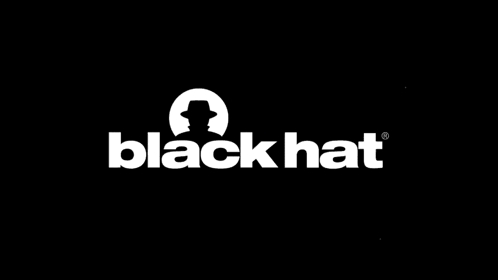
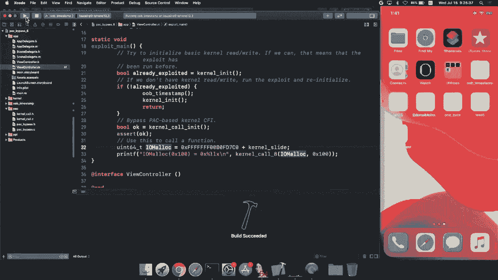
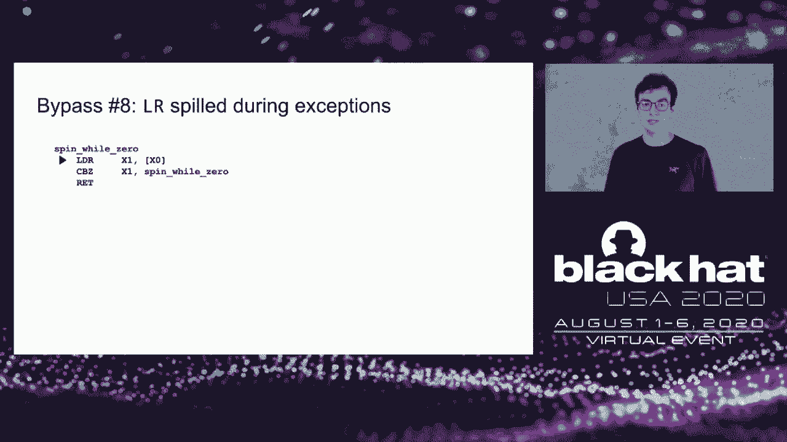
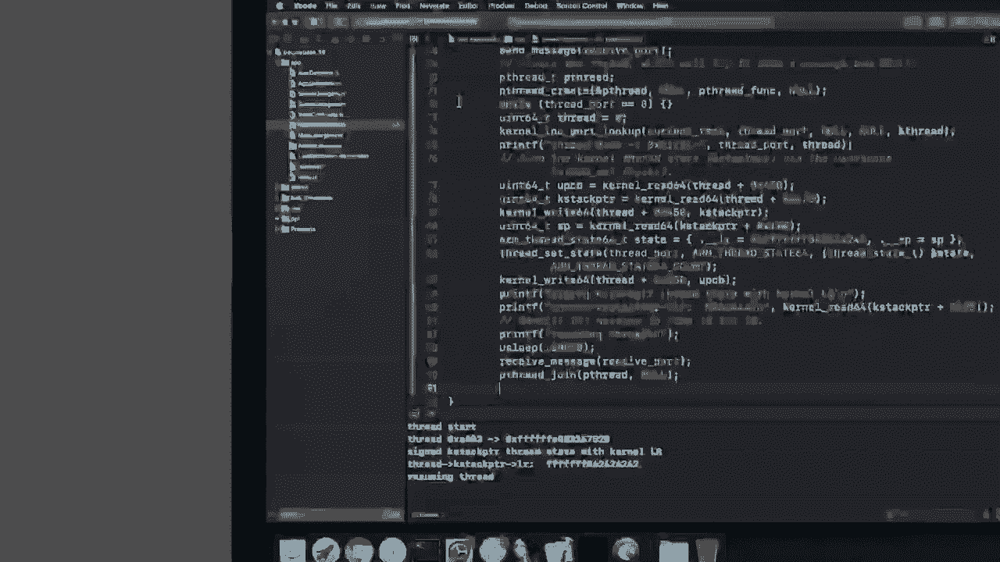
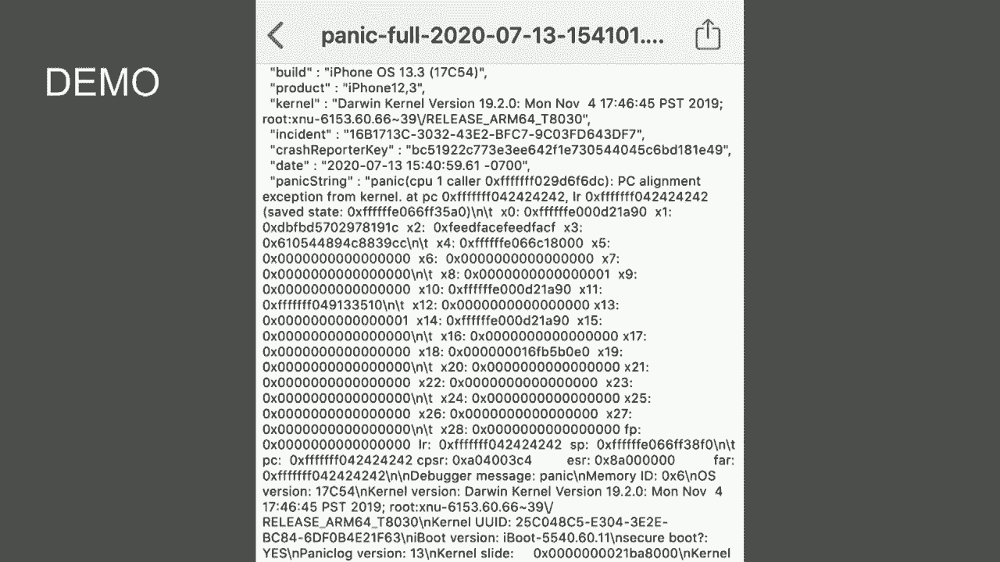
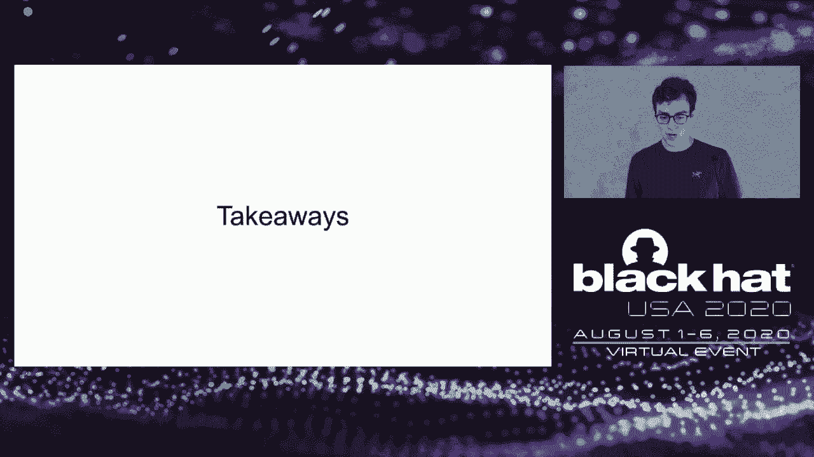

# P66：67 - iOS Kernel PAC, One Year Later - 坤坤武特 - BV1g5411K7fe

 [MUSIC]。

 Hello， welcome。 So today， I'm going to be talking about， pointer authentication in the iOS kernel。

 In particular， how pointer authentication is used to build， kernel control flow integrity。 Now。

 unfortunately， this time slot is not long enough for me。

 to talk about all the things I would like to share。 So if you're interested。

 I highly recommend checking out， either my previous talk on pack or the Project Zero blog。

 So about a year and a half ago， at the beginning of 2019。

 I'd written a kernel exploit for iOS 12 on the iPhone XS。

 And I'd achieved a kernel read/write primitive。 And at this point。

 I had wanted to find a way to use， kernel read/write to execute arbitrary kernel code that。

 is calling arbitrary kernel functions in the iOS kernel。

 So the idea was Apple had added this new pack security feature。

 And I wanted to find a way to bypass the control flow， integrity that it provided。

 So I put pointer authentication under the microscope。

 and eventually ended up finding five different ways， to bypass pointer authentication in iOS 12。

 which I then， presented in a study in pack。 So at the time， once I had found this fifth bypass。

 in my original work in 2019， I eventually， decided that this fifth bypass was indicative。

 of kind of systematic problems with the design--， with the original design of pointer authentication。

 And so I wanted to give Apple some time to fix it， to improve the design a little bit。

 And maybe I would revisit it at a later point， give iOS 13 a chance to fix some of the problems that I uncovered。

 So now， one year later， this talk， is my revisiting of pointer authentication in iOS 13。

 So what is pointer authentication？ It's a security feature from ARM V8。3。

 And the basic idea is that here you have a kernel pointer。 And if you look。

 you'll notice that the upper bits of this pointer， are basically all one。

 They're all kind of unused， storing redundant information。

 So the idea with pack is to replace those unused bits。

 of the pointer with a cryptographic signature， over the lower bits of the pointer。

 And what that allows us to do is basically ensure。

 that these pointers can't be tampered with during the operation， of the kernel。

 even if you have a kernel read/write primitive。 If an attacker tries to modify these pointers。

 that should result in using of this pointer causing a kernel， panic。

 So there are a number of different instructions， which， are provided by the ARM architecture。

 I'm not going to go into these in details， but these are the instructions that you。

 use to manipulate pointer authentication codes。 So how has Apple used this security feature。

 in order to implement control flow integrity in the iOS， kernel？ Well。

 there are a number of different uses， of these pointer authentication keys。

 I'm not going to go into all of them in detail here。

 The basic idea is that they segment out different use cases。

 into different architectural keys so that pointers used with one。

 key can't be substituted for other pointers using different keys。

 Only one we're going to be focusing on this talk， is thread saved state。 So basically。

 imagine that you have a kernel thread， and all of a sudden a timer interrupt fires。

 When that happens， you're going to jump execution。

 from the kernel thread over to the exception handler， the exception vector。

 And in the exception vector， you're， going to spill all of the kernel threads registers out。

 to memory and then run the interrupt handler in place。

 And then when the interrupt handler is finished running。

 it's going to pop all of those registers back， and then resume executing the kernel thread。

 But while those registers are spilled to memory， it's possible that they might be modified by an attacker。

 with kernel read/write to try to subvert control flow， integrity。

 So it's very important that any registers which， could be used to influence kernel control flow。

 those registers need to be protected to ensure that they， aren't modified by an attacker。

 And that's what this function right here is used for。 This sign thread state function is。

 going to take the address of the saved state blob， where， all the registers are being stored。

 It's going to take the PC register， CPSR and LR。 So PC is your program counter， which。

 is the address you were executing from。 CPSR is your current program status register。

 which saved the exception level that you were previously， running at， i。e。

 were you running in the kernel， or were you in user mode。 And LR is your return address register。

 And sign thread state is going to entangle all of these registers， into a signature。

 a pack protected signature， which then， gets stored into your saved state blob。 And correspondingly。

 there's also， a function that verifies these signatures verify thread state。 For one。

 you want to actually pop these registers back out。 And so this function is basically。

 going to regenerate the signature。 And check that none of the registers have been tampered with。

 And if it's true that there has been some sort of tampering， then this function will panic。 Now。

 a very important place for this to be used， is during exception return。 So as I mentioned before。

 if you， for example， are running a kernel thread and a timer interrupt fires。

 you're going to jump to the exception vector。 And eventually， after running your interrupt handler。

 to completion， you're going to want， to resume executing the original kernel thread。

 And that's what this exception return function does。 It's going to return from that exception。

 That was just handled。 So the ending of this function basically。

 pops all of those registers that have， been stored during the exception vector。

 It pops them back into the architectural registers， which， means that this is pretty much the best。

 ROP gadget that you could ever possibly hope for。 It gives you control over every single register。

 So it's very important that this thing is protected。

 so that you cannot just get it called with arbitrary arguments。

 You want to ensure that when you do an exception return， PC， CPSR， and LR are indeed protected。

 They haven't been modified during the execution， of the interrupt handler。

 And so Apple has inserted this call， to verify the thread state before executing。

 the exception return instruction。 All right， so that's an overview of what。

 pointer authentication control flow integrity looked like in iOS 12。

 Now I'm going to briefly summarize just two of the bypasses， that I reported back in 2019。

 So jumping all the way to bypass number four。 This was a very interesting pack bypass from my perspective。

 because it was an example of something which only showed up--。

 I didn't show up if you looked at the C code。 It only showed up when you started looking at the assembly。

 So here's this kernel function， IPC， K-Message， Clean Body， and it has a switch statement in it。

 And what you'll notice is that it's， loading the jump table for this switch statement。

 in register X25。 And then if you trace the flow of this register。

 eventually it loads the jump target into register X9， and then executes this unprotected branch。

 instruction through register X9。 So in my mind， I thought that this was problematic。

 because if you remember from before， when you have an interrupt delivered， only the PCC， CPSR。

 and LR registers， are protected when your thread state gets spilled to memory。 In particular。

 neither register X25 nor register X9， is protected， so they're vulnerable。

 to be modified by some concurrent kernel， write primitive by an attacker。 In this particular case。

 even though the idea was to find， things that were vulnerable to interrupts。

 I actually found that there's a function call， which actually。

 directly spills register X25 to the stack。 So there is in fact no need in the proof of concepts。

 that I submitted to leverage preemption， in order to take advantage of this switch statement。

 in order to get arbitrary kernel code execution。 The next bypass that I want to talk about。

 was something more of a fundamental issue， that I realized existed with signing thread states。

 So here we have a kernel function， which， is creating a new thread。

 And what you can see is that it has a call to the signed thread， state function from before。 Now。

 the thing that I noticed is that interrupts， are enabled during the whole execution of this function。

 And this is problematic because， as you recall from before。

 signed thread state only protects your PC， CPSR， and LR， registers。

 And yet the four arguments to sign thread state， are passed in registers X0 through X3。

 which are not， protected registers and therefore could be modified。

 if an interrupt is delivered directly before the signed， thread state operation。 But once again。

 in the end， I found， that it wasn't actually necessary to interrupt。

 to be used in order to trigger this issue， because it turns out that this function would actually just。

 read the parameters to sign directly from memory。 If you were to use your kernel write。

 primitive to swap out this user state pointer， to some address you control， you could just directly。

 get a signature on the state without having， to mess with interrupts at all。

 So those were two of the bypasses that I found in iOS 12。 And after this point， I realized。

 now this signing thread states is kind of fundamentally， insecure。

 I'll give Apple some amount of time， to fix these issues， and I'll revisit。

 PAC at a later point in time。 So let's look at what has happened in the intervening year。

 with iOS 13。 So fundamentally， the kind of uses of pointer authentication， through the iOS kernel。

 Fundamentally， it's the same stuff。 There's no， for example， data PAC using PAC。

 to protect additional data pointers。 I was hoping to see that， but it didn't end up。

 making it into iOS 13。 But regardless， there is one change which， is worth pointing out。

 which is that there are two new protected， registers。

 So if we look at the disassembly of this signed thread state， function。

 what you'll observe is that rather than having four， parameters as an iOS 12。

 it now has six parameters。 And the two additional parameters。

 are used to sign the values of architectural registers， x16 and x17。 Now。

 what that means is that x16 and x17， are now kind of considered interrupt safe in the sense。

 that they can't be modified during an interrupt， because any attempts to modify them。

 will invalidate the PAC signature。 And what this has allowed Apple to do。

 is basically harden their implementation， of switch statements。

 So here you can see the original switch statement that I， reported in PAC by pass number four。

 And on the right， you have the hardened version in iOS 13。

 where you can see that the switch statement is only using。

 registers x16 and x17 to conduct this indirect branch。 So theoretically。

 this should be safe from concurrent modification， during interrupts。 All right。

 so that's a high level overview， of the changes to pointer authentication in iOS 13。

 Now let's get to the bulk of the research， for this year， which was looking at。

 are there still ways to bypass this hardened pointer。

 authentication based control flow integrity in iOS 13？

 And the place that I wanted to start out， was revisiting this fifth bypass that I had found。

 the first time around。 So if you recall， the fifth bypass was this issue。

 with a signed thread state kind of being fundamentally， insecure due to the use of interrupts。

 So I was very curious how Apple actually addressed this， in iOS 13。

 And it seems like the solution was to basically replace， the reading of parameters from memory。

 with just hard coding all the parameters to zero。 So this is certainly an improvement。

 because it completely nullifies the technique， that I used in iPod。

 But the fundamental issue is still there， which is that interrupts are still。

 enabled for the duration of this function call， meaning that we are still vulnerable to preemption。

 This is a lot easier to see if you look at the assembly。

 So imagine that we're executing the instruction， sequentially。

 And then right before we get to this signed thread state call， we have a timer interrupt that fires。

 and we immediately jumped from here directly， to the timer interrupt exception vector。

 So now during this exception vector， as you can see， it's going to spill。

 all of the architectural registers to memory。 So you can see x0， x1， x2， x3， x4， x5。

 All of them get spilled to memory。 And because none of those are protected by the pack signature。

 they can all be modified by an attacker coming in， racing during this interrupt to overwrite them。

 while the interrupt handler is running。 And then once those registers get popped back out。

 an attacker has control over all of the parameters， to the signed thread state function。

 So once again， this is a full thread state forgery pack， bypass。

 Now for a couple of complicated reasons， it wasn't actually easy to trigger this issue right here。

 So I started searching for other places， that signed thread state was called。

 where it might be easier。 And I eventually ran across this function， thread state 64。

 to saved state。 So this function is the implementation， of the user system call thread set state。

 which， is responsible for setting the registers， in a user space thread。

 So imagine that a user space process has created a new thread。

 and it wants to set the values of all of the registers， in that thread。

 So this is the actual implementation of thread， set state in the kernel。

 And what you can see if you look at the assembly， is that it does something kind of interesting here。

 So first off， it's returning from this function， with an unprotected RET instruction。 And second。

 the return address is actually， being stored to register x8 for the duration of this kind。

 of verified thread state， then signed thread state， sequence of operations。

 And this is problematic because x8 is not a protected register。 It is vulnerable to being modified。

 if an interrupt gets delivered somewhere， during the operation of this sequence。

 So how would you actually use this to bypass pointer， authentication？ Let's walk through an example。

 So for this example， we're going to have two threads。 Thread A is going to be running on CPU 4。

 Actually， having it run on CPU 4， is important because for whatever architectural reason。

 CPU 4 seems to get a lot more interrupts than other threads。

 So thread A is going to be just calling， thread set state in a loop。

 And thread B is going to be checking， to see when CPU 4 gets interrupted。

 So each time thread set state gets called， that's going to jump into the kernel。

 And it's going to call machine thread set state。 And then that is going to call the vulnerable function。

 And as we're kind of iterating through the instructions， of this function， eventually at some point。

 we're going to have an interrupt arrive。 And it's going to cause us to jump to the exception vector。

 spilling all of our registers to memory， including register x8， which currently。

 holds the return address。 So once all these registers have been spilled to memory。

 execution is going to run in the interrupt handler。 And while this is happening， we're now。

 going to come in on thread B and see， oh， look， indeed， CPU 4 is interrupted。

 So it's going to go ahead and overwrite， the value of register x8。

 which used to hold the return address。 Now it's going to be an attacker controlled value instead。

 So at this point， we now have control over the return address。

 And when the interrupt handler finishes running， and it's about to do an exception return。

 all of those registers are now going， to be popped out of the saved state blob。

 and back into the registers， giving us control over register x8， when normal execution resumes。

 This means that this move instruction will get us control， over the return address register。

 And then this RET instruction is going to give us PC control。 So let's see a demo。 All right。

 so here we have an iPhone running--， it's an iPhone 11 Pro running iOS 13。3。

 And I'm going to run a kernel exploit on it， which。

 is going to give it a kernel read write primitive。

 And then I'm going to use that to call this kernel function， iomalloc。

 which is going to allocate some memory， from the kernel。 So this is basically demonstrating。

 the ability to call arbitrary kernel functions from user space。

 in spite of the presence of pointer authentication。 So if I just run this， what I should see。

 is it'll bypass pack。 And then immediately， I get the ability to call iomalloc。

 and it returns this pointer， which does indeed， look like a kernel heap pointer。

 So this demonstrates the ability to bypass， the control flow integrity mechanism using。

 preemption with thread set state。 So we've demonstrated being able to bypass control flow。

 integrity using this interrupt based technique。 But as I kind of thought about the issue here a little bit more。

 it really boils down to basically any time interrupts。

 are enabled during this thread state signing operation。

 That's just fundamentally an unsafe thing to have happen。 But with the more I thought about it。

 the more I realized that this doesn't just， apply to this sign thread state function。 Basically。

 any time you have a pack signature being generated。

 it needs to be the case that it either has interrupts disabled。

 or it's only using interrupt safe registers。 And so this let me search for other patterns。

 of a variant of the same bypass。 So here you can see an example in this function b-copy-in。

 where we have an unsafe pack ia operating on registers x3 and x11。

 I'm not going to go into this one in detail。 But it's fundamentally the same bypass。

 as before just with a raw pack ia instruction rather， than this thread set state。 All right。

 So after looking-- while I was in the process， of looking at the bypass involving thread set state。

 and interrupts being delivered， one of the things， that I had to look at was how exactly。

 are the registers spilled to memory， during execution of the exception vector。

 And I saw something kind of interesting。 I wasn't expecting to see this， but it ended up。

 being another pack bypass in the exception vector itself。 So if you look closely， what you'll。

 see is that actually the return address register x30， is being spilled to memory。

 And then just a few instructions later， it's being reread back from memory right before this call。

 to sign thread state。 And this is problematic because this basically。

 gives the attacker a window and time， to modify the return address while it's spilled to memory。

 before it has been protected by generating， this pack signature on the saved state。

 So this is additionally just another pack， bypass right in the exception vector itself。

 The way you might actually exploit this， is you'd need to find some sort of gadget， which。

 for example， is going to spin while some memory location is zero。

 And then it's going to return with this， again， an unprotected RET instruction。

 So now eventually while this gadget is executing， you'll eventually hit an interruptal fire。

 and you're going to jump to the exception vector。 And so now right at the beginning of this exception。

 vector， you're going to need to race in another thread。 So this thread is going to。

 at the very beginning， store the return address register to the saved state blob。

 And then we need to come in on another CPU core， and immediately overwrite it to change it to some attacker。

 control value instead。 Then just a few instructions later。

 the exception vector is going to read the now attacker， controlled return address value back in。

 And then it's going to call signed thread state， meaning that we have now controlled the return address that。

 has been incorporated into this pack signature， giving us。

 control of where this spin while zero gadget will return， to at a later point。

 So this was actually another interesting pack bypass。

 I hadn't expected to find something just sitting right， there in the exception vector。

 But it also kind of got me thinking， like what is the generalization of this issue here？

 And what I really eventually settled on， was that the problem was that you're。

 reading parameters from memory before calling signed， thread state。

 Doing this is kind of fundamentally an insecure thing， to do。

 since it'll always give an attacker a window in time。

 to modify the parameters to the signed thread state function。 So I started looking for other places。

 where signed thread state is called， where it's going to be reading parameters for memory。

 And to my surprise， I actually found another function which， does this exact same thing。

 So there's this function switch context， which is used during voluntary kernel context switches。

 So imagine like a kernel thread is blocking on a mutex， and yielding execution to another thread。

 When this happens， all of the call-e saved registers， are going to be spilled to your saved state。

 And in particular， that includes the return address， which means you have to protect it， which。

 means a call to signed thread state。 Now， when you are-- when switch context is calling。

 signed thread state， it actually reads in the value。

 of PC and CPSR originally in this saved state blog， from memory before the signing operation。

 So once again， this is basically a way， to directly get control of the PC and CPSR registers。

 in the saved state blob before the signature gets generated。 So once again， the switch context。

 is responsible for managing thread states， for voluntary kernel context switches。

 And so because this is really doing voluntary context switches， between kernel threads。

 that's the reason why these PC and CPSR， registers aren't needed and kind of why this thing isn't。

 fundamentally broken。 But what it enables is this really straightforward pack， bypass。 Basically。

 you wait for some kernel thread， to be active while it's running and using all of its registers。

 And while that's the case， you overwrite the PC and CPSR， registers in its saved state blob。

 Then eventually， this kernel thread is going to block。 It's going to call switch context。

 And switch context is going to read PC and CPSR， which are again the attacker controlled over written values。

 It's going to read those into memory， into registers as parameters to the call to signed thread state。

 And therefore， those are going to get signed into the pack， signature。

 And then because you have a valid signature， on an attacker controlled saved state blob。

 you can reuse that saved state for an exception return， operation with arbitrary PC and CPSR。

 So basically， you'd set CPSR to be exceptional level 1， or kernel mode。 And PC。

 you'd set to some attacker hijacking gadget。 So this is an interesting pack bypass as well。

 I wasn't expecting to find this issue in the context switching， code， which is called all the time。

 But once again， I wanted to take a step back， and think of what is the fundamental issue here。

 And pretty soon it dawned on me that there， is really something much bigger going on here。

 And that is that there's a design issue， with how these thread states are managed。 Fundamentally。

 there are two different ways， in which signed thread states are being used in the kernel。

 So first off， you have the method， that we are already very familiar with。

 which is during an exception return。 So in interrupt gets delivered， you run your interrupt handler。

 and then you're calling this exception return function。

 to resume execution of the interrupted thread。 So you've already seen that。

 But then there's this other way in which signed thread states， are used。

 which is via switch context， during voluntary kernel context switches。 And as it turns out。

 these two uses of signed thread states， have very different security requirements。

 So for exception returns， when you're， doing an exception return back into kernel mode。

 you really do care about all three of the registers， P， C， C， C， P， S， R， and L， R， since they all。

 have an effect on what kernel code gets executed。 So they all need to be protected in order。

 to ensure control flow integrity。 For exception returns to user mode-- so imagine。

 like a system call and you're returning， from the end of a system call--。

 you really only care about the CPSR register。 And the reason for that is all you really care about。

 is that when you return from the system call， you are indeed jumping back into user space。

 Someone hasn't tampered with CPSR to make you return， into kernel mode instead。 So in this case。

 when you're returning to user mode， you really only care about CPSR。 And finally。

 during a switch context--， for switch context， we only care about the return address， register。

 PC and CPSR just don't have meaning in this context。 So fundamentally。

 it turns out that since thread states can， be used in these two really different ways。

 in order to ensure integrity， we really， want to be sure that thread states signed for use。

 by switch context shouldn't be usable by exception return。 And also vice versa。

 we don't want thread states signed， for exception return to be usable by switch context instead。

 Unfortunately， as it turns out， there's only one function， signed thread state。

 which means that unless additional care， is taken in the implementation， thread states signed。

 for one purpose can always be swapped out and used， for the other purpose instead。

 So this gives us kind of a more fundamental lens， on what is happening in this bypass。

 which is that thread states signed by switch context， for context switching-- and remember。

 context switching does not care about PC and CPSR。

 These thread states can instead be used for exception returns， which do care about PC and CPSR。

 So this is cool， but it also begs kind of the obvious question， which is what about the inverse？

 Can thread states signed for use by exception return， instead be used for switch context？

 And this actually brought me to what I think， is the coolest pack by pass of all。

 because it was the one that was staring me in the face， the whole time。

 which is how when you swap user， and kernel thread states。 So if you remember from before， there。

 is this function system called thread set state， which。

 basically allows a process to set the registers， in a user space thread。

 And it's implemented in the kernel， by this function， which we also saw before in the very first。

 pack bypass， thread state 64 to saved state， which。

 is responsible for verifying the old user space registers。

 and then resetting the new registers and then re-signing。

 the thread state such that it has the new registers instead， with the signature intact。

 So now for this operation of thread set state， we only really care about CPSR being restricted。

 We want to make sure that CPSR is set so that we return， to user mode。

 but we really don't care about the return， address register。

 Because if you set a kernel pointer in your return， address register。

 as long as you're executing in user mode， that'll just cause a segfault when you try to return there。

 It's not going to violate kernel control flow integrity。

 So thread set state is fully secure against exception return。

 You can't use thread set state to assign thread states that， are then usable by exception return。

 to violate kernel control flow integrity。 Unfortunately， this is not at all the case。

 if you were to reuse thread states signed via thread set， state with switch context。

 Because switch context really cares about the return address， but completely ignores CPSR。

 So this gives us a really lovely kind of logical pack， bypass， which is very reliable。

 100% deterministic。 So once again， we're going to create two threads， thread A， and thread B。

 And we're going to take a close look at thread A， which has two signed thread states。

 one for user mode execution， one for kernel execution。

 So what's going to happen is that thread A is going， to call some system call。

 which is going to block。 And eventually， that's going to reach switch context。

 So when switch context is called， it's going to save all of the registers。

 including the return address register X30， and it's going to sign that state。

 And then it's going to cause the thread to block。 And while thread A is blocked。

 we're now going to come in， on thread B， and we're going to swap out the pointer。

 to the user state so that it now points to the kernel state， instead。

 So this is going to leave us in this situation， where the pointer to the thread A is user state blob。

 now points to its kernel state blob。 And at this point。

 we can now call thread set state on thread A， to set the registers in its kernel state。 Now。

 of course， thread set state， as I mentioned， is going to restrict the value of CPSR。

 but it does not at all restrict the value of the return address。

 which means that if we now unblock thread A， some other kernel thread is going to context switch to it。

 And when it does so， it's going to load this completely。

 arbitrary return address into its registers。 It's going to verify the signature that's correct。

 And then finally， it's going to move that into the return， address register and return， once again。

 giving us PC control。 So let's see a demonstration of this Pac-By-Pass。 All right， so here again。

 we have the same iPhone， and we are going to run this Pac-By-Pass。

 to demonstrate how to hijack control flow integrity using。

 the just discussed thread set state bypass technique。 So this is actually， as I said。

 because it's a logical bypass， it's really elegant and short。

 So you can see that the implementation starts on line 19， and ends on line 92。

 So that's the entirety of the code for this bypass。 It's very short。

 a completely 100% deterministic。 And what all this is going to do is。

 it's going to set the value of the return address register。

 to some controlled value causing the phone to panic。 So we will run that now。

 And you can see immediately the device panics。

 And if we check the panic log， it will indeed， be have this return address register set to 42， 42。

 42， demonstrating that we have broken the control flow integrity。

 So what are the things that I want， to you to take away from this talk？

 I know it's been kind of a whirl wind of Pac-By-Passes。 So what is the thing that I want you。

 to walk away understanding about all of this？

 When I originally gave the presentation demonstrating， the first five Pac-By-Passes in 2019。

 one of my conclusions was that more thorough analysis could。

 have helped in the design of pointer authentication。

 And while my views now are a little bit more nuanced， I still stand by this original conclusion。

 Even in iOS 13， Pac still feels quite ad hoc。 I really don't get a sense of what。

 the formal underlying security model for Pac， is that governs all of these design decisions。

 And as a result， even though I'm not aware of any， I wouldn't be surprised if at a later point。

 it was revealed that there are， in fact， other kind of fundamental design issues like the one。

 we just discussed earlier。 Now， another thing which I think is worth pointing out。

 is that when I initially reported the approval concepts， for the iOS 12 bypasses， Apple was。

 able to fix the specific POCs that I reported， but they did not address the underlying issue。

 for that fifth bypass， which is that interrupts were enabled。

 And I find this a little bit disconcerting， because I explicitly called out the facts that interrupts。

 or dangerous during thread-state signing operations， in my initial report。 And even one year later。

 despite this being something， that I talked about publicly， it still。

 was right there as a technique that worked。 So that was a little bit disconcerting。

 to see that it's taken so long and yet it still， wasn't addressed off the bat。

 One other thing which I think is definitely worth pointing out， is that it's very。

 very important to look at the output， of your compiler。

 A lot of these issues with pointer authentication。

 are not visible if you're just looking at the C code。 So it is crucially， crucially important。

 that you pop the kernel into a disassembler。 Take it apart。 Look at the register allocation to get。

 a good understanding of what are the low level characteristics， of your code。

 All of that being said， I do still， think that PAC is a good mitigation。

 Kind of see it as PAC having two different faces。 So there's PAC as an exploit mitigation preventing you。

 from getting a kernel read write to begin with。 And then there's also PAC as control flow integrity。

 making sure that you can't call arbitrary kernel functions。

 once you have gotten this read write primitive。 And so everything that I've talked about right now。

 is addressing PAC as CFI and does not in any way， diminish PAC as an exploit mitigation。

 And I think that PAC has been quite successful， at limiting the exploitability of certain bug classes。

 I think that any time you can force attackers， to use better bugs， that's always。

 going to be a win for the long term security of the platform。 I also think that PAC is promising。

 and there's a lot of untapped potential in it， improving over time， in particular with regards。

 to protecting data pointers with PAC。 And I'm looking forward to seeing some promising improvements。

 in this specific regard in iOS 14。 Now， the last thing that I want you to take away from all。

 of this is that as much fun as all this research was， to conduct， PAC bypasses just aren't all。

 that important in the grand scheme of things。 Like if I'm writing a kernel exploit。

 and I've obtained kernel read write， I really don't see PAC as the last step that needs to be。

 achieved， it's more like the cherry， on top of really nice exploit。

 I could see perhaps PAC bypasses might make an expensive upcharge， when you're selling an exploit。

 For example， there may be some threat actors out there。

 who have legacy implants that rely on kernel function， calling to accomplish their goals。

 And so for these actors， it may be--， they would prefer to buy a PAC bypass rather than。

 reimplement this implant。 But kernel CFI just fundamentally。

 is not the last line of defense keeping your device safe。 Hardening the kernel is always going。

 to be more important for end user security， because it's going to prevent the attacker from getting。

 read write to begin with。 And once you have read write， I mean。

 it's pretty much game over at that point。 So I'm excited to see kernel CFI。

 I think it's a really cool mitigation。 But just fundamentally， I think it。

 is much more important that this kernel hardening work， is happening。

 So I don't see these PAC bypasses as all that important， in the grand scheme of things。

 So that's all I have for you today。 I hope you enjoyed watching。 And thank you very much。 All right。

 I hope you enjoyed my presentation。 I'll try to address some of the questions raised。

 in the chat right now。 So first off， there was a question， are these types of flaws in programming。

 likely to continue or become reintroduced in the future？ So in my opinion， just based on how。

 I've understood PAC to have changed over time， it doesn't seem like there is a comprehensive strategy。

 for PAC。 It feels somewhat more ad hoc。 So I wouldn't be surprised if these types of PAC bypasses。

 do persist into the future。 That being said， this isn't a certainty。

 I could certainly see PAC being hardened enough， to make these things become very， very rare。

 But there isn't anything that I've seen yet， which demonstrates to me comprehensively that PAC。

 is robustly mitigated for CFI。 And then finally， the last thing that I， want to leave you with。

 just to redrive， the last point that I made in the talk home， is that PAC bypasses just aren't。

 comparable to local privilege escalation to begin with。 If you have a bug which gets kernel。

 re-rived in the system， your device is pretty much， toast anyway。

 So I don't see these PAC bypasses as all that important， in the scheme of things。

 I also see one new question that came up。 Could Apple disable interrupts on the sign thread state。

 to alleviate some of these issues？ Yeah， so that was one of the things。

 that is definitely going to be required in order， to have a secure implementation。

 It's not sufficient to just disable it， during the function itself。

 It has to also include the point at which the arguments， to the function are loaded into registers。

 But yeah， that's definitely something， which needs to occur in order for the implementation。

 of sign thread state to be safe。 So I believe that's all the time that I have。 Thank you so much。

 everyone， for listening。 I enjoy the rest of the black hat。

