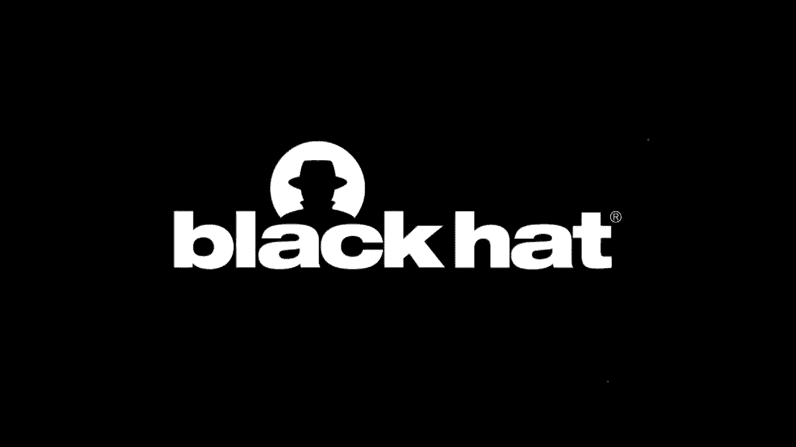
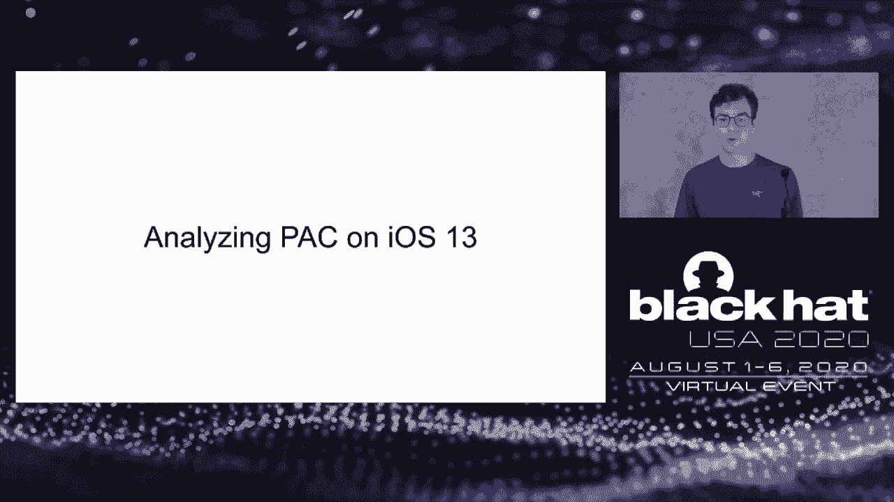
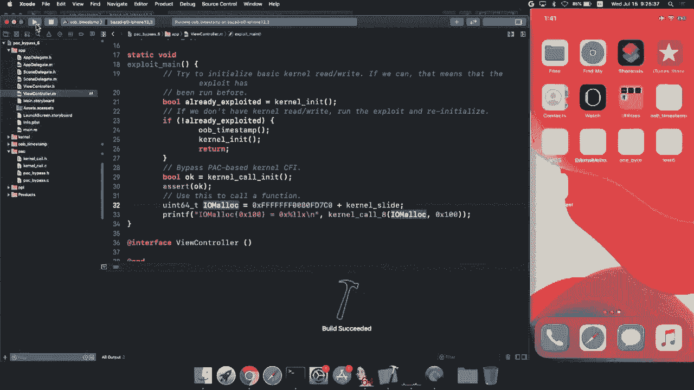
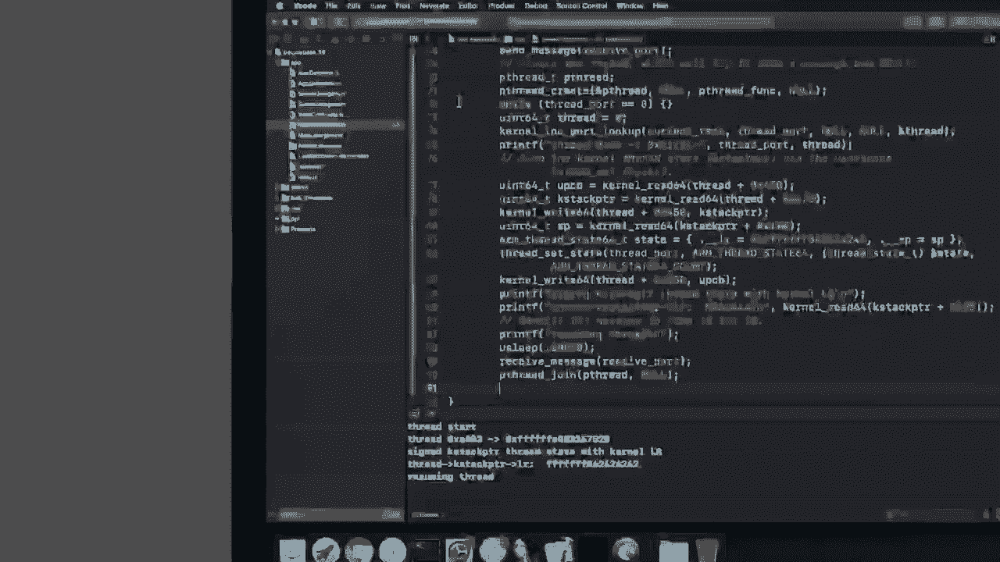
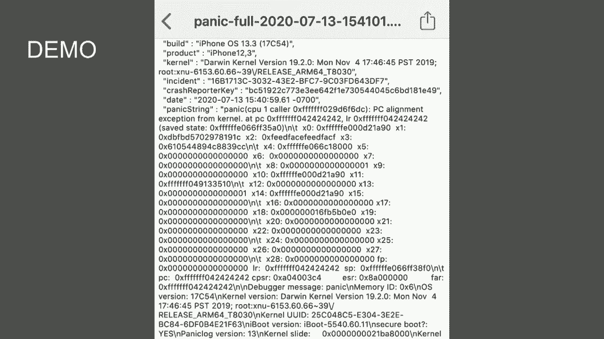

# P66：67 - iOS Kernel PAC, One Year Later - 坤坤武特 - BV1g5411K7fe

## 概述

在本节课中，我们将学习 iOS 内核指针认证（PAC）及其在 iOS 13 中的改进和漏洞。

## 指针认证（PAC）

PAC 是 ARM V8.3 引入的一种安全特性，旨在通过在指针中嵌入加密签名来保护内核代码的执行流程。

**公式**：



```
PAC = Hash(Pointer) + Signature
```

其中，`Hash` 是一个哈希函数，`Pointer` 是指针值，`Signature` 是加密签名。

## iOS 12 中的 PAC 漏洞



在 iOS 12 中，作者发现了几种绕过 PAC 的方法，包括：

* **中断利用**：通过在指针认证过程中触发中断，攻击者可以修改指针值。
* **参数读取**：通过读取内存中的参数而不是使用寄存器，攻击者可以修改参数值。


## iOS 13 中的改进

iOS 13 中对 PAC 进行了一些改进，包括：

* **增加受保护寄存器**：增加了 x16 和 x17 寄存器，使其在中断期间不可修改。
* **改进 switch 语句**：使用受保护寄存器进行间接分支，以防止并发修改。

## iOS 13 中的 PAC 漏洞

尽管 iOS 13 对 PAC 进行了改进，但作者仍然发现了一些漏洞，包括：

* **中断利用**：通过在 `thread_set_state` 函数中触发中断，攻击者可以修改参数值。
* **异常向量**：通过修改返回地址寄存器，攻击者可以控制异常返回流程。
* **上下文切换**：通过修改 `switch_context` 函数中的参数，攻击者可以控制上下文切换流程。



## 总结




PAC 是一种有效的内核代码执行流程保护机制，但仍然存在一些漏洞。iOS 13 对 PAC 进行了一些改进，但仍然需要进一步改进以确保其安全性。

**本节课中我们一起学习了**：

* 指针认证（PAC）的概念和原理
* iOS 12 和 iOS 13 中 PAC 的改进和漏洞
* 如何利用 PAC 漏洞绕过内核代码执行流程保护

希望这节课能够帮助您更好地理解 PAC 和其安全性。