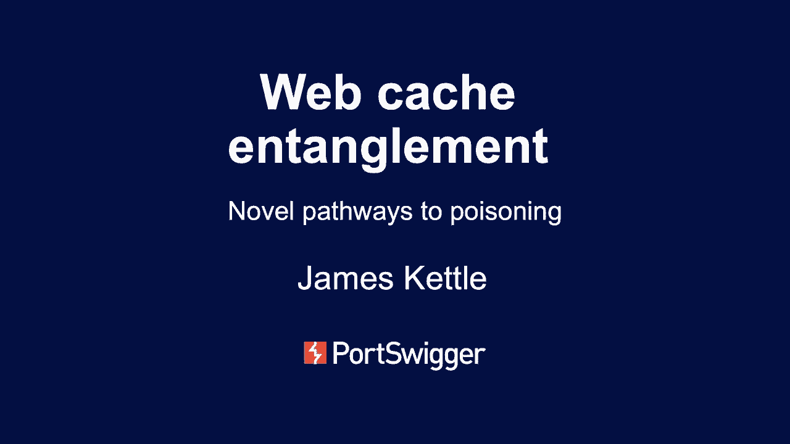

# P67：68 - Web Cache Entanglement - Novel Pathways to Poisoning - 坤坤武特 - BV1g5411K7fe

## 概述

在本节课中，我们将学习Web缓存纠缠，这是一种新的缓存中毒方法。我们将探讨如何发现一些非常特殊的缓存行为，并将它们结合起来，将垃圾漏洞转化为关键漏洞。

## 核心概念

**缓存中毒**：通过欺骗缓存保存有害页面并将其提供给其他用户。

**缓存键**：用于将请求映射到响应的键，通常是请求的一部分。

**缓存Oracle**：用于了解缓存工作原理的页面。

## 基本缓存中毒概念

缓存通过保存网页副本来减少后端系统的负载。缓存中毒是指欺骗缓存保存有害页面并将其提供给其他用户。

### 如何中毒缓存？

1. 将有效载荷放入请求中。
2. 希望应用程序发送有害的响应。
3. 缓存保存该响应并供其他用户使用。

### 问题

- 大多数应用程序从查询字符串和路径中获取大部分输入，我们无法直接编辑这些内容。
- 缓存键的理解过于简化。

## 缓存Oracle

缓存Oracle是一个页面，我们可以向其提出一系列问题以了解缓存的工作原理。

### 缓存Oracle的要求

- 可缓存。
- 告诉我们是否缓存命中或未命中。
- 反映整个URL和至少一个特定参数。

## 研究方法

1. 选择缓存Oracle页面。
2. 获取任何可用的文档或源代码。
3. 向缓存Oracle提出一系列问题以了解其工作原理。
4. 找到目标缓存中的怪癖。
5. 找到一个设备来改变它以创建强大的出口。

## 案例研究

### 简单场景

- 检查主机头是否包含在缓存键中。
- 检查查询字符串是否包含在缓存键中。

### 复杂场景

- 检查参数是否被隐藏或修改。
- 检查请求是否被规范化。
- 检查URL解析是否正确。

## 工具

- Parram Miner：用于发现缓存中毒漏洞的Burp Suite扩展。

## 防御措施

- 优化请求而不是缓存键。
- 不要接受POST请求体。
- 修复未解释的漏洞。

## 总结

在本节课中，我们一起学习了Web缓存纠缠，这是一种新的缓存中毒方法。我们探讨了如何发现一些非常特殊的缓存行为，并将它们结合起来，将垃圾漏洞转化为关键漏洞。