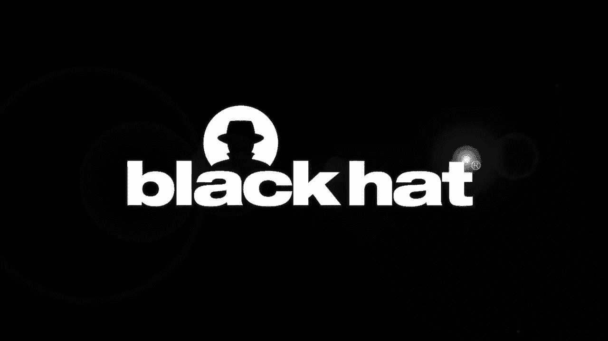
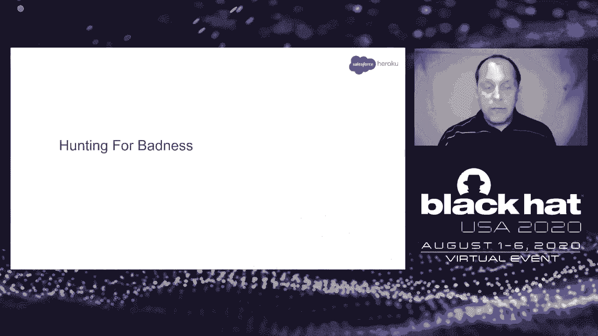
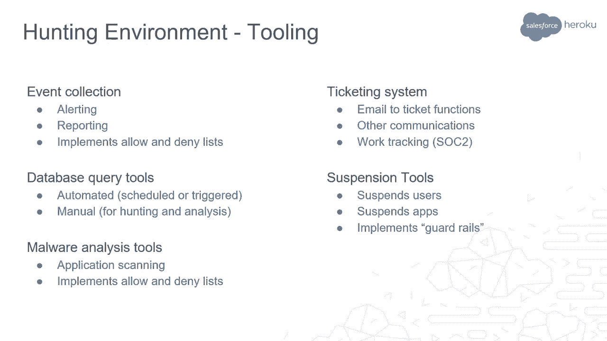
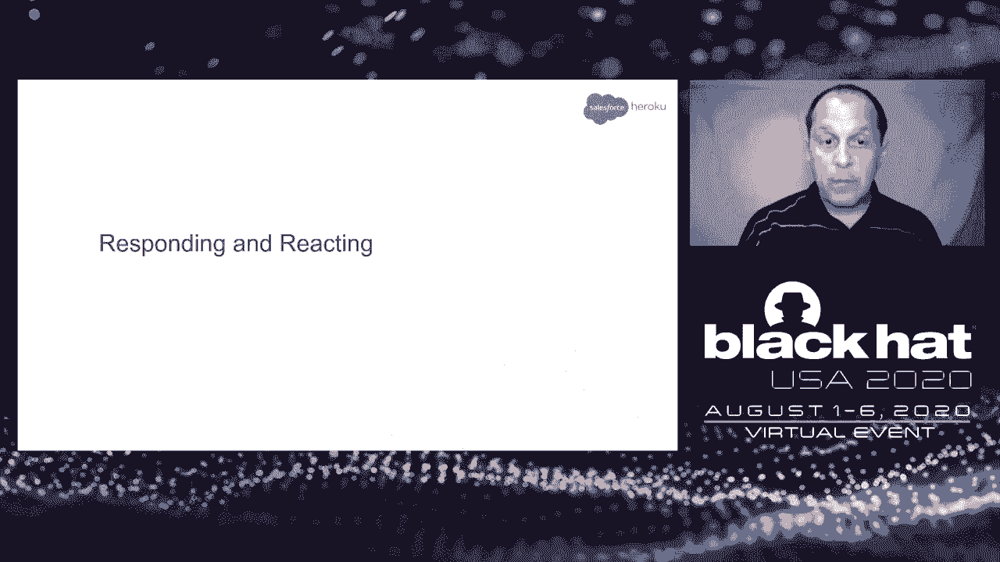
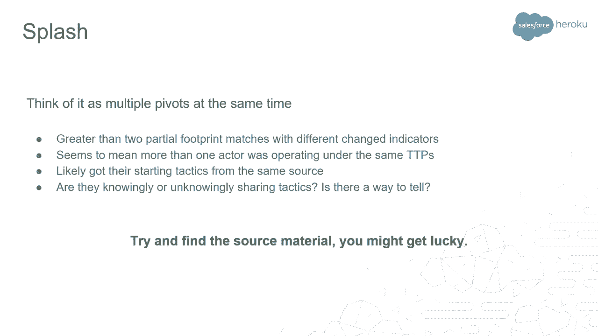
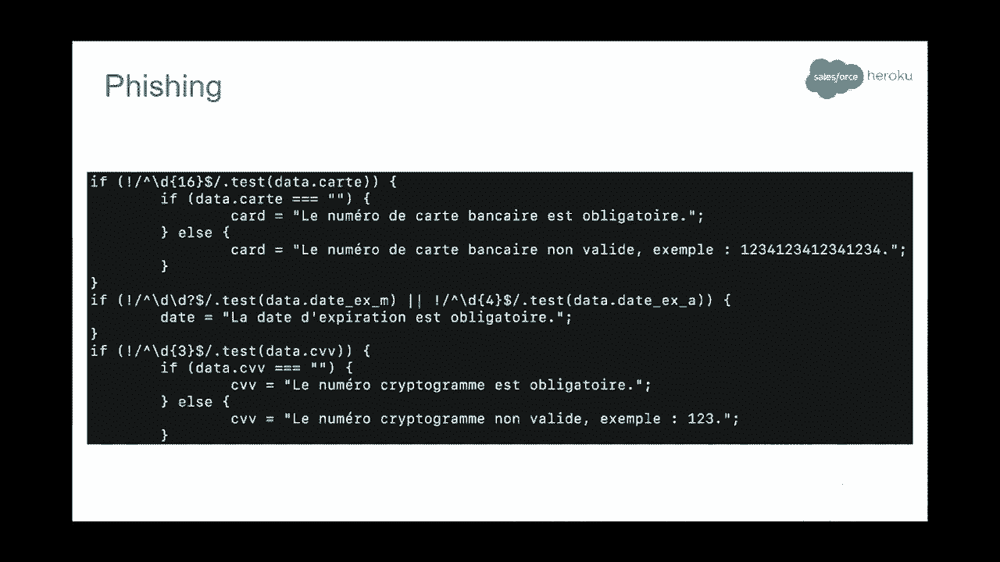

# P68：69 - Heroku滥用操作 - 穿着羊皮的狼 - 坤坤武特 - BV1g5411K7fe

## 概述

在本节课中，我们将学习Heroku的滥用操作团队如何追踪和打击滥用行为。我们将了解Heroku平台的特点、滥用操作的挑战以及团队如何使用工具和策略来保护平台。

## Heroku平台介绍

Heroku是一个平台即服务（PaaS）提供商，允许开发者快速将想法转化为在线应用程序，而无需管理底层基础设施。它支持多种编程语言，并提供可扩展性、备份、持续集成等功能。

## 滥用操作团队

Heroku的滥用操作团队负责防止用户在平台上进行不良行为。他们专注于防御滥用行为，例如恶意软件分发、钓鱼攻击和数据泄露。

## 滥用定义

滥用被定义为对任何事物的意外货币化。例如，一个免费服务或试用版可能会被滥用者用来赚钱。

## 滥用类型

滥用可以分为无意滥用和有意滥用。无意滥用可能是由于用户对平台的不了解，而有意滥用则是故意利用平台进行恶意活动。

## 滥用检测

滥用操作团队使用多种方法来检测滥用行为，包括：

* **可疑指标**：例如，异常高的CPU使用率、异常的网络流量或异常的应用程序行为。
* **事件收集器**：收集和存储平台上的事件数据。
* **数据库查询工具**：分析数据库中的数据以查找滥用模式。
* **恶意软件分析工具**：扫描应用程序以检测恶意软件。

## 滥用响应

一旦检测到滥用行为，滥用操作团队将采取以下措施：

* **暂停账户**：暂停涉嫌滥用行为的账户。
* **收集证据**：收集与滥用行为相关的证据。
* **删除内容**：删除恶意软件或钓鱼网站。
* **通知用户**：通知用户有关滥用行为的信息。

## 滥用案例研究

本节课中，我们将探讨两个滥用案例研究：

1. **加密货币挖掘**：一个滥用者使用Heroku平台来挖掘加密货币，并试图通过隐藏其活动来避免检测。
2. **钓鱼攻击**：一个滥用者使用Heroku平台来创建钓鱼网站，并试图窃取用户的个人信息。

## 滥用操作团队的经验教训

* **持续改进**：不断改进检测和响应策略，以应对不断变化的滥用模式。
* **团队合作**：与业务团队、安全团队和其他团队紧密合作，以共同打击滥用行为。
* **自动化**：使用自动化工具来提高效率并减少人工工作量。

## 总结

在本节课中，我们一起学习了Heroku的滥用操作团队如何追踪和打击滥用行为。我们了解了Heroku平台的特点、滥用操作的挑战以及团队如何使用工具和策略来保护平台。通过学习这些经验教训，我们可以更好地了解如何保护我们的平台和用户免受滥用行为的侵害。