# P69：70 - A Decade After Stuxnet's Printer Vulnerability - Printing is Still the Stai - 坤坤武特 - BV1g5411K7fe

 [MUSIC]。

 >> Hi， thank you for joining our talk。 A decade after StockNet's print of accessibility。

 printing is still the story to heaven。 First， let's introduce ourselves。 My name is Pellegadar。

 I'm in the InfoSec field for more than seven years。

 Currently working as a senior security researcher at SafeBridge Labs。

 My main focus is on Windows internals and vulnerability research。 >> Hi， my name is Tom Rabarro。

 I'm in the InfoSec field for more than 15 years。 Currently。

 working as a research team leader at SafeBridge Labs。 My main focus is on APT research。

 Windows internals， and vulnerability research。 In this presentation， we will cover the following。

 We will demonstrate our threat actor might have the ability to build the propagation part of StockNet 2。

0。 We will do that by walkthrough on the vulnerabilities which were used by StockNet。 For each one。

 we will describe the root cause， describe the patch， and， evaluate the effectiveness of the patch。

 We will continue with a deep walkthrough of our print spoiler research findings。

 including demos of the two zero days。 Finally， we will suggest a new mitigation for the entire arbitrary fireright bugless。

 We will be focused on answering two fundamental questions。

 Is it possible to build equivalent propagation capabilities as StockNet capabilities？

 Second question， if I fully patch my entire Windows operating system， am I safe now？

 Last note before we start， we will use two symbols during our presentation。

 An arrow patch means that the patch logic is very specific and it was possible to re-exploit it。

 And secondly， a regular patch means that it solves the problem and。

 has not been bypassed until nowadays， as much as we know。 Now that we are ready。

 let's see the recap and the timeline of StockNet。 StockNet is considered by many to be one of the most complex and。

 well-engineered computer worms ever seen。 It is believed that the project was developed in 2006 and。

 lasted four years until it was discovered。

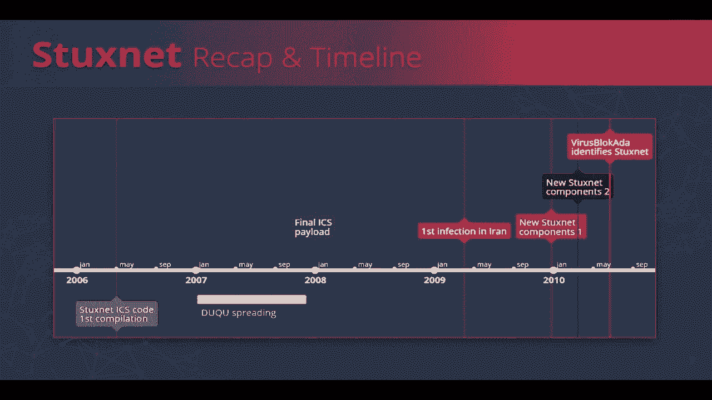

 So this is how Hollywood imagines StockNet。 Actually， I love Hollywood， but in real life。

 StockNet can be described by the following three parts。

 The first part is the propagation to the target network by using three remote。

 code execution exploits and two local privilege escalation exploits。

 The next part is the special evasion techniques， which allows StockNet to operate under the radar。

 The third part is the final payload delivering specifically to Siemens PLC。 In our opinion。

 a decade after StockNet， the most interesting part is， the propagation capabilities。

 which is still relevant to almost any targeted attack。

 Let's zoom in into StockNet propagation capabilities。 We will describe them one by one。

 Although it was a decade ago， it's still relevant to all of us because according。

 to a research posted in 2017， those capabilities were used widely after。

 StockNet for attacking a wide range of organizations。 Let's dive deeper， ending over to Paylup。

 Thank you， Tomer。 So let's start and talk about the other capability， which was used by StockNet。

 It used it to spread via weaponized USB flash drives。

 traveling between internet-facing computers and internal network computers。

 So the attack vector contained a crafted LNK file， which is a shortcut file。 Once it was displayed。

 an arbitrary DLL， which was specified as the icon file， of the LNK， was executed。

 Here's a screenshot of a crafted LNK file， which exploited the vulnerability。

 You can observe that the LNK file contains the following。

 The path of the CPL external file and the icon ID， zero。

 which caused the code to trigger the execution of the DLL。 Every time DLL and K file was displayed。

 So let's take a look at the exploitation path and how it was patched。

 The main problem was that instead of loading the CPL DLL file as a data-only file。

 by using load library X， the code actually called the load library W function。

 and also executed the DLL。 We expected the patch to replace this call in order to avoid execution。

 but let's see what was actually happening。 So the patch added two validations in order to mitigate the vulnerability。

 First， it checked that the provided CPL file was on Microsoft's white list。

 and was allowed to be loaded。 Next， the icon ID， which we control。

 would have been extracted and converted from a string。 If the ID was zero。

 it would override zero with minus one， meaning it wouldn't be loaded。 The path was very specific。

 because as you can see， the load library function still existed。

 meaning that if someone would have been able to bypass the validations。

 then the CPL could have been executed。 So let's see the bypass， which was patched five years later。

 In order to bypass the patch， we need to bypass the icon ID check and transform it to zero。

 It can be done if you will be able to send the minus sign as a parameter to STR to in W function。

 Let's see exactly how it was done。 Because of a type confusion between a white car buffer and a car buffer。

 the original icon ID string was truncated。 We can exploit it by providing a long enough buffer。

 so the icon ID will turn into the minus sign。 Once STR to in will return zero as the icon ID。

 our arbitrary CPL will be executed。 The patch for this one was pretty simple。

 The truncation bug was removed。 The code to load library， which was the actual root cause。

 wasn't changed。 That means that if there's another way to trigger the load CPL module function。

 it would have been still vulnerable。 And apparently there was。 Two years later。

 a new vulnerability was discovered and patched。 It's called the load CPL module function by using another exploitation path。

 which was left unpetched。 So the patch for this one was adding the previous logic of a CPL white list。

 But load library still was not replaced。 What's interesting here is that we have noticed that there is another last path to load library function。

 but we haven't seen any disclosed vulnerability yet。 So moving to the next propagation capability。

 next we will talk about the Stuxnets RPC vulnerability， handing over to Tomer。 Thank you， Peric。

 On 2006， three years before Stuxnet first known infection。

 a new Wombl RPC vulnerability was discovered and patched。 According to Microsoft。

 it was a very limited scope attack back then。 But later on。

 a very similar exploitation path was used by both Stuxnet and Conficker Womb。

 which became one of the most credible Womb ever seen。

 RPC vulnerabilities were the main cause of global computer warms since 2003。 Remember， Blaster。

 so it's obvious that the cause of availability in this mechanism is huge。

 Let's dive into the specific details。 The RPC vulnerability root cause that we will present is due to a canonical path。

 So let's understand what is it， a canonical path。 It's actually a pretty simple。

 It gets an absolute path and converts it to the shortest absolute path in the meaning of string length。

 The most common usage of canonical path is for textual comparison of two different representation of the same canonical path。

 The original vulnerability was a type confusion which lead to a classic stack-based buffer overflow。

 The vulnerable function was copying a buffer which exceed the allocated buffer。

 causing memory corruption。 Here is the exploitation path。

 An RPC request triggered a vulnerable function remotely。

 which lead to an out-of-bound write caused by WCS-cat function。

 Please notice the RPC function's name and TnetPW， we will explain why it's important in the following slides。

 The patch added a proper buffer length check， which eliminated the original buffer overflow vulnerability。

 Two years later， a newer vulnerability was discovered in the same exploitation path。

 This time it was discovered in the RPC-RAPO function， which is called NetPR。

 This function caused the original vulnerable function directly。 Remember NetPW？

 Let's dive into the root cause。 So the root cause of the vulnerability is that the input path includes more /。

/cals than the number of prior directory entries。 This will result in gaining control over the output buffer pointer。

 which will point backwards on the stack and will trigger out-of-bound writing after calling the WCS-copy this time。

 So the patch MS-867 replaced the WCS-copy function with a safer function string-copy-worker W。

 Let's dive into stack-net-toss scheduler vulnerability。 But first。

 let's understand how the task scheduler wrote。 The task scheduler job。

xml file contains the metadata of a job， including which user will execute the job。 The folder。

 which contains it， is writable by all users。 To protect the integrity of the job configuration files and prevent user from modifying them。

 task scheduler calculated a COC32 check sum on each created task。xml。

 When it's time to start the job， task scheduler recalculated the XML check sum and compare it to the original value。

 If they matched the job executed， if not， it would have been ignored。

 The COC32 algorithm is collision-prone， which may lead to data forgery。

 Stuxnet DOD exploited this fact by forging an XML file of a job which was executed as anti-authority system。

 It added a custom COC32 check sum， which was identical to the original task XML。

 therefore it would have been executed as a system， resulting in a local previous relation。

 In the patch， MS-1092， Microsoft implemented a second integrity check by using the SHA-256 algorithm。

 implemented by the compute-ash function， which is less collision-prone。 Moving forward。

 nine years later， a neural task scheduler vulnerability was found。

 The vulnerability abused the backward compatibility feature of the task scheduler mechanism。

 which provides the option of migrating all task from C-Windows task folder， to the new task folder。

 which is System 32 tasks。 In order to exploit it， the attacker would need to perform the following four steps。

 Step one， create a new job。 As a result， an XML file would be created in the new task folder。

 Step two， override the job file in the legacy task folder。

 with an R-link to the file which the attacker wishes to control。

 The third step is creating a new legacy task， with the same name。 And finally。

 trigger an old to new task migration over RPC。 As a result。

 the task scheduler service would update the security information of the file。

 which the attacker wishes to control， granting the attacker full control privileges on it。

 The attacker can now replace a right to any file， gaining a local privilege escalation。

 So this is the exploitation path that was used。 Let's see how Microsoft patched it。

 The patch makes sure that the file is not as involved in clink， by using two different checks。

 The first checks verify that the original path is the final path of the file。 If it's different。

 it means that it was redirected by a symbolic link。

 And the second check verified that the number of the file's anti-FS links is not bigger than one。

 Okay， so let's see the fourth vulnerability moving over to Win32K。 Actually。

 there were dozens of Win32K local privilege escalation vulnerabilities over the last decade。

 Here is the list of several options from 2020， which can replace the original already patched。

 vulnerability in order to rebuild the Stuxnet 2。0 propagation capabilities part。

 The only capability which remained is the print spoiler vulnerability。

 Let's start to talk about our printer's spoiler research and findings。

 We will start by presenting how we found a 20+ ear-old bug by using 20 minutes of fuzzing。

 We have noticed that each time a print job is being created， it is represented by two files。 First。

 an SPL file， which simply contains the data to be printed。 Second， an SHD file， a shadow file。

 which will be focused on。 It is represented by the undocumented shadow file struct and contains the metadata of the print job。

 For example， printer name， printer port name， document name， etc。

 We found that the printer's folder， which contains the SHD files， is writable by all users。

 And that the SHD files are being processed once the service is started。 So we ask ourselves。

 what will happen if we craft our own SHD file？ So we started to mutate the SHD files and fuzz the service。

 After 20 minutes of fuzzing， we had our first crush。

 We have managed to crush the print spoiler service by using a limited user and a crafted SHD file。

 It has appeared that the code was trying to dereference some part of our data。 To retain it。

 it is as a pointer to a security descriptor without any validation or sanitization。

 of the data we provided in the SHD file。 Microsoft did not fix this bug。

 We will show the response in the end of our talk。

 Okay， demo time。 Let's see a demo of the crush in the latest Windows 10 insider build。

 So on the left side， Johnny is a limited user。 We can see that we are running on the latest Windows 10 fully patched machine。

 On the right， the user， John， is a administrator and is used only for convenience to avoid restarts。

 of the OS instead will restart the service to trigger the vulnerability。

 So we are copying the crafted SHD file to the printer's puller directory。

 And now we will trigger the vulnerability by restarting the service。

 and listing the printers via WMI command。

 As we can see in Prothmon， we crash the service。 We will copy the SHD file and the SPL file to the printer's puller folder。

 And we will use John as an administrator from convenience reasons。

 to avoid OS restarts and instead we will restart the spuro service instead。

 And after listing the printers， we can see that the service is crashed。

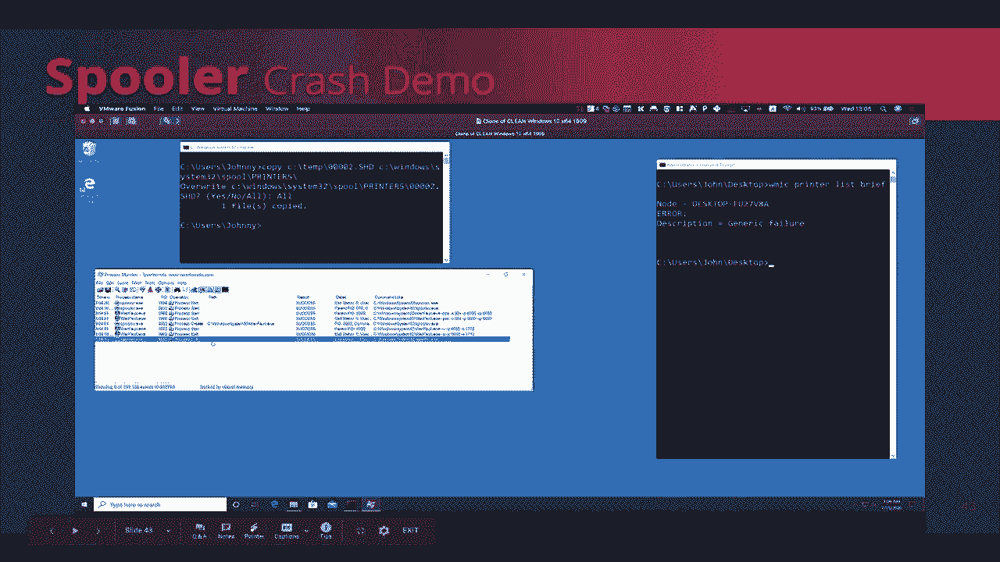

 Thank you。

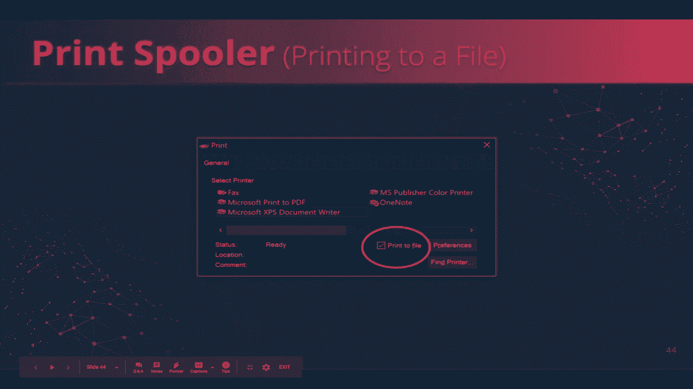

 So the crash was cool but we wanted more。

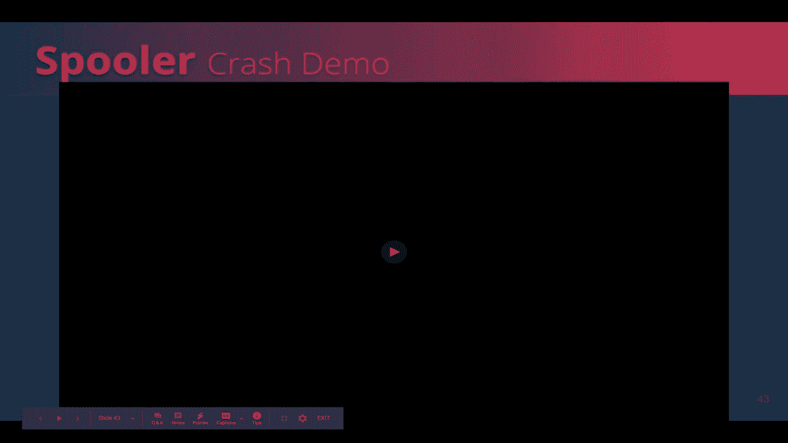

 Let's talk on how we got local previous installation twice。 One of them is still zero day。

 So in order to understand the next vulnerabilities we found。

 we will dive into the printing process in the Windows OS。

 The print spuro is the service which is responsible for creating and handling print dumps in the。

 windows OS。 Accessing the print spuro is possible remotely， for example using a shell printer。

 and locally。 We will focus on the local scenario。 More specifically。

 we will focus on the fact that the spuro that allows the user to print to a file by using a。

 virtual printer。 This is an important part which our fellow Sludge rely on。

 A quick brief on the flow of printing to a file scenario。 First。

 a user sends some data to be printed using an application， for example notepad。

 and specifies which file he would like to print to。 It means that the data will be printed。

 which means we will be written to a file using a virtual。

 printer instead of printed to a real printer。 The spuro service spuro。exe which is the RPC server。

 gets the request。 Later on， the local print provider which is responsible for printing data。

 to files will print the data into the file which was specified by the user。

 Let's start with the first print spooler vulnerability which was used in Stuxnet。

 This is the flow of the vulnerability which was providing a remote code execution。

 The vulnerability exploited the fact that the spooler allows the user to print to a file。

 on a remote computer on behalf of a system and has printed a malicious file to system 32。

 which was a mock file。 So it was patched on 2010。 The patch included two validations。 A。

 Check if the printing job was dispatched locally on the machine itself or remotely。 If remotely。

 it will override and ignore any requested file write operation。 Second。

 it will check that the user have write permissions to the path of the file。

 that he wanted to print to before it's writing to it。 Moving forward to 2020。

 we have found a way to bypass the patch locally using almost the same， exploitation path。

 The first check bypass is obvious because we shifted from a remote。

 code execution to a local privilege escalation。 The second check needed some work， so let's dive。

 into our print spooler research。 We found that a limited user can do some interesting operations。

 without any elevation required by just using partial commands。 For example。

 adding a virtual printer which prints to a local printable， meaning it will print to a file。

 And specifying a path of the file which he doesn't have access to。 For example， system 32。 Okay。

 interesting。 So does that mean that a user can just print any data he would like to system 32？

 Let's check。 So apparently no， or that's what we thought。 As we mentioned before。

 the MS-1061 patch has， added a function which validates if the user can write to the path he asked to print to。

 which means that the user won't be able to print data to system 32。

 So let's understand how can we bypass it。 Every time the print spooler initializes。

 it processes the shd files which are waiting to be， spooled in the same directory for every user。

 A limited user can create an shd file which， represents a print job which prints to any path。

 for example， system 32。 Once the print spooler， restarts。

 it will process the shd file without being impersonated or aware of who created a print job。

 Therefore， it will operate as anti-authority system and will print the data to any file as。

 anti-authority system resulting with allowing the user to write data to any file on the system。

 and gaining an arbitrary file write and a local pre-read escalation。

 This was actually the bypass of the second patch validation， specifically for the validate output。

 file function。 Because the spooler is running as anti-authority system， it has writing permissions。

 to almost every file on the file system。 So the check will pass successfully。

 So let's see a demo of the first local pre-read escalation we found in the print spooler。

 As you can see， we are running under the context of a limited user。 We're using a full。

 Windows 10 machine from March before our vulnerability was patched。

 We're using Johnny which is a limited user。 So first we'll use PowerShell in order to do the following stuff。

 We will add a printer， bolt which allows us to print to System 32。

 We will add a printer diver which allows us to， create a virtual printer。 And finally。

 we will add a printer which is using the System 32 port。

 Next we will use a pre-crafted shd file which represents a print job which prints to System 32。

 and we will use a DLL payload which we would like to write to System 32。 We will rename it to。

 SPL and we will copy it by using our limited user to the spool print-als folder in System 32。

 which is writeable by all users。 Now before we will restart the VM。

 we want you to notice that there are only three users in the computer。

 administrator Johnny and John and that the following file you need those 32 which names。

 exploited TXT does not exist。 Next let's restart the VM by our limited user in order to。

 the print-spooler will process our shd file。

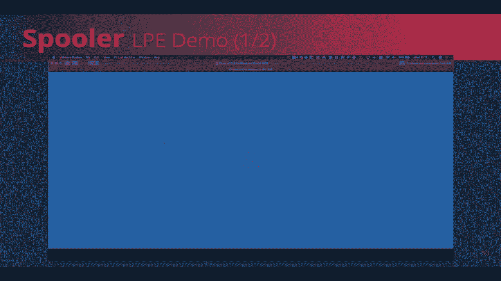

 Once we are logged in back into Johnny user， the print-spooler service will process our shd。

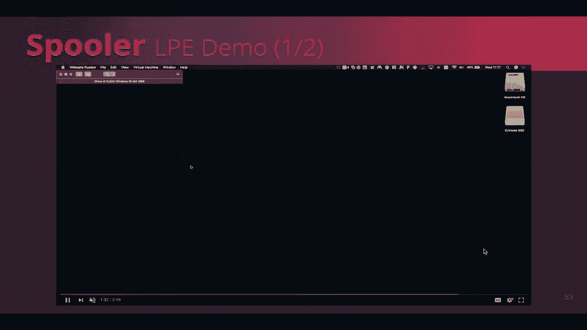

 file。 We will treat it as a print job and we will write our file to System 32。

 Next window service will execute our DLL and as you can see we have been able to add a new。

 administrator to the computer and we was able to write a file to System 32 named Exploited。txt。

 Now let's verify that we were actually added in as administrator。

 We will open a command prompt which is elevated and we will just log in using our new administrator user。

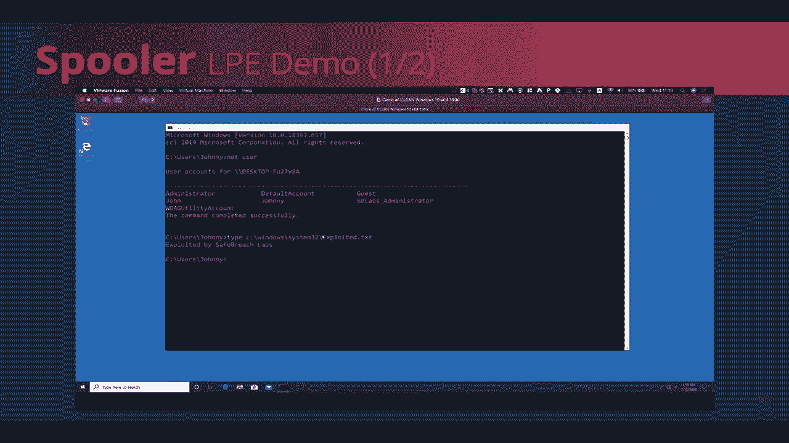

 As you can see。

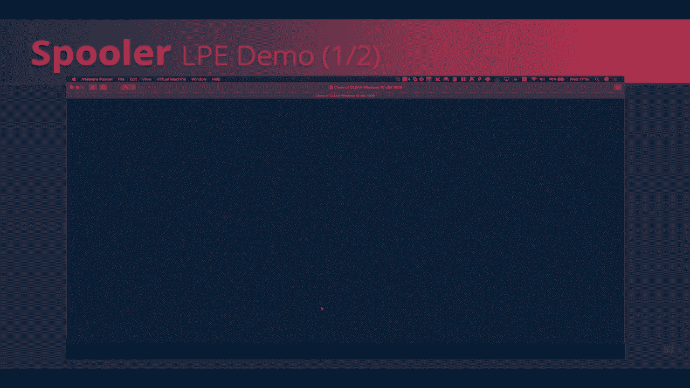

 the administrators group contains our user。 So we've been able to gain local preview escalation using the print-spooler service。

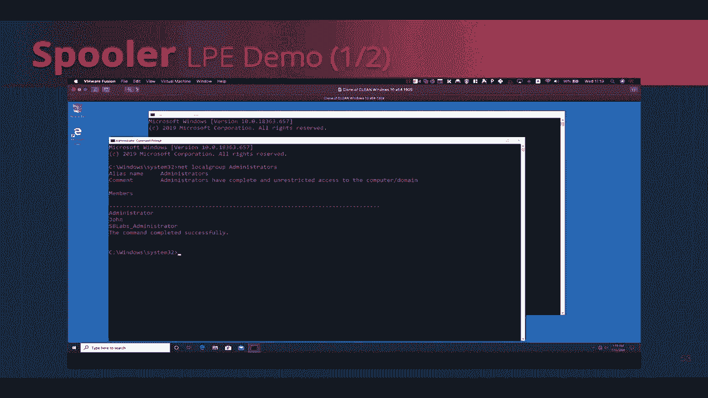

 So now that we coupled them all together we reached our destination。

 We have found equivalent capabilities to allegedly build Stuxnet 2。0 propagation path。

 but our work is not over yet。 After the first vulnerability we found was patched we've been able to re-exploit it。

 and we created it with CVE 2020 1337。 Microsoft are currently working on a fix which will be。

 deployed in the upcoming patched user。 Therefore we can't release any technical details right now。

 We will publish it once the patch will be deployed but let's see a demo。

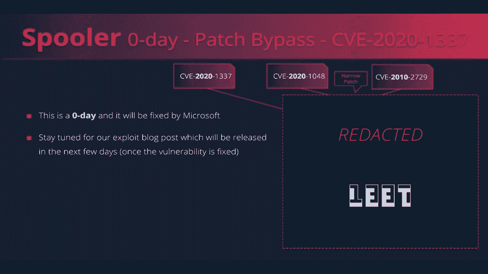

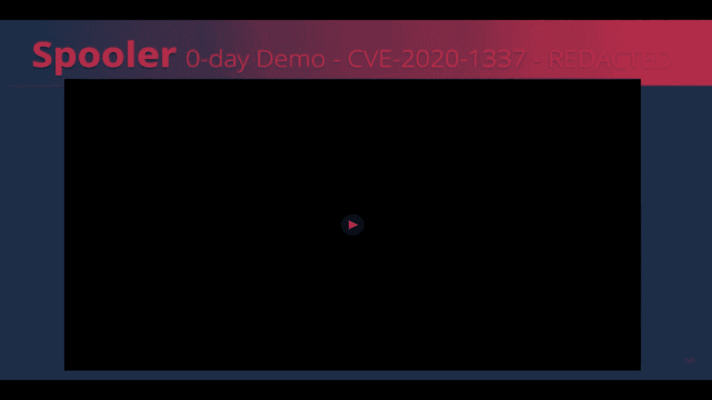

 So as you can see we're running under the context of Johnny which is a limited user。

 We're running under a fully patched VM。 Under the context of Johnny we will execute our exploit which will bypass the patch of CVE 2020 1048。

 After we crafted our shd file we'll copy to the print-spooler directory。

 But first you can notice that the exploit。txt file does not exist and that we have only three。

 users as before。 Now let's restart the VM。

 Once it was initialized we will log in again toward limited user Johnny。

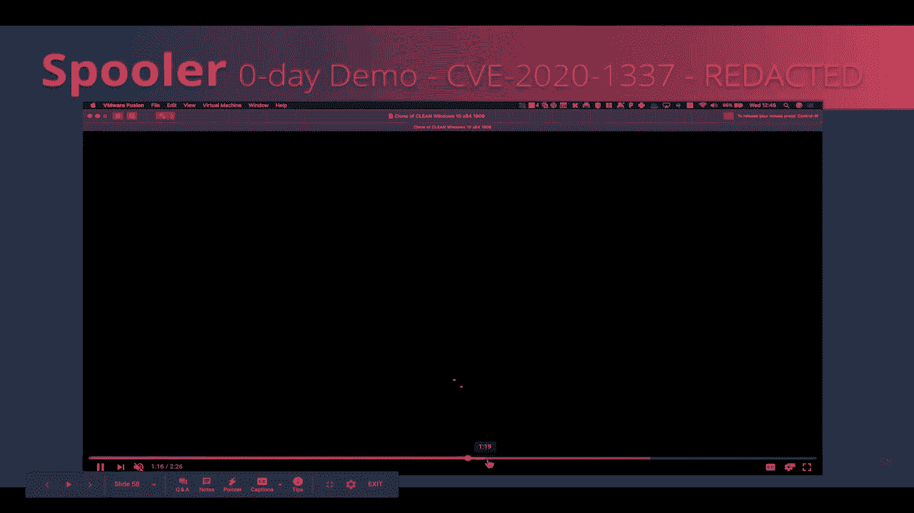

 Now as before the print-spooler will process our shd file and will print the data to system 32。

 which is our payload which is a dll file。 Our dll file will be loaded into an elevated。

 anti-authority system service and we will gain code execution。 Now let's try and find the exploit。

txt file。 As you can see we write it in data to system 32。

 and we have been able to add an administrator user once again to the VM。

 Let's execute a command prompt which is elevated。

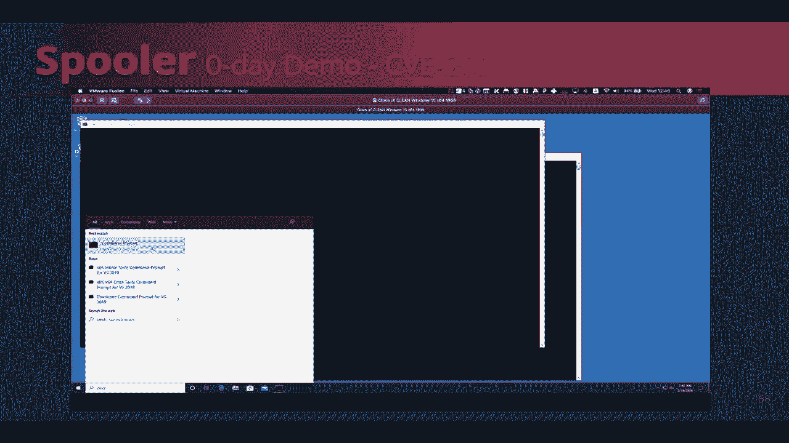

 And let's log in using our new administrator user。

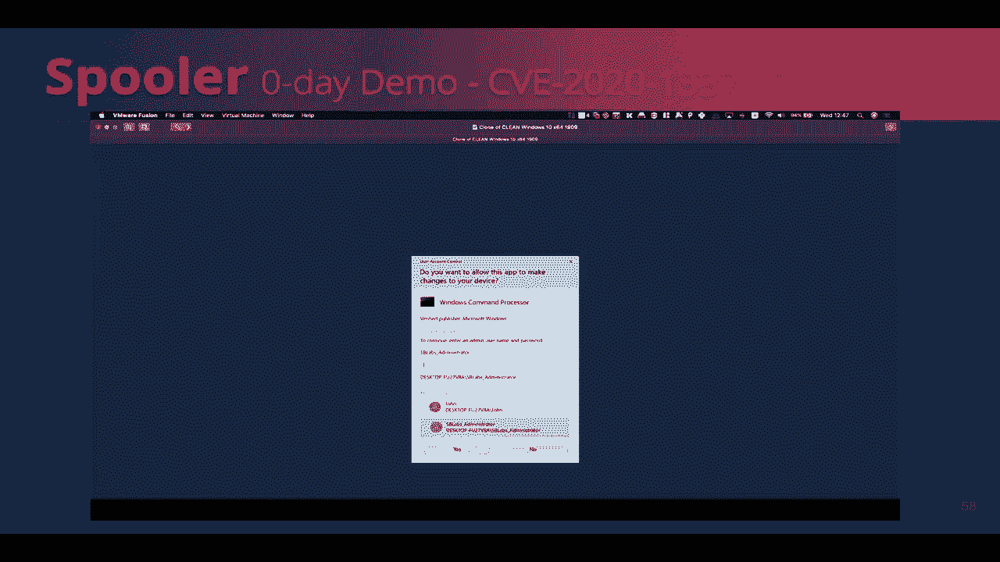

 As you can see we have again a local pre-read escalation and a code execution using the。

 print-spooler once again after the first vulnerability was patched。

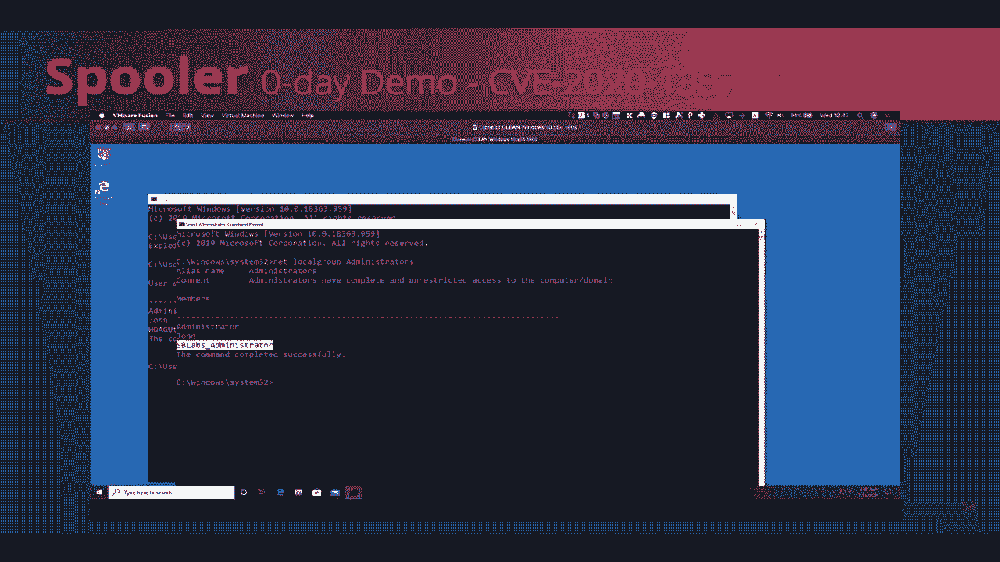

 Handing over to Tomer。 Wow， 137 that's awesome。 So going back to our second question we would like to propose an additional possible solution。

 as a second level for patching。 We believe in a level security mitigation approach。

 So we reported to members of C on each vulnerability we found， but we still believe it's not enough。

 So we developed a POC for real-time prevention of the attack。

 The main root cause of the arbitrary file right back class in the context of local pre-vig installation。

 is the fact that a limited user is allowed to write directly to the following location。

 This is dangerous and can be exploited very easily and we found that it's actually not really needed。

 for the regular use。 Today we will release a mini-fielder driver which restricts any far。

 right operation by a limited user to some of this location as a POC。 This mitigation。

 proposal is not specific to the spooler's vulnerabilities and can be used as a template。

 for mitigating the arbitrary far right back class。 Please treat the driver as a POC and be careful。

 not to execute it in production system before validating it for false positive。

 Let's see at the end。

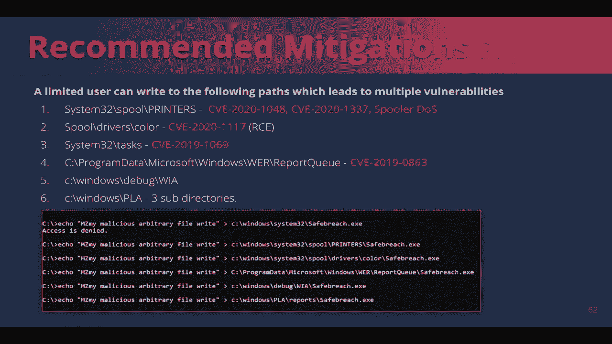

 Okay so this time we are running on Windows 10 RS1 an older version without the patch for the。

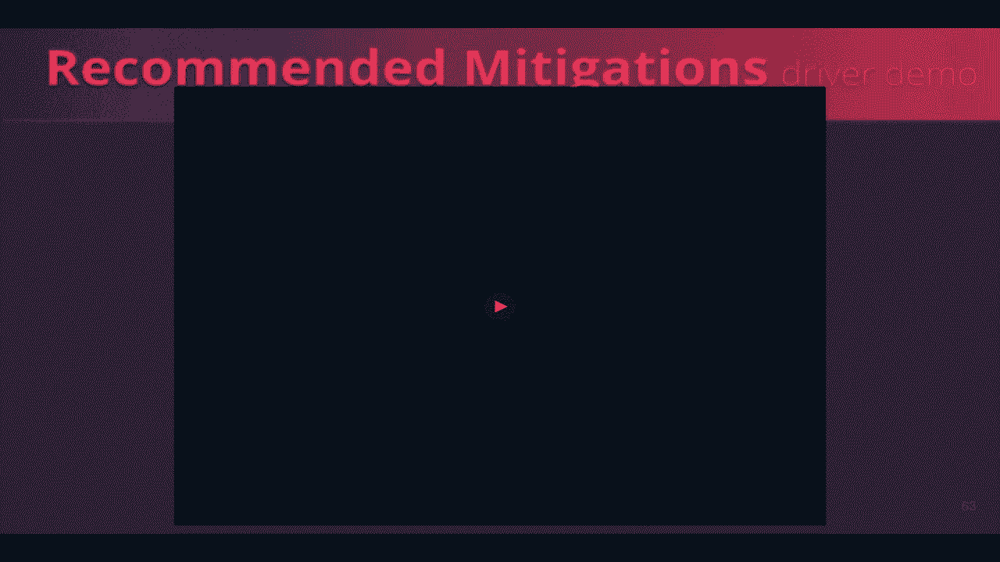

 vulnerability we were going to use and as usual we are running as joining a limited user。

 Let's make sure that our driver is loaded to memory。

 And now we present that a regular usage of printing is allowed。

 So our driver will examine the file right of the SPL and SHD file and we'll allow it。

 We can see that there are two files in the printer spooler folder with size which is not zero。

 And now let's copy the SHD and SPL file to the printer spooler directly。

 Now actually our driver examined the right and blocked it。 You can see that the files are F0 side。

 Let's demonstrate a task scheduler exploit。 This is a public exploit and we can see that our driver。

 blocked the right。 So for Microsoft's response for the spooler's local privilege escalation。

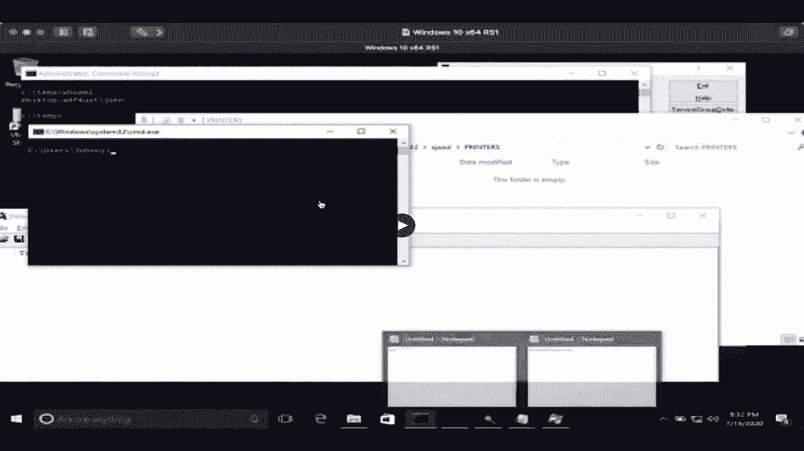

 the additional vector for CVE 2020 1048 will be addressed in August 2020 as CVE 2020 1 3 3 7。

 And for the spooler denial of service the technique results in a local denial of service。

 which doesn't meet Microsoft servicing bar for security updates。

 We would like to give credit for the following people for researching similar areas。 Alex UNESCO。

 and your then Shofir， Dave Weinstein， IT anchor and JINGOA KIA。

 Today we release our repository which includes an exploit POC for CVE 2020 1048 and an exploit POC。

 for the zero-day denial of service of the spooler service， the driver for the arbitrary。

 file right mitigation and in a few days on August 12 we release the CVE 2020 1 3 3 7。

 super late exploit POC。 Please check our repository。

 Thank you for joining us and let's go over for the Q&A。 So thank you everyone for joining us。

 We'll take questions now。 So first Jamie Butler asks do you need to restart the service or can you just enumerate the print。

 jobs or something？ So the answer is you need to restart the service in order to trigger the vulnerable。

 function。 Once you restart the service you need to trigger the vulnerable function but we found a way。

 we just triggered the RPC request。 So you definitely need to restart the service and then。

 you just find a workaround and enumerate the print jobs。 Any more questions？ [silence]。

 Yeah of course we will provide a link to the driver POC in our safe bridge repository in the。

 we will upload it in a couple of minutes once the presentation will be finished。 Any more questions？

 So Ricardo the link to the saved bridge labs， it's a repository you can google saved bridge labs it's this full repository and we will also。

 provide it in the the slide itself and Samuel the workaround that we found for restarting the。

 services of course just restart the computer and in the presentation of the crash in the POC of。

 the crash we just used and limited the elevated user in order to restart just to make it faster。

 but at the limited user you will just restart the VM。 [silence]。

 So there is a question about the false positive that we are seeing in our mini filters so actually。

 we haven't seen many false positives or any actually but we haven't tested it a lot in many。

 systems which we've put multiple settings so we encourage people to test it and we believe it will。

 be able to present some future zildes。 So Ricardo asked after this new CPAAD do you foresee an。

 impossible exploit coming out using similar probes？ Actually we don't know we'll wait for the patch。

 to see so we hope not。 And we'll make slides available and we will offer them a blacker to Apple them at the end of the day。

 and we will offer them to a heater repository as well。 There's about four minutes left for you guys。

 [silence]， So Willem asked the principle print file is empty system because it crashed the spoiler。

 and it lost track of who the original user was so it's almost accurate so the principle。

 doesn't know who sent the printing who wrote the SAT file so it works as a system but it does not。

 relate to the fact that we crashed it。 The crash was a different POC and the elevation of privilege。

 was because we restarted the computer so we didn't know who initiated the print who pasted the SAT file。

 So actually we used the custom fuzzer in order to fuzz the service。

 Now nothing that is already known we just wrote our own parking script in order to use the puzzle。

 [silence]， And with application whiteness in prevent this exploit。 Actually I'm not sure。

 Do you understand？ Yeah but I think that the most important thing is to prevent something that you don't know beforehand。

 So our driver is taking this approach and it doesn't need to know which specific vulnerability is。

 being exploited it just mitigates the root cause so it's a better approach。

 We don't have any plan to publish the custom puzzle we will think about it but we didn't plan to。

 [silence]， Can you define what it means to fuzz something？

 So basically fuzzing is a very big topic of course but。

 in our scenario we just used something that mutated the SAT file and just used random inputs。

 until we crashed it then we started to dive in and understand。 So to fuzz it's basically to use。

 random inputs and send it to the service。 Any more questions？

 So of course we will publish the guitar repository on our feeder on。

 Sabret feeder and on my personal feeder as well and it's important to say that we wrote a disclaimer。

 for the driver code we would like you to read it before you will use it。 It's important。

 Thank you for joining us Ricardo said what you used to modify SAT file。 So when we started the。

 research the SAT file was pretty un-optimited so we were just going to need the format and we used。

 010 editor in order to understand it very well and we also added the templates and we will publish。

 it on GitHub in a few minutes。 It's actually it's just distracting C which we used in this particular editor。

 But mitigation to recommend on full and official purchase release。 So basically we don't want to。

 disclose anything that's specific that might tell what was the availability so we just say。

 let's wait a few days until Microsoft will deploy the patch。 We're at Tiny New Journal。

 Okay thank you very much。 Thank you for joining us。

