# P69：70 - 十年后Stuxnet打印机漏洞 - 打印机仍然是通往天堂的道路 - 坤坤武特 - BV1g5411K7fe

## 概述

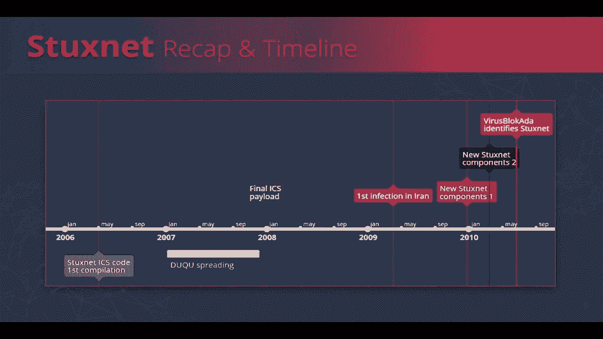

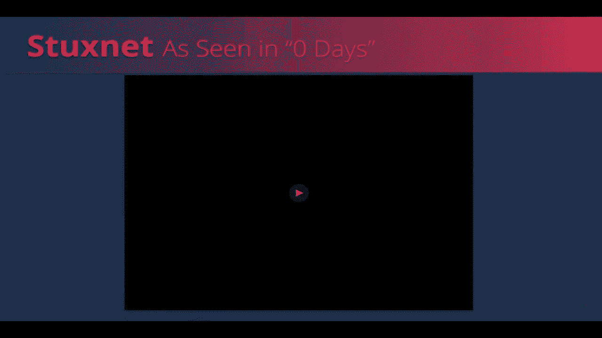

在本节课中，我们将探讨Stuxnet打印机漏洞及其影响，并分析打印机仍然是网络安全中的一个重要威胁。

## 讲师介绍

* **Pellegadar**：安全研究员，专注于Windows内部和漏洞研究。
* **Tom Rabarro**：安全研究员，专注于APT研究、Windows内部和漏洞研究。

## Stuxnet打印机漏洞回顾

* Stuxnet被认为是历史上最复杂和最精良的计算机蠕虫之一。
* 它于2006年开始开发，持续了四年，直到被发现。
* Stuxnet的传播能力至今仍然相关，对几乎所有针对性强攻击都具有重要意义。

## Stuxnet传播能力分析

以下是Stuxnet使用的几种传播能力：

### 1. 通过武器化U盘传播

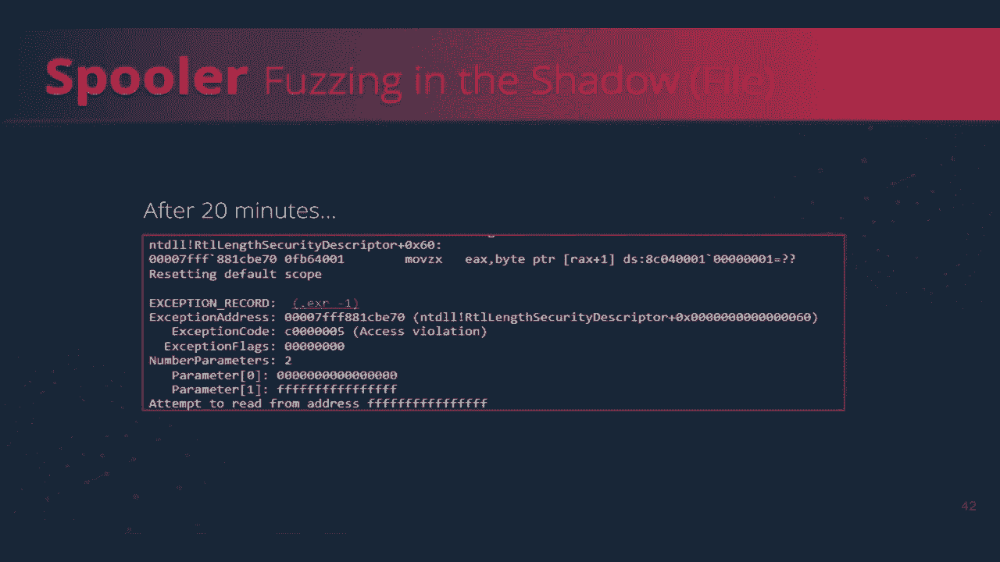

* 利用LNK文件和DLL文件执行远程代码执行。
* 通过修改LNK文件中的图标ID，绕过补丁并执行DLL文件。

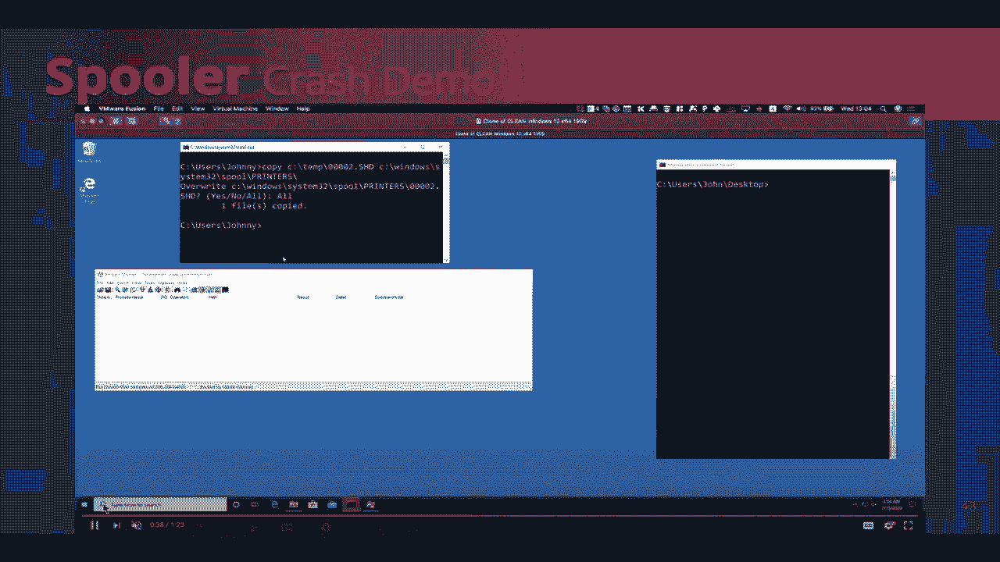

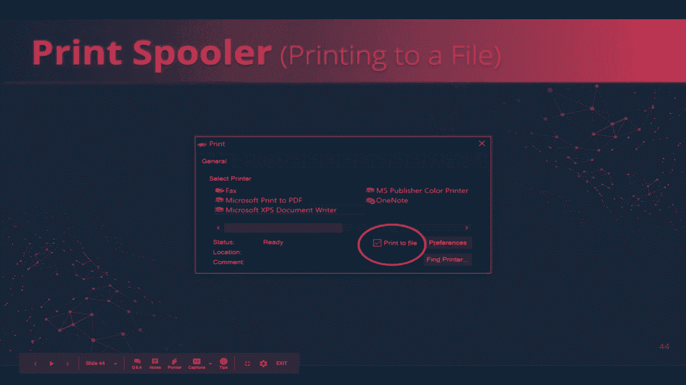

### 2. 利用Wormbl RPC漏洞传播

* 利用RPC漏洞远程触发堆栈溢出。
* 通过修改RPC请求中的路径，绕过补丁并触发溢出。

### 3. 利用任务计划程序调度器漏洞传播

* 利用任务计划程序调度器漏洞伪造XML文件，以系统权限执行任务。
* 通过修改任务计划程序调度器机制，绕过补丁并执行恶意代码。

### 4. 利用Win32K本地提权漏洞传播

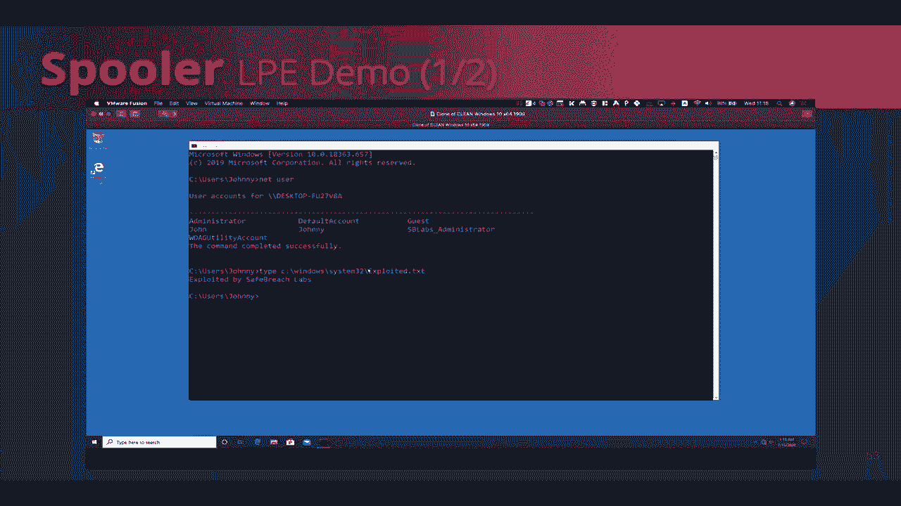

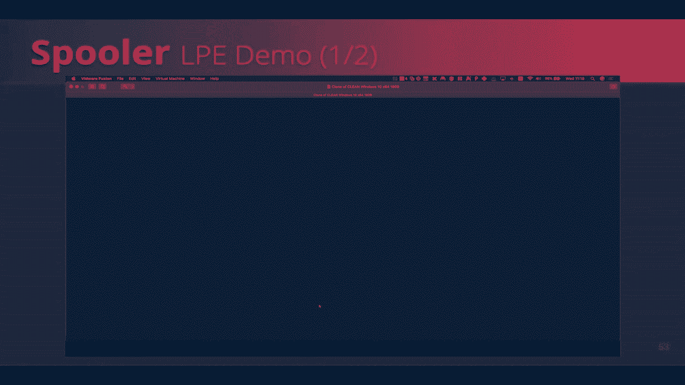

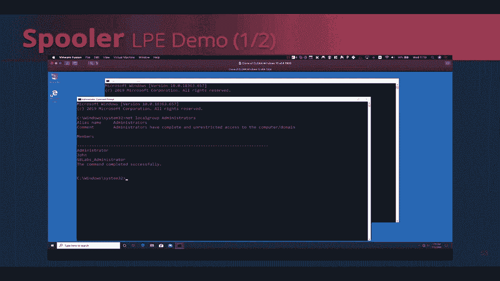

* 利用Win32K本地提权漏洞执行远程代码执行。
* 通过修改Win32K函数，绕过补丁并执行恶意代码。

## 打印机漏洞研究

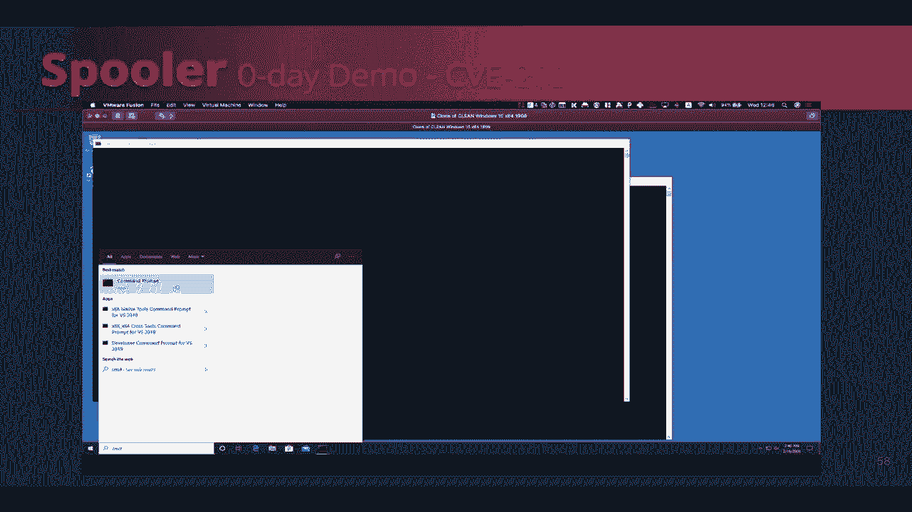

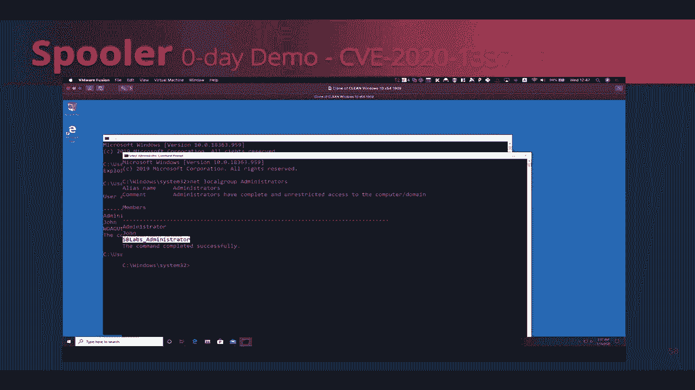

* 研究人员发现了一个20多年前的打印机漏洞，通过模糊测试在20分钟内成功利用。
* 该漏洞允许攻击者通过创建恶意的SHD文件来崩溃打印机服务。
* 研究人员还发现了一个本地提权漏洞，允许攻击者将数据写入系统32目录，从而获得本地提权。

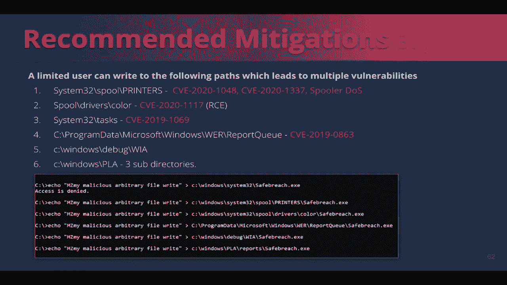

## 打印机漏洞利用演示

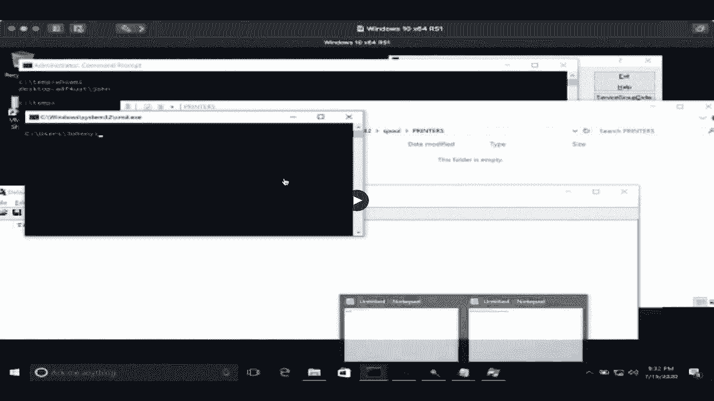

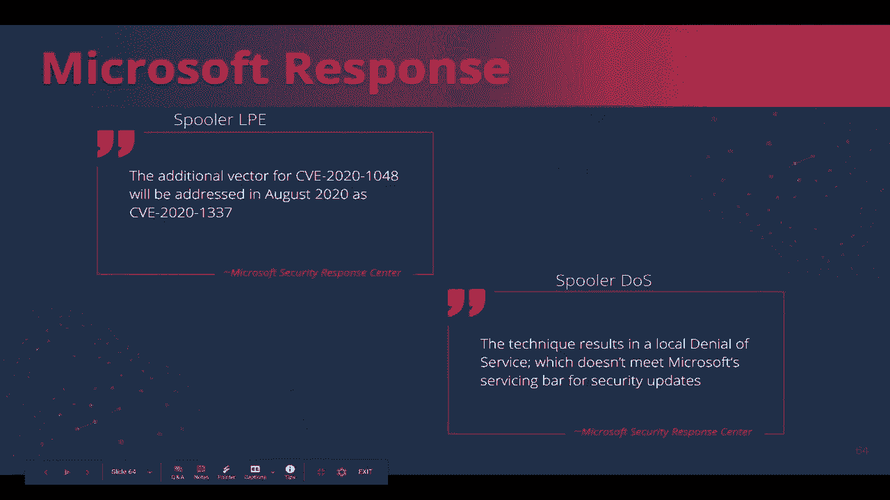

* 研究人员展示了如何利用打印机漏洞在Windows 10上执行本地提权。
* 他们通过添加虚拟打印机、创建SHD文件和执行DLL文件来利用漏洞。

## 补丁绕过和缓解措施

* 研究人员发现了一种绕过打印机漏洞补丁的方法，并创建了CVE 2020 1337。
* 他们还提出了一种缓解措施，通过限制有限用户对特定位置的写权限来防止任意文件写入。

## 总结

本节课中，我们学习了Stuxnet打印机漏洞及其影响，并分析了打印机仍然是网络安全中的一个重要威胁。我们还探讨了打印机漏洞的利用和缓解措施，以帮助您更好地保护您的系统。