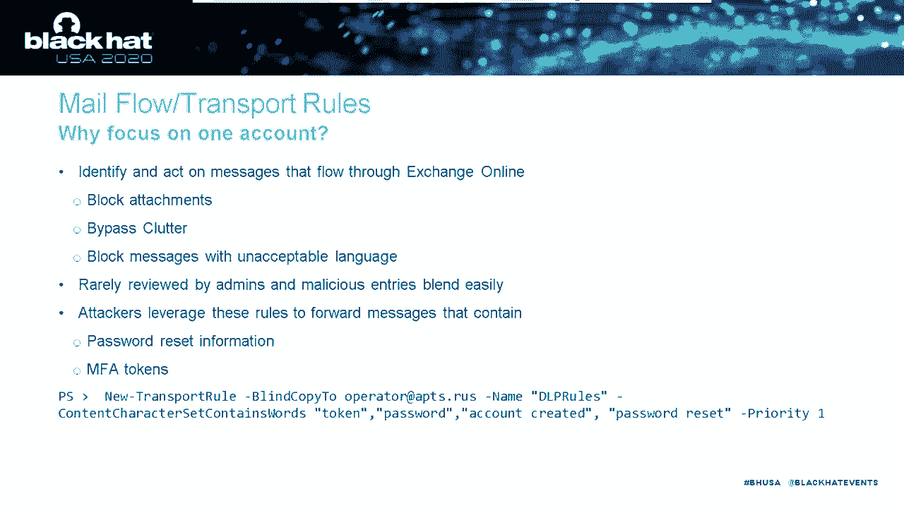

# P7：07 - My Cloud is APT's Cloud - Investigating and Defending Office 365 - 坤坤武特 - BV1g5411K7fe

## 概述

在本节课中，我们将探讨针对威胁行为者如何攻击 Office 365，并了解如何防御。我们将涵盖 Office 365 的基础知识、攻击者的初始访问方式以及他们如何完成任务并窃取数据。

## Office 365 简介

Office 365 是一个全面的协作平台，包括 Exchange Online、Active Directory Online、Microsoft Teams、SharePoint Online、Word Online 等。它允许用户从任何地方访问其数据，无需 VPN。

### 认证

Office 365 支持两种常见的混合身份模型：

* **托管身份验证**：Azure AD 处理身份验证过程，使用密码散列同步或通过本地 Active Directory 服务器进行身份验证。
* **联合身份验证**：身份验证传递给受信任的第三方，例如 ADFS、Octa、Ping Identity。

### 认证类型

* **现代身份验证**：默认和推荐的身份验证方法，基于 OAuth，支持多因素身份验证和条件访问策略。
* **遗留身份验证**：使用旧协议，例如 POP、iMap、旧版 PowerShell 和 autodiscover，不支持多因素身份验证。

## 日志记录

Office 365 提供以下核心日志：

* **统一邮箱和管理员审核日志**：记录各种 Office 365 应用程序的数据。
* **Azure AD 日志**：包含有关身份验证的额外数据，例如 MFA 类型。
* **邮件跟踪日志**：提供有关邮件传输的信息。
* **安全和合规报告**：用于搜索消息内容。

## 攻击生命周期

攻击者通常使用以下技术进行初始访问：

* **MFA 绕过**：使用 PowerShell 模块或 Microsoft Online Services Sign-In Assistant 绕过条件访问策略。
* **OAuth 滥用**：使用 OAuth 应用程序访问用户数据。
* **密码喷洒**：使用已知密码尝试登录 Azure AD。

## 持久化

攻击者使用以下技术确保长期访问：

* **条件访问策略修改**：添加 IP 地址到 MFA 信任 IP 列表或添加未验证域作为联合身份验证提供程序。
* **金鞋攻击**：导出 ADFS 服务器上的签名密钥并创建有效的身份验证令牌。
* **黄金沙漏攻击**：使用 Graph API 访问用户数据。

## 数据窃取

攻击者使用以下技术窃取数据：

* **邮件转发规则**：将邮件转发到攻击者控制的邮箱。
* **权限委托**：将权限委托给受攻击的帐户。
* **邮件流规则**：将邮件发送到外部地址。
* **Graph API**：访问用户数据。
* **电子发现滥用**：搜索和下载数据。

## 总结

本节课中，我们学习了针对威胁行为者如何攻击 Office 365，以及如何防御。我们强调了多因素身份验证、日志记录和监控的重要性，并讨论了各种攻击技术和防御策略。