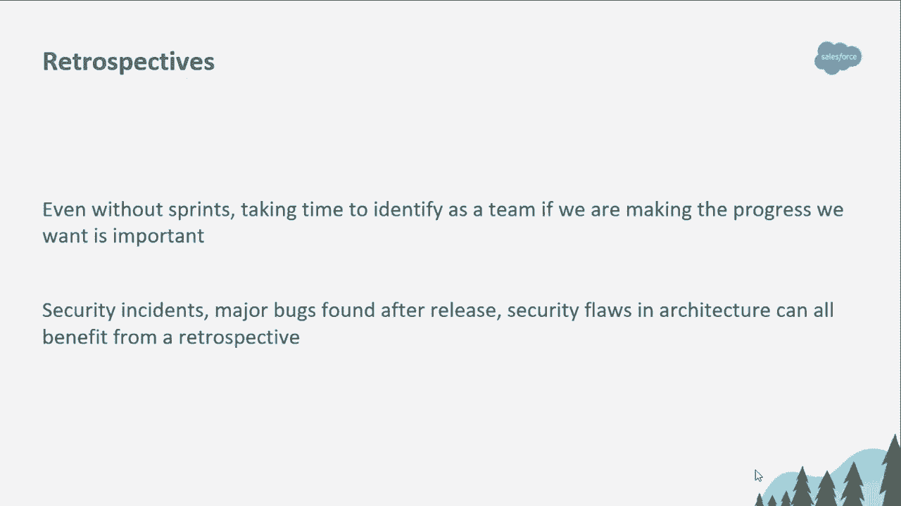

# P71：72 - Engineering Empathy - Adapting Software Engineering Principles and Process - 坤坤武特 - BV1g5411K7fe

## 概述

在本节课中，我们将学习如何将软件工程的原则和流程应用于安全领域，以提升安全团队的效率和成熟度。

## 一、编写良好代码的日常原则

以下是编写良好代码的日常原则，我们将探讨如何将这些原则应用于安全工程：

### 1. KISS - 简单与直接

**公式**：KISS = Keep It Simple and Stupid

**代码**：保持建议简单、直接、易于理解，以便工程师能够快速采取行动。

### 2. DRY - 不要重复自己

**公式**：DRY = Don't Repeat Yourself

**代码**：减少代码重复，提高代码可读性和可维护性。

### 3. TDD - 测试驱动开发

**公式**：TDD = Test-Driven Development

**代码**：编写测试用例来验证代码的功能和安全性。

## 二、团队层面的软件工程实践

### 1. 优先级和计划

**公式**：OKR = Objectives and Key Results

**代码**：明确项目目标和关键结果，确保项目顺利进行。

### 2. 反思会议

**公式**：无

**代码**：定期进行反思会议，总结经验教训，改进团队工作。

### 3. 用户研究

**公式**：无

**代码**：了解用户需求，为工程师提供更好的支持。

## 三、DevOps文化和安全

### 1. 服务级别目标（SLO）和服务级别指标（SLI）

**公式**：SLO = Service Level Objective，SLI = Service Level Indicator

**代码**：设定服务级别目标，监控服务级别指标，确保服务质量。

### 2. 自动化

**公式**：无

**代码**：通过自动化减少重复性工作，提高工作效率。

### 3. 左移

**公式**：无

**代码**：将安全工程流程整合到软件开发早期阶段，降低安全风险。

## 总结

本节课中，我们学习了如何将软件工程的原则和流程应用于安全领域，以提升安全团队的效率和成熟度。通过学习编写良好代码的日常原则、团队层面的软件工程实践以及DevOps文化和安全，我们可以更好地与工程师合作，共同构建更安全、更可靠的软件系统。