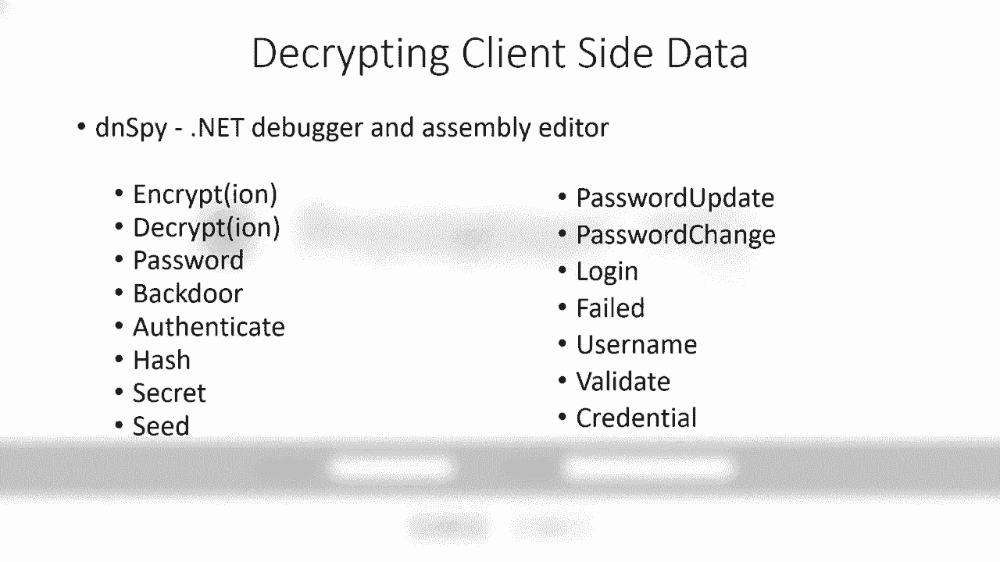

# P72：73 - Healthscare – An Insider's Biopsy of Healthcare Application Security - 坤坤武特 - BV1g5411K7fe

 Welcome to our talk today on healthcare application security。 My name is Seth Vogue。

 I've been doing security and various forms and functions for about 20 years。

 The last 10 of which have been with Penn Medicine， really specifically focused on healthcare。

 applications and embedded in the healthcare security environments with various healthcare。

 organizations。 So a point of reference， 16 years ago I happened to be presenting a black cat。

 That subject was on pocket PC abuse。 A few things have changed since then。 I've got less hair。

 got more kids and pocket PC really isn't a thing anymore。

 But it's kind of underlying architecture at Windows CE。

 Still is actually in use inside of the healthcare environments。 Along with HL7 and DICOM。

 these particular subjects have been of interest and have got， a lot of tension。

 I just want to give a nod to those people who have been doing research on that， including。

 one of our very own Penn Medicine， Dr。 Benoit who's been focused on DICOM security。

 But this talk is not about those things。 Instead， we're going to be focused on the application security。

 And by application security， I mean those applications that deal with the patient records。

 and the patient workflows that really kind of address a definite concern in the security。

 field and that these are actively being exploited and being the patient records are being sold。

 And there's a real monetized value about these things。 So on that note。

 these are one day vulnerabilities and that vendors are aware and certain members， of HISAC aware。

 which we try and get awareness around that。 But there's no guarantee that the patches have been deployed if there's even patches available。

 So as a result， the vendor names and products are going to be censored from this talk， thus。

 the fuzzy screen。 However， certain goals we do have today and the first is to really bring awareness to。

 healthcare security professionals on some of the methods and things they can look at in。

 their own environment， as well as bring attention to the vendors as to what we don't like to。

 see in their software so they can proactively remove this kind of stuff from their solutions。

 And then finally provide some insight to the security community， what they can be looking， for。

 whether they're assessors or auditors or pen testers， to help really raise the bar。

 when it comes to healthcare application security。 Now we can't have a talk about security without Alice and Bob。

 And we're going to be using Alice and Bob in a kind of a fictional overlay and official。

 context as they are interfaced with the Black Hat Clinic。

 Now conveniently the Black Hat Clinic is about the same size as pen medicine， so there's。

 some correlation there in the numbers。 But again， this is going to be a fictional overlay with some fictional elements using。

 Bob and Alice to really drive home the patient perspective because we can't lose the fact。

 that there is a patient behind all these technical issues ultimately and we want to make sure。

 that patient care is one of the key priorities here。

 So Alice and Bob have been with us since the 70s and 80s apparently they went through some。

 kind of divorce， something to do with Black of communication and keeping secrets。

 But they were able to get reconciled and have grown over with each other over the past， what， 40。

 50 years and now in their 60s or 70s。 At age some come some healthcare issues and Bob is with us now at Black Hat Clinic where。

 he's getting his pancreas taken care of and some analysis done there。

 He also has diabetes and Alice is beside him and helping him through this process。

 But currently Bob is off getting this procedure and Alice is sitting inside of his room doing。

 what most loved ones do at this point watching TV。

 And at this point we're going to introduce Mallory。

 Mallory is the bad guy in this kind of fictional overlay。

 He's the one that's a threat and he's kind of interjected himself right on Alice's screen。

 with this message that really throws Alice off。 Alice is a security person。

 she understands that there's risk here but she also knows。

 you the contact and she contacts a security team at Black Hat Clinic and we come in and。

 start talking to Alice about this particular system。 Alice first question is this is a TV。

 How is somebody able to take over this TV？ Well we'll clarify that and Alice just isn't really a TV anymore。

 This is a patient entertainment system meaning it's a system that has all kinds of integrations。

 behind the scenes to not just entertainment but to a meal order， education and nurse call， systems。

 In addition to that it does have a screen cast feature which allows doctors to take their。

 screen and throw it up onto the patient screen or to their patient device。

 So it looks like Mallory got into this。 Now we're going to take a look at that because from a bad guy's perspective Mallory is in。

 there he can obviously impact the patient experience but also potentially access patient。

 records and as you're experiencing Alice it can raise some stress issues and also there's。

 some potential issues about data and security privacy。

 So we take a look inside of our application database of about 250 applications and find。

 the application listed there and get it installed and note that it's a client server architecture。

 with some web interfacing behind the scenes。 So we integrate Burp into this which is a good proxy program and when we launch the program。

 we're expecting to see some kind of authentication prompt but though we come right to the screen。

 we can see Bob's room there， room number five， no authentication。

 So we want to see what happened behind the scenes。

 We take a look inside of Burp records and the logs there and see that there is indeed。

 a web request。 No authentication is web requests but we're concerning it returns a whole lot of XML and。

 this XML contains data birth， patient name， patient number， room number and it's important。

 to note here that this is kind of setting a line in the sand and hitting a bar that we。

 don't want to ever see and that it actually sent more than 500 records back and that's。

 kind of a line in the sand because when you get above 500 records and if this was a breach。

 it would be posted to a wall of shame。 There's potential investigations actually there will be investigations with potential fines。

 not to say that less than 500 records isn't important definitely for patient safety and。

 privacy and security and also that may not get some attention but that 500 line is definitely。

 a mark in the sand but that's not how Malorie got access to the screen。

 So we go back to the program and hit Bob's room number and it comes with this prompt。

 inter number one， two， three， four in there and we look behind the scenes and don't see。

 anything that's being passed from the client to the server which is unexpected because we。

 would expect to see that authentication occur。 So we do take a look and we see that there is a web socket upgrade request and inside。

 that web socket data there is a reference to this four digit number here 9284 which we。

 plug into the prompt and sure enough that allows us to know the screen。

 So in this just basic kind of simple example we kind of illustrated that there's some unauthenticated。

 API requests that are able to allow you to retrieve over 500 records and there's no validation。

 other than on the client so you got a client created a client validated pin and really。

 the pins only pass to the server just for informational purposes。 So not very complex。

 definitely a high issue and we got patient records over 500 so we。

 got what we will consider a high risk issue in this case。

 Now we start reaching out to the vendor and we talk with our internal team and realize。

 that we can probably just disable this feature and get rid of it all together。

 So we go back to Alice with these findings and explain to her that well we figured out。

 what was going on we were shutting it down so we are going to get that taken care of。

 At this moment the doctor walks in and says Bob is done with his procedure and we are。

 documenting everything up and we are getting prepared for the documentation you can take。

 home so you know how to treat Bob at home and what you can do afterwards and making sure。

 that everything is properly proceduralized away in the system。

 We will be back then very soon with some more information about the MRI system and Dr。 walks。

 out and Alice turns us and says well you know Maui is already threatened。

 Is this something that he can take advantage of？ And we tell Alice this is a system that kind of captures all the procedural parts of what。

 occurred and allows a physician or clinical care team to provide instructions and follow。

 up work flow。 There is auditing capability to it。 There is a lot of really important information here。

 So yeah if if if Malorie was into the system he could access the information of the minimum。

 and maybe modify it which could be a problem because from a patient perspective that could。

 lead to a misdiagnosis it could actually lead to higher cost for care because there is coding。

 which ties to insurance。 There is also definitely the loss of data in private security issues。

 So we tell us we are going to take a look， pull up our application database again and。

 this time we have 300 applications now。 We are digging through and we find the application。

 get it installed and start a different approach， on this one where we are going to take a look at the code that represents the client software。

 and we like to do this because we sometimes learn a little bit about how the program operates。

 by just investigating how the logic of the code works， some key functions that might be。

 in there that indicate there is some issues。 In particular we are going to use DNSPY to freely available and really great tool that。

 we will use a couple of times in this presentation but we look for key words like encryption。

 backdoor， seed， secret， username and it is really up to the test to kind of build their。

 own library but in doing this we end up drilling into the program we find a point called validate。

 user and password。

 It sounds interesting so we drill down into it， get to the snippet of code and at this。

 point we notice two particularly disturbing issues， one is that there is a backdoor reference。

 and the other is a daily password function。

 We drill down into the daily password function and at that point we see the snippet of code。

 here that we can basically just copy out， drop into an online site called 。NET Fiddler。

 and hit the run button and it produces a 8 character value。

 It looks like a password of sorts so we take that username back door and we take the password。

 that was just generated， plug it into the client interface and bang we are now into the。

 system as a backdoor account with full access to all the data， all the information in there。

 for all the patients。 Definitely a major issue that we discovered here。

 Now in addition to that we did find several other issues that are equally as bad but really。

 end up with the same result and that the system is fully compromiseable。

 The complexity is not that high， the impact is definitely pretty significantly high but。

 what frames us a little bit differently is we have over 100，000 patient records now that。

 are potentially exposed to this particular bug。 So we go to the vendor and the vendor recognizes the issue and starts remediating it and looking。

 for how to fix the problem for their clients and go back to Alice and tell us well it looks。

 like there were some bugs there， we don't see any indication that Bob was in there messing。

 with anything， we are double checking and making sure nothing happened to his record。

 So at that moment the nurse walks in and it's time for Bob who is back from the procedure。

 he's lying there he has got a little bit of pain， the nurse comes in with some drugs。

 Alice stops her and takes a look at the drugs， notes the number of stamp on them and allows。

 that to go on because Bob has got some allergies。 So knowing that Alice turns and says well he got allergies。

 how do I know that Mallory， couldn't end up impacting the drugs because he mess with something in that system。

 So we tell Alice well this is part of a bigger system， it's a drug dispensary system。

 We got centralized medicine management that allows you to distribute medication out to。

 the floor where it needs to be closest to the patient。

 But integrated into that is a lot of automation， a lot of auditing， diversion control， which。

 is theft control。 So I mean yes you're right if Mallory did get in there he could do something。

 you could， access patient records， modify the drug information， maybe even steal drugs。

 From a patient perspective actively the drug miso overdose or the wrong kind of drugs。

 which could be an underdose as a result of theft。 In addition to that there's the patient privacy and security issues。

 So again we take a look at our application database and we tell Alice we're going to， take a look。

 we're up to like 400 applications now and we just find the application and a。

 quick look at the server we see that there's this open share file that's part of the application。

 install， it's an authenticated user share which means anybody on really on the network who's。

 authenticated can get into the share。 Exposed in this share are two kind of issues。

 One is a configuration file which you have a snippet here on the screen you can see。

 The second is that you have a bunch of binaries。 Now we kind of illustrated in the last issue that if you have the binaries you can get。

 a good understanding of what's in the program and how it operates。

 So we drill into the program start taking apart and start focusing on the SQL count。

 description first and note that there is actually a function there called the Crip SQL， credentials。

 What's important about this is we've got the code and since it's in a DLL we can really。

 just take all the functionality of that DLL， import it into our own Visual Studio。net。

 program and have access to that functionality and really within one line of code decrypt。

 that value that's in the config file that's open to the network。

 So we do that find out is the Saa count for the database and it has a password that appears。

 to be a pretty much a probably is a vendor default password but still we have that account。

 and we go back to the user accounts this time and we start looking at what we can do there。

 Now in this case the decryption functionality is in some exe file so it's not just a matter。

 of reversing a DLL but we can still copy out the hard coded AES value and the algorithms。

 used to decrypt these strings and still paste them and piece them together in our own Visual。

 Studio。net program。 So we do that and we discover that inside of these encrypted values is a local administrator。

 account for the server as well as some other key critical accounts for the application。

 So in other words we have full system access to the database full system full access to， the server。

 We take a look inside the database now and discover that there is a user table and there。

 is user names but there is also a bunch of passwords that are encrypted。

 Do a little testing on those encrypted passwords and discover that is the same encryption algorithm。

 used to encrypt the user accounts from before so we run through and decrypt all those accounts。

 as well and discover that there is a bunch of vendor accounts in there that have the same。

 default password in addition to that we really have just compromised the whole entire user。

 table with database。 So we take that information and I will actually log into the application interface and gain。

 access to the drug distribution tool that is used to basically put medication in cabinets。

 control medication in cabinets， tell us what medication is in the cabinets。

 In addition to that we can add ourselves as a user to the whole entire application back。

 in at any level of permissions we want and to make a long story short we now have access。

 to one of the patient cabinets as well or sorry the drug cabinets as well and we decide。

 to get some to see the metaphine for the headache we now have just kidding we wouldn't actually。

 do that at Black Egg Lane。 But still at the end of the day we have fully a compromised system in the server and again。

 we have over 100，000 patient records in here the complexity really wasn't all that high。

 the impact is definitely high so this is again what we would consider a high risk issue。

 Oh we immediately contact a vendor the vendor starts making changes right away and some。

 simple changes that can really reduce the risk of this which are put in place。

 Let me tell Alice about this and Alice is thankful she understands that there's issues。

 and it's good that we're on top of it and making changes here but Bob has an insulin。

 issue related to his diabetes and she asked the question I think insulin is supposed to。

 be kept in a secure safe environment when it comes to temperature do you guys have a。

 temperature monitoring system on that and that's something that we're convinced with。

 Well we tell us that this is we do have a temperature monitoring system it's part of。

 a overall system that monitors our drugs our food and blood in the organization and。

 you know it's used in many different industry types but yeah if Mallory were to get in here。

 he could disable monitoring he could break the monitoring which could in turn have an impact。

 on patient safety and that they could get poisoned or ineffective medication but we tell。

 us we're going to take a look because this is again another critical system to patient， care。

 So we pull up our application database the 425 applications now and in this case we install。

 the client but we're going to take a little bit of a different approach and start to look。

 at the data traffic behind the scenes because this isn't just a standard web kind of this。

 client server architecture so we get ourselves a test account and plug it in and run a shark。

 behind the scenes and immediately start to notice that there's a pattern typically what we see。

 is that there's a there's a integer value followed by a couple variables called which。

 then we result in a return data。 For example we have 12 as an off code we have 34 as a change password code we have 67 as。

 an ad update user code 42 as a get group detail code and kind of build out this library。

 here and we kind of just want to test this out in our own little program and see if we。

 can just simply throw the request of the server using something like scappy so we create a。

 scappy script which allows us to send raw data right to the server interface and put。

 this together see if we can query back our own user account sure enough we end up with。

 our user ID the user name and the password that we had set up and yes the password is。

 alpha one not a very secure one for this testing experiment but still we get that password。

 Now we don't have to use scappy we can just simply use a netcat command essentially and。

 we try and test out what we can get from the administrators group and sure enough we end。

 back we end up with all the user names and passwords of the administrators group as， well。

 So we take that administrator account we log in on the server and we see that there's actually。

 a T monitoring device that appears to be offline。 It is suspicious because it is associated to where Bob's at in the in the organization。

 so we get the IP address out of the system connect to this little IoT monitoring device。

 which collects the data for various different temperature monitors。

 This is a simple login password but we take a look at the HTML see this is a reference。

 to this up directory take a look at that directory it's got file indexing enabled and。

 we can see that there's some purl files here drill down inside those purl files and sure。

 enough there's yet another password of the day function here and a completely different。

 program seems that this is a not so uncommon thing to find but in addition to that we also。

 have a reference to a hard coded cookie value that can be set and gives you administrator。

 access to the IoT device hard coded in these purl files as well。

 We use our cookie editor to simply set that value in there refresh the web page to the。

 IoT device and bang we're now in。 So I mean this is starting to feel like it captures a flag or some kind of sans event。

 where where you're following through and some pretty stereotypical hacks so we're not so。

 surprised to see a ping out test here and one of the more common ways that those type。

 of tests can be exploited is to simply and catinate another command on the end of the。

 IP address which we attempt to do with the cat Etsy password file which should return the。

 whole password file of course it does and we now have passwords for the IoT device take。

 those throw those in the john in about two seconds we end up cracking one of the passwords。

 it's not the root account but it is one of the passwords to be able to allow us to SSH。

 into the device once we're into the device we start looking around and there's an index。cgi。

 file now that file is the main page that is used to piece me all together the the web。

 requests and we find this reference to a run sue command now that looks suspicious because。

 it looks like it's going to give us the ability to run a super user command on the system so。

 we swap out one of those values there we kind of actually just add our own we're going to。

 try and run a reverse shell and get that reverse shell pointed back to our server we。

 refresh the index。cgi page and sure enough we are now have root access to the device since。

 it's not working anyway we ask permission to reboot the device reboot it comes back online。

 so it looks like a more of a false positive just a glist in the system but at the end。

 of the day we still have unauthenticated access to the server gain administrator account access。

 and IoT device as well we have full system control both those parts of the the application。

 now there's no patient records exposed but this is a compliance and kind of regulatory。

 issue wasn't very complex the impact is we'll rate it a little bit less higher because there's。

 no patient records but still in his own that we don't like to see。 Oh we go back to Alice。

 and we tell us that we're going to be actually architecting this kind of off the network and。

 segment this whole system out so so it's it's we can reduce the risk for this environment。

 Again Alice thanks us for our work and at this point Bob mentions that he's a little。

 hungry and and so Alice picks up the nurse call system kind of pauses and says you know。

 this nurse call system is it just going to ring a bell or is there more to it。 Well just。

 like the patient entertainment system these have evolved over time as well and they're。

 kind of baked into a whole back end environment where we can basically monitor the resources。

 that are used across the organization from from who's the most needy patient to to how。

 fast this nurses can reply and help us allocate where resources need to be put as well as。

 tracking devices and nurses and in that whole entire process as well。 So from a Mallory's。

 perspective he gained access he could probably get access to patient data take over the nurse。

 call system locate patients if it has RTLS enabled from a patient perspective they could。

 end up getting woken up repeatedly at 2 a。m。 in the morning if somebody wanted to be real。

 of pain and start doing nurse spotting in addition there's the loss of data and privacy。

 security issues。 So we take a look at our application database and if you haven't noticed。

 this is growing which is indicative of what is happening in healthcare we're seeing more。

 and more applications being thrown on to the stack to provide all kinds of different functionality。

 and all these applications have some really great use and some key patient care value but。

 the stack keeps growing which means the security teams have greater risk exposure as well。 Well。

 in this particular application we get it installed and we're going to take a little bit of a。

 different approach because it's got a client and a server but we want to see if maybe this。

 client has some logic errors that really allow us to completely bypass authentication altogether。

 So we drill down inside of it and on the left side of the screen we have the logic flow of。

 the program you can see there it basically throws the password and username off to the。

 database and the database returns an integer value one of the values is sitting on the table。

 there on the right。 So looking inside that table we see that there's some values there。

 but in this case we want to take the program and debug it and again there's a couple different。

 ways to do this but 。NET Spy makes it very easy so we simply connect the application to。

 it we hit the debug button on the menu and start debugging the program and this gives us。

 the ability to watch the program work in memory and see the values that are actually being。

 passed around in variables inside the program。 So we drill down on the verify log and function。

 here and you can see little small type there there's an admin account the password ASDF。

 we let it flow through the program and at the bottom there it returns a result。 Now that's。

 not the right password so in addition to that the count appears to be locked out so it's。

 returning that integer value that's associated with the account being locked out but we can。

 change that value so we can just go in there and switch it to a zero。 Now we can do this。

 every time we restart the program but since we have the capability we can also just simply。

 modify the binary and make this value hard coded so it always returns a zero no matter。

 what password you then enter it's going to be valid。 So we do that we save off the new。

 binary and we relaunch the application use a username admin with whatever password and。

 bang we're now into the the the the system as an administrator which gives us the ability。

 to control all the user accounts and basically make nurse calls to any room any floor any。

 bit we want to。 Now that's definitely a big problem but we also note that there's a server。

 side component to this。 We just want to take a look at the server side we're going to drill。

 in a little bit and see what kind of references using that same example we used in the clinical。

 documentation system to see if there's anything important in there and we do that here's the。

 user interface and while we're looking around we happen to find a rember still backdoor。

 account except not just one backdoor three back doors in this case and this is a little。

 bit interesting because we go back to the vendor and the vendors basically kind of stuck because。

 this is part of a merge an acquisition where they've kind of acquired some of this code。

 and don't really have the capability at least to really fix it they're going to focus on。

 a new version so we've got the capability to patch it so instead of asking to vendor。

 for a patch we've looked into patching it ourselves and just simply changing those passwords to。

 something a lot more complex and not so standard and we do that reboot the program it comes。

 back up and now we passed our own issue regarding this backdoor but we have access to the administrator。

 interface in the nurse call system all the patient data that's blowing in between and。

 the ADT feeds are called the end of the day the system fully compromised wasn't really。

 that complex and the impact's definitely high we're over our 500 count and this 500 counts。

 a little bit of a fuzzy number because it's a per day account maybe a per week count and。

 that number is going to grow over time as more patients come through the system if somebody。

 was actively monitoring or it's going to be a snapshot in time if somebody just found。

 that found this issue at at at point of of exploitation so we go back to Alice and told。

 you know we found some issues we're working to get those remediated segmentation and patching。

 um Alice Pies thank you and and at this point the doctor comes back and says well we took。

 a look at the radiology images and and everything looks fine um you know we just need to make。

 sure we keep an eye on Bob but you know we're going to wrap this up and you'll be able to。

 get out of here soon so Alice turns this and says what's this radiology system is that。

 another system that potentially could put you know Bob at risk if Mather got in so we tell。

 you know what this is a clinical inter-meaning system there's numerous ones out there this。

 one you know they kind of all serve the same general purpose in that they allow you to。

 look at the images and analyze them they have baked in tools for analyzing track the images。

 over time like a document against it and share that with other other radiologists and doctors。

 and you know if a bad guy got in yes they could access it they could modify they could。

 delete obviously that's going to have potential to impact patient care from from Bob's perspective。

 in addition to loss of data and privacy security so we pull up our application database of。

 500 applications now find the application get it installed and this time it's not a。

 dot-net program but we want to make sure that that we still take a look and we use ita which。

 kind of allows us to do much of the same thing we can search through the program fight。

 and key elements that are important there and we do that and find a reference to password。

 match hash and password is valid and we start to look at those and in addition we can still。

 also patch the program now it's a little bit different inside of a C++ or C compiled program。

 but at the end of the day there's there's opcodes that operate behind the scene and these opcodes。

 work with the work kind of the same way and in the current program does it jump not zero。

 which basically says that the password doesn't match go this way if it matches go this way。

 we can change that to a jump zero which means if the password matches fail if the password。

 doesn't match open so the difference between the two opcodes is really just a 75 versus。

 a 74 which we can find in in the binary we swap that out save it off have a new binary。

 and we have the old and the new now that you can see on the screen here from a jump not。

 zero converted to a jump zero and as a result when we go back to the program plug in this。

 user account of support which is provided to us as a result of some other issues with。

 the system we plug in a password of a and sure enough we're now logged in and are able to。

 see Bob's records but we don't really know what this means at the end of the day though。

 it still is exposed in addition to that because we patched that particular part of the program。

 it also allows us into the administrator tool with the same support account and we can access。

 to all users and change their passwords change the configuration of the system and so on so。

 the system is fully compromised the comp the complexity it may be a medium but I mean it。

 wasn't super complicated the impact is definitely high and in this case we've got over a thousand。

 records just because the program is a little bit more of a niche program so we go back to。

 Alice we we also work with the vendor before that and the vendors gonna get us a patch。

 for this and remediate the issue go back to Alice and explain what happened and Alice。

 thanks us for all the work that we've been doing related to this application security。

 you know raising the bar for this getting some vendors to pay attention to the software。

 issues but she asked another additional question and says well you know you guys are working。

 with these applications they all sit in the data center somewhere and I know you're working。

 on the confidentiality and integrity of that that CIA child but what about the availability。

 of what if that data center goes offline how are patients able to to maintain their care。

 and how the patient care team is able to know what the patient is even there for me tell。

 Alice well this is part of an EMR downtime device solution because you're right you know。

 you have a organization all the databases and the software runs in the data center but there。

 are some times where where the network goes down or a piece of hardware goes down and。

 kind of isolates a piece of the network whether it's an outpatient facility a small hospital。

 clinic or even a floor in the hospital but we have these things called downtime devices。

 that we distribute throughout the organization and they have enough information on them for。

 the patients in those in those areas that allow the care teams to maybe know allergies with。

 the patients therefore key critical things that they need to understand about what the。

 patients you know that they needed oh in order to treat the patient。 I mean these are sensitive。

 obviously so we encrypt the hard drives they have usernames passwords in them you know for。

 HIPAA compliance and the patient reports are encrypted the user everything I mean the。

 user tables encrypted so Alice just kind of stops and pauses for a second and says well。

 you kind of illustrated that client-side security is really hard to do and these all kind of。

 sound like they're self-embodied clients that have all the data in them。 So we're going。

 to take a look at one of these and we pull up one of the downtime devices and find a login。

 prompt and start taking a look at the code behind the scenes using the same process before。

 with the inspy find a part of the program there that the password is basically doing。

 a matching validation and from there we strip that out and re-re-save the binaries and。

 we basically set the program up so all it checks to see if the user is locked if the。

 user isn't locked we find that we can gain access to the patient records inside the。

 downtime device。 Now that's a small subset of patients but while we're in there we also。

 happen to really we notice that there's a load and decrypt user table function in there。

 So again you know if it's pointing those values in a memory then we can probably take the。

 opportunity to write those values out and we patch the program again to just simply write。

 the user table out using just some more C# code and plug it in there save the binary off。

 relaunch the computer and program and it gives us a copy of the user table。 Now the user hash。

 kind of looks like this it's got pieces of information in it but again we have access。

 to the code that we can create our own basically representation of how the hash is created when。

 it's entered from a username and password perspective the hash has to be created so it。

 can be bounced against the the table there。 So we recreate our own hash creation process。

 and effectively allow us to do a hash cracking type of program that we can do offline。 It's。

 important to note that that inside the user table is a copy of every single EMR user's。

 username and hash which is pretty significant number of the employees at Black Hat Clinic。

 But we do that and we run it through and sure enough after a few minutes we discover that。

 we can actually crack some of the passwords it's slow but it's offline and it's just a。

 matter of time and resources。 While doing that we kind of took a step back and realized。

 that we had another issue here in that the authentication prompt sat in generic user space。

 but it interface with a service account running in system space which was using DLLs that were。

 in what were effective that's effectively generic user space and has the ability to be。

 modified and written to by authenticated users again。 Meaning we have a traditional DLL injection。

 or overwrite issue that has been the longest to do some of these rewrites and patches in。

 the first place inside of the application on the downtime devices。 So we take advantage。

 of this and there's many ways to do this but we simply just patch it again and point it。

 to a batch file which gives us the capability to run any particular script or program we。

 just want to get admin on the box so we just put in the command to add admin and we now。

 have admin to the box and once we have admin on the box we can now configure the downtime。

 device and we do it the first thing we do is we configure the downtime device to basically。

 be a downtime device for the entire organization which means all the patience and all the other。

 pieces and parts of the organization all their records now also come to just this one。

 downtime device so we get all those records。 And while doing that we kind of discovered。

 there's a key that that syncs the downtime device to the downtime server。 It's the same。

 key for all the downtime devices so it's a per organization key。 Now the key is securely。

 stored on the downtime device but because we have access to the code or as a minister。

 down on the box we can again just simply find a location in the program export that key out。

 and now we've got a process by which we can export a key out for the downtime devices for。

 an organization。 So we go down the street to Defcon clinic and we see if this is actually。

 going to be something that can be exploited。 We take our patch DLL， throw it into a downtime。

 device in Defcon clinic， reboot the device and it produces a key for us。 We've got the， key。

 we have our device here， we've managed to get it on the network which is the first， hurdle overcome。

 not necessarily a really difficult hurdle so we get that our own downtime， device like a fake one。

 a spoof one onto the network， insert the key into that downtime， device by just modifying memory。

 patching it a couple different ways we can do that but。

 the downtime device now has that Defcon clinics key point to the Defcon clinics downtime server。

 and now we have all the records for the Defcon clinic as well。 In addition to that we already。

 know how to bypass authentication so we don't need to worry about actually logging into it。

 because we can just do that and the part of the information downloaded is also the user。

 table for Defcon clinic so we can now access the user accounts and the passwords there。

 and as a result we've basically expanded our scope of compromise to other organizations。

 with this particular issue。 So again the complexity is a little bit more challenging putting everything。

 in the table， the impact is definitely high， 13，000 records exposed in our scenario here。

 and again this is a kind of like a per day or per we have patient while they're in the。

 organization rolling numbers so that number kind of could grow over time or just be a simple。

 snapshot as if somebody were to exploit this bug。 So I mean kind of wrapping it all up。

 if you look at what we did we started with something simple relatively speaking with burp。

 looking behind the scenes noticing that there's just client side code with client side validation。

 then we started looking at some of the code and see if there's anything suspicious in there。

 that's hidden away inside the code that could be exploited。 We also looked at some of the。

 TCP protocols and the activity on the network， looked at how we could modify some of the。

 logic behind the scenes for dotnet programs and then also use that for a C++ program and。

 patch the program and kind of wrapped it all up in a final example with the downtime。

 devices where we took that kind of to the next level and just showed how far you can。

 get one of these particular application security issues。 So the reason why this is again important。

 is that just in our example here with the sizing of Black Act and make them deafcon clinics。

 thrown in there， we effectively were able to illustrate a compromise of about 225，000， records。

 Now these records can go for depending on what you talk to a thousand dollars or。

 ten dollars a record。 Either way we're talking about 2。25 million or 225 million for just one。

 ecosystem or one environment。 Now if we extrapolate that out and you look at all the hospitals。

 inside of the country or even broader， I mean I could have probably named this the trillion。

 dollar healthcare application security issue because we're talking about some pretty significant。

 numbers when you go that big of real data records that have a real value out there in。

 the real world。 So some pointers that we do go through when we look at these applications。

 is we just kind of spend two to four hours looking for what I'll call red flag indicators。

 Deep-wall credentials， plain text credentials， badly designed APIs with no credentials or。

 secrets that are embedded in code really kind of help us understand where we may need to。

 pay more attention and dig in deeper。 In addition to that we have found many cases where the。

 credentials themselves are stored in a database but we are told that the credentials are secure。

 but when we actually reverse out the way those credentials are secured， number one aren't。

 really that well secured。 Number two often have really bad passwords and password management。

 baked into the program。 So these are all the different ways that we look inside the organization。

 and we do this during what I'll call light pen tests against new products。 In addition to。

 that because we want the team to continue to grow their skills and have an understanding， of these。

 the scary issues that are current， even past or even that are coming up in the， future。

 We do team based pen test exercise practices where we let the team play on capture。

 the flags or internal products or even self-developed ones that some of our team have helped create。

 In fact this one the CSO 2020 award for just pushing that bar a little bit further。 We。

 have the scary testing bake into our goals。 We have a program for our team that again。

 encourages them to learn more and understand more about these bugs。 We also are working。

 with the health care consortium for those in the healthcare field to share information。

 and we're moving in that direction where we can share some of these vulnerabilities because。

 that is a big challenge for health care。 We don't want to just post this stuff out there。

 publicly when we find it and it's hard to kind of get traction sometimes on getting your。

 mediation moving。 But we want other healthcare providers to understand that there is some。

 risk inside their network as well and if they have the same product they probably want to。

 do something about it。 So we're looking at leveraging HISAC for that particular aspect， of this。

 And finally where to from here healthcare security teams we encourage you to start using。

 some of these tactics and methods to kind of look through your own security software or。

 own applications for security issues。 We would like to be able to share if you remember。

 HISAC that seems to be a good place to do it。 It's a more of an enclosed environment。

 and we just really need to share a lot more。 Security community， I ask that if you guys。

 and women have an opportunity to get out there and when you're doing audits or assessments。

 or pen tests and look at the applications just don't look at the how Active Directory。

 works or just the normal stuff that you look for in a pen test。 Add an scope， a healthcare。

 application and you might find something interesting and different instead of just going to main。

 admin。 And finally the healthcare vendors， I mean us healthcare security professionals。

 already have multiple hats in many cases especially for smaller healthcare organizations。 We also。

 have to maintain all the normal things that the security teams have to do with firewalls。

 and end users and training and maintaining a secure edge and patching and all that。 This。

 healthcare application issue just makes it that much more challenging to keep things secure。

 At the end of the day we're really talking about patience and patient care and that this is， a。

 in many ways， a patient data and privacy security issue。 So I just like to thank the。

 pen medicine security team。 Everybody on the team has had some impact on this presentation。

 and I just like to thank Black Hat for making this possible and with that I'll take your。

 questions inside the chat channel。 Thanks。 Hello， I might have 10 seconds to really say a thank you for all those who have been interacting。

 with me on the chat there。 I'll be around in the chat for another 20 minutes or so。 Thanks。

 for the question。 Thanks for the feedback。 I hope this is enlightening and brought some。

 really much needed attention to healthcare data or healthcare application security。 So thanks。

 and hope to talk to you later。

