# P72：73 - 医疗保健应用安全：内部人士对医疗保健应用安全的剖析 🏥

## 概述

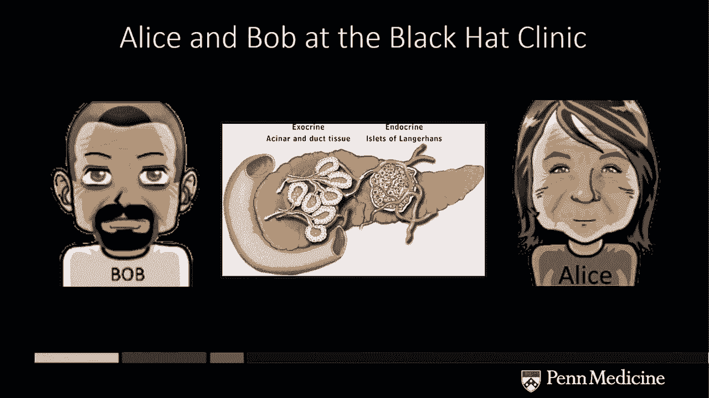

在本节课中，我们将探讨医疗保健应用安全，重点关注患者记录和患者工作流程的安全性。我们将通过一系列案例研究，展示如何识别和解决医疗保健应用中的安全漏洞。

## 1. 引言

**Seth Vogue**：大家好，今天我们来谈谈医疗保健应用安全。我叫Seth Vogue，从事安全领域已有20年，其中10年在宾夕法尼亚大学医学中心，专注于医疗保健应用和安全。

## 2. 案例研究：患者娱乐系统

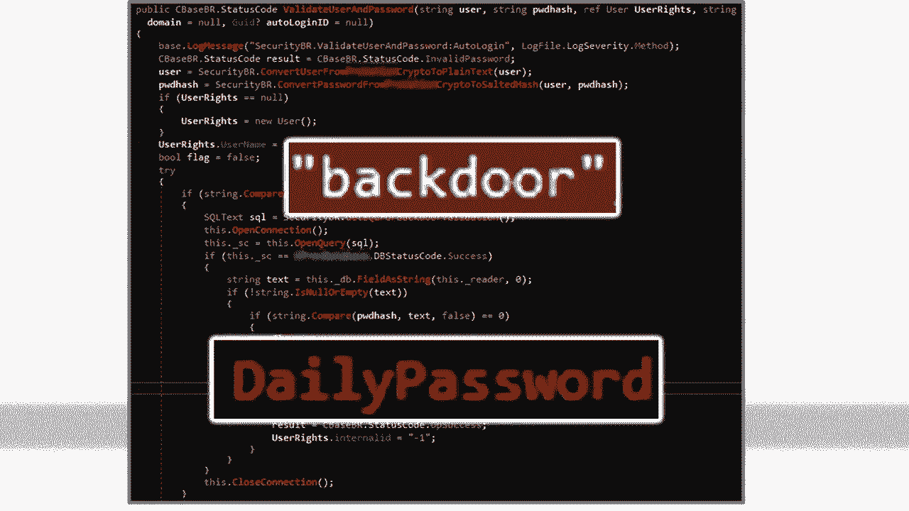

**Alice和Bob**：Alice和Bob是两位虚构的角色，他们在宾夕法尼亚大学医学中心接受治疗。Bob患有糖尿病，正在接受胰腺手术。

**Mallory**：Mallory是一个恶意攻击者，他试图利用医疗保健应用中的漏洞。

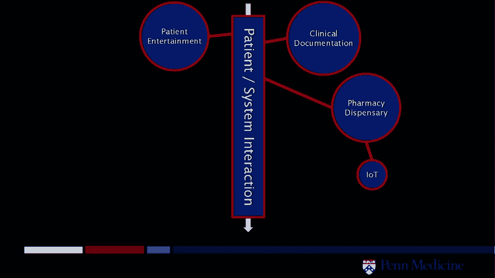

**漏洞**：患者娱乐系统中的未授权API请求允许攻击者检索超过500条患者记录。

**解决方案**：禁用该功能并修复漏洞。

## 3. 案例研究：临床文档系统

**漏洞**：临床文档系统中的后门账户和每日密码功能允许攻击者以管理员身份访问系统。

**解决方案**：更改密码并修复后门。

## 4. 案例研究：药物分配系统

**漏洞**：药物分配系统中的开放共享文件允许任何网络用户访问配置文件和二进制文件。

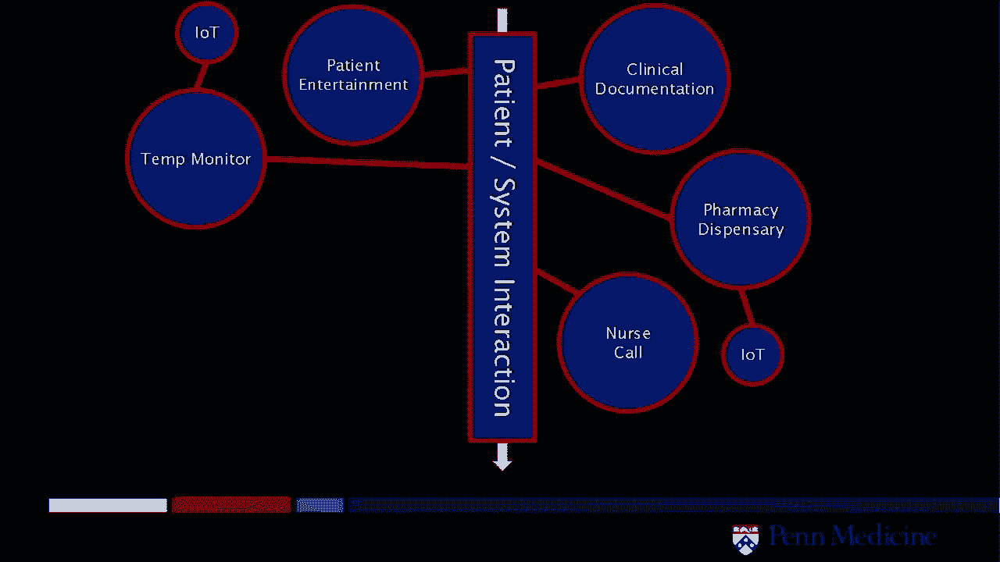

**解决方案**：禁用共享文件并修复漏洞。

## 5. 案例研究：温度监控系统

**漏洞**：温度监控系统中的未授权访问允许攻击者禁用监控功能。

**解决方案**：隔离系统并修复漏洞。

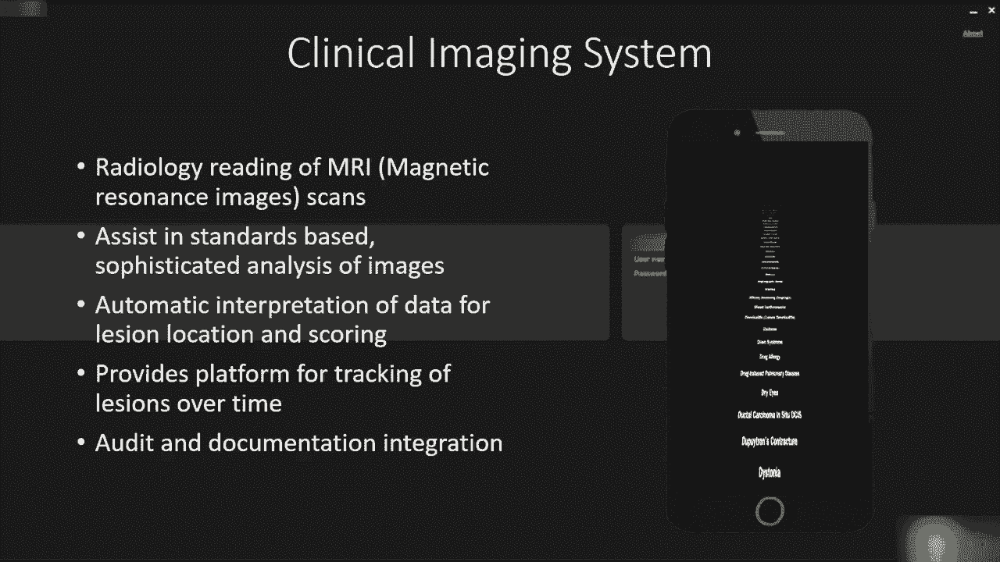

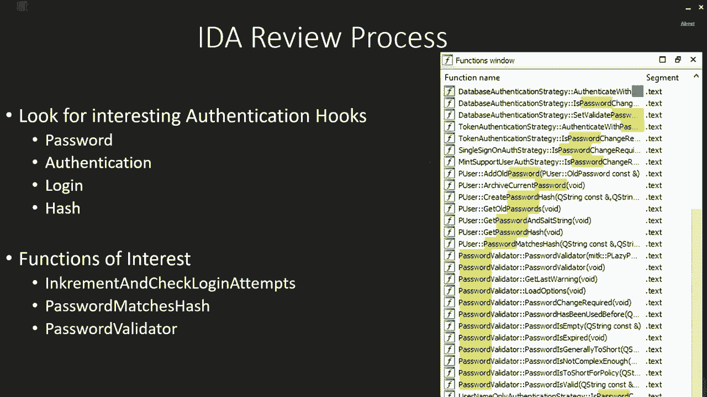

## 6. 案例研究：呼叫系统

**漏洞**：呼叫系统中的逻辑错误允许攻击者绕过身份验证。

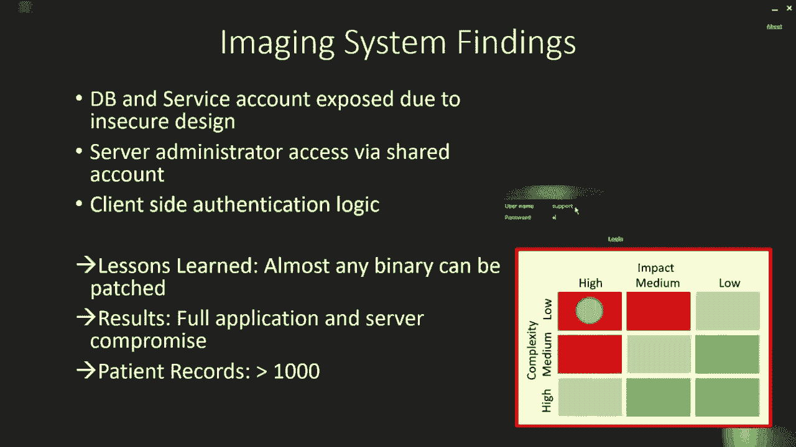

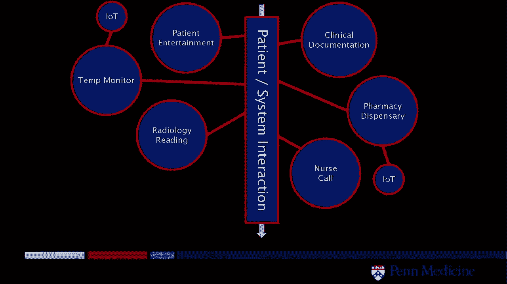

**解决方案**：修复漏洞并更改密码。

## 7. 案例研究：放射学系统

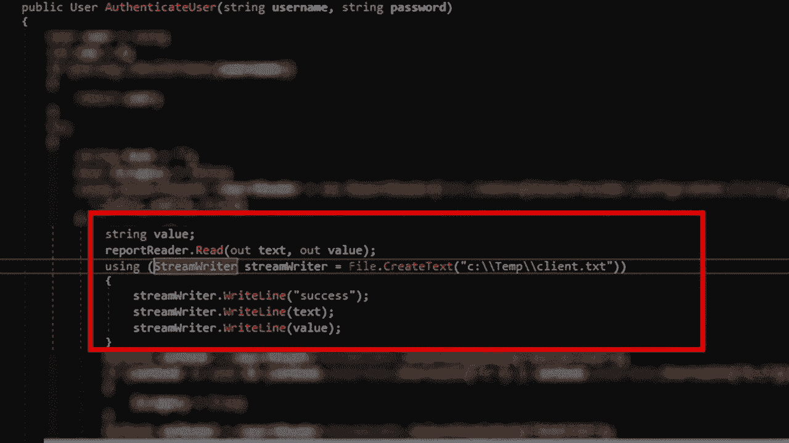

**漏洞**：放射学系统中的密码匹配哈希和密码验证允许攻击者以管理员身份访问系统。

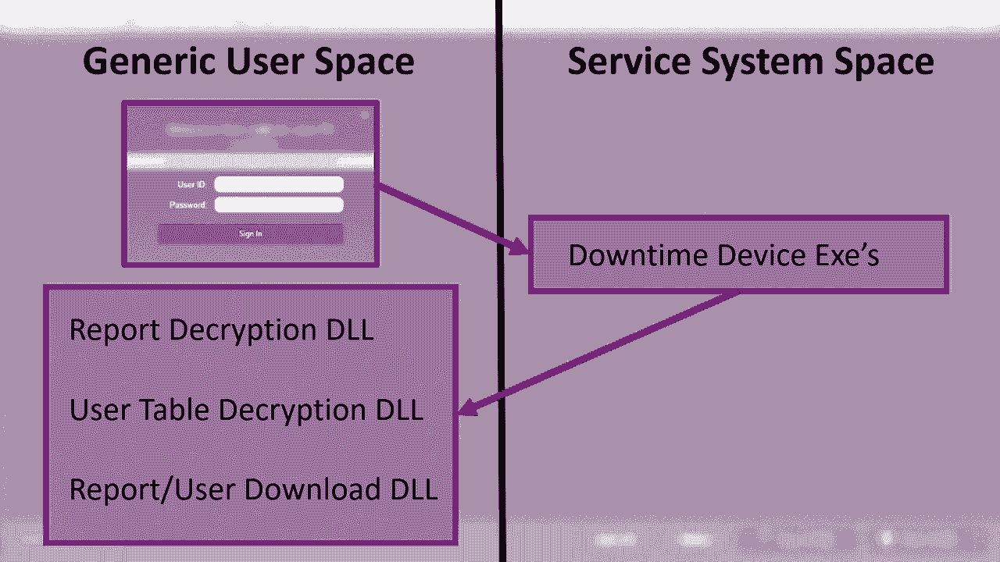

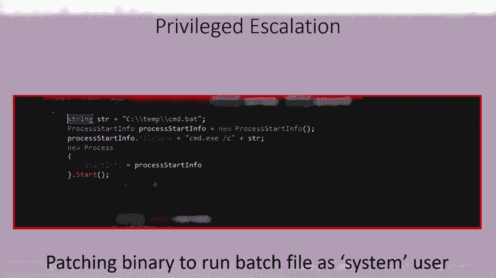

**解决方案**：修复漏洞并更改密码。

## 8. 案例研究：紧急情况设备

**漏洞**：紧急情况设备中的用户表和密码哈希允许攻击者访问患者记录。

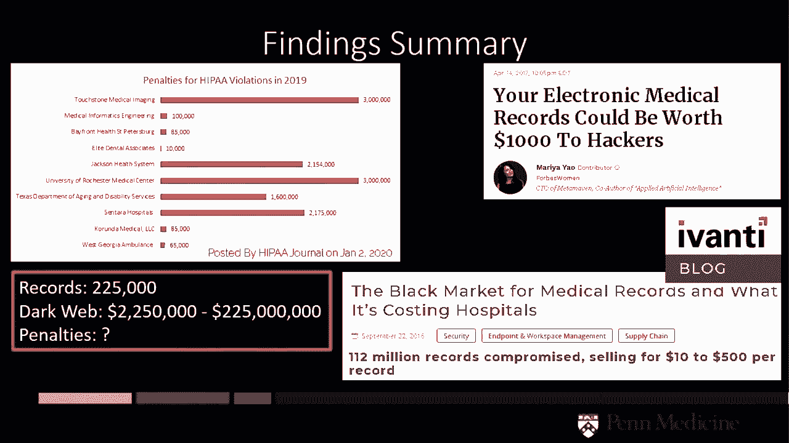

**解决方案**：修复漏洞并更改密码。

## 总结

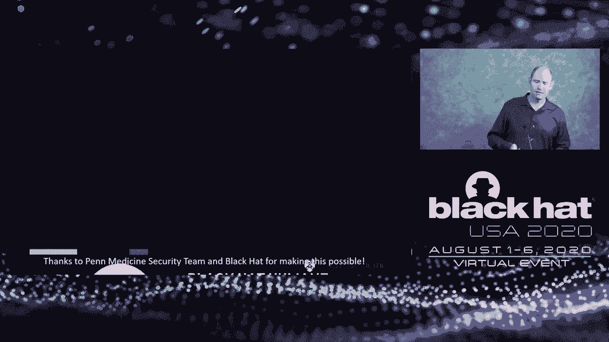

在本节课中，我们一起学习了医疗保健应用安全的重要性以及如何识别和解决安全漏洞。我们鼓励医疗保健安全团队、安全社区和医疗保健供应商共同努力，确保患者数据的安全和隐私。