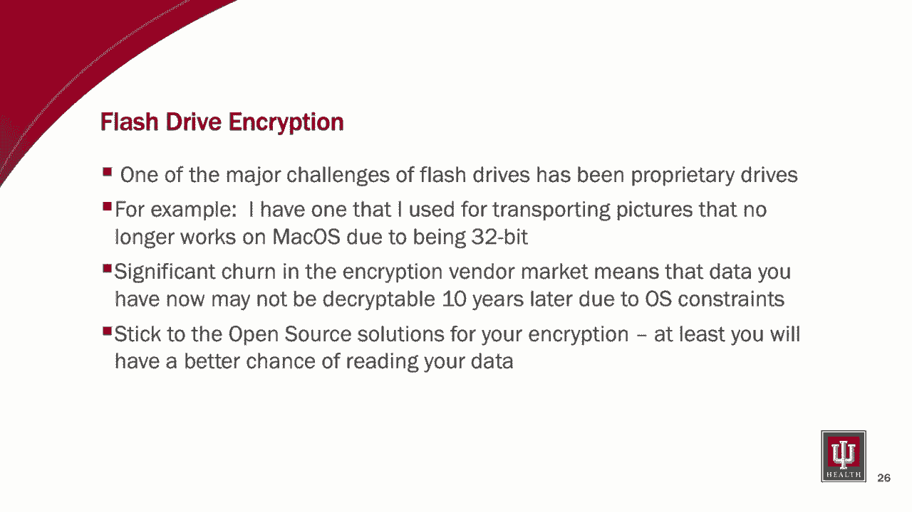

# P73：74 - Stopping Snake Oil with Smaller Healthcare Providers - Addressing Security 🚀

## 概述

在本节课中，我们将学习如何通过有效的计划和最大价值来应对小型医疗保健提供商的安全问题。我们将探讨如何识别和避免“蛇油”公司，并介绍一系列实用的工具和策略来加强医疗保健机构的安全防护。

## 核心概念

**公式**：

* **风险评分 = 可能性 x 影响 x 速度 x 潜在收入损失 x 声誉影响**

**代码**：

```python
# 量化风险评估工具示例
def risk_assessment(likelihood, impact, velocity, potential_income_loss, reputational_impact):
    score = likelihood * impact * velocity * potential_income_loss * reputational_impact
    return score
```

## 教程内容

### 1. 风险评估

* **内部评估**： 建议内部进行风险评估，以便更好地了解业务和漏洞。
* **量化评估**： 使用量化方法评估风险，并根据评分优先处理。
* **沟通计划**： 制定沟通计划，确保相关人员了解风险评估结果和应对措施。

### 2. 政策和程序

* **HIPAA合规性**： 根据HIPAA要求制定政策和程序。
* **风险驱动**： 根据识别的风险制定政策和程序。
* **模板**： 使用卫生与公众服务部提供的政策模板。

### 3. 物理安全

* **范围**： 将物理安全纳入风险评估范围。
* **设备**： 保护所有具有网络连接的设备，包括旧设备和物理基础设施。
* **整合**： 将物理安全与整体安全计划整合。

### 4. 医疗保健ISAC和协调委员会

* **资源**： 利用ISAC和协调委员会提供的资源。
* **内容**： 订阅邮件列表和获取最佳实践。
* **合作**： 参加会议和活动，与其他组织合作。

### 5. 电子病历系统

* **外包**： 对于小型组织，建议外包EMR维护。
* **复杂性**： EMR系统越来越复杂，需要专业团队维护。
* **合规性**： 确保EMR系统符合HIPAA等法规要求。

### 6. 密码管理器

* **必要性**： 医疗保健行业存在大量不兼容的登录凭证。
* **工具**： 使用密码管理器管理登录凭证。
* **培训**： 培训员工使用密码管理器。

### 7. 支付卡行业数据安全标准（PCI DSS）

* **合规性**： 确保符合PCI DSS要求。
* **设备**： 使用最新的加密设备。
* **测试**： 定期测试设备以确保其符合PCI DSS要求。

### 8. 防火墙和VPN

* **远程访问**： 远程访问是勒索软件攻击的主要目标。
* **解决方案**： 使用RDS网关、OpenVPN等解决方案。
* **更新**： 定期更新设备和软件以防止漏洞。

### 9. 文件系统

* **完整性**： 保护数据完整性，防止文件损坏。
* **工具**： 使用文件系统级检查工具。
* **备份**： 使用云备份作为勒索软件攻击的防御措施。

### 10. Samba

* **AD认证**： 使用Samba进行AD认证。
* **成本效益**： Samba可以节省Microsoft许可费用。



### 11. 安全电子邮件

* **用户界面**： 使用具有良好用户界面的安全电子邮件解决方案。
* **移动访问**： 提供移动访问功能。
* **简单性**： 简化用户界面和流程。

### 12. 端点检测和响应（EDR）

* **替代方案**： 使用EDR作为防病毒软件的替代方案。
* **集成**： 与SIEM和日志管理工具集成。
* **分析**： 提供更好的分析功能。

### 13. 闪存驱动器

* **开源解决方案**： 使用开源加密软件。
* **兼容性**： 确保加密软件与操作系统兼容。

### 14. 双因素认证

* **防御勒索软件**： 使用双因素认证防止勒索软件攻击。
* **认证方法**： 使用Duo、Authy或YubiKey等双因素认证方法。

### 15. WSUS离线更新

* **快速更新**： 使用WSUS离线更新快速更新设备。
* **带宽**： 避免使用在线更新工具消耗带宽。

### 16. 供应商管理

* **风险评估**： 对供应商进行风险评估。
* **认证**： 鼓励供应商获得认证。
* **工具**： 使用供应商管理工具。

### 17. 回拨政策

* **防止诈骗**：