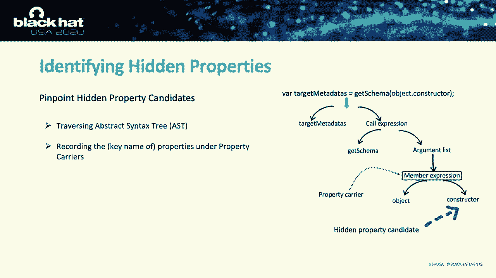
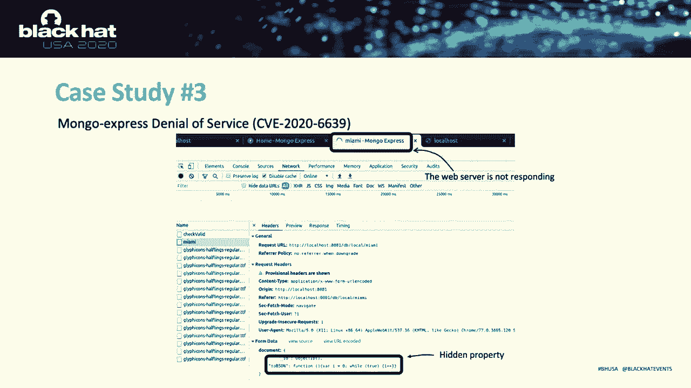

# 课程 P74：75 - 发现隐藏属性以攻击 Node.js 生态系统 🎯

在本节课中，我们将要学习一种针对 Node.js 生态系统的新型安全风险——隐藏属性滥用。我们将探讨其原理、攻击向量，并了解如何利用自动化工具来发现和利用此类漏洞。

---

## 背景介绍

Node.js 用于在浏览器之外执行 JavaScript。它基于 Chrome V8 引擎实现了一个运行时执行引擎，并提供了一系列 API，使 JavaScript 代码能够与主机环境交互，例如读写文件系统或执行系统命令。如今，许多网站和 Electron 应用都部署在 Node.js 上。

在基于 Web 的 Node.js 应用中，将通信数据打包成对象表示形式非常普遍。这通常通过两种主要方法实现：基于查询字符串的共享和基于 JSON 的共享。服务器在收到请求后，会解析数据并将其转换为对象，供程序后续逻辑使用。

## 什么是隐藏属性滥用？

通常，安全评估会尝试向现有数据字段（如 `age`）注入不同的负载以触发漏洞。但如果我们选择不测试现有字段呢？既然我们可以向服务器传递一个对象，那么如果我们向程序中注入服务器程序未预期的额外属性，会发生什么？

具体来说，如果攻击者能够发送伪造或覆盖某些内部状态的属性，就可能轻易获得危险的能力，例如操纵程序的关键逻辑。我们将这种攻击称为**隐藏属性滥用**。

HPA 利用 Node.js 中的对象共享来伪造或篡改 Node.js 应用程序中的关键程序状态。我们将注入的这些额外属性称为“隐藏属性”，因为它们类似于端点用户 API 的一些隐藏参数，这些参数与某些内部状态相关联，但在攻击者发现并利用它们篡改内部状态之前，没有人知道它们的存在。

## 攻击向量分析

在我们的研究中，我们发现了两种类型的攻击向量。

### 1. 应用特定属性操纵

这种攻击用于操纵应用程序自身定义的某些内部属性。这些内部属性本应由某些内部函数初始化和管理，通常代表程序的某些内部状态。

例如，一个 `initRole` 内部函数负责管理用户对象的访问权限。然而，通过 HPA，攻击者可以将一个名称冲突的属性传播到用户对象中，从而控制内部状态。如果恶意用户在其请求中注入一个额外的键值对，这个额外的键值对很可能会覆盖用户对象上的现有数据。

当我们需要在大型程序（如订单状态或用户权限管理）中滥用某些具体逻辑时，这种攻击向量非常有用。

### 2. 原型继承劫持

在 JavaScript 中，每个对象都有一个指向原型对象的链接。当 JavaScript 代码想要访问对象的属性时，不仅会在对象本身中搜索该属性，还会在其原型链上搜索，直到找到匹配名称的属性。

通过 HPA，我们可以劫持继承链，并将我们自己的负载伪造为链上的内部属性。如果我们注入一个名为 `constructor` 的属性，搜索过程将完全不同。由于输入对象内部已经有一个名为 `constructor` 的属性，搜索会立即停止并返回用户控制的值。

我们发现许多 JavaScript 开发者倾向于信任从原型继承的属性，并基于它们做出许多安全敏感的决定，这使得第二种攻击向量非常有用。

**请注意 HPA 与原型污染的区别**：原型污染旨在攻击和篡改原型对象本身，而我们的攻击向量并不修改原型对象。

## HPA 的根本原因与相关漏洞

HPA 的根本原因是 Node.js 未能将用户输入等不安全对象与关键内部状态隔离开来。

HPA 可以被视为 CWE-915（动态对象的不当修改）下的一个新安全风险。其他语言平台也存在类似问题，如 Ruby 的 Mass Assignment 和 PHP 的对象注入。虽然这些变体都受 CWE-915 主导，但由于语言差异，它们各有自己的模式。

例如，Ruby Mass Assignment 利用了 Ruby on Rails 框架特定的赋值功能来篡改与赋值相关的现有对象。其负载是字面量值，且 Ruby 是强类型语言，因此 Mass Assignment 漏洞无法向受害对象引入新属性。然而，HPA 可以注入任意属性，这使得 HPA 非常灵活和强大。

## 实战演示：攻击 Routing Controllers

现在，让我们通过攻击一个流行的 Web 框架 **Routing Controllers** 来演示一个端到端的攻击，从绕过安全检查到数据注入。

以下是攻击流程的简要概述：
1.  用户向 Web API 端点发送序列化数据。
2.  身份验证模块根据 JSON 字符串实例化一个对象，并将其发送给参数处理器。
3.  处理器会收集内部格式规范（蓝图），将其与输入对象合并，并调用输入验证 API。
4.  输入验证组件根据格式规范验证用户输入数据（例如检查电子邮件字段是否合法）。
5.  如果检查通过，用户对象将流入数据库。

**攻击步骤分解：**

**第一步：隐藏属性注入**
恶意用户在请求中包含额外属性（本例中为 `constructor`）。当服务器程序实例化用户输入时，参数处理器对象内部将包含这个额外的 `constructor` 属性。

**第二步：参数合并与继承链劫持**
程序将合并用户输入和参数处理器对象。合并操作类似于 `Object.assign`，会将参数对象的所有属性放入目标对象。通过此操作，隐藏属性 `constructor` 也被转移到了目标对象上，从而劫持了目标对象上 `constructor` 的继承链。

在 Routing Controllers 中，目标对象的 `constructor` 在其原型上存储着重要的格式限制。因此，合并操作使我们能够劫持这些重要格式限制的继承。

**第三步：绕过输入验证**
当 `getSchema` 函数读取 `constructor` 时，我们的隐藏属性会立即匹配并返回给代码。为了绕过输入验证，我们只需将格式规范设置为无效值（例如我们的注入负载），从而逃过检查。

**第四步：完成攻击**
经过验证的负载随后流入敏感的数据库 API，完成整个攻击。

实际的漏洞代码逻辑比简化的图示复杂得多。例如，输入验证模块本身包含超过 3 万行代码。因此，拥有一个能自动跟踪所有这些数据结构、自动检测所有隐藏属性甚至自动利用它们的工具将非常有帮助。

## 自动化工具：Lynx 的设计与实现

构建此类工具面临诸多挑战：
1.  **JavaScript 的动态特性**使得分析非常困难。
2.  **HPA 创建了新的数据依赖**，而程序分析擅长挖掘现有数据流，而非创建新的。
3.  **HPA 利用内部程序状态**，攻击效果高度依赖于代码上下文，这使得检测更具挑战性。

为了克服这些挑战，我们设计并实现了 **Lynx**，一个用于检测和利用 HPA 漏洞的混合型 JavaScript 程序分析工具。

Lynx 的工作流程主要分为两部分：

### 1. 发现潜在的隐藏属性（核心组件）

**动态流跟踪：**
Lynx 首先生成一个标签对象（一个唯一的键值对），并将其递归地注入到程序的输入数据中。它会生成多个不同的输入对象，每次将标签注入到不同的属性中。然后，在插桩框架中执行这些变异的测试输入。我们利用 JavaScript 分析框架 Jalangi2 来插桩测试程序，主要关注变量读写、对象属性索引和函数调用。执行期间，Lynx 会检查数据流中的每个对象，如果对象携带我们的属性标签，则将其记录为“属性载体”。

**静态语法分析提取候选属性：**
我们需要从属性载体中提取所有“外壳”（即其上的属性），并将其标记为隐藏属性候选。为此，Lynx 使用静态语法分析从代码中提取必要的语法信息。它会遍历语法树直到到达属性载体，然后记录该载体下的所有属性。

### 2. 检测有害隐藏属性并生成利用

在前一组件中，我们发现了潜在隐藏属性的键名（如 `constructor`）。通过注入具有此类键的属性，我们可能会覆盖某些内部状态。然而，我们仍然不知道候选属性是否可以被覆盖，也不知道如何利用这些候选属性引入攻击效果。

**定义敏感行为（Sink）：**
我们研究并总结了六种通用类型的敏感接收点（Sink）：
*   **基于关键字的 Sink**：如 `exec`, `eval`, `require`。某些敏感方法的参数是 HPA 的常见攻击目标。
*   **基于行为的 Sink**：例如，监控隐藏属性是否能改变模块的返回值。这类 Sink 对于输入验证器等安全相关模块来说是致命武器。

**符号执行探索利用路径：**
Lynx 首先生成一个可以到达潜在漏洞属性的利用模板，其中注入的是占位符。然后，使用构造的模板运行测试程序，并对隐藏属性进行符号执行。通过符号执行，探索路径上的所有约束分支。如果探索命中某个 Sink，则获取可以欺骗该 Sink 的相应负载。

## 研究成果与影响评估

在我们的研究中，我们从 npm 选择了 60 个广泛使用的程序（55 个模块和 5 个 Web 应用）。在 Lynx 的帮助下，我们跟踪了超过 1030 个属性载体，检测到 300 个与之关联的隐藏属性候选。最终，我们确认了 **13 个零日漏洞**，并借助符号执行合成了 **10 个漏洞利用**。

我们发现 HPA 可以引入各种攻击效果，例如**凭据泄露、绕过安全检查以及拒绝服务**。影响分析表明，HPA 危害了以前无法访问的程序状态，从而有效地扩大了攻击面。同时，我们注意到 HPA 不只是一个简单的输入验证问题，许多输入验证器本身也容易受到 HPA 的攻击。

## 案例分析

以下是部分已向供应商报告的有趣漏洞案例：

**案例一：MongoDB 官方驱动程序**
我们发现可以篡改一个名为 `bsonType` 的内部状态。MongoDB 利用此类型来指示查询对象的数据类型，但在序列化查询对象时，MongoDB 会忽略具有未知 `bsonType` 的对象。通过向查询条件对象中注入一个未知的 `bsonType`（如 `“blackhat”`），攻击者可以强制 MongoDB 不序列化查询条件，从而导致 MongoDB 始终返回数据库中的第一个用户。利用此能力，攻击者可以登录或删除数据库中的任意用户。

**案例二：TaffyDB（内存 JavaScript 数据库）**
我们发现了一个名为 `id` 的隐藏属性，它是数据库条目的内部索引。一旦在查询中指定我们自己的 `id`，TaffyDB 将忽略其他查询条件，直接返回与该索引关联的结果。此外，由于内部索引是易于猜测的格式（如 `T0002R`），攻击者可以利用此漏洞访问数据库中的任意数据。即使指定了错误的密码和用户名，攻击者仍然可以通过精心构造的隐藏属性泄露正确的用户数据。

**案例三：攻击 Node.js 事件处理器**
Node.js 使用单线程处理所有传入请求，因此事件处理器的可用性至关重要。在 Mongo Express 中，我们发现了一个允许我们传递函数定义的隐藏属性。该函数将在隔离的安全沙箱中执行。虽然我们无法使用这些隐藏属性执行命令，但我们可以通过传递一个无限循环来阻塞事件处理器，从而冻结整个服务器程序。

---

## 总结

本节课中，我们一起学习了 Node.js 生态系统中的一种新型安全风险——**隐藏属性滥用**。我们了解了 HPA 如何利用对象共享来伪造或篡改关键程序状态，探讨了其两种主要攻击向量（应用特定属性操纵和原型继承劫持），并通过实战演示了完整的攻击链。此外，我们还介绍了自动化检测工具 Lynx 的设计原理与工作流程，并评估了 HPA 漏洞的实际影响与危害。希望本课程能帮助你理解这一安全风险，并在开发中提高警惕。