# P76：77 - The Paramedic's Guide to Surviving Cybersecurity - 坤坤武特 - BV1g5411K7fe

 My first call is lead paramedic。

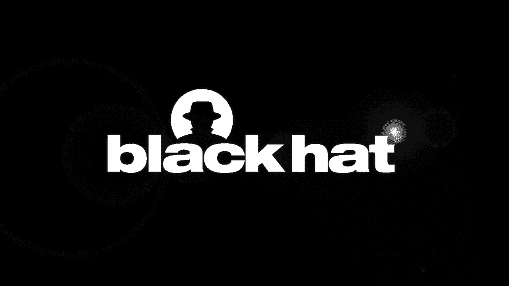

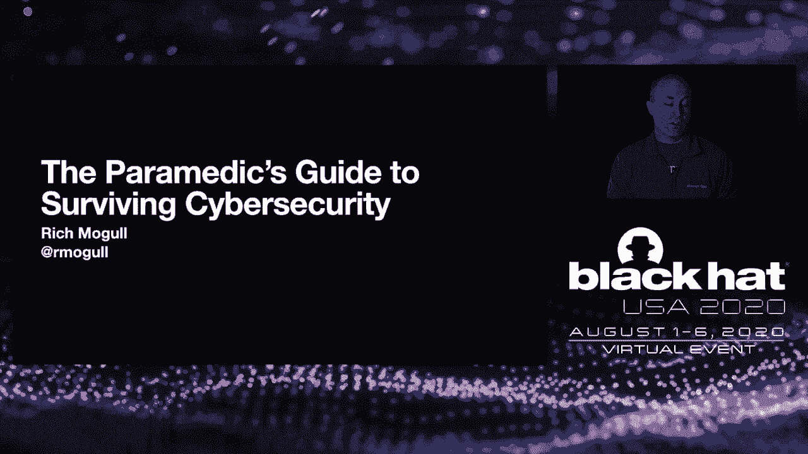

 Yeah， it was pretty bad。 So my partner and I， we got paged out for an ultra mental status just outside of Golden。

 Colorado。 I pulled up to this mobile home and the patient's neighbor met us down at the bottom。

 She called us in because she'd gone in to check on her neighbor and pounded her semi-conscious。

 sitting in her kitchen。 Walk in and I can still picture the patient sitting in a chair。

 It was on a formica floor in a very well kept kitchen。

 Some of those 70 style tables that's got the metal rooms around the edges。

 And from a distance it looked like it was probably going to be a diabetic emergency。

 So this is pretty straightforward for us to go ahead and take care of。

 First thing I would do is check the patient's glucose and if her blood sugar super low。

 we give her what's called an amp of D50。 It's 25 grams of dextrose。

 high octane sugar that's so concentrate when you put it in through， the IV。

 if you actually mess up and miss you'll kill all the surrounding tissue。 Well。

 sure enough her blood glucose is low and everything's going fine at this point。

 Then I really messed up and everything went wrong。

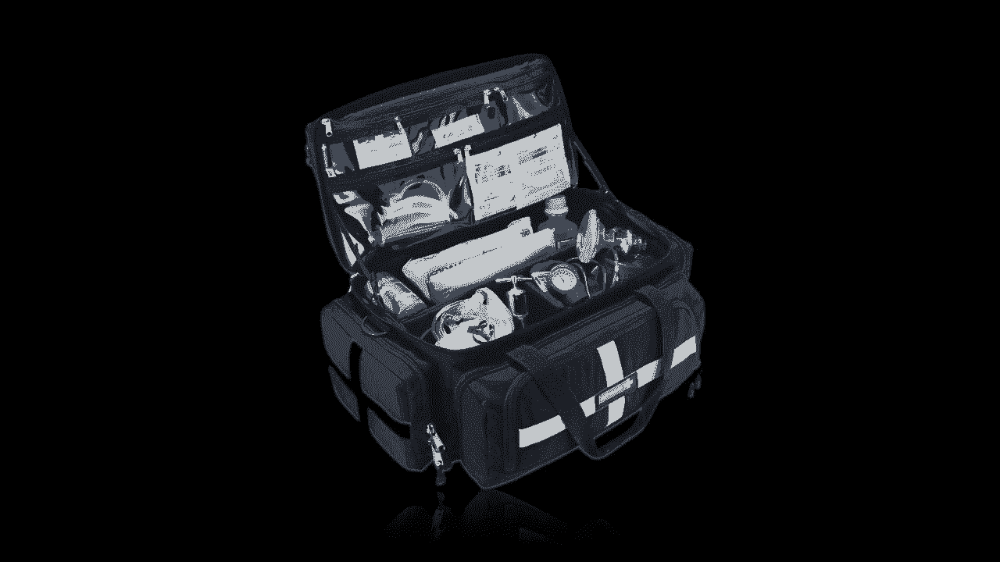

 I got it into my head that to treat the patient I wanted to start the IV and give her the D50。

 in the back of my ambulance。 Now there's reasons for this。

 That sugar is so pure it's very fast acting but it also wears off really quickly so if。

 the patient doesn't manage their sugar for the longer term they can end up right back。

 where they started and you really should be checked out at the hospital。

 The patient's not really with it so she can't tell me we have what's known as implied consent。

 that she doesn't want to go to the hospital。 But if you've ever had low blood sugar。

 you know how angry you get。 And so I told my partner let's get her out。

 let's get her in the back of the ambulance， and I'll take care of her and she started fighting。

 And the neighbor is wondering why we're dragging this poor woman out of her house， bringing。

 her into the back of the ambulance。 And it was ugly and I still remember us just kind of pulling her down the stairs and my partner。

 looking at me like I was crazy because I was because maybe I could have given her the。

 D50 in the house。 Her neighbors right there and made her a sandwich or given her a bowl of cereal and。

 kept an eye on her。 Instead I made that decision for the patient。

 Put her in the back of my ambulance， started the IV， she wakes up and she is even angrier。

 albeit fighting us a little bit less。 The reality is is I did not manage that call well。

 That partner never wanted to work for me again and I had actually caused me problems in that。

 job in the longer term。 It took me about a year or two before I think I became a competent paramedic。

 I went out to the East Coast to work some high volume places like the Jersey City Medical。

 Center before coming back to Colorado doing a little more work and then eventually going。

 back to college。 And when I went back to college， I dropped down after my paramedic expired to EMT so。

 and got a part time job as a PC technician because it was just really too hard to work。

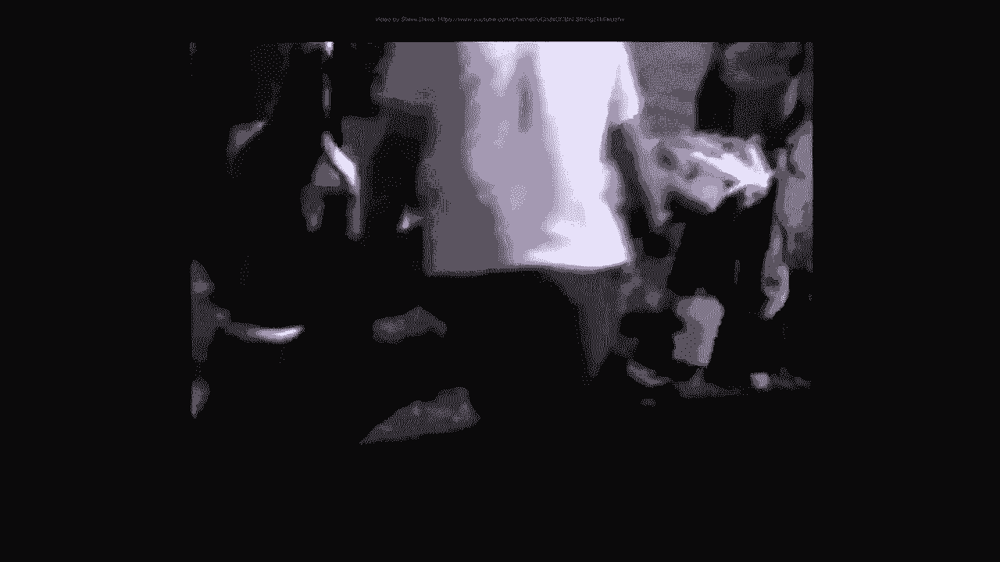

 as a paramedic while going to school at the same time。

 But over those years I stayed active in emergency services。

 I did about five years of volunteer firefighting， 12 years with Rocky Mountain Rescue Group， five。

 years on the Copper Mountain Ski Patrol， now 20 years as a federal disaster responder and。

 for a couple of years I've been a member of Team Rubicon and actually deployed with them。

 recently up to the Navajo Nation。 Also got my paramedic back about two years ago。

 So over this time period I built up my IT career as well， eventually starting Securosis and。

 the Cloud Security Company disrupts。 And I realized as I've lived these parallel lives。

 one foot in emergency services， one， foot in cyber security that the lessons I was learning from each profession were helping。

 me and the other profession。 And to be honest， I think I got more out of emergency services than I've gotten out of。

 the security industry improving my job as a paramedic。

 And it's because there's a lot of similarities between the two。 I mean first of all。

 they're both very young professions。 When I first started getting interested in emergency services。

 I was just a little kid， and I was watching this show Emergency with Johnny and Roy and it turns out that that。

 was kind of the start of paramedics in the US back in the early 1970s。

 That TV show was actually about an experimental program in Los Angeles and that wasn't even。

 covering the entire city。 And if you tried to call 911 after watching that show。

 the odds were nobody's going to， answer， even after the show went off the air in 1979。

 So I became a paramedic about 20 years after the profession started。

 When I started in security around the year 2000， we were still in our infancy as a profession。

 as well。 And we had really only been around for 10， 15， maybe 20 years if you count some of the。

 government aspects of it。 But that's just the start of these parallels。

 Not only are both industries relatively new and security newer than emergency medicine。

 we both have our roots in the government and military。

 Ambulance is started over in the military in the battlefield where a lot of what we have。

 taken from IT security actually started with government and government computing systems。

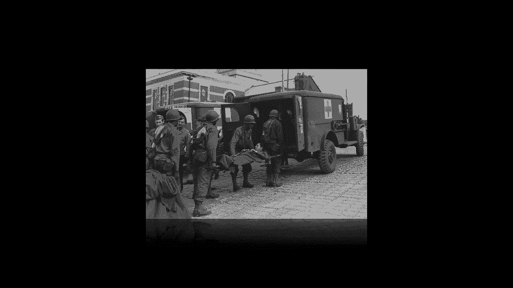

 because they're the first ones that had the money for computers。

 Both professions also have their feet in two different worlds。 As a paramedic。

 I split the difference between the fire and rescue world and the continuity。

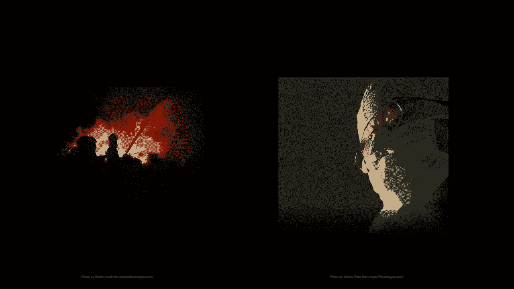

 of care and the medical world of in hospitals。 And they're very， very different。

 And that's really similar to how in security we have the requirements to be able to talk。

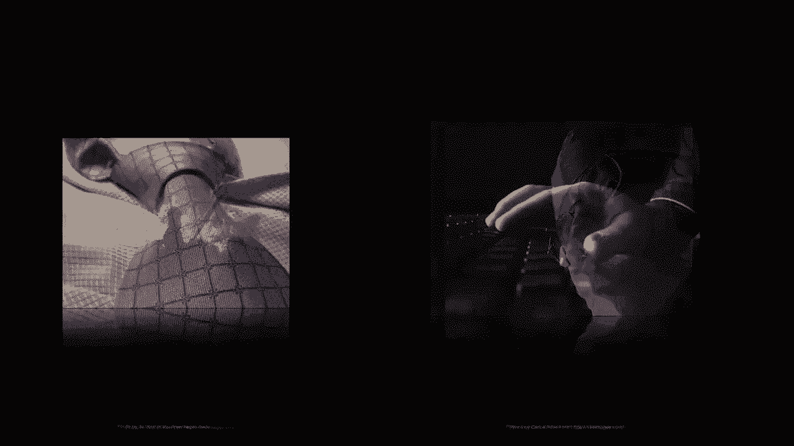

 to and work with the business。 But we also have the very technical aspects of our job。

 particularly those of us that， are dealing with things like on the incident response side。

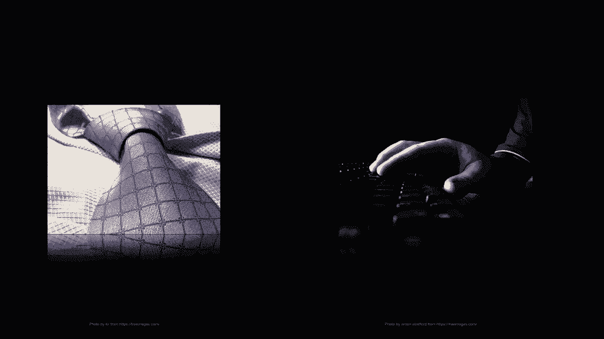

 And both jobs are highly technical， via the years it takes the many months to years to。

 learn how to read an EKG。 It's very similar to looking at packet captures or writing code。

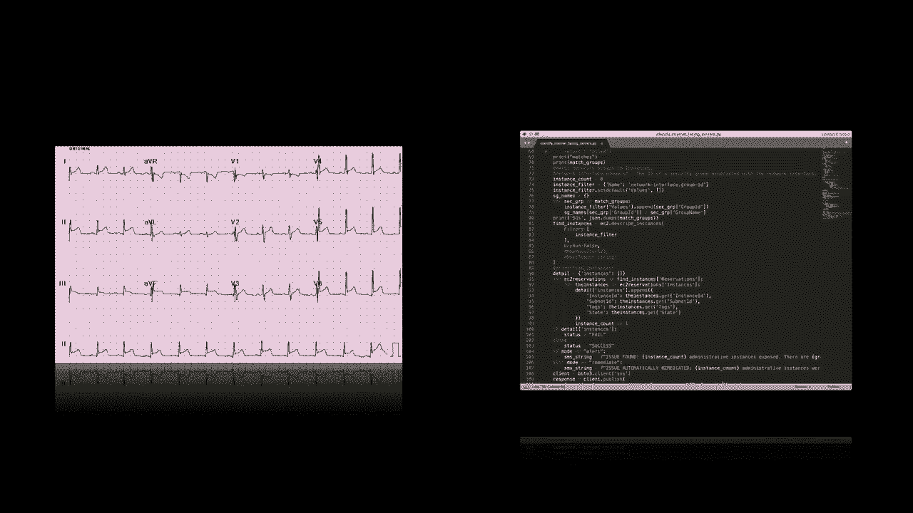

 And across both professions， we deal with incidents as well as longer term issues。

 Although to be honest， it's a paramedic。 I deal more with the short term incidents。 But again。

 in both， there's the how do I solve this problem today to what are the larger。

 issues that I have to look at to protect my organization or as a medic to protect my community。

 But there's downsides to these similarities。 The biggest thing around mental health and burnout。

 We have huge problems in both fields with burnout and with mental health。

 And I think it's worse in emergency services， but we have a growing recognition of burnout。

 issues in information security。

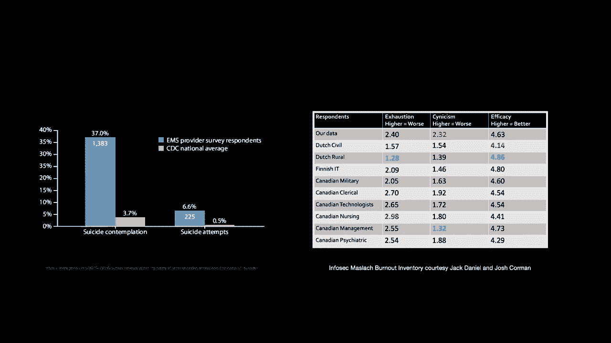

 I think the reason these two fields are so similar is we share one really core aspect。

 The job is never done。

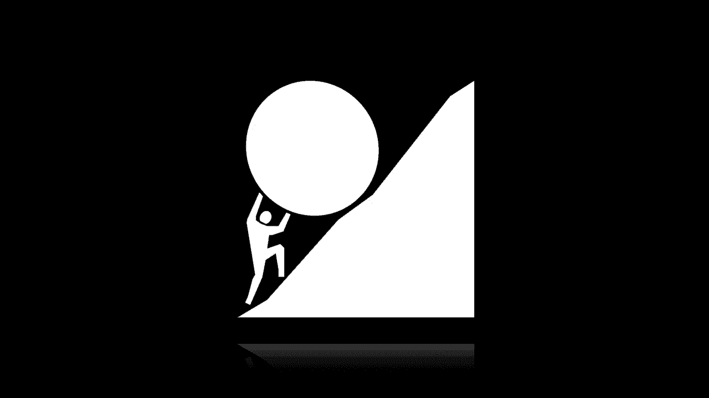

 We are always pushing the rock uphill。 We're always treating the next patient or solving the next incident or securing the next technology。

 But we don't get that seem sense of satisfaction you might get if you deploy a new application。

 or you release some new kind of business product。 And whatever our plans are in either field。

 we never know when the meteorites are going， to come in and blow them apart。

 We don't really have full control over our environment。 We're dealing with a certain level of chaos。

 And that takes a certain kind of a personality。 And so as I've lived both of these lives and learned the lessons across both of these communities。

 I think not only can we learn from each other， but I do think emergency services is a little。

 further ahead。 The profession should spin around for about 15。

 20 years longer than cybersecurity spin， around。 And I think we can learn the lessons from emergency services。

 emergency medical services， and apply， those to what we do in cybersecurity to improve how we do our jobs。

 but also to help us in， the long term to help us with our mental health and in the development of our careers。

 I've realized that there's four phases to our career in these professions。

 And not everybody makes it through all of these。 Some of us stall out at these different steps。

 And I recognize these earlier in EMS， but I think they apply to security as well。

 And the first one of those is enthusiasm。 Because when you first start the very first time I sat on this as a paramedic in that。

 right hand seat， I can't tell you how exhilarating it was。 And yeah。

 my first call didn't go very well， but eventually my calls did go well。 By the way。

 it's really important to my kids that I tell all of you that that's our cat。

 His name is Guisey's very cute。 And yes， he does wear a harness。 When you first start。

 we're really enthusiastic as we have to do incredible things。 Because in EMS。

 and particularly after I got my paramedic， I got to fly around in helicopters。

 and drive around with lights and sirens and sit in the back of that fire truck for the。

 first time with the air pack and the bunker gear on。 I mean。

 this is every kid's little dream or many kid's dreams。 When we first get into cyber security。

 we have a real similar issue。 We have real similar advantages。

 We're dealing with aspects of technology that others don't get to see or play with。

 be it hacking tools and packet captures and seeing everything that's going on in our organizations。

 So we're really enthusiastic。 We're very eager to learn。 We really want to use these new skills。

 I mean， when I got out of paramedic school， I couldn't wait to innovate and start IVs。

 And when we come out of security training， you can't wait to use those latest tools and。

 to run a penetration test against your organization。 We're also really flexible in this phase。

 Our minds aren't really locked in to any particular way of doing things。

 We're still looking for role models。 We're still figuring out how the profession works and how the job works。

 which means we， tend to be inexperienced because we're new， very task focused， very skills focused。

 So what are some of the challenges that we face during this time？

 And one of the biggest ones is the skills without context。 It's the， I want to use the new toys。

 I want to use the new skills。 I want to innovate a patient while I'm wearing full hazmat gear。

 That's great。 I worked on that on a real patient in my career。

 although some of those skills are actually， helping now during the COVID era。

 But it's the understanding when to use these tools。

 We don't really yet and we tend to over treat and we tend to overuse our tools and tend to。

 over rely on our technologies versus seeing that larger context。

 Another really dangerous problem is picking the wrong role models。

 People who are burnt out and cynical， they have a particular magnetism to them。

 They come across as the old crusty， seen it all， done it all。

 They are the Han Solo characters that we try to emulate。 But the problem is。

 is they're not going to be good role models。 They tend to think rigidly。

 They have kind of turned their brains up to learning。 They're in this survival mindset。

 And so we have to be very cautious who we pick for those role models。

 And so to get through these challenges， I think there's some things we can do that will。

 not only help us through this enthusiasm phase to move on with our careers， but。

 actually you're building the foundation for the rest of our time in the profession。

 One of the first is， you just got to know the job。 As a paramedic， I have to know my protocols。

 I have to know my drug doses。 I can't be messing around with those in the slightest。

 I may not always know the context。 I may go down the wrong protocol。 I may mess up an assessment。

 But if I fundamentally don't know those， it's a problem。 And in security。

 particularly for those of us on the incident response side， it's really， important。

 Know our playbooks， know our runbooks， know our standards， know our technologies。

 And just have to know those。 That's level one for being able to move forward as a professional。

 And one thing that's becoming more recognized in the medical community is the use of checklists。

 particularly for complex and harder procedures。 I know I've actually started building a lot of these when I do security work。

 particularly， hands-on， so that I don't miss steps and I don't make mistakes。

 Because no matter how much experience you have， you might still make a mistake。

 This is a checklist built by a physician who's one of the probably the best in the country。

 at managing airways。 As for rapid sequence innovation。

 that's where we sedate and then we paralyze a patient。 Something paramedics do。

 it's something physicians do。 And think about it， they can't breathe anymore。

 So if I don't have every piece of equipment I need and two or three layers of backup equipment。

 that I might need， if I screw up， I can easily kill that patient。

 And checklists are the kind of thing you don't just use in the beginning of your career。

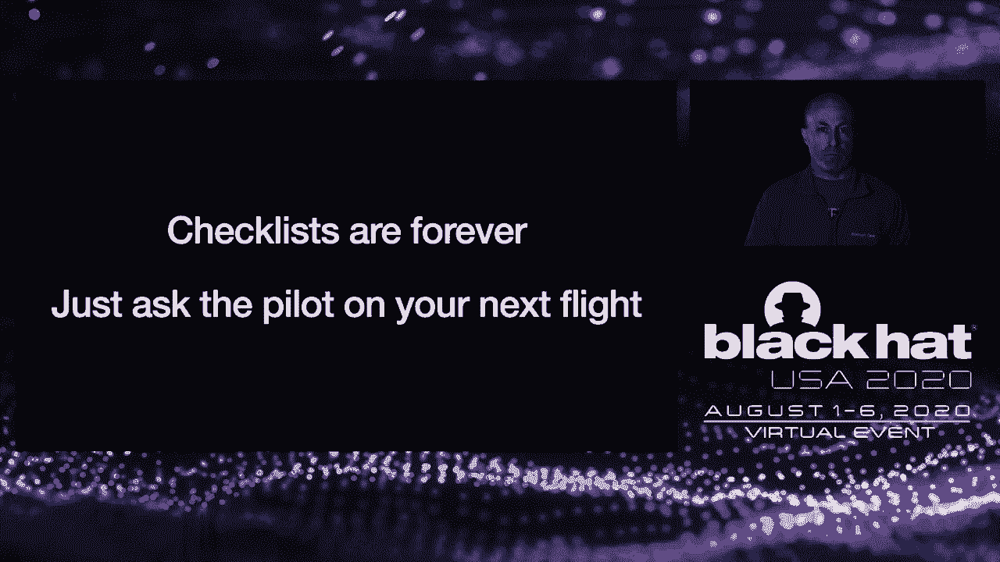

 You can use them throughout your career。 Just go ask the NES pilot next time you get on an airplane。

 if we ever get on airplanes， again。 Now there's another skill that you want to try to start developing at this phase。

 which， is harder。 That's the idea of zooming out it。

 Can I take a step back and look at the bigger picture？

 It's what I didn't do when I dragged that poor woman out of her house。

 I was on a mountain rescue call once。 It was kind of a sketchy on edge weather sort of day and the call came in in the afternoon。

 for some people shouting for help somewhere up in the mountains。

 I mean deep in the mountains just west of Boulder， Colorado， and nobody saw anybody hurt， they。

 just heard the shouts for help。 So a bunch of us went out and me and another gentleman were partnered up and we went out。

 we were one of the second and third people out the door with some medical equipment in， clothes。

 We're thinking we're out for a nice hike。 You get these calls all the time， there's no one there。

 Well， somebody ahead of us called out on the radio， they found two patients。

 We got there pretty quickly and I had to do the medical assessment。

 My first patient had an injured ankle， second patient two injured ankles and it smashed， his chest。

 These guys were trying to slide down a permanent snowfield， lost control and smashed into the。

 rocks at the bottom。 And the second patient， he was pretty banged up and he was having trouble breathing。

 I looked up at the sky and there's bad weather coming in and we're losing light。

 So I went over to the guy with the injured ankle， I didn't take his boot off， I didn't。

 assess his ankle， I just made sure there was no blood， no bone sticking out， I look at， him and go。

 can you walk？ He goes， yeah， go good， go with this guy and hike down the mountain。

 Stop if you need help and call for it on the radio。

 I zoomed out because at that point in time the best thing for that patient wasn't following。

 my protocol and treating that ankle which it turns out was broken。

 It was getting him out of there as quickly as possible before we had a very complicated， evacuation。

 And the rescuer for his partner ended up being overnight and almost resulted in a helicopter， crash。

 From the mental health side we also want to start building our skills early。

 Mental health skills need to be built just as much as your technical skills。

 Some of the things that can help find positive mentors and make sure you understand the procedures。

 and processes start learning why you have those protocols the way they are。

 Don't just know what the steps are， know why you have those steps。

 And start really learning continuously。 Don't assume because you got out of school or you passed a few tests that you actually。

 know what's going on。 Medicine changes， technology changes。

 there's always opportunities to learn new things。 There's also really important time to create bias defenses。

 Now this is huge and all public safety emergency services as we've seen in the news lately。

 When you're dealing with certain user populations， socioeconomic and even racial classes， you can。

 get a very biased view of them because of the nature of only seeing people at their， worst。

 In security we face the same issue。 How we look at our developers。

 how we look at different business units， how we look at， auditors and others in the business。

 I know we have a lot of biases。 I know we like to victim blame。

 And the earlier you recognize this and you don't get into that habit， the better。

 And it's something you're going to have to fight all the time。

 And then we want to embrace this concept of anti-projility。 If I'm resilient。

 I can keep taking hits and I don't change。 It's like that Simpsons episode where Homer Simpson is fighting the fake Mike Tyson。

 And the only reason he's in the ring is because he's the only one that wouldn't go three rounds。

 without dying。 But if he went to round four， he'd die and mow through in the white towel and rescued。

 him with， well， they flew out of the anyway。 It's the Simpsons。

 But resiliency is you are inflexible and you can take the hits。

 Anti-projility is all about thriving in chaos and uncertainty。

 It's where you look for that uncertainty。 And when something happens。

 you take the hit and you learn from it and you adapt from it， and you move forward。

 And it really is a mindset that mindset that I absolutely prefer。 Now the next phase is ego。

 It's a paramedic。 This is where we're going to get your first clean kill。

 This is where I'm going to make a mistake because I'm burned out。

 What we found when I first started as a paramedic， I was told average burnout per paramedic。

 is around seven years。 Nobody had done a study on that。 That was just this person's experience。

 So if you think about it， it takes you one， two， three to five years to become pretty good。

 at the job。 And then around five to seven years， you start burning out。

 And that's going to happen if you don't actively manage and try to prevent that burnout。

 Why is that？ Well， you've seen a lot and a lot of things that are hard to handle。

 And so you kind of stop listening。 You jump to conclusions because you're seeing this constant repetition of the same things。

 over and over。 Your sleep can be affected。 There's exhaustion。

 Maybe it's because of the psychological aspects of the job or maybe it's just because you're。

 rotating shifts or you've got too many pager calls in the middle of the night。

 This is also where having to be right to work may become more of a crux and a dependency。

 because you're now abusing substances as a way to escape from the burnout and your dissatisfaction。

 with what's going on。 And you're just caught in this endless cycle， seeing the same things over。

 responding the， same ways over in a very unhealthy cycle。 We can measure this。

 Something you notice in the Masoch burnout inventory。

 I actually learned about this from a couple of people in the cybersecurity industry， Jack。

 Daniel and Josh Korman， who both took time out to give me some results of a survey that。

 they did around information security。 And Josh actually did a great presentation in 2019 with Dr。

 Maslow， who created the burnout， inventory。 What we found or what they found is that in security。

 we hit all three criteria。 We're red in exhaustion。

 We're red in cynicism to the point of where Jack Daniel says cynicism is our core competence。

 And we're low on perceived self-fistency。 Are we feeling like we are making a change？

 That's actually split。 Or make people in the security community that feel like they're making a change。

 Those more in the incident response side feel like less like they're making a change。

 And burnout is something we have to battle all the time。 So how do we get through this ego phase？

 Well， it's a combination of mindset and process。 On the mental health side。

 this is where we really have to focus on the fundamentals。 There's no surprises here。

 People have talked about this over and over again。 You need to eat healthy。 You need to exercise。

 You need to sleep。 You need to rely on more peer support。

 One of the great things that we can do in some of the places I work EMS is， for example。

 when I got back from my deployment to Puerto Rico， they actually， in the federal， there。

 was a database someplace where I got a call a month or two later just to make sure I was。

 okay with Team Rubicon。 That's absolutely essential。

 There's like monthly buddy checks to make sure people are okay and mentally okay。

 And picking the right peers can be a very large part of this。

 If you hang out with that cynical burnt out crowd， you're going to be cynical and burnt， out。

 When you're enthusiastic， you're trying to impress those above you。

 But when you've been around for a while， you're trying to impress those below you。

 And that can actually get into this vicious negative cycle。

 And then having workplace support really helps。 I think we're actually better on this。

 Believe it or not， in security than an EMS， particularly some EMS companies do a really， poor job。

 People don't get time off。 They're low paid。 They don't get a lot of benefits。 And we do。

 We just have more money in security than people in EMS have， which helps。

 But both industries also have toxic environments。 And we need to recognize that and try to avoid those if we can。

 Because ego， burnout， these are rivers that are constantly eating away at our mental health。

 foundations。 And we need to constantly be rebuilding and refreshing those foundations to our career。

 This is why I say start with that mental toolkit early。 Recognize these issues early。

 Be aware of them because it's going to give you a better chance to protect yourself from。

 them as you move forward。

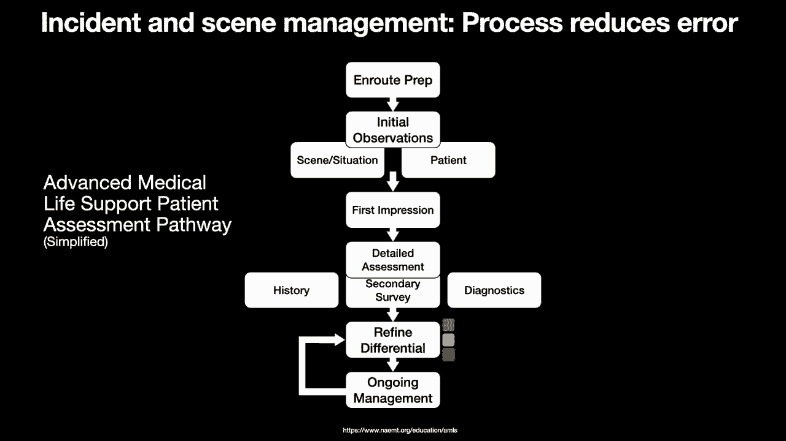

 Now that feeds into some of the process issues because some of the problems you make and the。

 reason is that Medi-com might get a clean kill at this phase is I stop paying attention。

 and I stop the fundamentals。 I start jumping around a little bit because I now have the experience to do that。

 This is where what I call second level pathways or protocols make sense。

 These are the kinds of things that physicians are often very good at that we as paramedics。

 need to spend a little more time with。 This one's from advanced medical life support。

 And it's a patient assessment pathway to make sure we're constantly assessing and reassessing。

 patients and we're not missing anything。 It really comes down to making sure that we introduce the right kind of processes and we。

 stick with those even when we start being very， very good at our job。 Information is scary。

 We don't have a lot of things。 We have some stuff in incident response。

 We have some written technical processes but I think it's a real big place where we can。

 grow as a profession to start really operationalizing what we do in both generic ways and in the。

 individual incident with the individual technologies as well。

 Now at this ego phase though we are competent at our jobs。

 So this is a time where we can really build some of these advanced skills。

 I talked about zooming out， keeping a flexible mind， continuous learning， doing drills and。

 exercises。 This was a great one we did with federal government。

 It was a top off they called it where we did a simulated weapon to mash destruction。

 It actually involved an attack in multiple states throughout the US。

 So I got blown up to Seattle and you can see that I'm in the decontamination tent at。

 our pole hazmat gear taking a picture of the bus that they fake exploded and threw onto。

 its side as we're treating hundreds of fake patients。

 Those are the kinds of things that really make a difference just drilling in and challenging。

 us mentally to keep us on our toes。 So we have the flexibility to adapt to new situations and the decisiveness to make a。

 decision and actually act。 We had an exercise once where the person running it got mentally locked up。

 Things didn't go the way she expected。 She didn't have that mental flexibility。

 As a result she didn't act and that whole exercise fell apart。

 Thankfully it was an exercise and not a real situation but I think we all know that it。

 happens in real life as well。 The ego phase， some people skip it and some people never leave it。

 This is that really tough area and it's the most I think personally challenging phase to。

 go into because your ego gets pretty strong because you know what you're doing but you。

 are also fighting those burnout and those mental health issues and it can really be。

 a bad combination and it really comes down to your choice。

 Do you want to move forward or do you want to stay locked into that negative cycle？

 Because the next phase has its own challenges and that's empathy。

 This is where you start seeing people as human beings again not as patients with vital， signs。

 One of the first times this really hit me was when I responded to Hurricane Katrina and。

 we actually ended up in Houston where we started off by triaging 900 patients in three hours。

 and they were helping provide medical care in the stadium where all these evacuees who。

 would come out of New Orleans had gone to。 When I'm dealing with 900 patients in a matter of hours and I have to do assessment after。

 assessment after assessment it's important to remember that for almost every one of them。

 that was possibly the worst day of their lives。 That they were experiencing absolutely horrible things and really I'm not going to be providing。

 much medical care。 Most of them didn't need any medical care but what I could bring in is empathy and kindness。

 Make them feel like human beings as they're being shuttled around and treated like meat。

 on these buses making just that small difference in someone's day。

 When you start an earlier in your career you don't feel personally rewarded by making。

 those kinds of small differences but I really think that that's what separates the true。

 experts in our field from people who are kind of younger and earlier in their career。

 It's tough because you have to learn how to empathize without sympathizing too much。

 What's the difference？ Well， when I deployed down to Puerto Rico things had been torn apart and we ended up。

 in a series of our disaster response tents in the parking lot of hospital where functioning。

 is an ICU。 We had a patient come in with diabetic ketoacidosis。

 DKA which is high blood sugar versus the patient， I talked about earlier with low blood sugar。

 This woman， she was actually from Florida。 She lived now in Puerto Rico but she was originally from Florida。

 Of course Florida。 We'll get there。 No offense to our watchers from Florida。

 But she came in with the high glucose and she knew she was in a hospital and she quickly。

 became drug seeking。 And she wasn't very kind to us as the staff even though we were trying to treat her dignity。

 and respect because however horrible it is in her drug conditions and everything else。

 she still had probably lost her home like most of the other people they were dealing with。

 and there was certainly no electricity or clean water。 Well。

 at one point the flight nurse and I who were treating her talked to the physician。

 assistant who was responsible for her overall care and he said just give her the meds and。

 we're like she's drug seeking。 You don't give a drug seeking patient。

 opioids and he goes look guys we're not changing her， life today。

 We're not going to change her life decisions today。

 We need to treat her get her out of our room open up that bed for somebody else and us。

 withholding that drug is going to make that situation any better。

 And so we did and I learned that day to be able to empathize and treat her like a human。

 being without once justifying her poor decisions。 And this was hard because I was starting to suffer from compassion fatigue。

 Compassion fatigue is really different than burnout。

 The thing about it is we have a gas tank for empathy。

 We have a gas tank for compassion and at a certain point you're going to run out of。

 fuel and the more you get into this empathy phase the more that you're going to be challenged。

 with compassion fatigue because you can't just close yourself off like you do when you're。

 burnt out。 And compassion fatigue is very well recognized within the medical industry。

 There's something the compassion fatigue project。 I've got some links actually that that will go out with this presentation and a lot of。

 it comes down to the regular same mental health on fundamentals。

 Now with compassion fatigue it can be a very short term。

 I did not get compassion fatigue when I was treating those hundreds of patients from Hurricane。

 Katrina。 I did get compassion fatigue from this one patient who was just sucking my life out of。

 me as I was trying to deal with her and as she was trying to get what she wanted out， of the system。

 And so it's really important to recognize that and I'll be honest we are really bad。

 at that in security。 We like to blame victims。 We like to blame business units。

 When the reality is is in many cases maybe they are making the wrong decisions but maybe。

 if we listen and try and understand why they're making those decisions we can better manage。

 the situations and be better professionals。

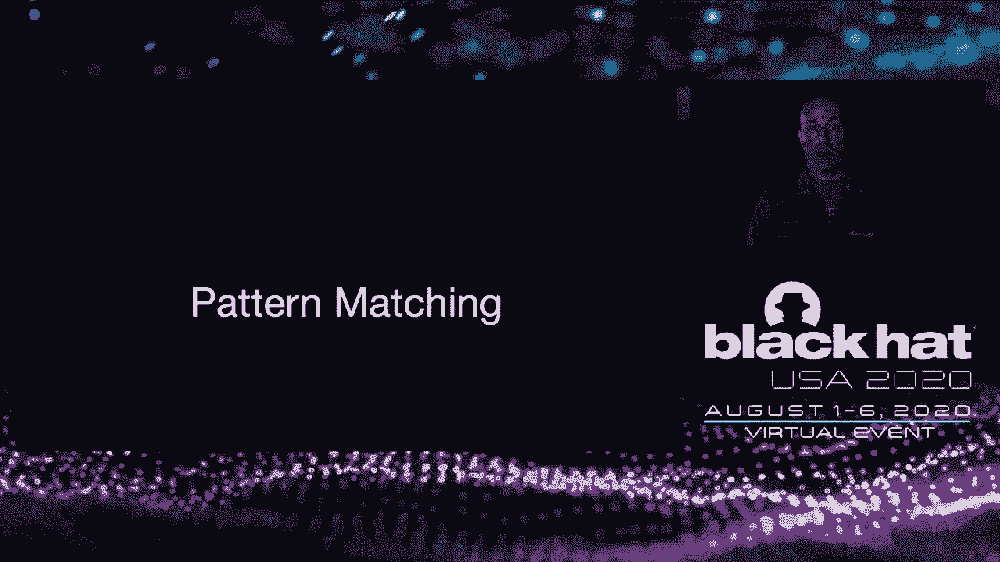

 At this phase our skills actually do really have the potential to start ramping up。

 So if we can get through these mental health and the empathy and the sympathy we know our。

 fundamentals cold we hopefully are still learning we have those flexible minds we've kind of。

 graduated from making those ego based decisions。 And one of the things that we can start doing more is moving from pattern matching to reasoning。

 This is something I'm still really working on this paramedic。 I think I'm better at it in security。

 These are those medics when I look at them and if they hear hoof beats they can tell the。

 difference between a horse and a zebra from across the room。

 Those are actually able to think through the situations instead of just looking at the。

 blood values and assuming they are what they are they actually think through the problem。

 and understand the physiology behind it。 That really just does take a lot of experience a lot of time a lot of continuous learning。

 So this is something that we can strive towards and we can do this in security as well。

 I think it's one of the things that's helped me a lot in my world when I'm dealing with。

 cloud security issues is I know the fundamentals of my platform so well and I can kind of reason。

 through why things are working or not working the way they are and as a result I may be of。

 a better assessed risk and be able better able to manage risk。 Now the last phase is enlightenment。

 No， not cosmic enlightenment but at this point we are hopefully anti-fragile because you can't。

 get through everything that I've just talked about unless you have learned really strong。

 coping skills because either you become anti-fragile or you burn out and trust me just because。

 you burnt out doesn't mean you stop working but you're not going to be a positive influence。

 on your coworkers， your patients， your organization and we have kind of a balance as well as a。

 better perspective because of all those years of experience and working through these issues。

 Now at this point we have a lot of baggage。 I think some pretty hard-well things is a paramedic。

 Plenty of dead bodies， dead kids， maggots， smells， rotting flesh like I don't want to， go into it。

 You don't care。 That's a good balance。 It's probably the one that really gets me the most or one of the ones that gets me the。

 most。 It's pretty bad but I'm okay and I'm okay because for me what I manage to do is compartmentalize。

 Everybody has different techniques to do this。 I use context shifting。

 I try and keep work at work and then I have my home life and my non-medical career and。

 my hobbies on the outside and you really have to break those apart。

 If all you do and we call them sometimes the rescue random in the emergency services community。

 where they work all day and then they volunteer and they take pages all night for another agency。

 it's not sustainable。 You have to have the ability to turn it off and go do other things and compartmentalize。

 that particularly if you're working in busier areas。 We need you to do that in security as well。

 We need to shut the laptop and spend time with our families。

 Those are things that really help us in the longer term mental health and the people who。

 really are in this for the long haul and who are basically well balanced。

 You can see that in how they work。 We also start focusing a bit more on outcomes as opposed to just inputs and protocols and。

 numbers。 In medicine we call science based medicine。

 This is a combination of you know what if a new study comes out and with all the new。

 COVID stuff coming out this is what I look for。 Is there a plausible scientific basis？

 Is there evidence to support it？ Are there the actual numbers and are there good outcomes？

 Because you can actually have a plausible scientific basis and evidence but then turns。

 out the outcomes are really bad。 I think we're actually terrible at this insecurity。

 We don't do randomized control trials。 We rely on vendor numbers of vulnerability counts or surveys or malware variants that。

 have been detected。 We don't do a good job of correlating。 We don't have controls。

 We don't have p-values or randomized control trials and it's hard to do that but it's not。

 impossible to do that。 Clearly if we can do it on human beings and do it ethically we can probably do it in security。

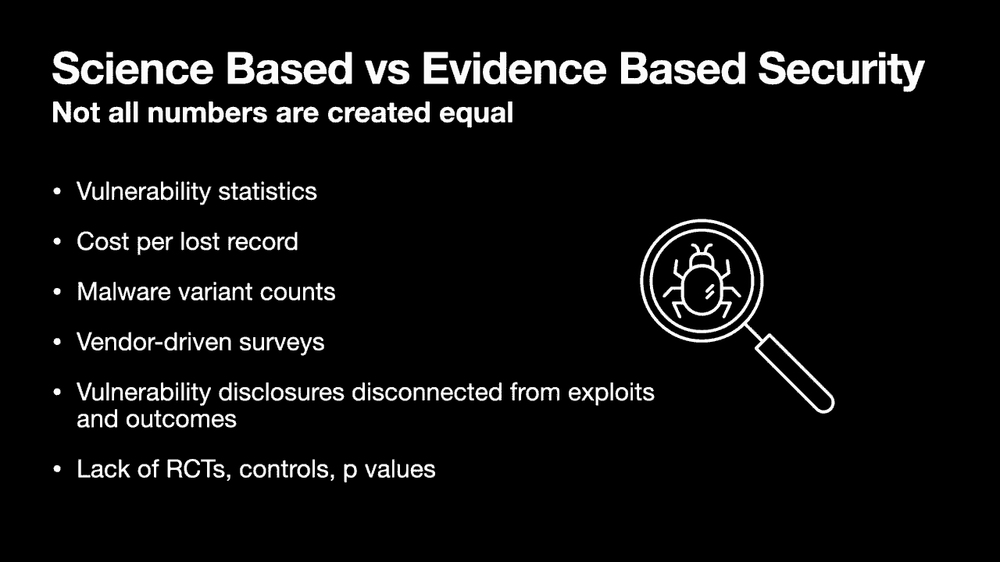

 without placing our organizations at greater risk。 A great example of this came out recently。

 It's something called the paramedic two trial where they actually looked at thousands。

 of patients who got epinephrine pre-hospital in the ambulance when they were in cardiac。

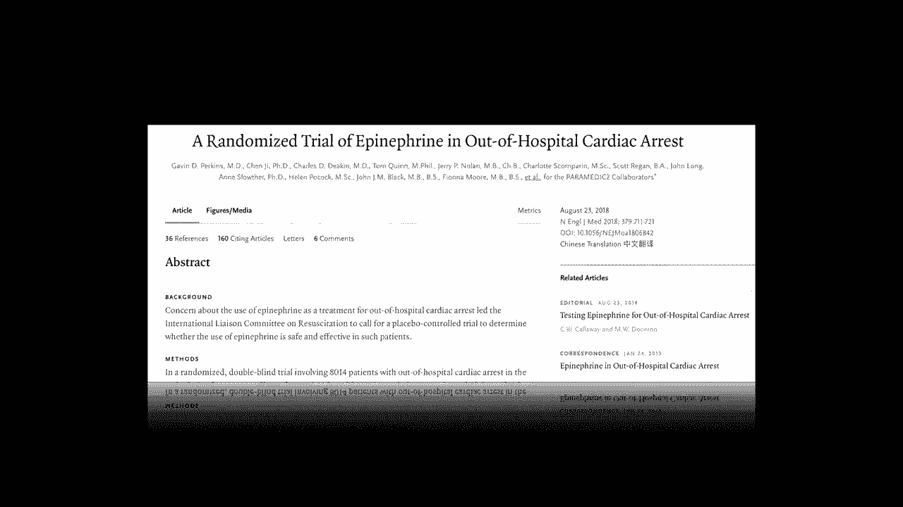

 arrest and it turns out we as paramedics are very very very good at getting heartbeats back。

 If I catch you in the field probably within 10 minutes of you going down I can almost。

 always guarantee you're going to have some kind of a heartbeat when I drop you off at。

 the hospital but are you going to walk out of the hospital？ It turns out the answer is no。

 There's actually no difference between placebos and epinephrine and patients who survived。

 with an intact neurological outcome。 We were getting heartbeats back and creating very expensive ICU patients without necessarily。

 actually improving that overall patient's life。 This one study is not going to change medicine。

 We're still going to give epinephrine because now we need to move forward to the next level。

 and figure out what are the different circumstances？ What are the different mechanisms of action？

 Why does this work？ Why does it not work？ And is there still a role for epinephrine？

 It's going to probably take us a decade to answer those questions but that's the difference。

 between science or pure evidence base which is if you want to know the difference if you。

 look at those studies for food supplements that you can go buy at some of those nutrition， stores。

 they have a lot of evidence and studies but they're like us letting the vendors tell。

 us if we need to worry about malware。 An example of this is we force people to reset their passwords every 90 days even if they。

 have multi-factor authentication enabled。 I just did work for a client。 I think it was every。

 no it was every 90 days。 Does that improve security？ Well if they have MFA turned on。

 probably not and it is adding complexity into a situation。

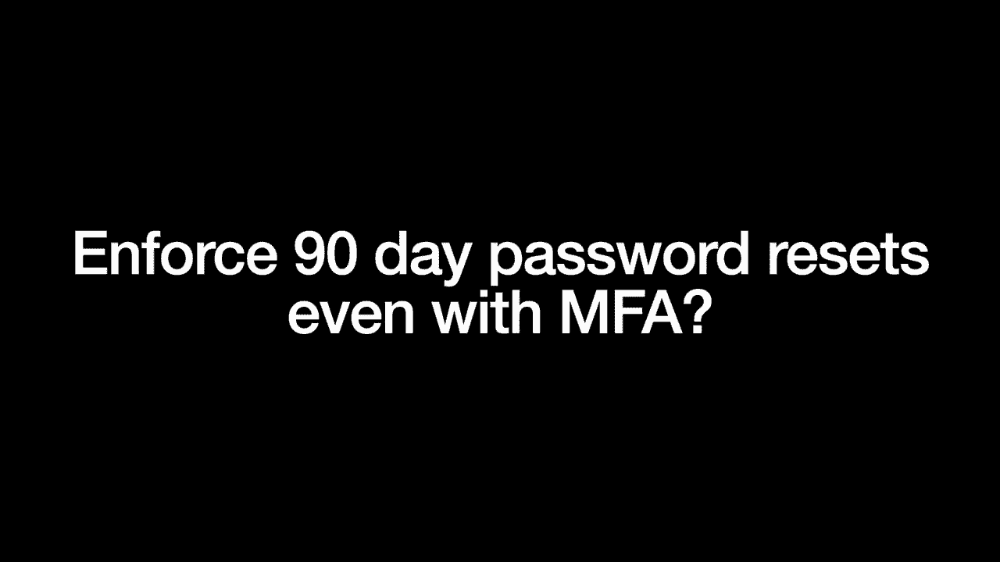

 without necessarily improving the outcome。 And if we're really good we've moved up at this point into management and we've looked。

 at these issues and we have a better understanding of our profession and we're mentally healthy。

 And one of the things that we can really do to improve is look at just culture。

 Just culture is about creating anti-fragil workplaces。

 So with just culture the idea is it's the opposite of plain culture。

 If we find that there's an error that somebody made a mistake， do we blame them for that mistake。

 or do we take the anti-fragil approach and find out why that mistake was made。

 The classic example of medicine is medication errors。 Paramedic。

 I work at three in the morning in bad light。 I'm now 49 years old so I don't see as well at night as I used to。

 Some of my medications， depending on where I'm working， they come in vials that have the。

 same color tops and the same shape vial and the same fonts on the labels。

 It's very easy for me to potentially make a mistake。

 And if I did make a mistake in a blame culture environment， I'd get yelled at for not checking。

 the medication， for not making sure that I was giving the right patient the right medication。

 at the right time。 In just culture， they're going to find a different vial。

 They're going to put a different color on the top or maybe we'll put a piece of tape。

 around it so that we know the difference so that I'm not making that mistake。

 It's about improving the system。 It's not about necessarily finding somebody to blame。 Again。

 in area we have a lot of room for improvement in cybersecurity。 If you use the word shadow IT。

 you don't have a just culture。 You're blaming users for using technology that they think they need to get their job。

 done。 Why are they going around？ In some cases， it could still be recklessness。

 It could still be negligence。 But in other cases， maybe we're just not giving them the right tools or not understanding。

 their needs。 Enthusiasm， ego， empathy and enlightenment。 We don't all go through these phases。

 We don't all go through them in the same time frame。 It's just a way of thinking about it。 Myself。

 I don't think I'm in enlightenment in emergency medicine yet。

 I think that moving to a part-time paramedic has inhibited my ability。

 There's things I still don't have fully internalized that I would like to in terms of my practice。

 But I think I've nailed the empathy。 Recently I was up in the Navajo Nation helping with the COVID response。

 I was out there with Team Rubicon， which is an amazing organization。

 We had one patient that came in every night。 Alcoholic。

 the police were dropping him off because they were just finding him on the。

 street wanting to get him out of the way or he'd wander in because he wanted a place， to sleep。

 This guy's brain was fried。 But he was a nice person。 And we。

 I would not have treated him as a human being earlier in my career。

 I didn't have the right role models for it。 I didn't even think about it。

 It was just another drunk getting in my way。 But I tried my best to treat him with empathy and compassion。

 And so did the rest of that emergency department to the point where people brought in clothes。

 And then one night myself at， and the EMT that I was working with， we actually stripped him。

 down and we cleaned him off with wipes。 This is not in any paramedic or nurses protocols unless somebody is in the hospital for days。

 or weeks。 We cleaned the guy down。 I even trimmed his fungus-ridden toenails。

 Because the thing is is we weren't going to make him not an alcoholic。

 We were not going to be able to change his long-term life decisions。

 I was not going to justify any of those decisions。

 But he was a human being who was having a really bad time。

 And the best part of that was I got to do it with this EMT。

 And maybe hopefully I was serving a bit as a mentor。

 Because if you make it this far into your career， I think we have an obligation to be。

 that positive role model to help others throughout their careers。

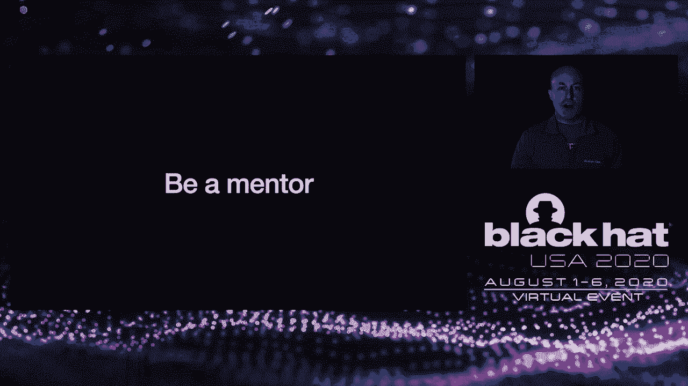

 Mentoring is one of the best ways to do that。 Thank you for your time。 That's all I have。

 But I do want to close on one last note。 We are in the midst of， for me。

 what I was trained in as the worst possible case scenario。 And things are pretty bad out there。

 So I'm just going to ask， pay attention， think of others， and please wear your mask。

 Protect yourself。 Protect your families。 And it's a lot of us who have to come out and help you。

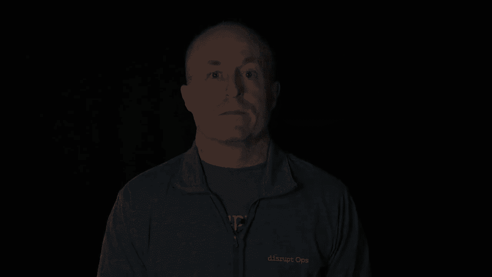

 Thank you。 Hey， everyone。 So thanks for watching the session。 This was a -- it was a big one。

 It was an emotional one for me to do this after a few years。

 So I'm going to blab away until we have any chat questions。 For me。

 I think for info sec professionals。 I try to cover a bit about the lessons I learned about incident response and kind of some。

 of those skills。 Those have absolutely helped me in security。

 But I think particularly for those of you who are high-level managers， the just-culture。

 concepts that come in at the end is probably where we need to focus。

 I think that that's where we can really start to make systemic differences into our environments。

 And actually， again， if you're in a managerial position， like I get to be these days， that。

 you're actually able to go through and make changes and induce that kind of a positive， environment。

 You know， they -- all the other bits。 I mean， the mental health， the burnout。

 I think also with COVID and what's going on， are definitely -- it's definitely hitting all of us。

 I mean， the repetition of being home all the time is， you know， this is some of the same。

 things that we see when you're running on calls and everything else。 By the way。

 I appreciate all the comments in here。 Ask questions。

 We've got a couple of minutes left if you have anything else that you want to hear about， you know。

 kind of -- well， we'll end up putting this one together and everything else。 But I had a blast。

 I mean， I spent like two， three years planning this。 I think like Kirsten。

 who's watching this and a few other people， you know， many conversations。

 usually at Black Hat and Def Con and frequently， let's just say， well， alcohol abuse is bad。

 A little bit of your conferences and stuff isn't always bad。 But if you're okay with them， you know。

 kind of over those late night drinks talking about。

 a bunch of these concepts and trying to put it into that framework of those four phases。

 those were all like things I really tried to do to kind of bring it in。 And I honestly。

 until I started seeing the feedback you guys are sending here， I didn't。

 know if anyone cared about this stuff。 You know， it's not the same。

 I'm used to giving technical talks and， you know， defensive technical talks。

 So I think -- am I out of time， guys？ I did put the link in the chat room if you want to go ahead and carry on a conversation。

 But otherwise， enjoy the rest of Black Hat and maybe we'll get the chance to meet each， other。

 I mean， up again next year， hopefully we'll be having this stuff dealt with by next year。

 With the Krispy Roll models， yeah， if you identify you're the Krispy Roll model， it's。

 time to get mental health， actually。 That's a -- you have to take a step back， separate yourself。

 And I had that。 In trouble at the stuff at Securosis。

 my partner said to talk to me because I was going down， a bad path。 Unfortunately， they did。

 And I set up fighting back。 I recognized it and I recognized my own issues。

 Took some time and was able to come back。 So with --， >> 10 seconds。 >> Oh， I got 10 seconds left。

 So I'm going to have to answer the other questions over in the Zoom。 I'll pop it over again。 But。

 yeah， there were a couple of other questions。 Yeah。

 thanks for the Eric for the -- the extra camera thing was a bit of a risk， but I think。

 to lay it out alright。 Thanks everyone and I'll see you maybe over in the zoom。

