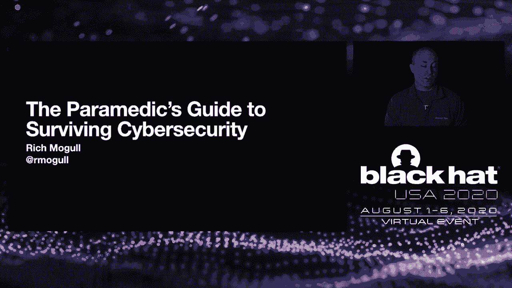
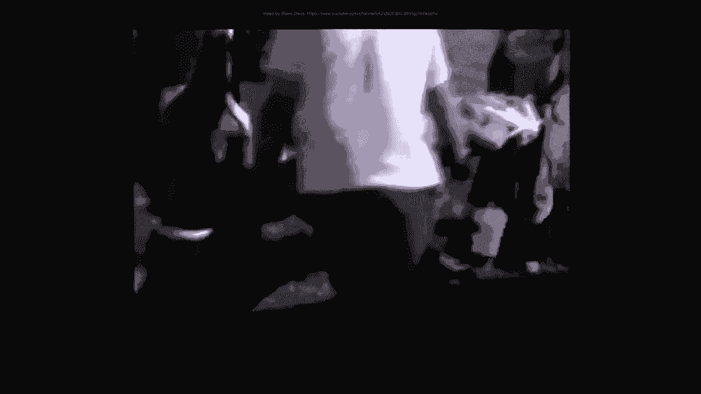
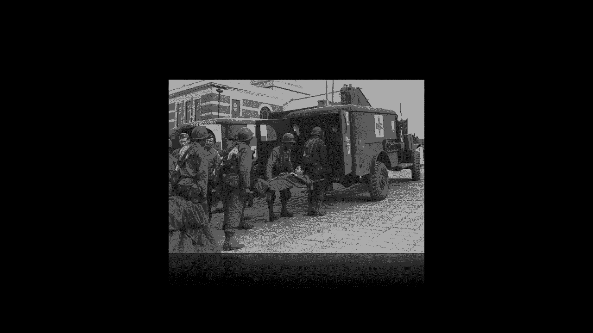
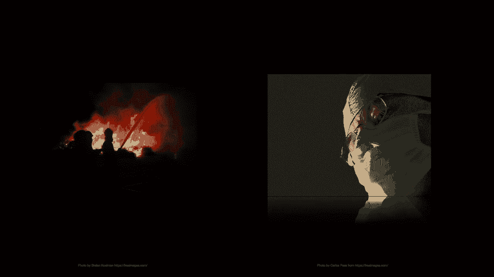
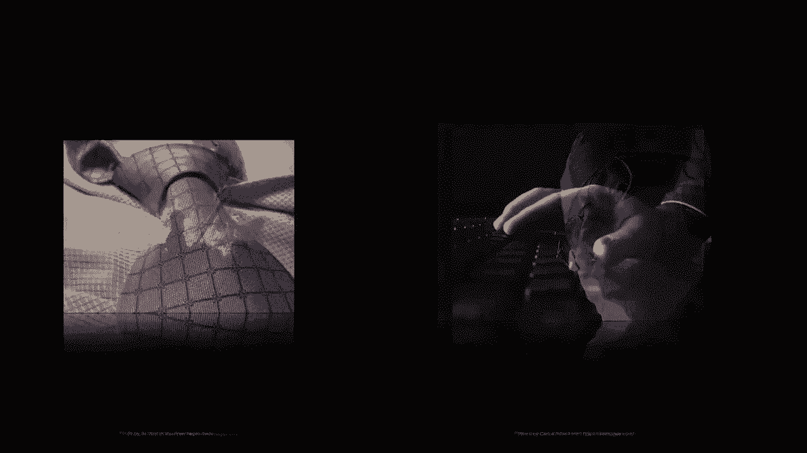
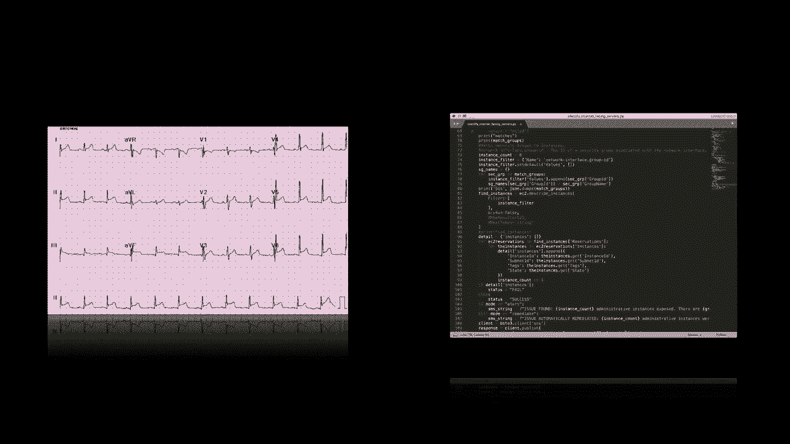
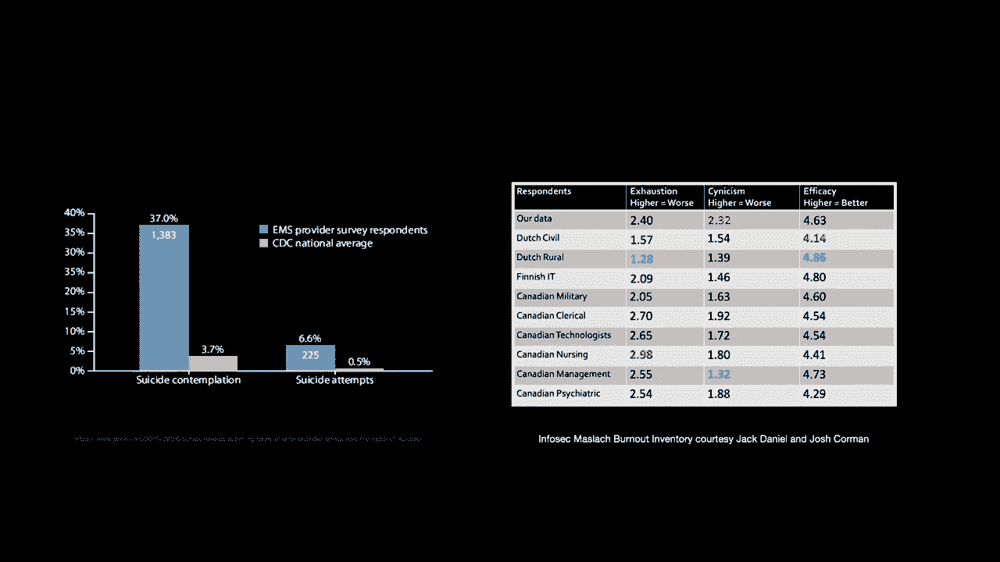
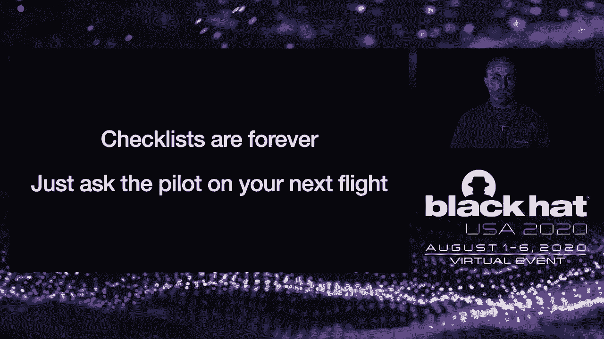
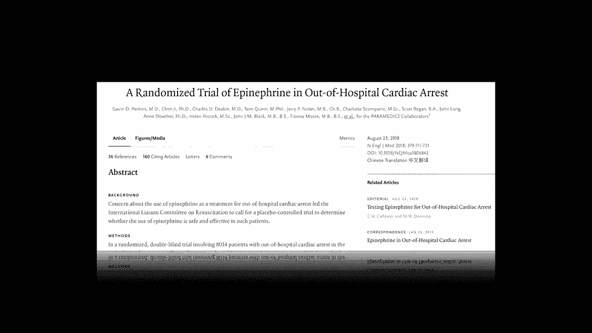

# 网络安全急救员生存指南 🚑 P76：77

在本教程中，我们将跟随一位拥有双重职业生涯（急救员与网络安全专家）的讲者，探索从紧急医疗服务中学到的经验教训，并了解如何将这些原则应用于网络安全领域，以提升专业技能、应对职业倦怠并实现长期职业发展。

## 概述：两个世界的交汇

讲者分享了他作为急救员的第一次糟糕出诊经历：他强行将一名低血糖但意识不清的患者带离家中进行治疗，而非在现场处理，这导致了不必要的冲突并损害了职业关系。这次经历让他认识到，专业技能不仅关乎技术操作，更关乎情境判断与同理心。

通过比较急救服务与网络安全这两个领域，他发现它们存在深刻的相似性：都是相对年轻的行业，根源都与政府/军事相关，都需要在技术操作与更广泛的组织/业务需求之间取得平衡，并且都面临着高压环境导致的职业倦怠与心理健康挑战。

讲者提出，网络安全可以从发展更早的急救服务中汲取经验。他将职业生涯划分为四个阶段：**热情期**、**自我期**、**共情期**和**通达期**。并非每个人都会经历所有阶段，但这个框架有助于我们理解职业成长路径与挑战。

---

## 第一阶段：热情期 🎯

当我们初次踏入一个领域时，会充满热情与兴奋。在急救领域，这意味着驾驶救护车、使用警笛；在网络安全领域，则意味着接触黑客工具、分析数据包，看到组织内部他人无法触及的层面。我们渴望学习新技能并立即应用。

然而，在此阶段，我们会面临一些挑战。

以下是热情期常见的挑战：

*   **技能脱离情境**：我们急于使用新工具和新技能，但可能不理解何时、为何使用它们，容易过度治疗或过度依赖技术，而忽略了更大的背景。
*   **选择了错误的榜样**：那些倦怠、愤世嫉俗的“老油条”可能颇具吸引力，他们看似经验丰富。但以他们为榜样可能导致僵化思维和生存心态，不利于长期发展。

为了顺利度过热情期并为职业生涯奠定基础，我们可以采取以下措施：

*   **掌握本职工作**：在急救中，这意味着熟记协议和药物剂量；在网络安全（尤其是事件响应）中，这意味着熟悉预案、操作手册、标准和技术。这是职业发展的基础。
*   **使用检查清单**：对于复杂程序，检查清单可以防止步骤遗漏和错误。这并非新手专用，而是贯穿整个职业生涯的最佳实践，正如飞行员所做的那样。
*   **开始练习“全局观”**：尝试退一步，审视更大的局面。讲者分享了一次山地救援经历：面对即将到来的恶劣天气，他没有按常规程序处理伤员脚踝，而是优先确保伤员能安全快速下山，这体现了根据情境调整策略的能力。
*   **建立心理健康技能**：寻找积极的导师，理解流程背后的原因（而不仅仅是步骤），持续学习，并尽早建立**偏见防御**意识。在两个领域，我们都容易因只看到人们最糟糕的一面而产生偏见（如指责受害者或业务部门），需要主动对抗这种倾向。
*   **拥抱“反脆弱性”**：韧性意味着承受打击而不改变。**反脆弱性**则意味着在混乱和不确定性中茁壮成长，从冲击中学习、适应并前进。这是一种更可取的思维模式。

---

## 第二阶段：自我期 😤

在积累了一定经验后，我们进入自我期。此时我们已相当胜任工作，但也是职业倦怠的高发期。在急救领域，平均倦怠期约为7年。我们可能因见过太多而停止倾听，草率下结论，睡眠受影响，甚至可能滥用物质来逃避。

网络安全行业同样面临严重的倦怠问题。根据马斯勒倦怠量表，安全从业者在**情绪耗竭**和**愤世嫉俗**方面得分很高，而在**个人成就感**方面则感受不一。

要度过自我期，需要心态与流程双管齐下。

在心理健康方面，我们必须回归基础：

*   **关注健康基础**：保持健康饮食、锻炼、充足睡眠。
*   **依靠同伴支持**：选择正确的同伴至关重要。与愤世嫉俗者为伍，你也会变得愤世嫉俗。此时，你努力影响的不再是上级，而是下级，这需要积极引导。
*   **寻求职场支持**：尽管两个领域都存在有毒环境，但网络安全通常在经济支持方面优于急救服务。识别并尽量避免有毒环境。

这些基础如同抵御“自我”与“倦怠”河流侵蚀的堤坝，需要不断维护和重建。因此，尽早建立心理工具包并识别这些问题至关重要。

在流程方面，问题往往源于忽视了基础：

*   **遵循二级路径或协议**：即使经验丰富，也需要坚持正确的流程。例如，使用持续评估患者的医疗路径，确保不遗漏任何问题。在网络安全中，我们需要更好地将工作流程化、操作化，无论是通用流程还是针对特定技术的事件响应。

尽管处于自我期，但此时我们已具备足够能力来培养一些高级技能：

*   **培养高级技能**：继续练习全局观、保持思维灵活性、持续学习、进行演练和练习。讲者参与了一次模拟大规模伤亡的联邦政府演习，这类挑战能保持我们的适应能力和决断力。

自我期是一个关键节点。有些人跳过此阶段，有些人则深陷其中。你的选择决定了是向前迈进，还是困在负面循环中。

---

## 第三阶段：共情期 ❤️

共情期是重新将他人视为“人”而非“任务”的阶段。讲者在卡特里娜飓风救援中体会到，在数小时内评估900名患者时，最重要的是记住他们几乎都经历了最糟糕的一天，此时他能提供的是**共情**与善意。

然而，共情需要付出代价。我们必须学会**共情而不过度同情**。讲者在波多黎各救援时，遇到一名寻求药物的糖尿病患者。尽管不认同她的行为，但团队决定给予药物，因为他们的目标不是改变她的人生，而是腾出床位救治更多人。这需要在不认同其决定的前提下，仍将其作为人来对待。

这引出了**同情疲劳**的概念。我们的共情和同情如同油箱，终会耗尽。与倦怠不同，同情疲劳发生时，你无法像倦怠时那样封闭自己。识别同情疲劳至关重要，而网络安全领域在这方面做得不好，我们习惯于指责受害者或业务部门。如果我们能倾听并理解其决策背后的原因，就能更好地管理局面。

如果能够克服心理健康挑战、掌握共情与同情的平衡，并保持思维灵活，我们的技能在此阶段有潜力大幅提升。

我们可以从**模式匹配**转向**推理分析**：

*   **模式匹配到推理分析**：这需要大量经验和持续学习。在急救中，这意味着不仅能看化验数值，还能理解背后的生理机制；在网络安全（如云安全）中，则意味着深入理解平台基础，从而推理出问题的根源，更好地评估和管理风险。

---

## 第四阶段：通达期 🧘

通达期并非指超凡脱俗，而是指在经历了前述所有挑战后，我们希望达到的一种状态。此时，我们很可能已变得**反脆弱**，并因多年的经验和对问题的处理而拥有更好的视角与平衡。

在此阶段，我们背负着许多“包袱”。讲者作为急救员，见过许多悲惨场景。他通过**情境隔离**来应对：将工作留在工作场所，拥有工作之外的生活、事业和爱好。这在两个领域都至关重要，我们需要合上电脑，陪伴家人。

我们也开始更关注**结果**，而不仅仅是输入、协议或数字。在医学上，这称为**循证医学**：考察科学依据、证据、实际数据和良好结果。网络安全在这方面做得不好，我们依赖供应商的数据，缺乏随机对照试验和良好的相关性分析。例如，强制启用多因素认证的用户每90天更改密码，可能增加了复杂性却未改善安全结果。

一个很好的例子是“护理人员2号试验”，该研究发现，对于心脏骤停患者，使用肾上腺素虽能恢复心跳，但并未改善患者出院存活率或神经功能结局。这促使医学界进行更深入的探究。

如果我们做得好，此时可能已进入管理岗位，对行业有更深理解，且心理健康。我们可以着力推行**公正文化**。

**公正文化**旨在创建反脆弱的工作场所：

*   **公正文化 vs. 指责文化**：当出现错误时，是追究个人责任，还是采取反脆弱方法，找出错误背后的系统性原因？例如，在急救中，药物易混淆可能导致错误，公正文化的做法是改进药瓶设计，而非单纯指责操作者。在网络安全中，如果我们使用“影子IT”这个词，就不是公正文化，而是在指责用户。我们需要理解他们绕开系统的原因，可能是我们未提供合适的工具。

---

## 总结与寄语

热情、自我、共情、通达——我们并非都以相同的方式或速度经历这些阶段。讲者自认在急救医学上尚未达到通达期，但已深刻掌握共情。他最近在纳瓦霍族协助新冠疫情响应时，尽力以共情和同情对待一位脑部受损的酗酒者，为他清洁身体、修剪指甲。虽然无法改变其人生，但可以将其作为人来尊重。

如果你在职业生涯中走得足够远，就有义务成为积极的榜样，**指导他人**。这是回馈行业的最佳方式之一。

最后，讲者提醒我们正身处一个艰难时期。他呼吁大家保持警惕、关心他人、佩戴口罩，这不仅保护自己和家人，也保护那些需要外出提供帮助的人。

对于网络安全从业者，他从事件响应中学到的技能无疑大有裨益。对于高级管理者，推行**公正文化**概念可能是能够产生系统性影响的关键领域。同时，在新冠疫情背景下，关注**心理健康**与**职业倦怠**同样至关重要。