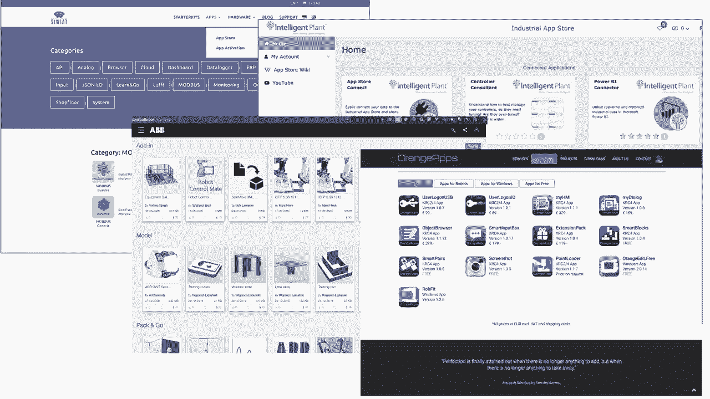
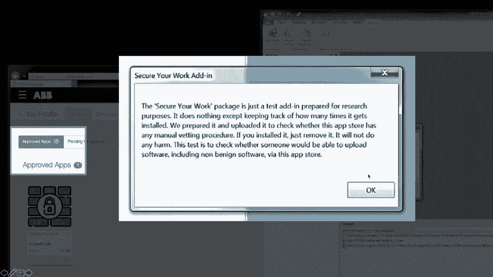

# 工业机器人静态代码分析漏洞挖掘教程 🛠️


## 概述
在本教程中，我们将学习工业机器人编程语言中的安全风险。我们将探讨这些语言的设计特性、它们如何被开发者无意中引入漏洞，以及攻击者如何利用这些特性编写恶意软件。最后，我们将介绍一种用于检测此类漏洞的静态代码分析技术。

---

## 1. 工业机器人编程方式 🤖

上一节我们概述了课程内容，本节中我们来看看工业机器人是如何被编程的。

工业机器人主要有两种编程方式：
*   **示教编程**：这是一种在线、交互式的编程方法，通常使用示教器（Teach Pendant）直接引导机器人完成动作。
*   **离线编程**：对于更复杂的任务，需要使用功能完备的编程语言在计算机上编写程序，然后部署到机器人上。

本教程主要关注离线编程所使用的语言。

---

## 2. 工业机器人编程语言特性 📝

上一节我们介绍了机器人的编程方式，本节中我们来看看这些专用编程语言的具体特性。

我们分析了8家主流工业机器人厂商的编程语言，以检查它们是否包含可能绕过安全模型的安全敏感原语。

以下是我们的发现：

**文件系统操作**
*   `5/8` 的语言支持从机器人文件系统读取或写入文件。
*   高级文件系统操作甚至支持直接列出目录内容。

**动态代码加载**
*   `4/8` 的语言支持在运行时加载新代码模块。
*   这些语言暴露了从文件加载模块、在运行时动态解析函数名并调用该函数的原语。
*   此功能与文件写入能力结合，如果语言是解释型而非编译型，就可能实现“可写且可执行的内存错误”。

**网络通信**
*   所有被分析的语言都具备执行网络通信的能力。

---

## 3. 运行时环境与安全现状 ⚠️

上一节我们了解了编程语言的内置功能，本节中我们来看看这些程序运行的环境及其安全状况。

**缺乏资源隔离**
现代平台通常通过沙箱机制隔离第三方应用，对操作系统或硬件的访问由细粒度的访问控制机制进行仲裁。然而，在工业机器人领域并非如此。
*   任务程序运行时没有访问控制机制。
*   如果存在访问某个硬件资源的指令或API，那么所有程序都可以访问该资源。

**安全认知度低**
我们与约20位专家（包括开发者、控制工程师和学者）进行了交流，并分析了主要工业自动化在线社区的讨论。
*   开发者确实需要使用网络、文件操作和动态代码加载等功能来实现自动化。
*   然而，在线社区中只有少数讨论涉及安全话题，部分论坛甚至几乎没有安全相关内容。

**现状总结**
1.  安全认知度相对匮乏。
2.  工业机器使用遗留的专有编程语言，难以更换。
3.  这些语言包含影响自动化程序安全的安全敏感特性。
4.  几乎没有安全隔离机制，操作系统无法阻止或确认敏感操作的执行。

---

## 4. 漏洞实例分析 🔓

上一节我们指出了潜在的风险，本节中我们来看看具体的漏洞实例。

工业机器人程序中的漏洞源于两个要素的结合：
1.  编程语言包含安全敏感特性。
2.  程序缺乏输入验证（部分源于开发者安全意识的缺乏）。

以下是我们在真实世界代码中发现的几类漏洞：

**运动命令注入**
*   常见于“情感服务器”（允许通过网络外部控制机器人的程序）。
*   如果服务器程序缺乏输入验证和身份验证，同一网络内的攻击者便可控制机器人。
*   示例代码（KRL语言）：
    ```krl
    DEF emotional_server()
      REAL coord_x, coord_y, coord_z
      ; 从网络接收坐标值，未经验证
      coord_x = EKI_Get_Real("channel", "x")
      coord_y = EKI_Get_Real("channel", "y")
      coord_z = EKI_Get_Real("channel", "z")
      ; 直接将接收到的坐标发送给机器人执行点对点移动
      PTP {X coord_x, Y coord_y, Z coord_z}
    END
    ```
*   修复方案：实施输入验证（限制允许的运动范围）并添加身份验证。

**路径遍历**
*   程序根据从网络接收的数据（未经校验）打开文件。
*   攻击者可通过 `../` 等序列遍历文件系统，读取敏感信息。
*   示例代码（RAPID语言）：
    ```rapid
    PROC serve_file()
      VAR string filename;
      VAR rawdata file_content;
      ; 从套接字接收文件名
      SocketReceive client_socket, filename;
      ; 直接使用接收到的文件名打开文件
      Open file_handle, filename, read;
      Read file_handle, file_content;
      SocketSend client_socket, file_content;
    ENDPROC
    ```
*   我们在ABB的官方“机器人应用商店”中发现的一个真实Web服务器就存在此漏洞。

**函数调用注入**
*   程序根据网络数据动态调用函数。
*   攻击者可能诱使程序调用任意函数。
*   修复方案：使用允许列表（Allow List）限制可调用的函数。

---

## 5. 恶意软件能力演示 🦠

上一节我们看到了开发者可能引入的漏洞，本节中我们来看看攻击者如何利用这些语言特性编写恶意软件。

编写恶意软件所需的核心能力如下：
1.  **网络能力**：所有语言都支持网络通信。
2.  **文件操作能力**：结合网络能力可实现文件窃取。
3.  **动态代码加载能力**：用于实现高级功能，如下载并执行恶意载荷。
4.  **网络扫描能力**：至少理论上，可以利用网络功能实现端口扫描。
5.  **图灵完备性**：所有语言都支持条件语句（如 `if`）和循环语句（如 `while`），足以编写复杂逻辑。

**概念验证演示**
我们成功开发了具备以下功能的恶意软件：
*   **端口扫描器**（使用RAPID语言编写）。
*   **文件窃取例程**：遍历文件系统并外传文件路径或内容。
*   **恶意软件投放器**：从网络接收数据，写入文件，加载到内存并执行。



我们演示了一个攻击场景：一个已被入侵的机器人（运行有漏洞的服务）扫描内网，发现其他机器人，并利用漏洞将恶意代码传播给它们，整个过程不影响机器人正常的运动任务。

---


## 6. 供应链攻击风险 🛒



除了利用远程代码执行漏洞，攻击者还可能利用供应链进行攻击。

一些机器人厂商提供了类似手机应用商店的生态系统，用于分发机器人软件或开发环境插件。我们发现其中存在审核绕过漏洞（已报告并修复），这曾允许攻击者上传恶意应用并立即供用户下载，完全绕过了审核流程。

这凸显了软件供应链安全在工业自动化领域同样至关重要。

---

## 7. 静态代码分析工具 🛡️


上一节我们探讨了各种攻击路径，本节中我们来看看如何防御和检测这些漏洞。

我们讨论的漏洞本质上是 **数据流问题**：未经验证的数据（来自敏感源）流向了敏感接收器（汇点）。

**敏感源示例**
*   文件处理函数
*   入站网络通信函数
*   从示教器用户界面获取数据的函数

**敏感汇点示例**
*   移动机器人的函数
*   文件写入函数
*   系统配置函数
*   动态代码加载/函数绑定函数


**分析工具原型**
我们开发了一个针对工业机器人编程语言的静态源代码分析器原型。其工作流程如下：
1.  使用对应语言的解析模块解析任务程序源代码。
2.  构建抽象语法树和控制流图。
3.  构建语言无关的控制流图，并将所有函数的控制流图链接成过程间图。
4.  在过程间图上运行可配置的数据流分析器。
5.  分析器根据配置的源、汇和净化函数，发现潜在的数据流漏洞或功能滥用模式。

**工具演示**
*   分析一个简单的“情感服务器”程序，工具成功识别出从网络接收数据到运动命令执行的数据流。
*   分析之前提到的存在路径遍历漏洞的ABB Web服务器程序，工具成功识别出从套接字接收数据到文件打开操作的数据流，即路径遍历漏洞模式。

**实际代码分析结果**
我们收集了约100个来自GitHub等公开仓库的工业机器人程序文件（作为真实程序的代理）进行分析，发现：
*   2个项目存在允许执行任意函数的漏洞。
*   1个项目存在路径遍历漏洞。
*   13个项目允许根据网络数据指定任意运动。

**工具局限性**
*   目前主要支持ABB RAPID和KUKA KRL语言。
*   无法检测通过共享内存等机制在不同并发程序间传递的隐式数据流。

---

## 8. 防护与缓解建议 ✅

上一节我们介绍了检测工具，本节中我们来看看如何从根源上预防和缓解这些安全问题。

**预防漏洞**
1.  **实现应用层安全通信**：原始设备制造商应考虑在语言中内置强大的加密原语实现。
2.  **实施输入验证**：对接收到的外部数据进行严格校验。由于机器人是物理移动对象，处理无效输入（如超出安全区域的坐标）具有挑战性。
3.  **正确配置安全系统**：如果无法在软件层面完全实现输入验证，一个配置得当的安全系统可以在物理世界充当最后一道防线。

**权限分离**
实现权限分离将是真正的变革。这将迫使开发者在需要使用时声明安全敏感原语（如网络、文件、动态代码加载），类似于移动应用开发。在部署时，操作员可以根据清单决定是否允许该程序在特定环境中运行。

**缓解恶意软件传播**
未来（可能在5-10年内），我们有望在这些平台上看到代码签名机制的广泛应用。

---

## 总结
在本教程中，我们一起学习了工业机器人编程领域的安全挑战。我们回顾了专有编程语言的安全敏感特性，分析了由输入验证缺失导致的几类典型漏洞（如命令注入、路径遍历），并展示了攻击者如何利用这些特性编写传播性恶意软件。最后，我们介绍了一种基于数据流分析的静态代码检测方法，并提出了从安全通信、输入验证、权限分离和代码签名等多层面进行防护的建议。随着工业机器人日益互联，将这些“奇特”的专有语言纳入安全开发和代码审计范畴至关重要。