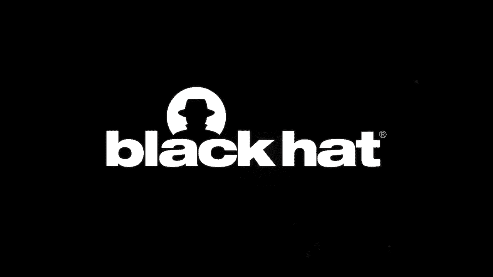
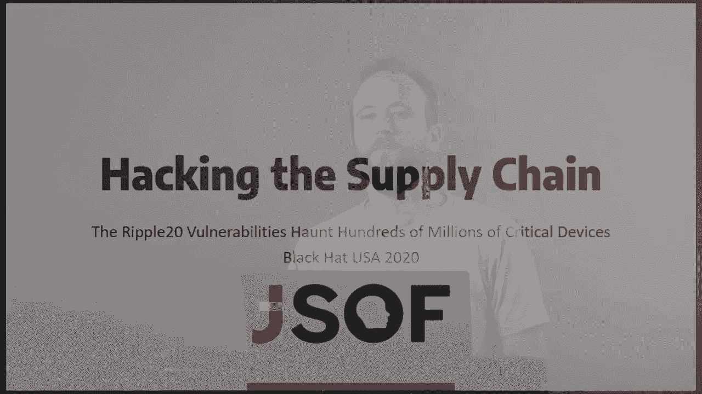
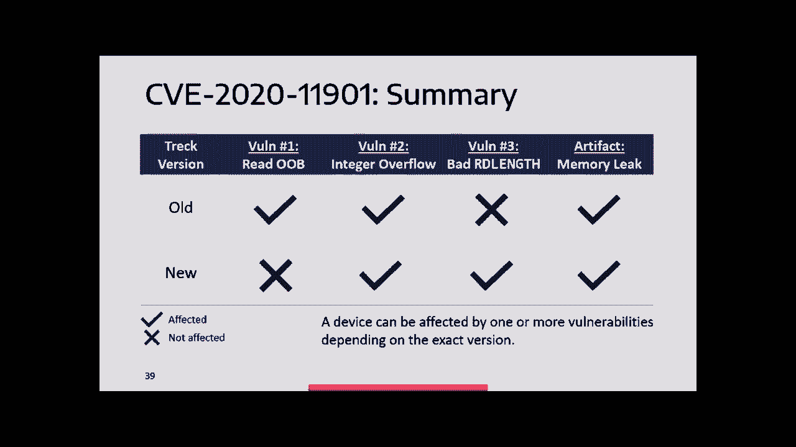
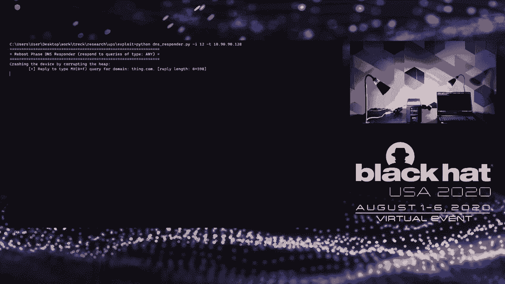
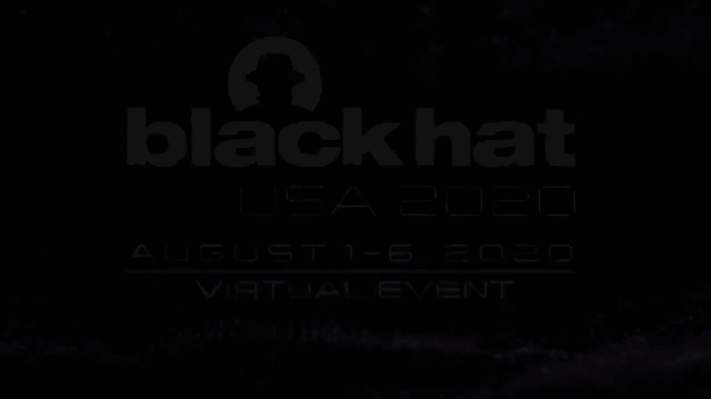

# P78：79 - Hacking the Supply Chain – The Ripple20 Vulnerabilities Haunt Tens of Milli - 坤坤武特 - BV1g5411K7fe

 [MUSIC]。

 Hi everyone。 Welcome to our talk about hacking the supply chain。

 There are about 20 vulnerabilities that， [NOISE] hundreds of millions of devices。

 What about who we are？ Joseph is a software security consultancy。 We do security research。

 penetration testing， consulting on secure development， as well as some training。

 My name is Shlomi Oberman。 I'm a co-founder at JSOF。 Together with me will be speaking Moshe Koll。

 a security researcher at JSOF， and a founder of the Ripple 20 vulnerabilities， and Ariel Shahn。

 a security researcher at JSOF， also heavily involved in the research。

 Today we'll be talking about what Ripple 20 is， and then diving in detail into one of the vulnerabilities。

 CVE-2020-11901。 After that， we'll be showing some of the details about。

 exploitation of CVE-2020-11901， and a demo of exploitation on a vulnerable device。 So， Ripple 20。

 Ripple 20 is a series of 19 zero-day vulnerabilities， in a TCP/IT stack called TREC TCP/IP。

 19 vulnerabilities give or take。 Two of these vulnerabilities were actually reported anonymously。

 at the same time as we reported， and actually resulted in 24 patches altogether。 So。

 depends how you count。 These vulnerabilities were amplified by the supply chain。

 something that we'll be talking about and showing， to affect hundreds of millions of devices。

 across a wide range of verticals， pretty much any type of IoT device you can think about。

 Out of these vulnerabilities， for the vulnerabilities。

 a critical remote code execution vulnerabilities。 This is not necessarily according to the CVSS。

 but according to our assessment of the vulnerabilities， but four of them are also critical CVSS。

 Eight of the vulnerabilities， are medium to high severity vulnerabilities。

 with some chance of remote code execution and other effects。

 The devices affected are made by vendors you all know。 Large vendors， devices of high impact。

 as well as smaller vendors， vendors really range from all types of IoT。

 devices and from Fortune 500 companies， to one person shops。

 tiny little companies making embedded specialized devices。

 The types of devices you can encounter in your hospital， at home， on your network， power， water。

 cellular utilities， things you use in your everyday life， transportation。

 Pretty much anything we do is powered， by devices affected by Ripple 20 vulnerabilities。

 At this stage， knowing what we know about affected devices， and affected vulnerabilities。

 we're assuming every mid to large organization in the US， has at least one vulnerable device。

 whether it be a networking device， a printing device， ICS device， etc。 Why did this happen？

 So it all has to do with the supply chain。 Somebody takes a piece of source code， a library。

 and embed it into a larger component， say an operating system。

 This component then gets embedded further， in a system on module or a larger component， which then。

 once again， gets embedded into a larger component， and so on and so forth。

 until we reach our final product。 At a certain moment in the supply chain。

 nobody knows they're using the original library。 Nobody knows they're using this original source code。

 Just imagine what happens， if one of the components along the way。

 one of the companies along the way， goes bankrupt or ceases operation。

 How difficult it is to fix these vulnerabilities。 And so with the supply chain。

 we have a network of devices， that embed different components， beginning at a single library。

 a single piece of source code。 And if a vulnerability exists。

 in a certain library at the beginning of the supply chain。

 this vulnerability infects the other parts of the network， kind of like a plague。

 and the vulnerability travels from one device， to the other device。

 reaching all kinds of different areas， in the supply chain， reaching different types of devices。

 This is what happened with Ripple 20， a vulnerability deep in the supply chain。

 that affected other devices， affected more and more devices， as the piece of code traveled。

 Why we chose TREC TCPIP， and why we think this research is interesting。

 for the community and for the listeners。 Well， the first issue is the issue of supply chain。

 Not in the sense that somebody put a backdoor， in your supply chain。

 in the sense that one vulnerability， in a single piece of code， travels across the supply chain。

 So one vulnerability， multiple products， multiple products， a few dozen different vendors。

 a few hundreds of different types of products。 Extremely large IoT impact。

 and the potential for zombie vulnerabilities。 Zombie vulnerabilities， these vulnerabilities。

 we're not exactly sure whether to call them one days or zero days。

 because we've already reported them， but probably not going to be fixed in some of these devices。

 where the company went bankrupt， chose not to fix。 The supply chain is too complex to follow， etc。

 And of course， a good attack surface， TCP/IP， mostly unauthenticated， a lot of parsing。

 pretty old code， perfect attack candidate。 Little bit about the concrete specific TCP/IP stack。

 that we chose。 TREC TCP/IP， pretty successful TCP/IP stack， one of the leading TCP/IP stacks。

 at least for a while。 TREC is a small American company。

 that makes TCP/IP stack a fully featured TCP/IP stack。

 all the way going all the way from the link layer， to application layer protocols。

 complete with all the RFCs needed to be implemented， and has been available for over 20 years。

 Usually used in embedded devices and real-time operating systems。

 and very importantly for our research， very， very configurable。 So each instance of the TREC stack。

 each implementing the TREC stack， has a slightly different version of TREC。

 And this affected a lot of the vulnerabilities， and a lot of the way we did our research。

 This happens because different vendors， compile the TREC stack differently。

 and because they use different versions of TREC， and then sometimes stop support。

 And most importantly， it's strategically loaded， located at the very beginning of an extremely long supply chain。

 So in some cases， we've seen companies that are second-hand， third-hand， fourth-hand users of TREC。

 and had no idea they were using this piece of code。

 A little bit about how we conducted our research。 So because every piece of TREC TCP/IP stack is different。

 every instance is different， we took six data points， six different devices。

 and reverse engineered them in multiple versions。 We didn't spend as much effort on every one of the devices。

 the same amount of effort on all the devices， but we use these in order to understand the situation better。

 and understand how the vulnerabilities change over time。

 Every one of our devices had different configuration， a different version。

 The research took approximately nine months， with different levels of intensity。

 starting September 19th， ending sometime around June 20th with the public disclosure。

 And the research involved a few strange architectures， a few strange frameworks。

 We'll be talking about one of them today。 Unfortunately， we can't go into all the details today。

 We only have 35 minutes， but we did release two white papers detailing full technical details。

 of several of the vulnerabilities， as well as exploitation。

 You're welcome to look them up on our website。 Today。

 we'll be going to be talking mostly about a single CVE， which is the CVE we find most interesting。

 and perhaps the most critical of the Ripple 20 vulnerabilities。 It's a vulnerability。

 a client-side vulnerability， and it tracks DNS resolver component。

 It can result in remote code execution， and we've demonstrated this。

 And the interesting thing about it， is that because DNS will travel from inside your corporate network。

 to the internet， a sophisticated attacker can potentially use this。

 to attack a device from outside network boundaries。 Another interesting thing is。

 because the TREC TCP IP stack is so configurable， this one CV actually hides four vulnerabilities。

 and one， what we're calling an artifact， a bug that makes it easier for us to exploit。

 Different versions of the TREC， different vendors have different versions of the vulnerabilities。

 All of them have a remote code execution in this case。

 but just an example of how complex this really is。 Today。

 we'll be talking about three of these vulnerabilities， and the artifact。 Now。

 I'm going to hand over the microphone to Moshekal。

 who's going to be discussing the vulnerabilities in detail。 Hi， I'm Moshek。

 security researcher at JSOF， and I will be talking about three of the vulnerabilities。

 that comprise CV 2020， 1191， also known as the DNS bugs。 So， as long as we said。

 the vulnerability is found in the DNS resolver component of TREC TCP IP。

 and we need to refresh our memory， about the basics of the DNS protocol。 So。

 DNS is a code internet protocol designed to map， between domain names and IP addresses。

 It's a core response protocol client-server architecture。 So。

 the client resolves the name by issuing a query to a DNS server。 So， if， for example。

 you browse to www。example。com， your browser issues a DNS query of type A。

 to one of the configured DNS servers， and the DNS server look up the name and returns a response。

 Each response has a value for type A。 The value is an IPv4 address。

 DNS servers can return multiple answers in the same DNS response。

 and an answer is specified as a resource record， which consists of the following fields。

 according to the RFC。 The name specifies the name to which the record refers。

 Each record has a type。 We talk about the type shortly。 A class field。

 which in practice is always constant。 A TTL field， which specifies the number of seconds。

 This record is valid。 The value is specified in the R data field。

 whose length is specified in the RD length field。 So， both questions and answers have a type。

 Some of the common type includes type A， which we saw before。

 specifies an IPv4 address for the query domain， type C name， which defines an alias。

 a canonical name， for the query domain， and type Amix that specifies a domain name of a mail server。

 for the query domain。 So， if you send an email to gmail。com。

 your mail client issues a DNS query of type Amix， and gets back a domain name of a mail server for gmail。

com。 And because this is a name， this name needs to be resolved into an IP address。 So。

 a second DNS query of type A in this case， is generated by the client。 In practice。

 most DNS servers simply hand in type A records， in the first DNS response to reduce latency。

 but nonetheless， this functionality should be supported by DNS resolvers。 So。

 a little bit about domain names encoding。 So， domain names are encoded as a sequence of labels。 So。

 www is a label， example is a label。 Each label is preceded by a length byte。

 which specifies the number of characters this label occupies。

 and the name is terminated with a zero length byte。 And according to the RFC。

 the maximum label length is 63。 This would come up later。 So。

 what the designers of the DNS protocol notice is that。

 there is a lot of repetition in a single DNS packet。 So， to reduce the size of the DNS messages。

 they simply employ a compression scheme。 In this scheme。

 compression is achieved by replacing a sequence of labels。

 with a pointer to prior occurrence of the same sequence。 So。

 you can see a sample DNS response packet of type Amics， for gmail。com。 You can see gmail。

com is specified laterally in the packet， in offset hex C from the start。

 And it so happens that gmail。com， needs to be specified additional times in the packet。 So。

 instead of specifying gmail。com literally， we will use the compression scheme。

 We replace it with a pointer to the offset， from the start of the header where it is written。 So。

 if you want to write smtp。gmail。com， we only need to write smtp the first label literally。

 and the next two labels are specified using the compression pointer。 So， in this scheme。

 compression pointers are encoded in two bytes。 The first byte begins with one one as more significant bits。

 and the other 14 bits specify an offset from the start of the header。 So。

 we found the three vulnerabilities in the DNS parsing logic of， tract TCP/IP。

 specifically in the function TF DNS callback， which is responsible for the parsing。

 And there you can see a pseudo code of this function， responsible for parsing MX resource records。

 So， we can see that the length of the hammock source name is calculated。

 by the function explained like the length。 Based on that length， a buffer is allocated on the heap。

 And then， label to ASCII copies the hammock source name as ASCII。

 to the previously allocated buffer， pointed to by ASCII PTR in the snippet。

 And what we can see is that label to ASCII is not aware of the lengths of the allocated buffer。

 This means that if for some reason， expand label length returns a length value which is too small。

 then label to ASCII will overflow the buffer， because it simply copies bytes until a null byte is reached。

 So， this motivates us to look further into expand label lengths。 So。

 this is a pseudo code for expand label lengths。 What this function is basically doing is sums up all the lengths byte。

 while on open compression。 So， in more details， it reads the current label length。

 It then checks to see if there is compression or not。 If there is no compression。

 which is the common case， it adds the current label lengths plus one to the total length variable。

 which is later returned from this function。 And advance the input add。 If there is compression。

 it reads the compression offset， computes a new label pointer based on that offset。

 and then checks to see that new label PTR points before the initial label pointer。

 This means we can only jump backwards and we cannot jump forward。 This will come up later。

 And the length calculation continues from the new label point。 So， as you can see。

 expand label length is not aware of the， bounds of the packet buffer。

 This led us to the first vulnerability， a readout of bounds vulnerability。 So。

 this vulnerability could result in a denial of service。 If， for example。

 while iterating over the length byte， we read from an unmapped page。 But more interestingly。

 it can lead to an infolic。 So， TFD and S label to ask you the function that does the copying。

 has no bound checks either。 This means that data from the heap could be interpreted as an MX host name。

 This MX host name is later resolved by the client in an attempt to get an IP address。 So。

 this means that data is leaked inside the MX host name itself。 So。

 this vulnerability affects track version at least 4。7， advance fixed in later versions。 As we see。

 we don't know the exact date。 They fix the vulnerability， but。

 underless the vulnerability still found in the wild， due to the complex supply chain effect。 So。

 some vendors don't receive support from track or don't apply patches。

 And some devices don't even have the means to have them themselves。 So， something to worry about。

 And this is nice and all， but we are looking for analysis。 So。

 let's go back to the function that calculates the lengths， and examine its operation。

 There are more issues with it。 So， there is a limitation on the maximum on the lengths of the domain name。

 the limitation according to the RFCs 255 characters。 And this limitation is not enforced。

 Expand the balance further does not validate that the characters of the domain name。

 they should be alpha and numeric and iFAN only， but it doesn't validate the characters。

 And most importantly， the total length variable is stored as an， unsight short 16-bit width。

 And this is also the return value of expand variable lengths。 So。

 we will try to get our RC by overflowing the total length variable。 So。

 in order to pull this thing off， we need to construct a name whose length is larger than 64k。

 And we wonder， is it really possible， can we do this？

 Can we have a flow of the total length variable within a single DNS response bucket？

 And the answer is yes， we use the DNS compression feature to achieve this。

 The idea was to nest compression pointers within themselves。 So。

 recall that expand level length does not validate the characters of the domain name。

 This means we can embed inside the name itself any bytes we want。 And in this case。

 we chose compression pointers， as we will see in the example shortly。

 Keep in mind doing the examples that we have two challenges to overcome。 First。

 there is a limitation on the size of the DNS response bucket。

 The maximum size allowed is 1460 bytes over UDP。 And keep in mind that we can only jump backwards from a current level pointer。

 so we need to overcome this challenge also。 So， what you see in front of you is the basic construction we use in order to overflow the total length。

 variable。 You can see a name arranged in the metrics like form。

 Each row in the metrics has length 16。 Blue is says represent compression pointers and。

 big set represent branch byte。 Talk about those shortly。 So。

 let's assume that we start expanding the name from this spot。 That is calculating the lengths。

 We can actually achieve this in practice by using。

 another compression pointer that will end us exactly in that spot。 But for now， take it as a given。

 So， if we start expanding the lengths from this byte， what expand level length does？

 It checks to see if there is compression or not。 There is no compression in this case。 So。

 we simply add 0F plus 1 bytes to， the total length variable and skip 0F plus 1。

 Because the metric is arranged in this， special metrics form。

 we simply move to the next row and stay in the same column。 So。

 the process repeats until we reach a branch byte。 For this value of the purpose of the branch byte is to lead us to the next compression pointer。

 For this value of the branch byte， we will end this compression pointer。

 We can tell that it is compression pointer because the high， nibble of the first byte is C。

 At this point， we read the compression offset。 In this case。

 it's 0E which points before our initial level pointer， our initial offset that， was 0F。 So。

 we pass the check that we can only jump backward and we continue expanding， from this part。

 The process continues， we reach a branch byte， we land another compression pointer。

 And you can see that the total length value nearly dabbers itself after we did this compression trick。

 So， we simply do continue expanding the name until the null byte is reached。

 You can see that the total length value in this example turned out to be 1，502 bytes。

 which is pretty neat if you consider the fact that the name only occupies 128 bytes。 So。

 this of course doesn't overflow the total length variable yet。

 But when we use the maximum label length allowed of X3F instead of XF shown in the example。

 we reached using this construction and name whose length is greater than 64K。

 That's overflowing the total length variable and record the TIF expand label length。

 returns a value which is too small than the actual value。 We open an heap based buffer overflow。 So。

 this is a good RC candidate and it's important to know that this vulnerability can be triggered。

 in response to every query type supported by the network stack by using CNAME resource records。

 which must be passed in every DNS response。 And this vulnerability affects the latest track version。

 at the time of disclosure。 So， we were pretty happy about it at this stage and we purchased。

 a new device， Schneider Directal QPS device at this point。

 And we wanted to know if the vulnerabilities， affect this UPS device and what we saw is that track fixes the read-auto bandwidth vulnerability。

 which means the UPS device has a slightly newer version of track than the one we examined。

 You can see that the RDLanX value is checked against the remaining size of the packet and now。

 expand label length accepts a third argument label and PTR which is calculated based on the。

 RDLanX value。 So， what expand label length does when it reaches label and PTR is simply stops。

 processing without any error and returns the current total length。 This is perfect for。

 an attacker standpoint because RDLanX is attacker controlled。 So。

 if we can specify a value which is， smaller than the actual RDLanX value。

 there is a chance that expand label length returns a value， which is too small。 So。

 here for example you can see a resource record。 So， instead of specifying。

 20 SDLanX we specify 7 and label NPTR will points here in this case but expand label。

 length returns 5 and TFDNS label to ask you will copy the entire RAMics host name that's。

 overflowing our buffer。 So， another artifact we found during our research is that we can leak。

 another infrastructure during the MX parsing logic。 So， you can see here an other infrastructure。

 is allocated and in T these two error flows it is not freed。 So， this means we have two ways to。

 leak another infrastructure first by specifying an RDLanX value which is smaller than 2 like one。

 oh by causing expand label length to return a length of 0 and we can do this by using a bad。

 compression pointer for example。 So， the size of the leak is hex 3c and this leaks come in handy。

 when exploiting heave vulnerabilities and in fact we use the exact same memory leak in our exploit。

 as you will see later。 So， to summarize CV 20， 20， 11， 9， 1 is comprised of four vulnerabilities we。

 talk about three of them and one artifact。 So， the first one reliability read out of band vulnerability。

 affects all the versions of the stack but was fixed in later versions as we saw the integer overflow。

 vulnerability affects both all the N-year versions of the stack。 The bad RDLanX vulnerability is a。

 result from a bad fix for the read out of band vulnerability。 So， it affects only newer versions。

 of the stack and the artifact is present in both all the N-year versions of the stack。 So。

 the main takeaway from this part is that a device can be affected by one or more vulnerabilities。

 depending on the exact version of track they would and this fragmentation causes IT security。

 personnel。 This fragmentation makes the life of the IT security personnel more challenging to know。

 whether the devices are affected or not。 So， now I'll hand over the mic to RDLs Sean， he will talk。

 about exploitation。 Thanks Moshe。 Hi， I'm Maria， I'm also a security researcher at JSOF and today I'm。

 going to talk about exploitation specifically exploiting one of the vulnerabilities Moshe talked。

 about on Schneider Electric UPS device。 So， a UPS。 UPS essentially stands for Uninterruptible Power。

 Supply。 It's a big battery connected to the wall and you plug all sorts of devices into it that。

 you don't want them to suffer from power outages or power fluctuations such as medical devices。

 critical infrastructure， server acts， stuff like that。 So， we exploit on a UPS made by Schneider。

 specifically on the network card。 This the network card houses a 2 or 0 1 8 6 processor。

 it's an x86， base processor。 All code runs in 16-bit real mode， so OS， TREC， App， whatever。

 everything。 Meaning also that it has basically no modern mitigations， so no OS， TR， no depth。

 making our life a bit easier。 One crook that this processor is different from x86 is that it shifts。

 the segment register by 8 bits instead of 4 bits and we'll talk about that a bit more later。

 And during our research we had essentially no debugging capabilities， so we focused mainly on。

 static analysis and reverse engineering and we also had a little bit of assistance from partial。

 crash dumps including stack trays and some registers。 So just to recap the vulnerability。

 our primitive is a heap overflow through DNS response parsing and because this is a slightly。

 newer version of TREC we can only overflow with alpha numeric characters and hyphens。

 We chose to exploit on this device using the bad RDLN vulnerability。

 So we can overflow through all DNS response types as Moshe said earlier， so whether they be， CNAME。

 AMX， PTR， all response types。 But we chose to overflow specifically through AMX。

 because when the device boots up the network card will send out three AMX requests to。

 notify about some events via email and this is very advantageous from an exploitation point of。

 view and because we would like as much interactivity as possible in our exploit to allow easier heap。

 shaping。 We don't care a lot that we need to crash the device in order for this to happen。

 since we probably need to get the heap into a relatively deterministic state anyway having no。

 debugging capabilities or no real insight into the heap。 And also the penalty for crashing the。

 network card is relatively low as it has no functional or visual influence on the UPS。

 and the only effect is a few seconds of downtime on the network card web interface。

 So we chose to overflow the TS DNS cache entry struct using our heap overflow。

 As you can see it has all sorts of interesting fields。 It has a list of other info structs。

 other info holds the contents of DNS responses。 So if you resolve an IP address it will have the。

 IP。 If you resolve the name it will have a name all sorts of stuff like that。 And other than that。

 it has other interesting pointers。 You can see it's in a doubly linked list always at the。

 advantages for exploitation and it's referenced often in DNS response parsing logic which is the。

 logic we can trigger。 So this fact was interesting for us。 So assuming we can overflow this struct。

 what can we do with it？ So for example during CNAME record processing you can see the spit of。

 pseudocode。 It will first take a pointer from the cache entry the other info list PTR and save it。

 in a local variable。 It will then expand the CNAME allocate the CNAME we provided on the heap。

 and it will later put the pointer to that heap buffer into the address provided from DNS cache。

 entry。 So basically if we can overflow the DNS the other info PTR field of the cache entry we can。

 with some arbitrary value we can write a pointer to some address in the address space。

 So a controlled pointer right pointers in 16-bit real mode are made absolute pointers are made。

 of two bytes offset and two bytes segment and we can write them to any alphanumeric address since。

 our overflow is alphanumeric and this is a strong exploitation primitive writing data to places。

 you're not supposed to write to is always interesting from an exploiter point of view so we chose to。

 go ahead with this primitive。 Our overflow is a simple heap overflow it's from the end of the。

 Mx name buffer with no jumps it's a continuous overflow。 So in order to overflow the DNS cache。

 entry we need it to be placed linearly after us。 This can prove a bit tricky since the DNS cache。

 entry is allocated on DNS request creation and our Mx name buffer is obviously allocated on response。

 parsing which happens chronologically later and we need the cache entry to be placed after our name。

 buffer so we need to do some shaping to make this happen。

 Luckily the heap is a bit sophisticated and， it supports tight fit preference meaning that if you have a whole of a specific size as shown in。

 this diagram it will prefer to take the tightest fit for the allocation size of the request from all。

 the free blocks。 So if we create for example a whole pattern that has a whole the size of the。

 DNS cache entry struct after a whole the size of the Mx name buffer we're going to allocate。

 it can assist us in reaching the linear overflow target。 However we do need to separate these。

 holes with some allocated separator of some sort to prevent free block coalescing。

 So we'll use the memory leak artifact Moxia talked about to create the separators and simple name。

 DNS name allocation to create the names as they are freed after DNS response parsing is finished and。

 we have three responses。 So the limitations on our CNAME pointer right are the CNAME pointer is。

 written to an address we overflowed into the cache entry so it must be alphanumeric。

 This is a little NDN architecture and so the offset and segment look like that and since our。

 overflow is after all a string overflow we do have a trailing null byte which can be used as the。

 segment most significant byte allowing us a bit more flexibility in what we can overflow。

 However nothing interesting is placed in a strictly alphanumeric address so no code no heap no stack。

 no globals and nothing interesting really。 Luckily because of the weird segmentation。

 feature of this processor and we can easily combine two alphanumeric bytes to reach a non-alphanumeric。

 byte so that will look something like this。 If we have a valid segment that we can overflow such。

 as null byte 4b and we add to it an alphanumeric offset such as AA the result will contain a non-alphanumeric。

 byte corresponding directly to a non-alphanumeric segment。 This is possible due to the fact that。

 the shift is by 8 bits and not 4 bits giving us more flexibility in this calculation and using。

 this technique we can reach the heap utility functions text section allowing us to directly。

 override with our pointer heap code。 Again no mitigations so no depth no is a lot。

 So when you can override code with a pointer one of the interesting things to do in x86 is to。

 override the farcode destination as it is encoded directly with an absolute pointer in it。

 So if we can override a farcode like this in the in some heap flow we can cause the farcode to。

 direct execution to our cname buffer instead of the original destination。

 We chose in our example to patch a farcode in a free airflow called when heap metadata。

 corruption is detected and so when the metadata corruption is detected the farcode will execute。

 our payload。 So just to recap the vulnerability we shaped the heap to allow the mxnuff name buffer。

 to be placed before the DNS cache entry。 We then overflow the DNS_adarenful_ptr so it will point。

 into some heap code specifically a farcode then a cname record we provided is processed and the name。

 and the rdata of the cname is allocated on the heap in this case it will be some evil payloads。

 or some alphanumeric shell code of some sort。 Then the pointer to that buffer will be placed。

 into the pointer we overflowed on the cache entry struct essentially overriding the。

 farcode destination in the free airflow redirects re-iraxing execution to the evil payload。

 So to figure this this error flow will be triggered when we free the mx name we overflowed from。

 since we overflow the end of it some metadata was corrupted and when it will be freed。

 our code will get executed and our payload contains a two-stage decoder to allow us to run。

 arbitrary payloads and not be contained only to alphanumeric shell codes and in the demo you'll see。

 soon we execute a payload turning of power to the UPS power outlets essentially turning off any。

 device connected to it achieving arbitrary payload execution and owning the device so let's see a short。

 demo。 [silence]。

 [silence]， [silence]， [silence]， [silence]， So so。 [silence]， Hi everyone thanks for listening。

 Thanks for joining us。 We're here to take any questions you have about our。

 volume to see feel free in the last questions in the chat。 All the speakers are here I'm。

 shlomi and I really want to share here with me。 Someone asked about timing these vulnerabilities。

 They both I'm manually but reverse engineering we have to reverse engineer several different devices。

 to get a handle on the variances and the track staff the different variations of what the vulnerabilities。

 look like but everything is done manually and then some build it and you know on the basic tools。

 [silence]， So John is asking if we had source code for our research。

 Yeah so yeah the answer is no we we did our research by reverse engineer several devices and what we saw on the slides of。

 pseudocode essentially the compilation。 What we did have is we had pretty good debug symbols the。

 the staff being in so many different devices different vendors compile them differently so some of the vendors。

 compile them with quite a few debug symbols and that was of course very helpful。

 Okay we have question what effect will return to how we will defend the industries。

 That's a really good question。 It's a question that we're to some extent asking ourselves because of course it's quite difficult to get reliable information in this case。

 We can say that we do know at least a few defense contractors from different countries that are affected。

 and also that the green hills integrity operating system is to some extent affected and it's used happily in the defense sector。

 So the defense sector is affected but of course the whole the risk model is different there the risks are different and the flow information is very difficult。

 We have another question from Cameron was there a response from APC or Schneider？

 Schneider we're very responsive and we're very communicative and they've released patches for the APC devices as well as there are other devices。

 And at this point if you apply patches on the APC devices are not affected by these if you apply patches。

 Okay so Brent is asking what are the top vendors that you think are most important that people should worry about patching like common AP printers。

 Yeah so I think it very much depends on your industry and your you know the assets on your network as well as the the internet。

