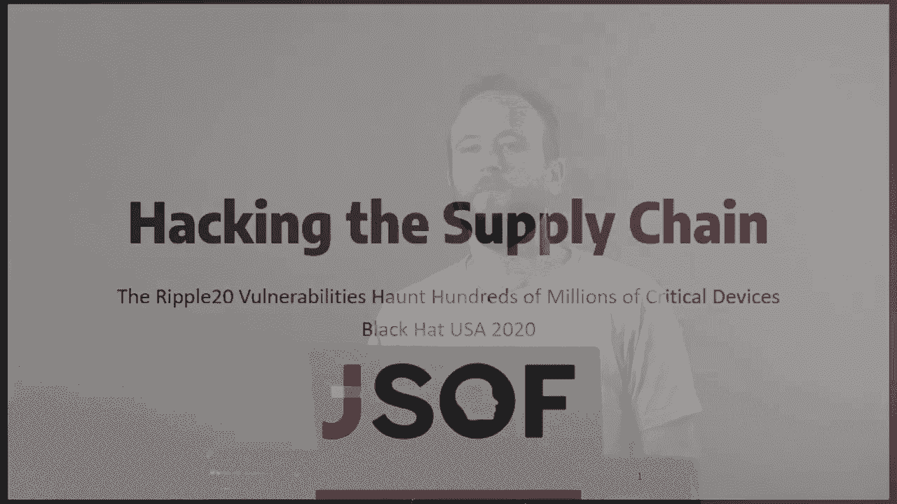

# 课程 P78：供应链安全攻击 – 影响数千万设备的 Ripple20 漏洞分析 🚨

## 概述

在本节课中，我们将深入探讨一个名为“Ripple20”的重大供应链安全事件。这是一系列存在于一个名为“TREC TCP/IP”的网络协议栈中的零日漏洞，通过复杂的供应链传播，影响了全球数千万台物联网设备。我们将重点分析其中一个最关键的漏洞（CVE-2020-11901），并展示其技术细节、利用方法，以及在一个真实设备上的攻击演示。

---

## 什么是 Ripple20？🔍

Ripple20 是一系列在 TREC TCP/IP 协议栈中发现的 19 个零日漏洞。这些漏洞通过供应链被放大，影响了数以亿计的设备，覆盖了从医疗、能源、交通到家庭网络等几乎所有物联网垂直领域。其中，有 4 个被我们评估为可导致远程代码执行的严重漏洞。

这种现象的发生与供应链的复杂性密不可分。一个库或源代码组件被层层嵌入到更大的系统和最终产品中。在供应链的某个环节之后，下游厂商可能根本不知道自己在使用这个存在漏洞的原始代码库。一旦原始库出现漏洞，它就会像瘟疫一样感染整个供应链网络。

我们选择研究 TREC TCP/IP 协议栈，是因为它功能完整、高度可配置，并且战略性地位于一条极长的供应链的起点。这意味着一个漏洞可以影响数十家不同厂商的数百种产品，造成巨大的物联网安全影响，并可能产生许多无法修复的“僵尸漏洞”。

---

## 漏洞聚焦：CVE-2020-11901（DNS 解析器漏洞）🎯

上一节我们介绍了 Ripple20 漏洞的宏观背景，本节中我们来看看其中一个具体漏洞：CVE-2020-11901。这是一个存在于 TREC TCP/IP 协议栈 DNS 解析器组件中的客户端漏洞，可导致远程代码执行。有趣的是，由于 DNS 查询会从内网发往互联网，攻击者有可能从外部网络边界攻击内部设备。

由于 TREC 协议栈的高度可配置性，这个 CVE 编号下实际上隐藏了四个不同的漏洞和一个我们称之为“辅助缺陷”的问题。不同厂商使用的不同版本可能受到其中部分或全部漏洞的影响。

---

### DNS 协议基础回顾

在深入漏洞细节前，我们需要快速回顾 DNS 协议的基础。DNS 用于将域名映射到 IP 地址。DNS 响应中包含一种称为“资源记录”的结构，其格式如下（根据 RFC 定义）：

*   **名称**：记录所指的域名。
*   **类型**：记录的类型（如 A、CNAME、MX）。
*   **类**：通常为固定值。
*   **TTL**：记录的有效时间（秒）。
*   **RD长度**：后面数据字段的长度。
*   **R数据**：记录的值（如 IP 地址或域名）。

域名在数据包中以“标签序列”形式编码。例如，`www.example.com` 被编码为三个标签：`www`、`example`、`com`。每个标签前有一个长度字节，整个名称以零长度字节结束。根据 RFC，单个标签的最大长度为 **63** 字节。

为了减少数据包大小，DNS 采用了压缩方案：用指向数据包内先前出现的相同名称序列的“指针”来替代重复的标签序列。压缩指针用两个字节编码，其最高两位为 `11`，剩余 14 位表示从数据包头部开始的偏移量。

---

### 漏洞发现：解析逻辑中的问题


我们在负责解析 DNS 响应的函数 `TF_DNS_callback` 中发现了漏洞，特别是在处理 MX 资源记录的代码段中。

以下是该函数解析 MX 记录的伪代码逻辑：

```c
length = expand_label_length(compressed_name_ptr);
ascii_ptr = allocate_buffer_on_heap(length);
label_to_ascii(compressed_name_ptr, ascii_ptr);
```

问题在于，`label_to_ascii` 函数在复制名称时，并不知道之前分配的缓冲区 `ascii_ptr` 有多大。它只是持续复制字节，直到遇到空字节为止。因此，如果 `expand_label_length` 函数返回的长度值 `length` 小于名称的实际长度，就会发生堆缓冲区溢出。

这促使我们深入研究 `expand_label_length` 函数。

---

### 漏洞一：越界读取

`expand_label_length` 函数在遍历计算名称总长度时，没有检查数据包缓冲区的边界。这导致了第一个漏洞：越界读取。

**影响**：
*   可能导致拒绝服务（例如，读取到未映射的内存页）。
*   更关键的是，可以导致信息泄露。因为 `label_to_ascii` 同样没有边界检查，它会把堆上的数据当作 MX 主机名来复制。这个主机名随后会被客户端尝试解析，从而将堆数据泄露到外部的 DNS 查询中。

此漏洞影响了至少 TREC 4.7 及更早版本，在后续版本中被修复。但由于供应链的复杂性，许多设备中的漏洞依然存在。

---

### 漏洞二：整数溢出导致堆溢出

仅仅信息泄露还不够，我们寻找的是远程代码执行。让我们再次审视 `expand_label_length` 函数。

该函数存在几个问题：
1.  没有强制执行 RFC 规定的域名最大长度（255 字节）。
2.  没有验证域名字符（应为字母、数字和连字符）。
3.  **最关键的是**：存储总长度的变量 `total_length` 是一个 16 位的无符号短整型（`unsigned short`）。

这启发我们尝试通过溢出这个 16 位变量来触发漏洞。我们需要构造一个长度超过 64KB（65535字节）的域名。这在单个最大 1460 字节的 DNS 响应包中可能吗？

**答案是肯定的**，我们利用了 DNS 压缩特性。思路是在域名中嵌套压缩指针。由于 `expand_label_length` 不验证字符，我们可以在域名中嵌入任意字节，这里我们嵌入压缩指针。

以下是构造溢出 `total_length` 变量的基本方法（简化示例）：

```
假设域名排列如下（每行16字节）：
[0F][a a a a a a a a a a a a a a a]  // 标签长度 0x0F，后跟15个字符‘a’
[0F][a a a a a a a a a a a a a a a]
...
[BRANCH_BYTE][C0][0E]... // 分支字节后跟一个压缩指针 0xC00E，指向偏移 0x0E 处
```

计算过程：
1.  函数从某个位置开始计算长度。
2.  遇到普通标签，长度增加（标签长度+1）字节，指针后移。
3.  遇到我们构造的“分支字节”后，跳转到压缩指针 `0xC00E` 指向的位置（该位置在我们当前指针之前，符合“只能向后跳转”的检查）。
4.  从新位置继续计算，由于指针指向我们精心构造的循环结构，`total_length` 的值会急剧增加。
5.  通过使用最大标签长度 `0x3F` 进行构造，我们可以在一个很小的数据包空间内，让计算出的 `total_length` 超过 65535，从而发生整数回绕，返回一个很小的值。

最终，`expand_label_length` 返回一个远小于实际名称长度的值，导致 `label_to_ascii` 分配过小的缓冲区并发生堆溢出。这是一个极佳的远程代码执行利用点。

**重要提示**：此漏洞可以通过 CNAME 资源记录触发，而 CNAME 记录可以出现在任何类型的 DNS 响应中，因此影响面非常广。此漏洞影响了披露时最新的 TREC 版本。

---

### 漏洞三：错误的 RD长度 修复漏洞

在研究过程中，我们购买了一台新的施耐德 UPS 设备，发现其 TREC 版本修复了之前的越界读取漏洞。修复方式是在 `expand_label_length` 函数中增加了一个参数 `label_end_ptr`，该指针基于资源记录中的 `RD长度` 字段计算得出。

当函数遍历到 `label_end_ptr` 指向的位置时，会停止处理并返回当前累计的 `total_length`。

**新问题**：`RD长度` 字段是攻击者可以控制的。如果我们提供一个小于实际数据长度的 `RD长度` 值，`expand_label_length` 就会提前停止，返回一个较小的长度值，从而导致 `label_to_ascii` 发生堆溢出。这实际上是对第一个漏洞的错误修复所引入的新漏洞。

---

### 辅助缺陷：内存泄露

在 MX 记录解析逻辑中，我们还发现了一个辅助缺陷：在某些错误路径下，一个内存结构体 `other_info` 没有被正确释放。通过构造特定的 `RD长度` 值（如 1）或使用错误的压缩指针，我们可以触发这个缺陷，导致固定大小（0x3c 字节）的内存泄露。这种内存泄露在利用堆漏洞时非常有用，我们在后续的漏洞利用中确实用到了它。

---

### 本节总结

CVE-2020-11901 实际上由四个漏洞和一个辅助缺陷构成：
1.  **越界读取漏洞**：影响所有早期版本，后续版本修复。
2.  **整数溢出漏洞**：影响所有版本（包括最新版）。
3.  **错误的 RD长度 漏洞**：是修复漏洞1时引入的，只影响较新版本。
4.  **内存泄露缺陷**：存在于所有版本。


**核心要点**：一个设备可能受到其中一种或多种漏洞的影响，具体取决于其集成的 TREC 协议栈的精确版本。这种碎片化使得企业安全人员难以准确判断设备是否受影响，增加了防护难度。

---

## 漏洞利用实战：攻击施耐德 UPS 设备 ⚡

上一节我们详细剖析了 CVE-2020-11901 的多个变体，本节中我们来看看如何实际利用其中一个漏洞。我们将以施耐德电气的一款不间断电源（UPS）设备为例，展示完整的攻击链。

UPS 是连接在关键设备（如服务器、医疗设备）和电源之间的备用电池。我们攻击的目标是 UPS 的网络管理卡。该卡使用 20186 处理器，所有代码（包括 TREC 协议栈和应用程序）都运行在 **16 位实模式** 下，这意味着没有任何现代漏洞缓解机制（如 ASLR、DEP），为利用提供了便利。

我们的利用基于“错误的 RD长度 漏洞”。利用原语是一个堆溢出，但溢出内容被限制为字母、数字和连字符。我们选择通过 MX 记录响应来触发溢出，因为设备启动时，其网卡会主动发送 MX 查询来发送事件邮件，这为我们提供了交互机会，便于进行堆布局塑造。

---

### 利用策略：篡改 DNS 缓存条目

我们选择溢出目标是 `TS_DNS_cache_entry` 结构体。这个结构体包含一些有趣的字段，例如指向 `other_info` 结构体列表的指针，而 `other_info` 存放着 DNS 响应的内容。该缓存条目处于一个双向链表中，并且在 DNS 响应解析逻辑中被频繁引用。

以下是我们的攻击思路：
在解析 CNAME 记录时，代码会从缓存条目中取出 `other_info` 列表指针，然后将新分配的 CNAME 名称的指针写入该地址。伪代码如下：

```c
other_info_ptr = cache_entry->other_info_list_ptr; // [1] 从被溢出的缓存条目中读取指针
cname_buffer = allocate_and_copy_cname(attacker_controlled_name); // [2] 分配并复制我们控制的CNAME名称
*other_info_ptr = cname_buffer; // [3] 将指向我们CNAME缓冲区的指针，写入[1]读出的地址
```

因此，如果我们能通过堆溢出覆盖缓存条目中的 `other_info_list_ptr` 字段，将其改为一个我们控制的地址，那么当处理 CNAME 记录时，我们就能实现一个 **受控指针写入**——将一个指针写入任意地址。

---

### 挑战与技巧

1.  **堆布局塑造**：我们需要让 `MX` 名称缓冲区紧挨着 `DNS` 缓存条目分配，且缓存条目在内存中位于其后，才能实现线性溢出。我们利用堆分配器的“紧适应”策略和之前提到的内存泄露缺陷来塑造堆布局，创建合适大小的内存空洞。

2.  **地址限制**：我们的溢出内容是字母数字字符串，因此我们想要写入的地址也必须由字母数字字节构成。但在实模式下，绝对地址由“段:偏移”组成。由于目标处理器奇特的段寻址方式（左移8位而非4位），我们可以组合两个字母数字字节来产生一个非字母数字的段值。例如：
    `段 = 0x004B`，`偏移 = 0x00AA`，计算出的线性地址为 `(0x004B << 8) + 0x00AA = 0x4BAA`。通过精心构造，我们可以让写入的指针指向堆管理函数所在的代码段。

3.  **劫持执行流**：在能够向代码段写入一个指针后，我们选择覆盖一个 `far call`（远程调用）指令的目标地址。当某些堆管理函数（例如检测到堆元数据损坏时调用的错误处理流程）执行这个 `far call` 时，控制流就会跳转到我们 CNAME 缓冲区中的“邪恶载荷”。

---

### 利用链回顾

1.  **堆塑造**：利用内存泄露和多次 DNS 查询/响应，塑造堆布局，使 MX 名称缓冲区后方恰好是目标 DNS 缓存条目。
2.  **溢出**：发送恶意 MX 响应，触发堆溢出，覆盖缓存条目中的 `other_info_list_ptr`，使其指向代码段中的一个 `far call` 目标地址。
3.  **触发写操作**：发送一个 CNAME 记录响应。解析时，系统会为我们控制的 CNAME 名称分配缓冲区，并将其指针写入我们覆盖的地址（即 `far call` 的目标地址）。
4.  **触发执行**：当 MX 名称缓冲区被释放时（因为我们溢出了它后面的元数据），会触发堆损坏检测流程，执行被我们篡改的 `far call`，跳转到我们的 CNAME 缓冲区。
5.  **执行载荷**：我们的 CNAME 缓冲区中包含一个两阶段解码器，用于执行任意载荷（而不仅仅是字母数字的 Shellcode）。在演示中，载荷会关闭 UPS 的电源输出，从而切断所有连接设备的供电。

---


## 总结 🎓

本节课我们一起学习了供应链安全中的典型案例——Ripple20 漏洞。

我们首先了解了 Ripple20 的本质：一系列深植于 TREC TCP/IP 协议栈中的漏洞，通过复杂的软硬件供应链扩散，影响了海量物联网设备，凸显了现代供应链中“一处漏洞，处处风险”的严峻挑战。

接着，我们深入分析了其中一个关键漏洞 CVE-2020-11901。它位于 DNS 解析器中，由于长度计算函数 `expand_label_length` 存在越界读取、整数溢出以及对修复代码的绕过等问题，最终可导致堆缓冲区溢出。我们看到了一个 CVE 编号下如何因代码版本和配置差异而包含多个变体。

最后，我们目睹了漏洞利用的完整过程。通过精心的堆布局塑造、利用处理器特性绕过地址限制、以及劫持 `far call` 指令，攻击者成功在施耐德 UPS 设备的网络卡上实现了远程代码执行，并完成了关闭电源的演示。这个案例生动展示了，即使是一个看似简单的协议解析漏洞，在缺乏现代系统防护的嵌入式环境中，也可能造成严重的物理世界影响。


Ripple20 事件给我们的核心启示是：在万物互联的时代，企业必须重视供应链安全，建立软件物料清单（SBOM），并具备对网络中各类设备（尤其是嵌入式设备）进行漏洞评估和应急响应的能力。