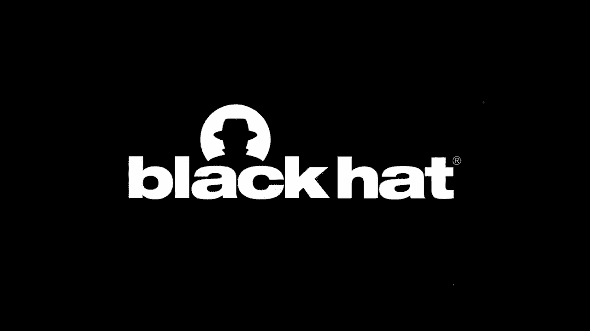
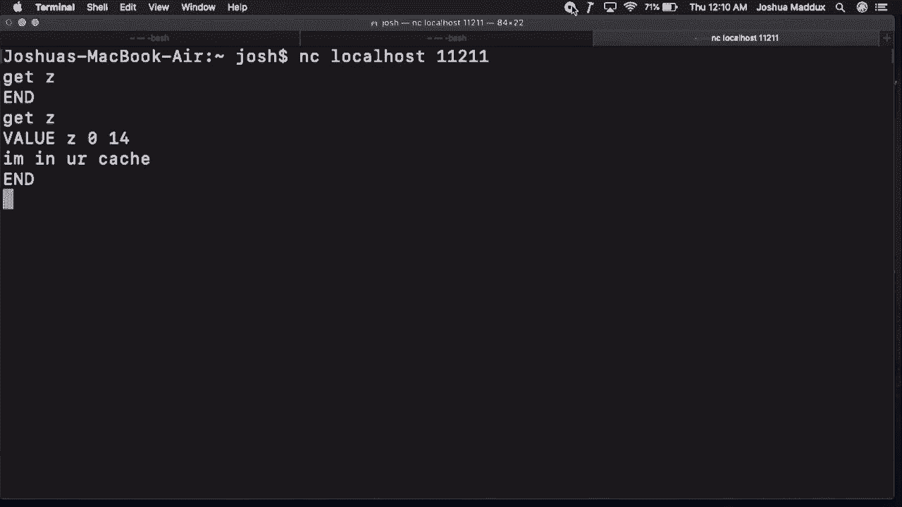
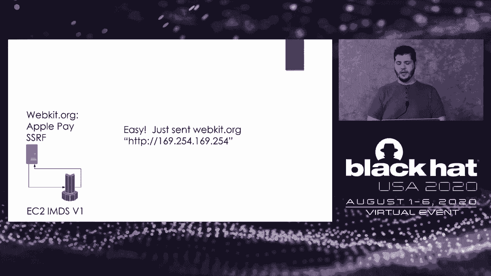
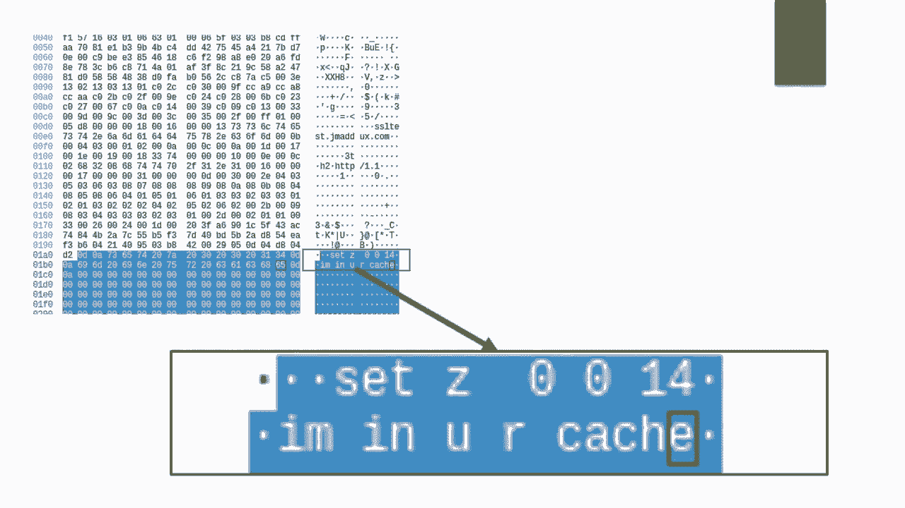
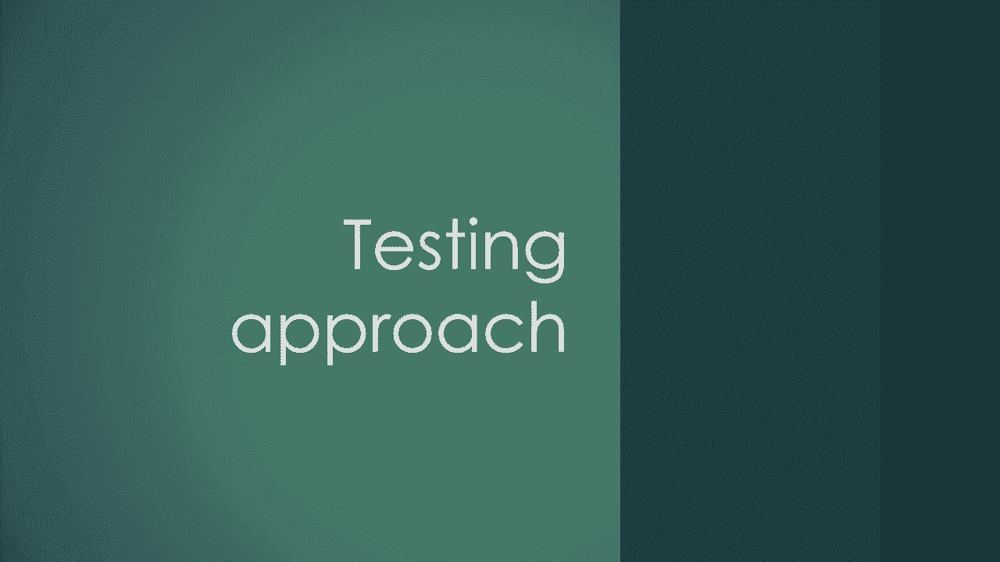
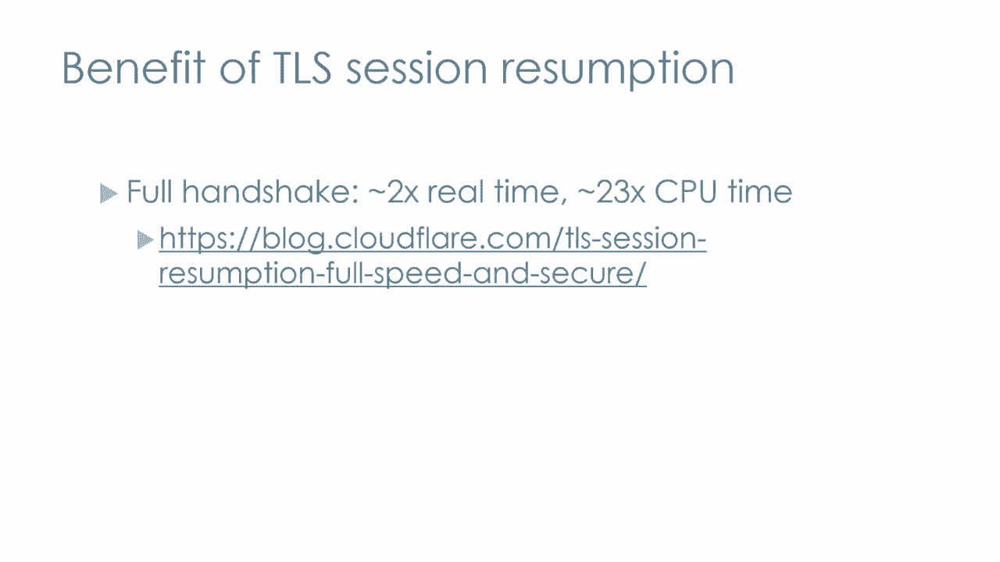

# 课程 P79：80 - 当 TLS 攻击你时 🔐

在本节课中，我们将学习一种结合了TLS（传输层安全协议）会话机制与DNS重绑定技术的攻击方法。这种方法能将看似无害的“服务器端请求伪造”（SSRF）漏洞，转变为能够攻击内部服务的强大武器。我们将从核心概念讲起，逐步深入到实际的攻击场景和防御建议。

## 引言：一个奇怪的演示

上一节我们介绍了课程主题，本节中我们来看看一个令人费解的演示，它揭示了TLS一个潜在的危险特性。




这里运行着Memcached，一个通常在11211端口运行的流行缓存服务。目前，键名为“Z”的条目是空的。



```
get Z
```

现在，我向一个HTTPS URL发起请求，这个操作看似与Memcached无关。

```
curl -L -v https://example.com/redirect-loop
```

经过一系列重定向后，curl命令最终报错。但神奇的是，如果我们再次查询Memcached：

```
get Z
```

会发现“Z”键下出现了一个条目，而这个文本从未在curl的输出或任何重定向响应中出现过。这表明，与我们通信的服务器通过某种TLS机制，诱使curl将数据存入了Memcached。这个现象虽然奇怪，但可能具有利用价值。

## 攻击背景：SSRF的局限性

上一节我们看到了一个奇怪的现象，本节中我们来探讨其背后的攻击背景——SSRF及其挑战。

SSRF（服务器端请求伪造）是一种漏洞，攻击者可以诱使服务器向指定URL发起请求。然而，利用SSRF通常面临诸多限制：

以下是常见的SSRF利用限制：
*   **盲SSRF**：服务器会获取URL，但不返回响应内容。
*   **请求方法限制**：服务器可能只使用特定的HTTP方法（如PUT）。
*   **响应验证**：服务器可能只接受特定内容类型或只返回特定字段的响应。
*   **协议限制**：服务器可能只接受HTTPS URL。

因此，攻击者需要一个**通用的盲SSRF方法**，即仅通过让服务器访问一个URL，就能向内部服务（如SMTP、Redis）投递有效载荷并达成安全突破，而无需看到响应。

传统的利用方法（如通过SNI字段注入换行符）通常依赖于特定平台的URL解析漏洞。那么，是否存在一种内置于TLS协议本身的利用方式呢？这就是本研究的起点。

## TLS协议中的可利用字段

上一节我们了解了SSRF的挑战，本节中我们深入TLS协议，寻找可能的利用点。



通过Wireshark分析TLS连接，我们可以看到Client Hello报文中的各个字段。之前的研究利用了**SNI（服务器名称指示）**字段来注入攻击载荷。但SNI的利用受限于URL解析。


然而，存在另一种方式可以让攻击者将载荷注入Client Hello报文。这涉及到TLS的会话恢复机制。



TLS为了优化性能，提供了几种机制来复用之前连接建立的加密上下文：
*   **会话ID**：服务器可以分配一个最多**32字节**的标识符给客户端缓存。
*   **会话票据**：一个更大的、通常由服务器加密的数据块，大小可达约**65KB**。
*   **预共享密钥身份**：TLS 1.3中功能类似的机制。

这些机制的本质是服务器告诉客户端：“保存这段数据，下次连接时带上它，我们可以快速恢复会话。”这就像一个**明文传输的Cookie**，完美契合了我们试图实现的SSRF攻击需求。

## 核心攻击链：结合DNS重绑定

上一节我们找到了TLS中的“可携带Cookie”，本节中我们来看看如何让它被发送到错误的目标——内部服务。

这里存在一个关键问题：访问`google.com`和`localhost`的TLS会话数据是不同的，服务器如何会在与内部服务通信时复用攻击者提供的会话呢？

通过研究curl等常用库的源码发现，TLS会话缓存的键值通常**不包含目标IP地址**。这意味着，无论`attacker.com`解析到哪个IP（互联网IP或本地IP），客户端都会尝试复用之前与该域名建立的TLS会话。

攻击者可以将此TLS特性与**DNS重绑定**技术结合：
1.  **第一阶段**：让目标服务器访问 `attacker.com`，此时DNS将其解析到攻击者控制的服务器IP（如`35.x.x.x`）。该服务器在TLS握手时，通过**会话票据**向目标服务器“投递”攻击载荷。
2.  **等待DNS记录过期**。
3.  **第二阶段**：目标服务器再次访问同一个URL `attacker.com`。此时，攻击者控制的DNS服务器将其解析到**内部目标地址**（如`127.0.0.1:11211`）。
4.  目标服务器向内部服务发起TLS连接，并**自动携带**了第一阶段获取的攻击者会话票据。

这样，攻击者就能操纵目标服务器，将包含攻击载荷的TLS会话ID、票据或PSK身份标识发送给它自己或内部网络的其他服务。


上图展示了原始的TCP流。攻击载荷中可以包含**换行符**等任意字符，这使得攻击者能够与Memcached这类基于换行符的TCP协议进行交互，就像过去利用`gopher://`协议一样。

以下是一个更具破坏性的例子，一个Python pickle序列化载荷，当从Memcached中取出时可能直接导致远程代码执行：

```
... (二进制形式的pickle载荷) ...
```

## 测试与利用实践

上一节我们理解了攻击原理，本节中我们来看看如何搭建环境进行测试和利用。


以下是测试所需的基础设施组件：
*   **自定义DNS服务器**：一个运行在53端口的Python脚本，交替返回攻击者服务器IP和`localhost`。
*   **自定义TLS服务器**：用于通过会话票据投递攻击载荷。可以使用Rust TLS库（如`rustls`）快速搭建。
*   **网络监听器**：使用`netcat`监听端口，用于验证载荷是否被成功携带并发送。


在测试时，直接让目标访问`localhost`可能无法验证会话是否被缓存。因此，有时需要先让目标访问一个中间监听服务器，确认载荷被持久化后，再切换DNS指向最终的内部目标端口。


## 实际案例与演示

上一节介绍了测试方法，本节中我们通过几个真实案例和演示来加深理解。

许多支持用户提供URL并由服务器获取的功能都可能存在此类风险，例如：
*   **Webhook接收器**
*   **URL预览/爬取功能**
*   **文件导入/共享功能**（如NextCloud）

**案例一：Jira**
在Jira的某个导入功能中发现了此漏洞。利用DNS重绑定和TLS会话投递，成功让Jira服务器向本地的SMTP服务发送了包含攻击命令的TCP流。



**案例二：NextCloud**
NextCloud的共享URL功能允许包含端口号。虽然自动添加了`https://`前缀，但通过盲SSRF结合本技术，攻击者（作为非管理员用户）能够对内部Memcached执行任意写入操作。修复方案是为此类外部请求添加超时限制。

**演示：针对Django开发者的钓鱼攻击**
这个演示展示了攻击的威力。攻击者只需在邮件中嵌入一个图片标签，其`src`指向攻击者控制的域名。

```

```

当开发者查看邮件时，邮件客户端会自动加载该图片，触发整个攻击链：
1.  首次请求，获取包含恶意Pickle载荷的TLS会话票据。
2.  DNS重绑定后，邮件客户端（或服务器后端，如果代理了图片）向本地`127.0.0.1:11211`发起HTTPS请求。
3.  请求中的TLS会话票据包含Pickle载荷，被写入Memcached。
4.  Django应用从缓存中读取该数据并反序列化，触发预置的shell命令（例如弹出计算器）。


此演示表明，即使受害者只是查看了邮件而**没有点击任何链接**，也可能导致远程代码执行。

## 防御措施与总结

上一节我们看到了攻击的危害，本节中我们一起探讨如何防御以及总结全课。

**根本解决方案：修改TLS客户端行为**
最根本的解决方法是修改TLS客户端实现，使其**不会在不同服务器间复用会话**。一个折中的建议是，至少禁止在访问本地（`localhost`、私有IP段）地址时复用来自互联网域名的会话。然而，主流客户端（如Chromium）出于性能考虑，目前尚未完全采纳此类方案。

**应用层防御建议**
对于应用程序开发者和运维人员，可以采取以下措施：
*   **使用代理**：将所有出站请求通过一个固定代理发出，代理服务器应禁用TLS会话复用或严格隔离会话缓存。
*   **增加超时**：为所有外部HTTP请求设置较短的超时时间，增加DNS重绑定攻击的难度。
*   **网络层防御**：在防火墙上部署DNS重绑定防护（例如，阻止外部DNS响应包含内部IP地址）。
*   **禁用会话缓存**：如果使用的HTTP客户端库支持，考虑禁用TLS会话缓存功能。

**性能与安全的权衡**
TLS会话恢复的主要好处是**减少握手带来的CPU开销和延迟**。对于服务海量TLS连接的服务提供商，这是一个重要的性能优化。然而，对于普通互联网用户或发起出站请求的Web应用而言，其所带来的安全风险可能超过了微小的性能收益。我们需要重新评估这一权衡。

本节课中我们一起学习了一种新型的SSRF攻击技术，它利用TLS会话恢复机制和DNS重绑定，能将盲SSRF转化为对内部服务的攻击。作为攻击研究人员，关注新协议和标准中不同寻常的特性往往能发现有趣的攻击面。作为防御者，应意识到内部服务暴露的风险，并考虑在网络架构和应用设计中实施纵深防御。

---
*（注：本教程根据公开技术演讲内容整理，旨在进行安全技术教育。文中提及的攻击方法仅用于学习与防御目的，请勿用于非法活动。）*