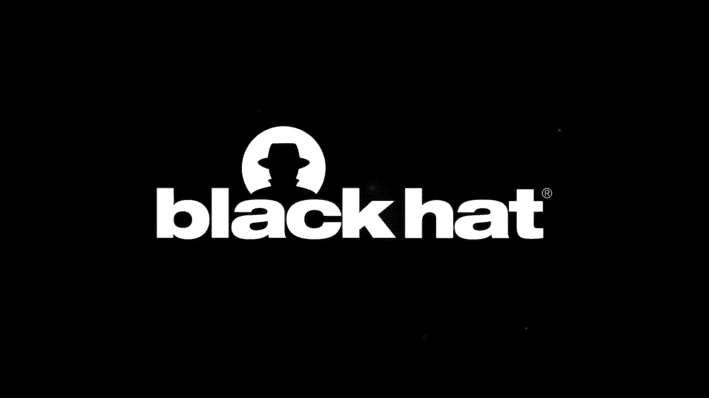
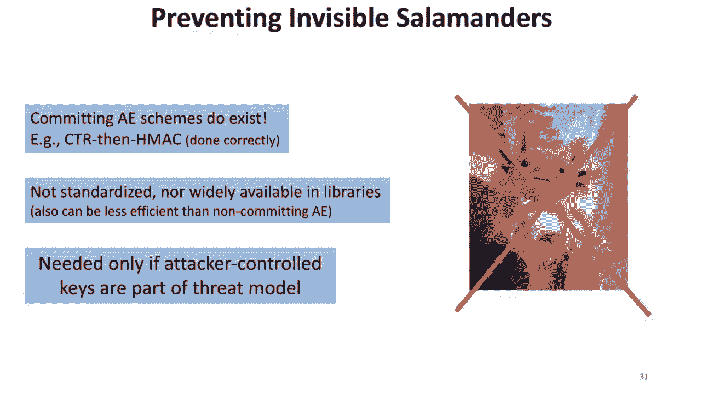

# P8：08 - Hunting Invisible Salamanders - Cryptographic (in)Security with Attacker-Co - 坤坤武特 - BV1g5411K7fe

 Hi， my name is Paul Grubbs and today I'll be presenting my talk Hunting and Visible Salamanders。

 Cryptographic Insecurity with Attacker-controlled Keys。 Before I start。

 let me tell you a little bit about myself。 For another month or so。

 I'll be a PhD student in computer science at Cornell's New York， City campus。 After that。

 I'll be joining NYU for a year-long postdoc， and next fall， I'll be joining the。

 University of Michigan as an assistant professor of computer science。

 My research is an applied cryptography。 I do some work on the security of outsourced encrypted databases and storage。

 but the， work I'll be talking about today is all about the security of a core cryptographic。

 primitive called authenticated encryption。 Specifically。

 I'll be talking about the ways in which the security of authenticated encryption。

 can fail when it's in new settings。 This talk will probably be most interesting to people。

 as day-to-day work involves designing， implementing， and applying cryptography。

 But all security practitioners will be able to follow along and take away some interesting。

 new knowledge about cryptography。 I'll also be delving into a few mathematical details during my talk。

 But I'll mark these slides with the symbol to let you know that it's okay if you don't。

 understand everything， and at the end， I'll give a high-level summary of the takeaways。

 of those slides。 So as I said before， my talk is all about authenticated encryption。

 or AE for short。 AE is probably， along with key exchange and signature。

 is one of the most widely used， cryptographic primitives on the Internet。

 The way AE is often used is for two parties who want to communicate securely to first。

 agree on a random symmetric key， perhaps pre-distributing it or establishing it via key exchange。

 and then encrypting all their traffic， for example， their cat pictures， with an AE scheme。

 like Galois Countermotor， Cha-Cha20， Poly-1305。 This basic blueprint is the core of a huge number of security protocols on the Internet。

 like TLS， IPsec， SSH， and others that protect end users， sensitive business data， and financial。

 transactions every day。 Decades of research and cryptography has given us ways to prove formally that as long as。

 this key that the two-party share is random enough and hidden from the attacker， using。

 authenticated encryption hides the contents of the traffic and prevents an adversary from。

 modifying the contents。 AE， though， is increasingly used in settings that don't look like this one I just described。

 For example， in some threat models， it makes sense for the attacker to be able to choose。

 the key used for authenticated encryption。 Examples of this include password authenticated key exchange。

 password-based encryption， encrypted， messaging for groups and content moderation and abuse reporting for encrypted messaging。

 And these attacker controlled key settings。 We can't argue any security based on the fact that the key is random and hidden from。

 the adversary。 After all， the adversary chose it。 So we're left with a bunch of important questions like。

 what security properties does AE need， to have in the face of such an attack？

 What properties might we expect it to have？ Do modern widely used authenticated encryption schemes have the properties we expect？

 My talk， based on these research papers here at the bottom， will seek to answer these questions。

 First I'll describe our attack-controlled key setting in more detail。

 Convence is not just something I made up by giving a few examples and explain the committing。

 security property AE should have here。 Next， I'll show that most modern authenticated encryption schemes are not committing。

 I'll explain the GCM algorithm briefly， walk through the process of creating a GCM cipher。

 text that decrypts under two different attacker controlled keys。 And finally。

 I'll show how to use polynomial interpolation to go from two to hundreds of。

 thousands of keys with GCM。 And then after that， I'll give some attacks resulting from non-committing authenticated。

 encryption。 I'll describe how in multi-receiver encryption you can send different messages to different。

 people when encryption is not committing。 And then we'll meet the original invisible salamander in an attack on Facebook's message。

 ranking protocol。 And finally， I'll describe partitioning oracles。

 which recover lower medium entropy， cryptographic keys via adaptive chosen ciphertext attacks。

 But we'll start with explaining the setting in a little bit more detail on explaining。

 committing security。 So first I'll say a little bit more about the setting that we started the talk with and。

 then contrast it to the attacker controlled key setting。 In secure transport settings。

 the encryption key here is unknown to the adversary and has， lots of randomness。

 The kinds of things an attacker can try to do in this setting is to learn something。

 about the message or to change the output of the encryption to cause the decryption to。

 output something other than what the encrypted put into the encryption algorithm。 In contrast。

 neither of these goals really make sense when the attacker controls the， key。

 The adversary already knows the message that's using for encryption so nothing is hidden from。

 the adversary。 And the adversary can try to make decryption output whatever it wants because it chooses。

 the input。 So what might an attacker want to do in this attack setting？

 So it really depends on whether or not the adversary already knows the key used for decryption。

 as well as encryption。 If the adversary doesn't control the key used in decryption。

 one thing it could try to do， is to learn information about the key itself。

 The classical example of this is a brute force attack on， for example， password based authenticated。

 encryption。 If the receiver is decrypting ciphertext using a key that's easy to guess and the receiver。

 somehow lets the sender know whether the decryption succeeded with its key， an attacker can try。

 to encrypt a message with every possible password in popularity order and send them to the receiver。

 If the keys don't match， decryption will fail and the receiver will say I can't decrypt， this。

 But if the keys match， decryption will succeed and the attacker will know the receiver's， password。

 Attack like this is always possible in any protocol but in settings like TLS and another。

 transport protocol is the key is random enough to make an online brute force attack like this。

 infeasible。 So key recovery attacks like this are usually only a problem when the key used for authenticated。

 encryption is a password or a short pin or some key bits rather are leaked via side channel。

 So even if the sender and the receiver share a key， attacker controlled keys can still be。

 a problem。 If for example a setting where two parties are saying trying to embezzle money and communicating。

 AE encrypted traffic that contains fraudulent records like evidence of their crimes。

 If the encrypted traffic has been stored for audit purposes and the auditor needs to decrypt。

 to check what they've been doing， the attackers could try to give a different key than the。

 one they've been using。 So here their goal is not to learn something about what the decryptor is using or what。

 the auditor will see in decryption。 It's rather to ensure that the auditor recovers something from decryption other than the fraudulent。

 records that they've been communicating。 So now that we understand the setting and have some examples。

 I'll explain what this， committing security property is。 To explain this。

 I like to use a very simple physical intuition of authenticated encryption， as a lockbox。

 We can take AE in like a lockbox， we can put a message inside of a box， close it and lock。

 it up and give it to an adversary。 Unlike a physical lockbox AE should hide the contents of what's inside confidentiality。

 and prevent someone with that box from changing what's inside so integrity。

 Another property that a physical lockbox has is more similar to committing security for。

 AE which is that when you try to unlock the box， no matter what key you use， you either。

 fail to open it or you open it and you see what the person who locked the box put in， there。

 This guarantee is a meaningful one in our attacker controlled key setting because it。

 restricts what the attacker can do when they lock the box。

 So this is in put simply the committing security guarantee that AE needs。 If AE didn't have this。

 it might be able to create an attacker or rather might be able。

 to create lock boxes that had different things in them depending on which key was used to。

 unlock them which defies our physical lockbox intuition。 For example。

 an adversary could craft a single AE ciphertext that had in addition to this。

 real cat picture description from before a second decryption with a different key to。

 the salamander， the invisible salamander of the title。

 So committing security for AE as I said prevents this by binding the attacker in some sense。

 to a single AE decryption and requiring that unless the attacker solves some computationally。

 intractable problem， any AE ciphertext that they create only has one correct decryption。

 This prevents them from crafting a ciphertext with these hidden secondary decryption or these。

 invisible salamanders from the title。 To see why committing prevents the attacks I described before。

 recall our plaintext reporting， example from before。

 If the malicious accountants that were communicating these fraudulent records used committing。

 authenticated encryption， no matter what key they report to the auditor they won't be able。

 to hide the fraud。 The committing property guarantees that either the auditor will fail to decrypt those ciphertext。

 or it will decrypt and see the fraudulent records out。

 So next I'll explain that surprisingly many widely used modern authenticated encryptions。

 are not committing。 So I promised you an attack on GCM but because GCM is fairly complicated I'll start with。

 reasoning just about the encryption part of GCM which is counter mode。

 So counter mode encryption if you're not familiar is pretty simple。

 If we want to encrypt for example this plaintext with this orange key here we just sample a。

 random initialization vector and derive a pad using that key and that an IV。

 Then we take this pad that we derived an exclusive order with the plaintext to output。

 the ciphertext。 But now imagine that we have a different key， this red key here。

 We can still derive the pad for this other key with the same IV and try to decrypt the。

 ciphertext with this other pad which will result in a different plaintext than the one。

 we kind of use for encryption。 So counter mode as you can see has this somewhat intuitive counterintuitive property rather。

 that a ciphertext can be decrypted by any key。 So before showing the attack on full GCM I'll briefly explain how it works。

 So GCM is ubiquitous and standardized by basically every standard body that standardizes encryption。

 schemes。 So GCM in addition to using counter mode to encrypt things by sampling a random IV and。

 encrypting the message with counter mode uses a message authentication code or MAC to prevent。

 tampering。 This is this MAC is what provides the authenticated and authenticated encryption。

 So to encrypt the GCM first computes counter mode on the plaintext and then applies this。

 authentication message authentication code on the result of counter mode to compute the， tag。

 Decryption then takes this counter mode ciphertext and tag as input and recomputes the tag using。

 this MAC algorithm and compares it to the tag of those input。

 If they match GCM outputs the counter decryption of that part of the ciphertext and if they。

 don't decryption fails。 So if you didn't follow that， that's fine。

 All that's really important is that we don't have to worry about any of the properties of。

 counter mode to craft an invisible salamander for a ciphertext or a ciphertext that decrypts。

 under multiple keys。 All we need to do is come up with a counter mode ciphertext that collides under this tag。

 function that has the same tag output under these two different keys。

 So we'll next see how to do that。 And recall that our processors going to take as input these two encryption keys and it's。

 going to output a counter mode ciphertext IV and message。 So to do this。

 we need to review how the MAC works。 And fortunately for us GCM's MAC is not a complicated collision resistant hash function。

 like SHOT 56。 Instead， it's a very fast polynomial evaluation combined with exclusive or as follows。

 First， the algorithm takes the counter mode ciphertext and splits it into 128 bit blocks。

 which form the coefficients of the polynomial。 So here we'll just stick to the case where the ciphertext is a single block for now。

 Then it computes the hash point and the pad， the hash point by encrypting the zero string。

 with AES and the key and the pad by encrypting the IV with AES and the key。

 Finally it treats this hash point as a number and evaluates the polynomial defined by coefficient。

 C1 and a block denoting the ciphertext length at the number H。

 Then exclusive or is the pad with the result and outputs it as the tag。

 All this arithmetic is actually not done over the real numbers。

 It's done in what's called a GOWA field of order 2 to the 128。

 And the details of that aren't too important。 The only thing that's important to know about that algebraic structure is that in that field。

 addition an exclusive or the same operation。 So recall we're trying to work out an input IV and ciphertext that makes the MAC function。

 help with the same thing for our red and orange keys here。

 So to do this we're going to use the following process。 So we're going to choose an arbitrary IV。

 it doesn't matter which one and then we're， going to derive the hash points and the pads for the two keys。

 Then we're going to take the tag equations for the two keys。

 Treating the ciphertext block as a variable and just set them equal to each other。

 This gives an equation in one variable namely the single block C1 so we can simply solve。

 it and I'll come back to how we do this to find the block。

 Now we can let our message be that single block that we computed and recompute the tag。

 which by construction collides under both keys and then output this IV message and tag that。

 we computed。 Now to solve this equation we simply have to rearrange it a little bit so that we get。

 this the ciphertext block times the sum of the two squared hash points and on the right。

 side we get some constants。 So we can rearrange this by multiplying the left hand side by the inverse of that constant。

 term and just define the ciphertext block C1 as the terms on the right。

 Now this equation here on the left looks very hairy because it has a lot of terms but it's。

 really very simple。 So just imagine a much simpler equation like 2x equals 6。

 Like 2x equals 6 our equation here on the right hand side is all constant and on the。

 left hand side is a variable times a constant。 So if you remember from algebra all you need to do is kind of divide both sides by the constant。

 term here on the left to solve for the variable which on the right hand side is x equals 3。

 and the left hand side is our ciphertext block。 So it's worth reflecting on why this attack doesn't work for other collision resistant hash。

 functions like shot 56。 Why this attack can't work for any Mac based on the collision resistant function and it's。

 because this Mac is not a complicated function of the ciphertext。

 It's a very simple to describe algebraic function of the ciphertext。

 So you could write down an equation like this for a more complicated collision resistant。

 hash like shot 56 but the reason why that function is collision resistant is because。

 no one knows how to solve that system of equations with time less than just a simple。

 generic collision finding search。 So this attack works for a single ciphertext block and it's not too hard to adapt it to。

 multiple ciphertext blocks。 It just needs to add a constant contribution from the other ciphertext blocks that aren't。

 fixed by the choices of two keys to the Mac equation。

 So here on the right hand side I've adapted the Mac algorithm to arbitrary numbers of。

 blocks with the changes here in white。 But I also promised you that I would describe how to do more than two keys and you can do。

 this by observing that this simple one equation problem for one block that we had before is。

 a very simple instance of linear algebra or it has to do with solving systems of linear， equations。

 So we can recast the question of constructing a GCM collision to a single matrix vector equation。

 where there's an equation for each key that we want to collide on and as many variables。

 as there are ciphertext blocks in the desired ciphertext。

 So we know from linear algebra that as long as there are more ciphertext blocks than keys。

 this system can be solved。 We're here on the left hand side。

 This matrix is basically the exponentiation of each of the hash points for each of the， keys。

 And this equation as long as the number of variables is more than number of constraints。

 can be solved in quadratic time and the number of keys。 So finally。

 this basic template for colliding on multiple keys applies to other authenticated。

 encryption schemes with polynomial max。 So for example。

 schemes that use poly-1305 that can be found in libsodium and nackel can。

 be attacked like this and GCM SIV as well。 But for technical reasons I won't go into scaling these attacks up to many keys is more。

 complicated than with plain GCM but it can be done。

 So here we're at the end of the heavy math stuff。 So if my dulcet tones have put you to sleep it's time to wake up to get the summary。

 First widely used authenticated encryption schemes like GCM are not committing though。

 importantly this doesn't invalidate their use in settings where attacker controlled keys。

 are aren't a problem。 It's very simple to craft ciphertext with invisible salamanders or secondary hidden decryption。

 And finally using linear algebra it's not too hard to produce a single ciphertext with。

 hundreds of thousands of correct decryption or even more。

 For example my colleague generated a GCM ciphertext that decrypts correctly under over 131，000。

 different keys。 Finally I'll give you some attacks that result from incorrect use of non-committing authenticated。

 encryption in attacker controlled key settings。 So the first I'll start with the simplest one which has to do with group messaging。

 In group messaging a single sender sends a message to a group of recipients instead。

 of just one receiver。 Actually the sender will use AE to encrypt the message。

 And they'll do so with a key that's shared pairwise with each recipient perhaps done。

 using a public key encryption of the key in the ciphertext itself。

 And importantly we're going to assume a setup where there's only one AE encryption sent。

 to all users， found out by the server。 So once the keys are shared pairwise the sender can send a single ciphertext to the server。

 that fans it out to each recipient just got key。 So this basic pattern of fanning out these single ciphertexts after pairwise sharing keys。

 is pretty common in group messaging and is used by Whatsapp and Keybase and a few others。

 So the attack here is pretty simple。 If the sender is malicious it can simply share different keys with different recipients and。

 send a ciphertext with an invisible salamander and forcing different receivers to see different。

 decryption。 This attack is a nice demonstration of what unintuitive things can happen when encryption。

 is not committing but as far as I know it's only theoretical and it's not clear that these。

 protocols that use this pattern are vulnerable。 Although if you want to do some homework you can go look at these protocols yourself and。

 if you find a vulnerability like this and email me I'll give you a gold star。

 So attacks like this have been demonstrated in some protocols although many of the details。

 are different in a way I'll explain before。 So an attack similar to this one that's been demonstrated is on an abuse reporting system。

 for encrypted messaging。 So just to give you some background on abuse reporting this is a problem that's faced by。

 all people who run platforms that provide end-to-end encryption where if a sender is。

 malicious and sends something abusive to a receiver encryption makes it hard to report。

 that message to the platform because if the platform doesn't ask for additional verification。

 that the reports are genuine then a malicious receiver could themselves report whatever they。

 want and abuse the abuse reporting system。 So what is needed here in this abuse reporting from encrypted messaging setting is some kind。

 of secure reporting protocol for the contents of an encrypted message。

 And Facebook were the first to notice the need for this in applications and they developed。

 an ad hoc protocol for cryptographically proving the contents of a message called message。

 ranking and the attack will break this message ranking protocol basically the attack works。

 because Facebook used non-committing encryption for part of their protocol which meant that。

 an attacker a malicious sender to be precise can choose the keys and craft a ciphertext。

 that lets them evade abuse reporting。 So let's take a look briefly at the message ranking protocol。

 Note that for time reasons this isn't the exact protocol it's actually a vastly simplified。

 version but this protocol has the same problem as the real one and I invite you to look at。

 my academic papers on the subject or Facebook's white paper if you have questions about the。

 real protocol。 So first the protocol encrypts the plaintext with a sender chosen per message key and then。

 the sender sends the ciphertext to Facebook。 Facebook stores a copy of it and then forwards the ciphertext on to the receiver who decrypts。

 it with that key。 When the receiver judges the content that they decrypted to be abusive they send the。

 keys for all recent messages to Facebook and Facebook decrypts those ciphertexts that。

 it's stored and deduplicates their contents and places them into an abuse report that a。

 human can see。 Because if we send a single ciphertext twice under two different keys because the keys。

 are sender chosen we might imagine that we can use a ciphertext with an invisible salamander。

 to send a message that Facebook won't see because of this deduplication。

 And so this is exactly what we're going to do。 More specifically we're going to craft a ciphertext with an invisible salamander that's some。

 abuse of use of image that we want to send and another decryption to an innocuous image。

 Then the attacker the malicious sender will send this ciphertext twice with two different。

 keys to the receiver。 The receiver will decrypt both the ciphertext under both keys and they'll see the abusive。

 image and the innocuous one。 But then when the receiver reports that that conversation to Facebook the deduplication。

 will ensure that despite both decryption being decrypted by Facebook the human moderator。

 will only actually see one of those decryptions namely the innocuous one。

 So this protocol allows the sender to evade abuse reporting but I told you that to do。

 this the sender has to craft a GCM ciphertext that decrypts two different valid images。

 And before I didn't actually tell you how to do that。

 In fact without additional work the invisible salamanders crafted using the method I described。

 before won't have any particular structure at all。 They'll just be kind of random junk bits。

 So to give Facebook a proof of concept we actually crafted a single GCM ciphertext where。

 both decryption are valid images namely this bitmap of a kitten and this JPG of a salamander。

 that we've been using throughout this talk。 And I actually did import the decryption of that single ciphertext into this powerpoint。

 So these are the real images。 Doing this collision was tricky because in addition to crafting the tag to be colliding。

 we need to have the right bytes at certain offsets of these files。

 For example the initial two bytes of the file need to be the correct magic bytes for。

 the image files respectively the JPG and the bitmap magic bytes。

 The third and fourth bytes in the JPG need to be a comment character and in the bitmap。

 need to be the length。 And then the fifth and sixth bytes in the JPG need to be a comment length and in the。

 bitmap they need to be the two zero bytes。 So what we ended up doing is colliding the GCM key stream of the first four bytes and then。

 allowing the comment length to vary randomly based on the decryption of those bitmap bytes。

 under the JPG key stream， the counter mode key stream。

 And because the what's whatever is at the suffix of this bitmap file will be ignored。

 by the bitmap parser as long as the length is correct。

 We can construct the rest of the ciphertext very simply by starting with the bitmap ciphertext。

 and then putting some padding and then ending with the JPG ciphertext ensuring that the。

 JPG ends with the correct FFD9 byte indicator。 So the last attack I'll tell you about that results from the use of non-committing AE is。

 partitioning oracles。 Partitioning oracles occur when non-committing AE is used with low entropy keys like passwords。

 and give a speed up in online brute force key recovery attacks for on password based， AE。

 So recall our example before of an online key recovery attack。

 The adversary chooses the key and then encrypts a kind of guess plain text with it and sends。

 it to the receiver。 And the receiver either responds with decryption fail that came to encrypt this or decrypting。

 succeeded。 And based on these responses the attacker will be able to learn the receiver's key。

 So using non-committing AE here lets the adversary check more than one guess for each。

 ciphertext it sends。 Effectively the use of non-committing AE lets the adversary partition the space of possible。

 keys into sets that are bigger than one。 So there's nothing actually special about these two guesses here。

 The fact that the sender has sent a ciphertext that decrypts under both these keys。

 It could be more than two keys。 It could even be the ciphertext that my colleague crafted that has 131。

000 correct descriptions。 If the adversary sent a ciphertext like this they'd be able to check more than 131。

000， password guesses with a single ciphertext。 In fact if there are no restrictions on the length of the ciphertext the adversary can。

 actually give an exponential improvement in a number of guesses required for key recovery。

 by using a partitioning oracle by using binary search。

 For example if there are a million possible passwords that could be the receiver's key。

 over here an IE brute force attack needs to send a million ciphertext to guess the key。

 in the worst case but a partitioning oracle only needs to send 20 ciphertexts or the log。

 base two of one million passwords by using binary search。

 So in some forthcoming work my authors my co-authors and I demonstrated concrete partitioning。

 oracle attacks on the shadow socks protocol for proxying UDP connections and also on incorrect。

 prototype implementations of the opaque protocol which is a standards track protocol for password。

 authenticated key exchange。 We also found latent password or latent partitioning oracle vulnerabilities elsewhere。

 So finally I'd like to end on some optimism。 I spent a lot of time talking about attacks and these attacks seem quite scary but I'll。

 just briefly describe how to prevent them。 So we do know of committing authenticated encryption schemes and they're not that hard。

 to build in theory。 For example counter mode then HMAC if done correctly provides this committing security。

 guarantee that we need。 Unfortunately committing AE schemes can be hard to use because there aren't really standardized。

 committing AE schemes and schemes that have this security guarantee aren't widely available。

 in cryptography libraries that offer AE interfaces though they can be built using the primitives。

 from common libraries like OpenSSL。 Committing AE can also be less efficient than on committing AE because of the for technical。

 reasons committing achieving this committing guarantee necessitates the use of collision。

 resistant hash functions which can be slower than fast polynomial max。

 Finally let me just conclude this section on preventing these attacks by saying that you。

 don't need committing AE unless attacker controlled keys are part of your threat model。

 So I don't want anybody to rush home after seeing this talk and immediately change your。

 TLS cipher suites to remove these fast AE schemes like GCM or CHOTCHOT 20 poly 13 to 5。

 They are perfectly safe for use when keys are hidden and random enough。

 They simply need to be used with care or not used at all in settings where attacker controlled。

 keys are a problem。 So I'd like to end by thanking all my co-authors on these papers and also by thanking Hugo Crochick。

 who helped us understand the opaque protocol and develop an early version of the partition。

 oracle attack and catch real cone Gordon for making the observation about multi receiver。

 encryption that I discussed in a previous slide。 I'd also like to thank the black hat organizers from inviting me to speak and I'd like to thank。

 Thank you for listening and take any questions。