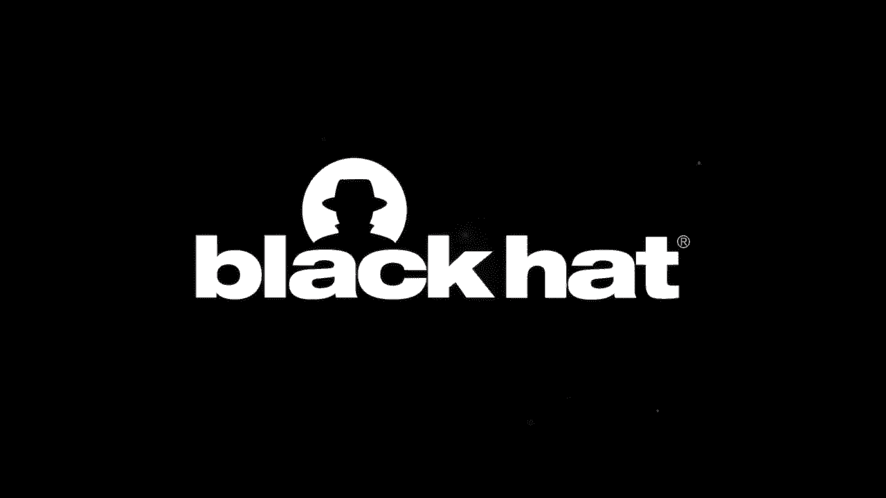

# 课程 P8-08：追捕隐形蝾螈 - 攻击者控制密钥下的密码学（不）安全性 🕵️♂️

在本节课中，我们将探讨一种名为“认证加密”的核心密码学原语。我们将了解，当攻击者能够控制加密密钥时，许多广泛使用的认证加密方案的安全性会如何失效。课程将涵盖“承诺安全性”的概念，展示针对GCM等流行方案的实际攻击，并探讨这些漏洞在群组消息、滥用报告和密码恢复等场景中可能引发的后果。

## 认证加密与攻击者控制密钥的场景 🔑

上一节我们介绍了课程主题，本节中我们来看看认证加密的两种不同使用场景。

在传统的安全传输场景中，通信双方共享一个随机且对攻击者保密的密钥。攻击者的目标是窃听消息内容或篡改密文。

然而，认证加密越来越多地用于攻击者能够选择密钥的场景。例如：
*   基于密码的认证密钥交换
*   基于密码的加密
*   群组加密消息传递
*   加密消息的滥用内容报告

在这些场景中，攻击者知道用于加密的消息，因此机密性目标不再适用。攻击者的目标转变为利用其对密钥的控制权，实现其他恶意目的。

## 理解“承诺安全性” 🧱

上一节我们对比了不同场景，本节中我们来看看在攻击者控制密钥时，认证加密应具备的关键安全属性——“承诺安全性”。

我们可以将认证加密想象成一个物理锁箱。它不仅能保密（机密性）和防篡改（完整性），还应具备一个类似物理锁箱的特性：无论你用哪把钥匙尝试开锁，结果要么是打不开，要么是打开后看到锁箱人当初放入的东西。

**承诺安全性**正是这一保证。它意味着，攻击者无法创建一个密文，使得使用不同的密钥解密会得到*不同的、有效的*明文。这防止了攻击者制作包含“隐形蝾螈”（即隐藏的、备选解密结果）的密文。

在之前的财务审计例子中，如果使用了具备承诺安全性的认证加密，那么无论恶意会计师向审计员报告哪个密钥，审计员要么解密失败，要么解密看到的必定是真实的欺诈记录。

## 广泛使用的认证加密方案并不具备承诺安全性 ⚠️

上一节我们定义了所需的安全属性，本节中我们来看看现实情况：许多现代广泛使用的认证加密方案并不具备承诺安全性。

我们将以GCM为例。为了理解攻击，我们先看GCM的加密部分——计数器模式。

计数器模式加密很简单：选取一个随机初始化向量，用密钥和IV生成一个密钥流，然后将明文与密钥流进行异或得到密文。

在计数器模式下，**同一个密文可以用任何密钥解密**，只需用新密钥和同一个IV生成新的密钥流进行异或即可。但这只是加密部分，GCM还包含一个用于认证的消息认证码。

GCM在计数器模式加密后，会使用一个MAC算法计算一个认证标签。解密时，会重新计算标签并与接收到的标签比对，只有匹配才会输出解密后的明文。

因此，要针对GCM制作一个能在两个不同密钥下都有效解密的密文，我们不需要关心计数器模式的特性，只需要找到一个计数器模式密文，使得它在两个不同密钥下能计算出**相同的MAC标签**。

以下是GCM的MAC计算简化流程（单分块情况）：
1.  将密文分块作为多项式系数。
2.  用密钥加密全零字符串得到哈希点 `H`。
3.  用密钥加密IV得到填充值 `pad`。
4.  在特定的数学域中，计算多项式在点 `H` 处的值，然后与 `pad` 异或，得到标签 `T`。

**攻击过程如下：**
1.  任意选择一个IV。
2.  为两个目标密钥分别计算它们的哈希点 `H1`、`H2` 和填充值 `pad1`、`pad2`。
3.  建立等式：`C1 * H1 + pad1 = C1 * H2 + pad2`（此处 `+` 表示异或）。其中 `C1` 是未知的密文块。
4.  这是一个关于 `C1` 的简单线性方程，可以在该数学域中直接求解出 `C1` 的值。
5.  使用这个 `C1` 作为密文，重新计算标签，由于构造方式，该标签在两个密钥下都会验证通过。

此攻击之所以可行，是因为GCM的MAC是一个简单的代数函数。对于基于复杂抗碰撞哈希函数（如SHA-256）的MAC，构造这样的等式在计算上是不可行的。

## 从两个密钥扩展到成千上万个密钥 📈

上一节我们展示了如何为两个密钥制作碰撞，本节中我们来看看如何将攻击扩展到大量密钥。

将单分块、多密钥的碰撞问题转化为线性代数问题。我们有一个方程组，每个方程对应一个我们希望发生碰撞的密钥，变量是密文块。

**核心公式可以表示为矩阵形式：**
`A * C = B`
其中：
*   `A` 是一个矩阵，每一行包含对应密钥的哈希点的幂。
*   `C` 是密文块向量（未知变量）。
*   `B` 是一个由常数项构成的向量。

根据线性代数知识，只要密文块的数量（变量数）大于密钥的数量（方程数），这个系统就是可解的。求解过程的时间复杂度与密钥数量的平方成正比。

因此，攻击者可以制作一个GCM密文，使其在成千上万个不同密钥下都能正确解密。例如，研究人员已成功制作了一个在超过131,000个不同密钥下可解密的GCM密文。

这种基于多项式MAC的攻击模板也适用于其他认证加密方案，如使用Poly1305的方案（如ChaCha20-Poly1305）和GCM-SIV，尽管扩展到大量密钥可能更复杂。

**数学部分总结：**
1.  像GCM这样广泛使用的认证加密方案不具备承诺安全性。
2.  可以相对容易地制作包含“隐形蝾螈”（隐藏解密结果）的密文。
3.  利用线性代数，可以制作在极大量密钥下都能解密的单个密文。

## 非承诺加密导致的攻击案例 🎯

上一节我们理解了漏洞原理，本节中我们来看看这些漏洞在现实协议中可能引发的具体攻击。

**1. 群组消息传递中的攻击**
在群组消息中，发送者使用认证加密向多个接收者发送消息。通常，发送者会与每个接收者 pairwise 共享密钥，然后向服务器发送**单个**密文，由服务器分发给所有接收者。

如果发送者是恶意的，并且使用的认证加密方案不具备承诺性，那么他可以：
*   与不同的接收者共享不同的密钥。
*   制作一个包含“隐形蝾螈”的密文。
*   导致不同的接收者解密出完全不同的消息。

**2. 针对Facebook消息分级协议的“隐形蝾螈”攻击**
Facebook设计了一个名为“消息分级”的协议，用于加密消息的滥用报告。该协议允许接收者在报告滥用消息时，向平台提供解密密钥，以便平台验证内容。

攻击利用该协议中使用了非承诺加密的部分：
1.  恶意发送者制作一个GCM密文，使其在一个密钥下解密为滥用图片，在另一个密钥下解密为无害图片。
2.  发送者将同一个密文用两个不同的密钥发送两次给接收者。
3.  接收者看到滥用图片并进行报告，将两个密钥都交给Facebook。
4.  Facebook用两个密钥解密**同一个密文**，但由于协议中的去重机制，审核员最终只看到无害图片的解密结果，从而让滥用内容逃脱审查。

研究人员实际制作了这样一个密文，使其能解密成一张小猫的BMP图片和一张蝾螈的JPG图片。

**3. 分区预言攻击**
当非承诺的认证加密与低熵密钥（如密码）一起使用时，会导致分区预言攻击，从而加速在线暴力破解。

在普通的在线密码猜测攻击中，攻击者每发送一个密文只能测试一个密码猜测。

如果使用非承诺加密，攻击者可以制作一个密文，使其在**多个**密码猜测下都能解密成功。这样，每发送一个密文，就能同时测试多个密码，将密钥空间“分区”。

更极端的情况下，如果对密文长度没有限制，攻击者甚至可以利用二进制搜索思想，实现指数级的效率提升。例如，在100万个可能的密码中，普通暴力破解最多需要100万次尝试，而利用分区预言可能只需要约20次（log₂(1,000,000)）尝试。

研究已在Shadowsocks代理协议和OPAQUE密码认证密钥交换协议的某些原型实现中发现了具体的分区预言攻击。

## 如何防范与总结 🛡️

上一节我们看到了攻击的危害，本节我们来探讨解决方案并总结全课。

确实存在具备承诺安全性的认证加密方案。例如，计数器模式加HMAC（如果正确构建）可以提供所需的安全保证。

然而，目前：
*   缺乏标准化的承诺认证加密方案。
*   密码学库中通常不直接提供此类接口。
*   承诺方案可能效率较低，因为它通常需要使用计算更耗时的抗碰撞哈希函数，而非快速的基于多项式的MAC。

**最重要的结论是：你不需要承诺安全性，除非攻击者控制密钥是你的威胁模型的一部分。**

对于TLS等密钥随机且保密的安全传输场景，GCM、ChaCha20-Poly1305等快速认证加密方案仍然是完全安全的。只需确保不在攻击者可能控制密钥的场景中使用它们即可。

**本节课总结：**
我们一起探讨了认证加密在攻击者控制密钥场景下的安全性。我们学习了“承诺安全性”这一关键属性，并发现许多广泛使用的方案（如GCM）并不具备该属性。我们深入分析了针对GCM的具体攻击方法，以及如何将攻击扩展到海量密钥。最后，我们研究了非承诺加密在群组消息、滥用报告系统和密码恢复中可能引发的实际攻击。请务必在设计和实现密码系统时，仔细考虑密钥由谁控制，并据此选择合适的密码学原语。