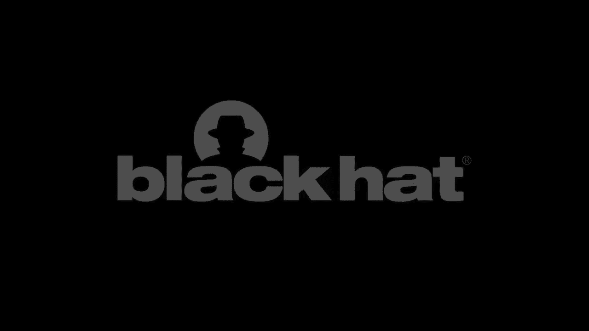

# P80：81 - The Dark Side of the Cloud - How a Lack of EMR Security Controls Helped Amp - 坤坤武特 - BV1g5411K7fe

 Dark Side of the Cloud。

 How a lack of VMR security controls help amplify the opioid crisis and what we can do about， it。 So。

 why are we here today？ The opioid crisis has caused mass addiction and prescription painkillers。

 Since thousands of people have died from opioid addiction， we've seen families broken apart。

 We've seen children being born addicted。 I mean， there's a dedicated daycare for children of addicts in West Virginia。

 The social support network that we had， it has been stretched to its breaking point if， not beyond。

 We have every reason to be here today and every obligation。

 So why am I talking about this at Black Hat？ Because one of the major root causes of this was because of underhanded manipulation of。

 an electronic medical records system that's normally used to assist physicians in prescribing。

 medications。 So a few months ago in February， an electronic medical records company settled for $145。

 million with the Justice Department because they allowed the marketing department of one。

 of these companies to manipulate the system to recommend their products consistently。

 People died and became addicted because of this manipulation。

 And this subversive manipulation we're talking about is a security issue and we have not addressed。

 that for small organizations and we're going to go over that today。 So who was the CMR company？

 Companies name was practice fusion。 They're now a division of all scripts。

 They started off as an independent company。 They provided an ad supported free electronic medical records system for smaller practices。

 However， this was not without controversy in the beginning。

 They were considered controversial because of perceived violations of what's known as。

 the Stark Act and the anti kickback statutes because they were displaying advertisements。

 as part of the EMR。 And 2015， they missed our financial goals。

 their CEO and founder stepped down and in 2018， they were acquired by all scripts for $100 million under a cloud of suspicion of investigations。

 Our research showed it was one-fifteenth that respected market value。 So who were their customers？

 They had a lot of smaller practices that couldn't afford the large EMR systems or to even lease。

 them from the larger providers such as UPMC or Mercy Technology Services。 They had 100。

000 practices as customers in 2018。 So here's some numbers。 Why is this important？

 So part of our research we took a look at the American Medical Association's policy research。

 perspectives report on ownership benchmarks。 56。5% of patient care physicians worked in practices of 10 or fewer physicians in 2018。

 And that's what the sample size of 33。39。 And from that same source。

 54% of them own their own practice。 Again， sample size 3，500。

 And from the EMA's policy research perspective report on physician compensation， but this。

 is 2016 dated in 2018， 64。2% of these owners based their salary on personal productivity。

 aka seeing patients with a sample size of 2900。 So what does this mean to us？

 This means that physicians， they work the pay to bills just like the rest of us。

 And their income is based on how many patients they see and how much they bill。

 And the margins you have to hire employees when the owners are working that much， it's。

 not going to be good enough to have the specialists you need for an electronic medical record。

 system like you're going to have in a large health system。 And in addition。

 I want to put some more sobering economic facts out there。

 According to our friends at the American Hospital Association in their 2018 chartbook， 26。

4% of hospitals have negative total margins and 30。6% have negative operating margins。

 This means a lot of hospitals out there that you may go to are losing money。 Yet。

 we have the same requirements for electronic medical records across the board， whether you're。

 a small practice or a large hospital。 So what is an electronic medical record？

 I realize I got this far and I didn't even give you a definition。

 So this is a digital version of the paper charts in the clinician's office。

 It has your medical and treatment history in one practice。

 And it's kind of advantages over these paper records。 So for example。

 they allow doctors to track data over time， identify who's needed to go。

 see them for prevented screenings or checkups， check to see how well patients are doing such。

 as under blood pressure readings or vaccinations or overall physicals in monitor and improve。

 overall quality of care within the practice， tied in to an initiative from a few years ago。

 called core measures。 They now also now interface with other health systems。

 payers and business associates。 And as we've seen with COVID-19 also now medical devices and remote monitoring systems。

 So how did they work？ How does a doctor actually use this？ They can bring up remote desktop。

 VDI or Citrix interface。 They can bring it up on the web。

 They have their mobile device apps or their desktop apps。

 And there's a lot of interfaces they have to other to med devices， billing systems and。

 pretty much anything you can think of。 And they normally authenticate from a central directory service。

 usually Microsoft Active， Directory although you can authenticate off of a samba。

 They also have remote access from offsite and a major demand has been for physicians to。

 complete charts after hours。 So personal example I've worked on several EMR Go lives of my career。

 Almost every single time I have put in the MRN， it has come with a number of doctors wanting。

 me to help them get their personal devices up and running so they can access their EMR。

 because they have four hours of trying to do tonight。

 And that's been a hallmark of working with a number of people on medical staff。

 So we have some security holes we're going to talk about。 First of all。

 EMRs need to be certified to be eligible for federal reimbursement dollars。

 and actually for use to store patient records。 So there's a non-profit that does this on behalf of the US government called the Certification。

 Commission on Health Information Technology。 However， this is only the one part。

 You can't just use a certified system and get money。

 You have to complete annual risk assessments and complete your risk management plans and。

 follow up on your security findings。 Failure to do so will result in fines from our friends at the office for civil rights。

 of the Department of Health and Human Services。 So we talk a deeper look at this because we're not going to sit there and just not give you。

 data。 We went through every Health and Human Services press release on HIPAA settlements issued。

 since 2015 from their websites。 And we identified the following five key factors that were for OCR penalties。

 Number one， no risk assessment completed。 Number two， no risk management plan completed。

 Number three was not following up on risk assessments。

 Number four was not properly reporting your breaches within 60 days。 And finally。

 number five was underreporting the number of patients affected by a breach。

 And many of these organizations that we took a look at were multi-billion dollar companies。

 So if these multi-billion dollar companies can't do these five things， what are the odds of。

 a smaller practice being able to do so？ If they're not doing these。

 they're also not reviewing changes to the EMR system。

 They're not reviewing changes to clinical decision support alerts。

 They're not reviewing who has access。 And they're not providing relevant training for the purposes other than checking a box。

 And here's another complicating factor I wanted to bring up。

 And this is something that's been actually been very prevalent over the past few years。

 We call it pre-texting attack。 What we've seen here is because of the large amount of information that's made available。

 about our medical staffs on the internet， there's been a very sharp uptick in pre-texting calls。

 A lot of these criminals claim to be government regulatory agencies or professional associations。

 that call up asking people to update their information using a spoof caller ID or emails。

 I've personally seen state agencies get spoofed。 And emails。

 they get some pretty similar looking domain names。

 And it's not difficult to get personal info using this method。

 And it's not difficult to call it to help desk when you have all this personal information。

 to get a hold of someone's username and password。 And therefore， get yourself system access。

 So as my friends， the underpants knowns will be glad to hear， there is a phase two。 Phase one。

 get national practice identifiers and public information from the internet。 Number two。

 call practices and get personal info using spoof caller IDs。 And number three， profit。

 Especially when the practice doesn't have two factor authentication。

 What are some of your other complicating factors？ Number one is the lack of two factor authentication for system access。

 While the actual prescription process needed to prescribe opioids requires two factor authentication。

 base system access often doesn't。 That means you can make changes to those processes requiring this with not actually needing。

 two factor authentication to do so， including administrative access to the EMR。

 This is not a failing of the EMR itself。 This is a failure in how we protect them。

 Isn't this just theoretical？ No。 Practice Fusion gave us pretty much a clinic on how to do it。

 And this was very significant because it revealed flaws in how we secure EMRs that we're。

 going to talk about how to fix today。 So who were they？ Company started in 2005 by Ryan Howard。

 Definitely not the ex-filies MVP provided that ad supported free EMR to doctors in the， cloud。

 which meant less IT investment， which is key when two thirds of your salary is based。

 on seeing patients。 You have to see a lot of patients to afford IT and keep the lights on。

 So a little bit of personal background here。 I worked in the doctor's office about 17 years ago。

 One of the items I remember about the doctor's office is the doctor himself was running from。

 office to office like ping pong because he was seeing a patient every 20 minutes and。

 there were two other doctors seeing patients with him。

 So the amount of work it takes to run a small physician practice is not appreciated。

 No one there is lazy。 It is absolutely crazy。 They have to keep people paid and the only way to do it is by seeing more and more patients。

 burn out with a small physician practice is very real。

 And the truth is if you are spending money to keep that office staff and you have to run。

 around like that to make money， you are not spending money on compliance and you are。

 not affording a high-end EMR。 And again， most of the revenue for a practice fusion according to the Washington Post came。

 from advertisements。 That's a problem isn't it？ So according to the anti-kickback statute 42 US 1320 A7BB。

 yes。 The translation of the paragraph I have right there is， "Ads in a product used to receive。

 money from federal and senate programs is going to land you in serious trouble because。

 it could influence how the service is provided。"， That's essentially what it comes down to。

 You put ads in there， you have a chance of influencing how federal money is being used。

 and not in a good way。 So another line of business practice fusion had according to the Department of Justice。

 Settlement was by marketing themselves to drug manufacturers as willing to customize the。

 clinical decision support alerts。 Now Farmer Company X。

 according to the settlement paid a million dollars to add a custom clinical。

 decision support alert to your EMR。 And the reason we are not naming that company is because first of all the Justice Department。

 has it。 Second of all， there are four companies in that space we want to give you the right answer。

 And third of all， as part of the settlements， practice fusion is being required by law to。

 make officers and anyone else involved in the company available to DOJ as part of this。

 investigation， which means the company is under an act of criminal investigation。

 So why is this important？ Because these alerts they paid a million dollars for。

 written by marketing people， recommended， extended release opioids to doctors 230 million times between July 2016 and the spring of 2019。

 And they were able to statistically prove that doctors who received these alerts prescribed。

 extended release opioids at a higher rate than those that didn't。 So a little bit of background。

 look， I came from Philly， I came from Philly back when they， had an opioid crisis in the late 90s。

 Under release opioids were killing teenagers back then。

 And what they called an oxy 80 back in Philly caused a lot of teenagers to lose their lives。

 So this is something that people from the East Coast have been seeing for years。

 But unfortunately the rest of the country is now seeing what we saw that long time ago。

 So deception equals death。 The version of this computer system used to provide false information。

 it caused a false， prescription of extremely addictive drugs in the middle of a crisis。

 And I put this here， I wish they had the flash tag and PowerPoint because people died and。

 became drug addicts because of a marketing department。 I don't know a better way of saying that。

 And it illustrated a lot of security holes that affected smaller providers。

 So how are we going to address this？ We're going to talk about how to do this using four methods。

 First of all， we're going to provide more clarification of this Stark Act safe harbors。

 to allow larger providers to provide cybersecurity services to smaller ones。

 We're going to talk about having smaller providers leverage resources of larger ones to provide。

 clinical decision support services to their EMR instances。

 And we're going to include privacy monitoring services as part of the bundles of services， sold。

 And we're going to talk about how we can increase security in the EMR itself to require two-factor。

 authentication and increase the login around creating alerts or making these configuration， changes。

 So we found three parts of the Stark Act safe harbor wording that were relevant。

 First one requires fair market remuneration for equipment rental and is not based on the。

 volume or value of referrals。 One is that they require fair market value remuneration for management services。

 And the third requires that practices pay 15% of cost of services up front。

 Have you seen what privacy and security software cost lately？

 Have you worked in a small doctor's office asking someone that they 15% up front for somebody's。

 services？ That's not going to happen。 That is the number of practices are going to do this is asymptotically approaching zero。

 So what's being proposed？ In October of 2019， the Department of Health and Human Services proposed an amendment to。

 these laws I just talked about to allow for the donation of cybersecurity products and services。

 However， this did not allow for patching， maintenance or hardware。 A。K。A。 will give you equipment。

 but you can't update it。 As we've seen with a number of issues。

 very specifically the fact that Windows 7 is no， longer supported， that's a losing proposition。

 So in January 2020， our friends at the Health Sector Coordinating Council proposed some further。

 amendments， including allowing for donation of patching of maintenance， allowing for donation。

 of hardware and more importantly， liability protection for donors。 A。K。A。

 we give a smaller practice something and something happens， they can't sue us。

 So we didn't think this went far enough。 So we're going to propose two further amendments。

 First one is to include diversion monitoring software as part of cybersecurity services and。

 to allow for donation of services to include drug diversion monitoring and practices and。

 alerts of potential issues。 A lot of larger health systems are putting this in already。

 Excellent excellent software cuts the time for diversion investigation down from a month。

 to literally less than a day。 And privacy monitoring， a lot of practices don't have this。

 And you ought to be able to have the practices to be able to monitor and be alerted to potential。

 patient privacy violations and have this donated so they can actually do so。 Why is this important？

 The link below talks about a case that happened in Florida where a woman was just sentenced。

 to a couple of years in prison because she worked at a bunch of smaller practices。

 And what she would do is she would take pictures on her smartphone of the patient's personal。

 information。 So what she ended up doing is taking this personal information and committing identity。

 theft。 Why is this relevant？ Because they found out about this from a confidential informant。

 Not from the EMR， not from the practices。 Somebody who told the police they saw the records。

 No practice even knew she was doing this。 And if a confidential informant has to be notifying the practices and the police of。

 what's going on， there's a really big problem。 So brings us to larger providers。

 Leveraged partnerships or resellable agreements with larger health systems or service organizations。

 to use their EMRs。 Why？ Because a doctor that is literally ping pong between offices is not going to be spending。

 that much time monitoring the CDS alerts。 They're going to pay someone else to do it。

 Use their expertise。 Use their staffing。 Pay them for the service to help monitor these alerts and leverage their order sets and alerts。

 to reduce opioid prescriptions。 A number of the larger health systems in the United States have done significant work and。

 have great programs that reduce the amount of opioid prescriptions。

 And they're worked on by some of the top emergency medicine and addiction medicine physicians。

 in the country。 Leverage that whenever you can。 Because you're not going to be able to do what they do。

 And privacy and diversion monitoring services。 I was doing a lot of research in this and could only find the most recent survey from。

 2016 was from the PONEMON Institute which indicated that 56% of providers had sufficient。

 privacy protection。 However， when you took a look at the actual data behind it。

 2% of respondents did that， survey with a sample size of 90 or from organizations less than 100 people。

 So brings me to a point about health care。 A lot of the benchmark surveys are normally based towards larger institutions which means。

 we don't have data demonstrating the real situation。

 And we had to make sure that these services are being offered a smaller practices。

 And the version monitoring is new， however， there is a demonstrated need for this in practices。

 And brings us to privacy and diversion monitoring。

 You can't talk about security on its own without these two。 You're protecting against malware。

 worms and ransomware。 We're doing a pretty good job of it actually。 However。

 we're not protecting against identity theft， diversion and cascading effects。 And definitely。

 as we just explained， not curious team members looking at medical records and。

 using that info for their personal gain。 So I want to start off here and say I've worked with most of the major EMR companies。

 They have done an incredible job improving security over the past five years。 I've actually。

 they have to be applauded for the work they've done。

 And they've taken this from being mainly desktop based applications to best in class and security。

 in a number of areas。 And we have two factor authentication for prescribing opioids。

 And we have a lot of great companies selling great solutions for it。 However。

 we still have room for improvement。 We can't rest on our laurels。 And talk about EMR security。

 We're going to talk about four areas we can improve on。

 Number one is obviously requiring that two factor authentication to make administrative。

 or configuration changes， not just prescribing。 We need to limit who can make changes in EMR。

 So as part of your cybersecurity services provided you need to have this in there。 And again。

 another real life example I'm going to talk about was with a radiologist I worked， with。

 We were talking about packs security and packs authentication。

 One of the items he brought up was that normally in a lot of these types of systems， you give。

 excessive access so people can get access to what they need。

 So part of that comes when you give access to somebody to make a change in one area。

 you can actually also give them access to make changes to clinical content。

 That was what this doctor had pointed out to me。 So we need to be very clear about who has access to make changes and make sure we don't。

 have any quote unquote hidden surprises because we gave someone access to a certain screen。 Well。

 now they have access to make rules， changes and alerts， changes。 So yes， this really does happen。

 And we also have to make sure that we provide good configuration change reports of what。

 changes were made。 Right now a lot of larger organizations rely on their internal governance to be able to。

 do change management properly。 What that means for us is that people are not getting human readable results out and they。

 are relying on systems outside of the EMR to do so。

 There's not a very simple way for somebody to hit a button and get that report that says。

 these were following changes made in the past week。

 So we need to be able to get that configuration change report that shows who changed what。

 so that you can verify it against your existing governance systems。

 This is something that I've been working on a lot and also comes over to user access review。

 as well。 Part of the HIPAA security rule requires us to be able to review for access over the。

 past year at least。 So what we have to do there is get that report out there。

 You can't have a staff member that is overloaded。 Take a look and see oh these disaccesses right when I got to look at 700 people。

 There's going to be errors。 You need to make sure that you break things down so that it's better for the medical staff。

 or better for the administrators that are overworked to be able to actually see what。

 they need to do。 And the user interface， biggest challenge in security， but we need to improve that。

 And we need to also continue to work with providers to ensure that their access to their。

 systems is fully secured and using two factor authentication。

 It's too easy to do a pre-texting attack and it's too easy to get access to a system。 And yes。

 two factor does help。 I always reference Microsoft in their presentation at RSA earlier this year discussing how out。

 of all the account compromises 99。9% of them occurred with people that did not have two。

 factor authentication。 When your sample size is a billion accounts， that's pretty good sample size。

 So we have to work to make sure that access is secured and using two factor authentication。

 even with smaller practices。 So what are our takeaways？

 Biggest one right here is that smaller practices are more susceptible to electronics a version。

 of their critical systems because there's a lack of resources to actually take a look。

 at how they operate。 So in other words， it's easy to make changes when you know no one's looking。

 And you need to have those partnerships with larger health systems because it's key to addressing。

 the resource needs to properly operate in EMR。 Not just with cybersecurity。

 but also with governance， management and avoiding subversion， like exactly what happened here。

 This was a case of a company taking advantage of the fact they knew no one was looking and， well。

 they did what they did with tragic consequences。 And also getting that Stark Act provision for cyber security。

 getting some additional， provisions for privacy and diversion monitoring added so that we can help out those smaller。

 providers and help them address what we've discussed along with security issues。

 This is where you see a lot there because realistically， privacy and diversion software。

 are very expensive。 And if we can get it in the hands of the smaller practices。

 aka over half of the practices in， the US， we're going to greatly help these people understand what's really going on and。

 not have it。 So we have a case where confidential informant is informing the police who then have to notify。

 medical practices of data breaches。 We don't want to be in that place。

 We need to be in a place where those people like that are caught immediately and aren't， working。

 The relationship between a medical practice and a doctor and a patient is a relationship， of trust。

 And what we're doing here breaks trust。 It breaks trust and it breaks confidence and we tell our medical。

 we tell our doctors everything， about our lives。 They know more about us than almost anyone else。

 They know a lot of very personal things about us。 And when you break that trust between a doctor and a patient。

 it's there's no other way to， put it。 It's tragic。

 And what we're doing right now is where we are tacitly enabling that to happen and we。

 need to stop that。 And we can also do that by improving security in several areas with the EMRs。

 which we've， discussed。 So with that， thank you very， very much。

 You can follow me on Twitter @mitchparkersyso and I'm also available on LinkedIn or email。

 and I will have some follow-up items posted up on the web soon。

 So thank you very much for your time。 Good afternoon everyone。

 Thank you so much for attending and thank you very much for all the wonderful questions。

 I hope I was able to answer your questions for you。

 Anyone have any further questions from anyone who want to put in the chatter question box， please？

 So again， I really appreciate you coming。 And I'll be sticking around for a few minutes for anyone who's answering further questions。

 Paul， thank you very much。 Hi Valerie， do you have a question？ Thank you Rashid。

 Thank you very much。 Thank you， Robert。 And so the question。

 how do you feel about the future of this problem？ I feel that we've made some significant advancements here。

 I think with a lot of diversion software that if we get it out to the right people。

 you have privacy among the software to the right people and we get the appropriate staffing。

 in place that we can help manage this problem。 And if you wanted to assist your doctors using Valerie。

 ask them。 There's a few major ones out there。 Obviously the big three are Epic。

 Surner and Metitech and there's also ones like Athena， Health but just ask。 And so Sean。

 my specific recommendation for EMR using the cloud is partner with a good。

 vendor that knows what they're doing or partner with a larger academic health system that。

 can help you because EMR in the cloud is a lot more complex than people lead on。 So Paul。

 also going to your question explaining what the version software is。

 The version software is software that analyzes and transactions that take place in an electronic。

 medical records system and oftentimes will reconcile them with a medication suspension， system。

 And then the dispensary such as PIXIS will run the other products out there to detect discrepancies。

 So you're right， Nina。 And so Nina， to make your question。

 I've been answering the question tag as they've been， coming in as well。 And so， the NACA。

 you monitor configuration change， electronic medical records systems。

 are required to keep logs or transactions that occur。

 That's part of the HIPAA security where you're supposed to keep those logs。

 He's supposed to review those logs as well。 So that's how the version software works。

 It goes through monitoring the same logs that you work for activity or privacy monitoring。

 So William， thank you very much。 Gary， thank you very much。 I hope you stay well as well。 And again。

 I really appreciate you all coming and I still have time for a few more questions。 And again。

 in terms of the version software， there's a few companies out there as well。

 just to go back to that that are actually working in that space。 So one。

 there's two companies that I know are doing some great work in protest and maze。

 Those two companies， that does some incredible work and until I get taken off on here to answer。

 any more questions。 Thank you， thank you， thank you。 No problem。

 I have one last one from Mackenzie Holland， Mackenzie。 So question you should ask yourself。

 We are taking a look at the EMR itself。 So that's the last question。 Thank you all very much。

 And I'm going to close out here。 I'll answer that last question in chat， Nina。 [ Silence ]。

